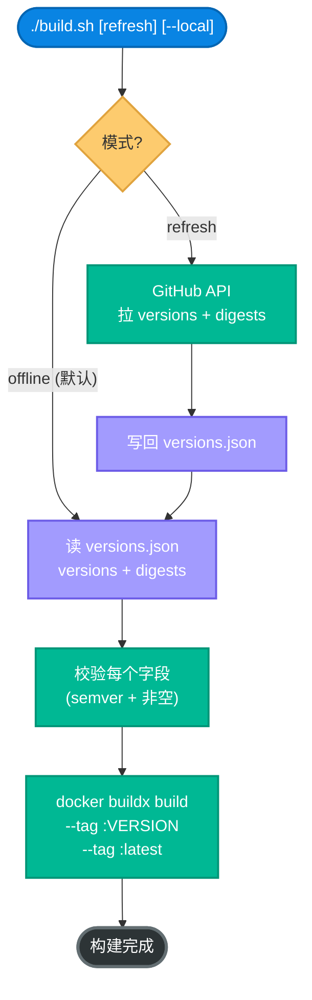
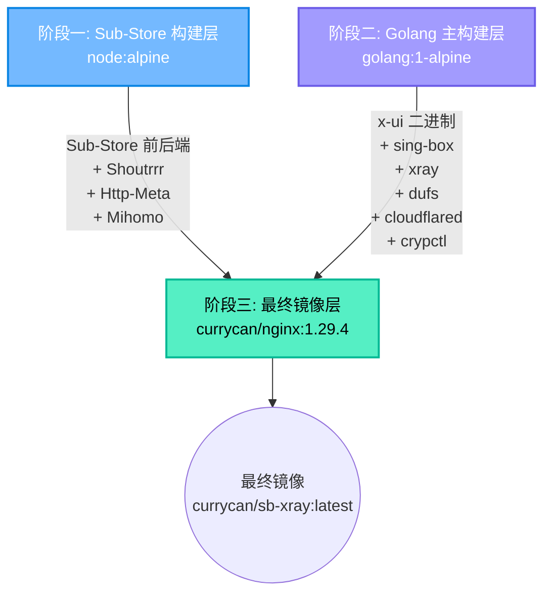
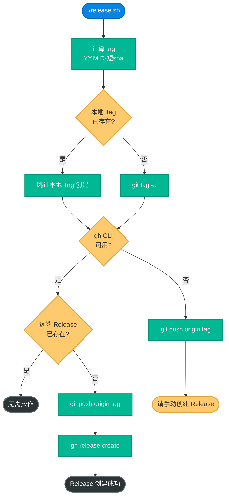
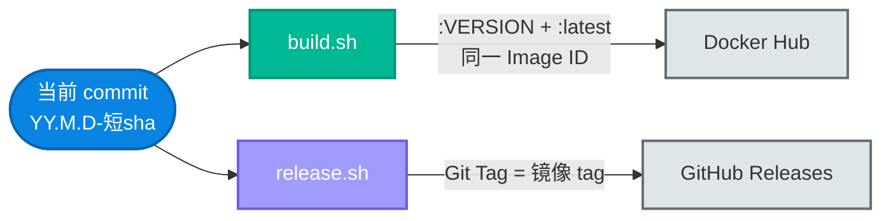
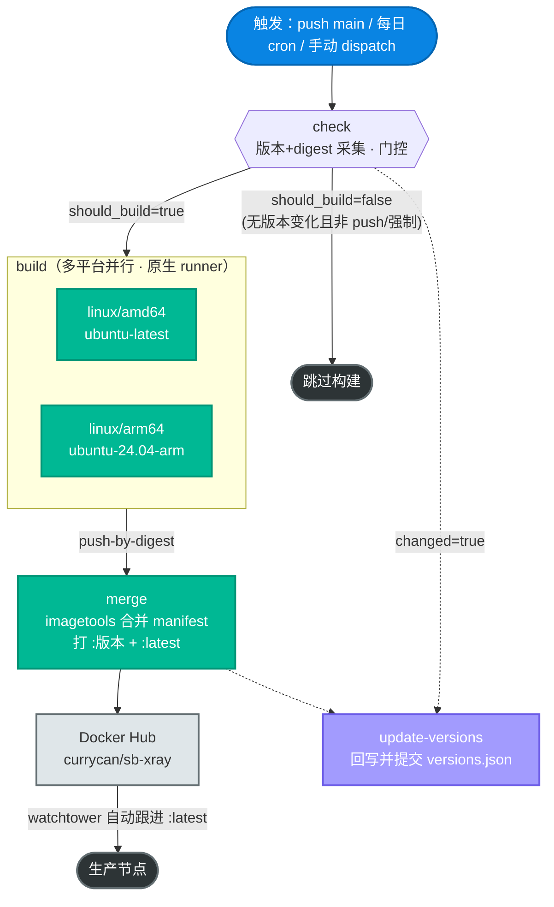

# 00. 构建部署与版本发布指南

> 本文档详细解析 SB-Xray Docker 镜像的完整构建流程，包括环境准备、自动化构建脚本、三阶段 Dockerfile 架构、常见构建问题，以及 Git Release 自动化版本发布机制。

---

## 目录

1. [构建环境准备](#1-构建环境准备)
2. [自动构建脚本](#2-自动构建脚本buildsh)
3. [三阶段 Dockerfile 架构](#3-三阶段-dockerfile-架构)
4. [组件版本管理](#4-组件版本管理)
5. [手动精细构建](#5-手动精细构建)
6. [常见构建问题 FAQ](#6-常见构建问题-faq)
7. [Git Release 版本发布](#7-git-release-版本发布releasesh)
8. [GitHub Actions CI 自动构建与发布流水线](#8-github-actions-ci-自动构建与发布流水线)

---

## 1. 构建环境准备

### 1.1 必备工具

| 工具 | 最低版本 | 用途 |
|:---|:---|:---|
| **Docker** | 24.0+ | 容器运行时 |
| **Docker Buildx** | 0.11+ | 多架构构建 |
| **jq** | 1.6+ | 解析 GitHub API 返回的 JSON |
| **curl** | 7.68+ | 调用 GitHub API 获取版本 |
| **Git** | 2.30+ | 源码管理 |

### 1.2 多架构构建器配置

```bash
# 检查是否存在 buildx builder
docker buildx ls

# 如不存在，创建一个支持多架构的 builder
docker buildx create --name multiarch --use --bootstrap

# 验证支持的架构
docker buildx inspect --bootstrap
```

### 1.3 GitHub API Token（可选，推荐）

GitHub API 对匿名请求有严格限流（60 次/小时）。推荐设置 Token：

```bash
export GITHUB_TOKEN=ghp_xxxxxxxxxxxxxxxxxxxx
```

---

## 2. 自动构建脚本（build.sh）

`build.sh` 是推荐的构建入口。**单一真相源是仓库根目录的 `versions.json`**，`build.sh` 既不硬编码任何组件版本，也不在本地构建期间与 CI 产生漂移：

- 日常构建直接读 `versions.json`（已由 CI 每天刷新并提交），纯离线、可复现
- 需要跟最新上游版本时用 `./build.sh refresh`，会像 CI 一样调用 GitHub API 拉取 versions + digests，写回 `versions.json`，然后构建

### 2.1 基本用法

一条命令完成构建并同时推送 `:<版本号>` 和 `:latest` 两个 tag，两者始终指向同一 Image ID。版本号格式为 `YY.M.D-<7 位短 sha>`（构建日期按 `Asia/Shanghai` 时区 + 当前 commit 短 sha），例如 `26.6.9-9efd47a`。各组件自身的版本仍以 `versions.json` 为单一事实源，与镜像 tag 相互独立。

```bash
./build.sh              # 离线模式（默认）：读 versions.json 构建，不触网
./build.sh refresh      # 刷新模式：GitHub API 拉最新 → 写回 versions.json → 构建
./build.sh --local      # 单架构 linux/amd64，--load 到本地，不 push；可与上面两种组合
```

`./build.sh default` / `./build.sh offline` 作为旧名称保留为离线模式别名。

### 2.2 工作流程



### 2.3 版本获取策略（仅 refresh 模式用到）

| 策略 | API 端点 | 适用组件 |
|:---|:---|:---|
| **Latest Release** | `/repos/{owner}/{repo}/releases/latest` | Shoutrrr、Mihomo、Http-Meta、Sub-Store |
| **Latest Stable Tag** | `/repos/{owner}/{repo}/tags?per_page=100`（过滤 `rc/beta/alpha`） | Xray、Sing-box、3x-ui、Dufs、Cloudflared |

`.github/workflows/daily-build.yml` 每日跑相同逻辑：调用 API → 计算 digests → 提交 `versions.json`。所以本地 `./build.sh` 和 CI 的最新产物始终位级一致。

### 2.4 镜像版本号与 OCI 标签

镜像 tag（`YY.M.D-<短 sha>`）由 `build.sh` 与 CI 在构建时计算，并通过两个 build-arg 写入最终镜像的 OCI 标签，便于在运行节点上反查镜像来源：

| build-arg | 值 | 写入的 OCI 标签 |
|:---|:---|:---|
| `VERSION` | `YY.M.D-<短 sha>`，如 `26.6.9-9efd47a` | `org.opencontainers.image.version` |
| `SHA` | 完整 git commit sha | `org.opencontainers.image.revision` |

OCI 标签在 Dockerfile 最终阶段末尾注入（位于所有 `RUN` 之后、`ENTRYPOINT` 之前），因此版本变动不会使其前面的依赖层缓存失效。在运行节点上反查镜像版本：

```bash
docker inspect --format '{{ index .Config.Labels "org.opencontainers.image.version" }}' currycan/sb-xray:latest
# 期望：打印形如 26.6.9-9efd47a 的版本号
```

---

## 3. 三阶段 Dockerfile 架构

整个构建过程分为三个精心设计的阶段（Multi-Stage Build），最大程度地减小最终镜像体积。



🔬 **BuildKit cache mount 贯穿三阶段**：Dockerfile 头部声明 `# syntax`/需要 BuildKit 1.7+，各阶段的 `RUN` 用 `--mount=type=cache` 把高频可复用目录挂成持久缓存——apk 包缓存（`/var/cache/apk`）、pnpm/npm store（阶段一）、Go 模块与编译缓存（`/go/pkg/mod`、`/root/.cache/go-build`，阶段二）、pip 缓存（最终阶段）。这些缓存跨构建复用，重复构建时不必重新下载/编译。`build.sh` 与 CI 都用 `docker buildx`，BuildKit 默认启用。

### 3.1 阶段一：Sub-Store 构建层

**基础镜像**: `node:alpine`

**构建产物**:

| 组件 | 来源 | 构建方式 |
|:---|:---|:---|
| **Shoutrrr** | containrrr/shoutrrr | 预编译二进制下载 |
| **Http-Meta** | xream/http-meta | 预编译 JS Bundle 下载 |
| **Mihomo** | MetaCubeX/mihomo | 预编译二进制下载 |
| **Sub-Store 后端** | sub-store-org/Sub-Store | 预编译 JS Bundle 下载 |
| **Sub-Store 前端** | sub-store-org/Sub-Store-Front-End | **从源码构建** (pnpm build) |

### 3.2 阶段二：Golang 主构建层

**基础镜像**: `golang:1-alpine`

**环境特性**: `CGO_ENABLED=1`（启用 CGO 以支持 SQLite）

🔬 **GOPROXY 默认走国内镜像**：Golang 主构建层声明 `ARG GOPROXY="https://goproxy.cn,https://proxy.golang.org,direct"`（国内构建友好）。CI 可用 `--build-arg GOPROXY=https://proxy.golang.org,direct` 覆盖。这只影响 `go build`（crypctl）拉取依赖的来源，不改产物。

**构建产物**:

| 组件 | 构建方式 | UPX 压缩 |
|:---|:---|:---|
| **crypctl** | 从源码 `go build`（`-ldflags="-s -w" -trimpath`） | ✅ |
| **Dufs** | 预编译 tar.gz 下载 | ✅ |
| **Cloudflared** | 预编译二进制下载 | ✅ |
| **X-UI (3x-ui)** | 预编译 tar.gz 下载（MHSanaei/3x-ui releases） | ❌ |
| **Sing-box** | 预编译 tar.gz 下载 | ❌ |
| **Xray** | 预编译 ZIP 下载 | ✅ |

> **UPX 压缩并非全员开启**：仅 crypctl / Dufs / Cloudflared / Xray 经 `upx --lzma --best` 极限压缩（减小 50-70% 体积）；**X-UI、Sing-box 不做 UPX**，直接安装解压后的官方二进制（其官方发布产物对 UPX 压缩不友好，强压可能导致启动异常）。

### 3.3 阶段三：最终镜像层

**基础镜像**: `currycan/nginx:1.29.4`（基于 Alpine 的自定义 Nginx）

**运行时安装**:

```
curl bash iproute2 net-tools tzdata ca-certificates python3 pip
gettext libc6-compat vim libqrencode-tools jq sqlite nodejs
supervisor dumb-init fail2ban acme.sh
```

**关键配置**:

| 配置项 | 值 | 说明 |
|:---|:---|:---|
| `ENTRYPOINT` | `dumb-init -- python3 /scripts/entrypoint.py run` | dumb-init 作为 PID 1，Python `entrypoint.py` 提供 `run` / `show` / `trim` 三个子命令；`run` 用纯 Python 一次性跑完 15 段初始化流水线（探测 → 选路 → 证书 → 模板渲染 → 面板初始化 → cron → `os.execvp` supervisord） |
| `CMD` | `supervisord` | Supervisor 管理所有子进程 |
| `HEALTHCHECK` | `supervisorctl status xray` | 每 30 秒检查 Xray 存活 |
| `EXPOSE` | `80 443` | 默认暴露端口 |
| `TZ` | `Asia/Singapore` | 时区 |

🔬 **运行时安全加固**：

- **非 root 用户预置**：最终阶段 `addgroup -S appgroup && adduser -S appuser -G appgroup` 预创建非特权用户 `appuser`，供需要降权的进程使用（容器入口仍由 dumb-init/supervisord 以 PID 1 管理）。
- **fail2ban 内置**：运行时安装 `fail2ban` 并预置 jail 配置——移除发行版自带的 `alpine-ssh.conf`、把 `jail.conf` 复制为 `jail.local` 并显式关闭 `[ssh]` / `[sshd]` jail（本镜像不跑 SSH）、开启 IPv6 支持。具体封禁 jail 由 entrypoint 在运行期按需启用。

---

## 4. 组件版本管理

### 4.1 当前组件版本

所有版本由仓库根目录 `versions.json` 统一声明，CI 每日从 GitHub API 刷新并提交。`build.sh` 离线模式直接读取该文件，因此**本地构建与 CI 产物始终一致**。查阅当前组件版本：

```bash
jq -r 'to_entries[] | select(.key != "digests") | "\(.key): \(.value)"' versions.json
```

对应的 Docker build-arg 名称：

| 组件（`versions.json` 字段） | Build Arg |
|:---|:---|
| `shoutrrr` | `SHOUTRRR_VERSION` |
| `mihomo` | `MIHOMO_VERSION` |
| `http_meta` | `HTTP_META_VERSION` |
| `sub_store_frontend` | `SUB_STORE_FRONTEND_VERSION` |
| `sub_store_backend` | `SUB_STORE_BACKEND_VERSION` |
| `dufs` | `DUFS_VERSION` |
| `cloudflared` | `CLOUDFLARED_VERSION` |
| `x_ui` | `XUI_VERSION` |
| `sing_box` | `SING_BOX_VERSION` |
| `xray` | `XRAY_VERSION` |

配套的二进制 SHA256 校验值存于 `versions.json` 的 `digests` 字段（由 CI 同步刷新），Dockerfile 通过 build-arg 传入并在下载阶段强制校验。任何 digest 缺失都会导致 `build.sh` 直接退出。

> **per-arch 资源名陷阱**：amd64 的 mihomo 用 **`-compatible`** 资源（兼容老 CPU），digest 的计算来源必须与 Dockerfile 下载用**完全相同**的资源名，否则校验失败。详见 [Q8](#q8-amd64-构建在-mihomo-sha256-校验处失败)。

### 4.2 版本覆盖

可通过环境变量强制指定版本：

```bash
# 指定特定 Xray 版本
XRAY_VERSION=25.12.15 docker buildx build \
  --build-arg XRAY_VERSION=25.12.15 \
  --tag currycan/sb-xray:custom \
  .
```

---

## 5. 手动精细构建

### 5.1 仅构建单架构（本地测试）

```bash
# 仅构建 amd64（不推送）
docker buildx build \
  --platform linux/amd64 \
  --build-arg XRAY_VERSION=26.2.6 \
  --build-arg SING_BOX_VERSION=1.12.21 \
  --tag currycan/sb-xray:test \
  --load .
```

### 5.2 多架构构建并推送

推荐直接使用 `build.sh`（自动获取版本 + 同时推送两个 tag）：

```bash
./build.sh
```

如需手动指定版本构建：

```bash
docker buildx build \
  --platform linux/amd64,linux/arm64 \
  --build-arg XRAY_VERSION=26.2.6 \
  --build-arg SING_BOX_VERSION=1.13.1 \
  --tag "currycan/sb-xray:$(TZ=Asia/Shanghai date +%y.%-m.%-d)-$(git rev-parse --short=7 HEAD)" \
  --tag currycan/sb-xray:latest \
  --push .
```

### 5.3 构建缓存优化

```bash
# 使用 registry 缓存加速重复构建
docker buildx build \
  --platform linux/amd64,linux/arm64 \
  --cache-from type=registry,ref=currycan/sb-xray:cache \
  --cache-to type=registry,ref=currycan/sb-xray:cache,mode=max \
  --push .
```

---

## 6. 常见构建问题 FAQ

### Q1: GitHub API 返回 403 / Rate Limit

**原因**: 未配置 GitHub Token 导致匿名限流（60 次/小时）。注意只有 `./build.sh refresh` 会调 GitHub API —— 默认 `./build.sh` 完全离线。

**解决**:
```bash
# 离线构建（直接用仓库 versions.json，无需 API）
./build.sh

# 若确实需要刷新到最新上游版本
export GITHUB_TOKEN=<your-personal-access-token>
./build.sh refresh
```

### Q2: Sub-Store 前端构建失败

**现象**: `pnpm install` 或 `pnpm run build` 失败

**常见原因**:
* 网络问题导致 npm 包下载失败
* Node.js 版本不兼容

**解决**: 重试或检查 Sub-Store 前端仓库的 `engines` 字段要求

### Q3: UPX 压缩失败

**现象**: `upx: CantPackException`

**常见原因**: 某些二进制已被压缩或具有特殊段

**解决**: 跳过该文件的 UPX 或降级 UPX 版本

### Q4: ARM64 构建报错

**现象**: 在 x86 机器上构建 ARM64 失败

**解决**:
```bash
# 安装 QEMU 用户态模拟
docker run --rm --privileged multiarch/qemu-user-static --reset -p yes
```

### Q5: 如何查看镜像中所有组件版本？

```bash
docker run --rm currycan/sb-xray:latest bash -c "
  echo '=== Xray ===' && xray version
  echo '=== Sing-box ===' && sing-box version
  echo '=== Nginx ===' && nginx -v
  echo '=== Node ===' && node --version
  echo '=== Python ===' && python3 --version
"
```

### Q6: 版本 tag 和 `:latest` 的 Image ID 不一致？

**原因**: 在 `build.sh` 之外又单独执行了一次 `docker buildx build`，导致其中一个 tag 被新构建覆盖。

**解决**: 只用 `./build.sh` 构建，它在同一次 `docker buildx build` 中同时传入 `--tag :VERSION --tag :latest`，两个 tag 天然指向同一 Image ID。

### Q7: 构建后镜像体积过大？

**预期体积**: 约 300-400 MB (compressed)

**优化要点**:
1. 确认 UPX 压缩正常执行
2. 确认使用 `--no-cache` 的 `apk add`
3. 多阶段构建已自动丢弃中间层

### Q8: amd64 构建在 mihomo SHA256 校验处失败

**现象**: amd64 构建在下载 mihomo 这步报 `/tmp/mihomo.gz: FAILED` / `sha256sum: WARNING: 1 of 1 computed checksums did NOT match`，而 arm64 构建正常。

**原因**: amd64 的 mihomo 使用 **`-compatible`** 资源（`mihomo-linux-amd64-compatible-v${VER}.gz`）。通用 amd64 资源是按 x86-64-v3 微架构优化的，在 SSE4.2 等 **≤x86-64-v2 老 CPU** 上会触发非法指令崩溃；`-compatible` 资源专为兼容老 CPU 而编。

SHA digest 的计算来源必须与 Dockerfile 实际下载用**完全相同**的资源名。以下三处的 amd64 资源名必须严格一致，任一处误用通用 `mihomo-linux-amd64-v${VER}.gz` 而其余用 `-compatible`，算出的 build-arg SHA 就与实下文件不符，导致下载阶段 `sha256sum -c` 失败：

| 位置 | 作用 | amd64 资源名 |
|---|---|---|
| `Dockerfile` | 下载并校验 | `mihomo-linux-amd64-compatible-v${VER}.gz` |
| `build.sh`（`refresh` 模式 `get_asset_digest`） | 本地刷新算 digest | `mihomo-linux-amd64-compatible-v${VER}.gz` |
| `.github/workflows/daily-build.yml`（check job `digest`） | CI 算 digest 并写回 `versions.json` | `mihomo-linux-amd64-compatible-v${VER}.gz` |

> arm64 没有 `-compatible` 变体，三处统一用通用 `mihomo-linux-arm64-v${VER}.gz`。

**解决 / 自检**: 确认三处的 amd64 资源名一致（输出应全部带 `-compatible`）：

```bash
grep -oE 'mihomo-linux-amd64[^"]*\.gz' Dockerfile build.sh .github/workflows/daily-build.yml
# 期望：三行均为 mihomo-linux-amd64-compatible-v${...}.gz
```

校验运行镜像里的 mihomo 在目标 CPU 上确实可执行（尤其老 CPU 节点）：

```bash
docker exec sb-xray /sub-store/http-meta/http-meta -v
# 期望：打印 "Mihomo Meta v... linux amd64 ..." 且退出码为 0（非法指令会非 0 退出）
```

---

## 7. Git Release 版本发布（release.sh）

`release.sh` 为当前 commit 打一个与 Docker 镜像同名的 Git Tag 并创建 GitHub Release，使每个 Git Release 与一份 Docker 镜像 tag 一一对应。

### 7.1 版本号策略

Git Release Tag 与 Docker 镜像 tag 完全一致，均为 `YY.M.D-<7 位短 sha>`：

| 标识 | 格式 | 示例 |
|:---|:---|:---|
| Docker 镜像 Tag | `YY.M.D-<短 sha>` | `26.6.9-9efd47a` |
| Git Release Tag | `YY.M.D-<短 sha>` | `26.6.9-9efd47a` |

组件版本（含 Xray）以 `versions.json` 为单一事实源，不参与镜像 / Release 版本号的命名。

### 7.2 基本用法

```bash
# 为当前 commit 创建 Git Tag 和 GitHub Release（tag = YY.M.D-短sha）
./release.sh

# 创建 Release 需要 gh CLI 已登录；或设置 token 供 git push 使用
export GITHUB_TOKEN=ghp_xxxxxxxxxxxxxxxxxxxx
./release.sh
```

### 7.3 工作流程



### 7.4 幂等性保障

`release.sh` 设计为**可重复执行**，不会产生副作用：

* **本地 Tag 已存在** → 跳过创建，不报错
* **远端 Release 已存在** → 跳过创建，不报错

### 7.5 与 build.sh 的关系

`build.sh` 与 `release.sh` 各自独立计算同一格式的版本号（`YY.M.D-<短 sha>`）：在同一 commit、同一天运行时两者一致，使 Docker 镜像 tag 与 Git Release tag 指向同一份代码。



推荐执行顺序：`./build.sh` → `./release.sh`，在同一 commit 上运行即可让镜像 tag 与 Git Release tag 一致。

---

## 8. GitHub Actions CI 自动构建与发布流水线

前面 §2 / §7 讲的是**本地**手动构建与发布。生产环境用的 `:latest` 镜像并不是手动推的——它由 `.github/workflows/daily-build.yml` 这条 CI 流水线**每天自动产出并发布**。本节讲清这条主干怎么跑、做了哪些架构取舍，以及它和本地 `build.sh`、`versions.json`、生产节点之间的关系。

> 📘 **一句话**：CI 是生产镜像的权威生产者，`build.sh` 是同一套逻辑的**可复现离线镜像**。两者都以仓库根 `versions.json` 为单一真相源，因此本地构建与 CI 产物位级一致。

### 8.1 流水线总览



流水线分四个 job，依次串接：

| Job | 职责 | 触发条件 | 关键产物 |
|---|---|---|---|
| `check` | 计算镜像版本号；调 GitHub API 拉各组件最新版本与下载 digest；校验；判定是否需要构建 | 总是运行（≤5 min） | `should_build` / `changed` / `no_cache` 等输出；`new-versions` artifact（仅 `changed` 时） |
| `build` | 各平台**原生**编译并按 digest 推送镜像 | `should_build == true` | 每架构一个 `digests-<platform>` artifact |
| `merge` | 把各架构 digest 合并成 manifest list，打最终 tag | `should_build == true` | 推送 `:<版本>` 与 `:latest`（同一 manifest） |
| `update-versions` | 把刷新后的 `versions.json` 提交回仓库 | `changed == true` | `chore: bump component versions` 提交 |

### 8.2 触发与版本门控

🔧 流水线有三个触发源（`on:` 段）：

| 触发源 | 含义 |
|---|---|
| `push` 到 `main` | 代码改动即构建（`should_build` 对 push 恒为真） |
| `schedule`：`cron: "0 2 * * *"` | 每日 UTC 2:00（北京时间 10:00）跟进上游组件新版本 |
| `workflow_dispatch`（`force_build`） | 手动触发；勾选 `force_build` 可在无版本变化时强制重建 |

`check` job 的门控逻辑决定后续是否构建：

| 输出 | 何时为真 | 作用 |
|---|---|---|
| `changed` | 拉到的组件版本与仓库 `versions.json` 有差异 | 触发 `update-versions` 回写；上传 `new-versions` |
| `should_build` | `changed` 为真，**或** 事件是 `push`，**或** `force_build=true` | 决定是否进入 `build` / `merge` |
| `no_cache` | `force_build=true` | 见 §8.3「绕缓存」取舍 |

> 🔬 **为什么 push 也要构建**：纯代码改动（如改 `scripts/`）不会改变任何组件版本，`changed` 为假；若仅靠版本差异门控，代码改动将永远进不了镜像。因此 push 事件单独把 `should_build` 置真。

### 8.3 关键架构决策

📘 **原生 arm64 runner，不用 QEMU**。`build` job 用 matrix 把两个平台分发到各自的原生机器——amd64 跑 `ubuntu-latest`，arm64 跑 `ubuntu-24.04-arm`（公开仓库免费的原生 arm64 runner）。各 runner 单架构原生编译，避免 QEMU 用户态模拟带来的构建慢与偶发不兼容。

📘 **push-by-digest + manifest 合并**。`build` 阶段每个平台用 `push-by-digest=true` 只按内容寻址推送镜像（不打人类可读 tag），把 digest 经 artifact 传给 `merge`；`merge` 用 `docker buildx imagetools create` 把各架构 digest 合并成一个 manifest list，一次性打上 `:<版本>` 与 `:latest`，**两个 tag 指向同一 manifest**。

🔬 **GHA 缓存与 `force_build` 绕缓存**。BuildKit 层缓存用 `type=gha` 持久化，并按平台 `scope`（`linux-amd64` / `linux-arm64`）隔离，避免跨架构串味。但缓存有个陷阱：纯代码改动不改任何 build-arg 时，`COPY scripts` 等层会全缓存命中，输出的还是旧 digest，新代码进不了镜像。所以手动 `force_build=true` 时 `check` 会置 `no_cache=true`，`build` 据此 `no-cache` 强制重建。

🔬 **下载完整性强校验**。`check` job 从各组件 GitHub Release API 抓取 `.assets[].digest`，任一 digest 缺失即 `exit 1` 让流水线失败；这些 digest 连同版本号一起合并进 `versions.json` 的 `digests` 字段，再经 build-arg 传入 Dockerfile，在下载阶段强制校验（与 §4 的本地校验同源）。

🔬 **凭据机制**。`build` / `merge` 用仓库 secret（`DOCKERHUB_USERNAME` / `DOCKERHUB_TOKEN`）登录 registry 推镜像；`check` 调 GitHub API 用内置 `GITHUB_TOKEN`。文档不记录任何凭据值——这些属运维配置。

### 8.4 CI 与本地构建、生产的关系

把三段串起来看，闭环是这样的：

1. **单一真相源**：`versions.json`（含组件版本 + `digests`）。CI 每日刷新并由 `update-versions` 提交回仓库，是它的权威生产者。
2. **本地一致**：`./build.sh` 离线读同一份 `versions.json`，所以本地手动构建与 CI 产物位级一致；`./build.sh refresh` 则复刻 CI 的「调 API → 算 digest → 写回」逻辑。
3. **发布到生产**：CI 的 `merge` 推出 `:latest` 后，生产节点经 watchtower 自动跟进该 tag——这一步的运维约束（watchtower 不读 `docker-compose.yml`、新增 env 必须镜像内默认兜底）见仓库根 `CLAUDE.md` 的「Watchtower 自动更新发布纪律」。因此**修复类变更必须落在镜像内默认行为里**，才能随 `:latest` 自动生效。

> ⚠️ CI 自动发的 `:latest` 不会自动同步 `docker-compose.yml`。若某次发布确实必须靠新 compose env 才能正确运行，应在发布说明标记 `requires-compose-sync` 并改走全量 `git pull && docker compose up -d`，不走 watchtower 自动分发。

---

## 相关资源

- [04. 运维管理与故障排查手册](./04-ops-and-troubleshooting.md) — 环境变量全集与线上排障
- 仓库根 `../CLAUDE.md` — Watchtower 自动更新发布纪律（漂移缓解契约）
- [../CHANGELOG.md](../CHANGELOG.md) — 历次构建/发布变更记录
