# 01. 系统架构与全流量链路引擎

> 本文档深入剖析 SB-Xray 的核心架构设计——从 Nginx 边界网关的流量拦截与分发，到双引擎内核的协议处理，再到容器启动的 16 段分层初始化流水线——进行全景式解读。

---

## 目录

1. [核心架构理论：Nginx 前置 vs Xray 前置](#1-核心架构理论nginx-前置-vs-xray-前置)
2. [全流量链路深度拆解](#2-全流量链路深度拆解)
3. [内部通信链路：Unix Domain Socket 清单](#3-内部通信链路unix-domain-socket-清单)
4. [架构方案对比与选型分析](#4-架构方案对比与选型分析)
5. [Entrypoint.sh 守护进程生命周期](#5-entrypointsh-守护进程生命周期)
6. [出站路由与多 ISP 链式落地引擎](#6-出站路由与多-isp-链式落地引擎)
7. [参考文献](#7-参考文献)

---

## 1. 核心架构理论：Nginx 前置 vs Xray 前置

在代理服务领域，关于 443 端口的接管权一直存在两种主流技术路线。为了实现复杂的多业务级功能，本项目坚定选用了 **Nginx 前置多业务网关** 架构。

> **文献参考**: 本架构设计深度融合并扩展了 XTLS 社区关于端口共存的讨论 [XTLS/Xray-core#4118](https://github.com/XTLS/Xray-core/discussions/4118)。

### 为什么选择 Nginx 作为守门人？

如果由 Xray 独占 443 端口（Xray 前置），虽然配置极简，但其只能作为单一的 Reality 代理服务器。一旦您需要同时运行 **多个可视化 Web 面板 (X-UI/S-UI)**、提供 **文件网盘 (Dufs)**，或是处理来自 **Cloudflare 的 CDN 备用流量**，Xray 简单的 `fallbacks` 机制将捉襟见肘。

**SB-Xray 的 Nginx 前置三大核心优势：**

| 优势 | 技术原理 | 效果 |
|:---|:---|:---|
| **TCP 层 SNI 嗅探** | Nginx `stream` 模块在不解密 TLS 的情况下直接查看客户端请求的 SNI | 零延迟识别流量类型 |
| **零损耗透传** | 伪装域名的 TLS 握手数据通过 Unix Socket 直接转发至 Xray Reality | 性能损耗肉眼不可见 |
| **强大的 Web 路由** | CDN 域名的 HTTPS 请求由 Nginx 解密后按 URL 路径精确分发 | 支持多微服务并行运行 |

---

## 2. 全流量链路深度拆解

我们把复杂的宏观架构拆分为三个微观视角，以便您透彻理解数据包从客户端到服务器的完整旅程。

### 2.1 全景流量分发图

以下图表展示了当一个请求到达服务器时，它所经历的完整路径。

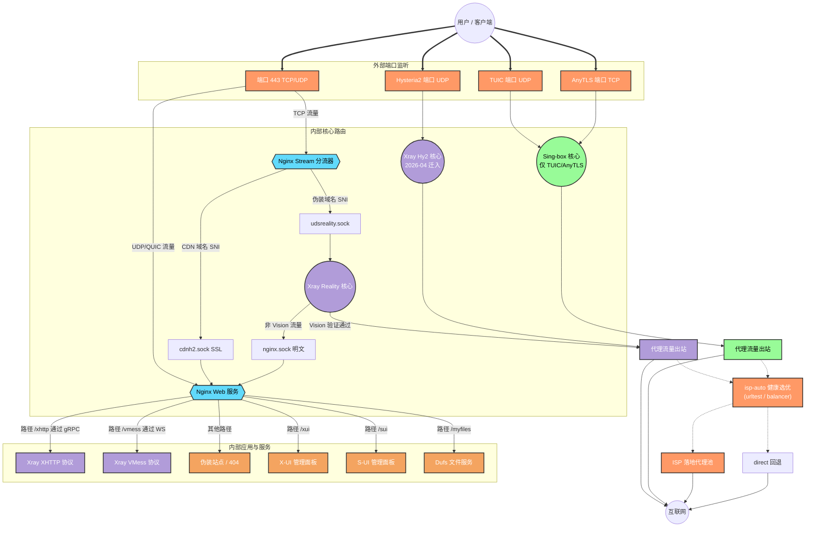

### 2.2 视角一：边缘网关入口层

外部流量如何进入服务器的物理端口。

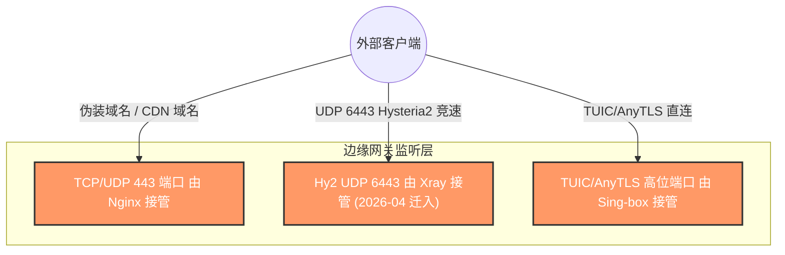

* **解释**：Hysteria2（2026-04 起由 **Xray** 原生承载）/ TUIC / AnyTLS 等协议基于纯 UDP 或 QUIC，拥有极强的抗丢包特性，因此直接绕过 Nginx，监听独立的随机高位端口，实现暴力竞速。

### 2.3 视角二：Reality 核心鉴权与回落

当流量通过 443 端口进入系统后，Xray Reality 是如何处理它的。

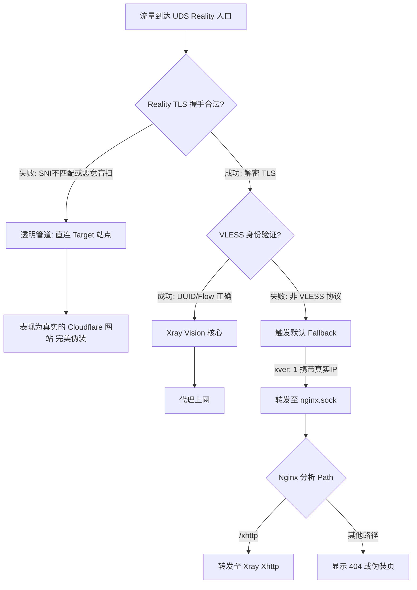

> **关键安全设计**：配置中限制了 `serverNames: ["${DEST_HOST}"]`。如果攻击者使用错误的 SNI 连接，Reality 直接将流量透传给 `target`。攻击者看到的永远是真实目标站点（如 Cloudflare 测速页面）的正规证书和页面。

### 2.4 视角三：Nginx Web 业务层路由

对于走 CDN 通道或触发回落的流量，Nginx HTTP 引擎如何进行业务分发。

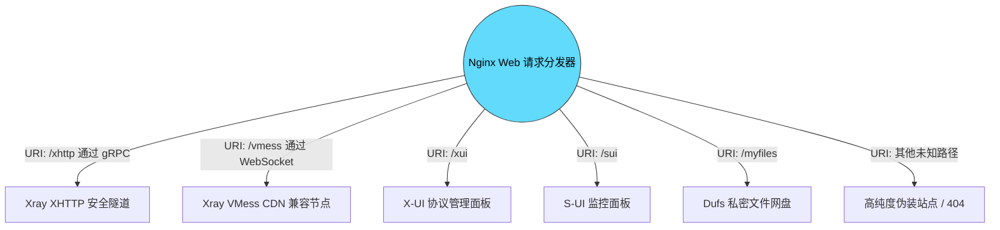

### 2.5 四大场景详细流程

#### 场景一：最强防探测模式（Reality 直连）

* **适用协议**：VLESS + Vision + Reality（主力），VLESS + Xhttp + Reality（备选）
* **客户端行为**：连接服务器 443 端口，SNI 填写**伪装域名**（如 `speed.cloudflare.com`）
* **流转过程**：
  1. **Nginx Stream**：识别伪装域名 SNI，将流量通过 `udsreality.sock` 转发给 **Xray Reality**。
  2. **Xray Reality**：进行 TLS 握手并解密流量。
  3. **Vision 分流**：
     * **VLESS Vision 流量**：验证通过，直接出站代理（最短路径）。
     * **Xhttp 流量 / 浏览器探测**：识别为普通流量，通过 **Fallback** 机制（以明文形式）转发给 `nginx.sock`。
  4. **Nginx Web**：接收明文请求，根据 Path 通过 `grpc_pass` 转发给 Xray Xhttp 模块。

#### 场景二：CDN 或 WebSocket（救火/备用）

* **适用协议**：VMess-WS、VLESS-XHTTP（CDN 模式）
* **客户端行为**：连接 CDN 节点，SNI 填写 **CDN 域名**
* **流转过程**：
  1. **Nginx Stream**：识别 CDN 域名 SNI，转发给 `cdnh2.sock`。
  2. **Nginx Web（`cdnh2.sock`）**：此监听器**开启了 SSL**，负责完成 TLS 握手解密。
  3. **路由分发**：Nginx 根据 Path 转发给 VMess、Xhttp (gRPC) 或管理面板。

#### 场景三：独立端口直连模式

* **适用协议**：Hysteria2 (UDP)、TUIC V5 (UDP)、AnyTLS (TCP)
* **客户端行为**：连接服务器的**独立端口**（Hysteria2/TUIC 支持端口跳跃）
* **流转过程**：流量直接到达独立端口。**Hysteria2 由 Xray 承载**（2026-04 起永久迁移，`templates/xray/04_hy2_inbounds.json`）；**TUIC / AnyTLS 仍由 Sing-box 承载**（`templates/sing-box/01_tuic_inbounds.json` / `02_anytls_inbounds.json`）。均不经过 Nginx。损耗最小。

#### 场景四：管理与维护

* **访问面板**：必须通过 **CDN 域名** 访问（走场景二路径），如 `https://cdn.您的域名.com/xui`
* **访问订阅**：同样走 CDN 域名路径，必须携带 `?token=${SUBSCRIBE_TOKEN}` 通过鉴权

---

## 3. 内部通信链路：Unix Domain Socket 清单

在上述流程图中，您会频繁看到形如 `udsreality.sock`、`nginx.sock` 的词汇。

### 为什么使用 Socket 而非端口？

传统的内部通信（如 `127.0.0.1:8080`）依然要走操作系统的完整 TCP/IP 协议栈，有开销且占用端口。而 `.sock`（Unix 域套接字）直接在**系统内存中进行进程间数据交换**——延迟极低、不占用网络端口、且无法被外部网络探针扫描。

### 核心 Socket 清单

| Socket 文件名 | 流量方向 | 协议/加密状态 | 作用描述 |
|:---|:---|:---|:---|
| **`udsreality.sock`** | Nginx Stream → Xray Reality | TCP / 原样转发 | **直连主通道**。Nginx 识别伪装域名 SNI 后，将包括 TLS 握手包在内的原始流量交给 Reality 处理。 |
| **`cdnh2.sock`** | Nginx Stream → Nginx Web | TCP / SSL 加密 | **CDN/主站入口**。Nginx 内部 SSL 监听器输送流量，在此解密 HTTPS 请求。 |
| **`nginx.sock`** | Reality Fallback → Nginx Web | HTTP / 明文 | **Reality 回落通道**。Reality 解密后发现不是代理流量，通过此通道把明文请求"退货"给 Nginx。 |
| **`udsxhttp.sock`** | Nginx Web → Xray Xhttp | HTTP/2 gRPC / 明文 | **Xhttp 代理通道**。Nginx 将 Xhttp 请求通过 gRPC 协议转发给 Xray 入站接口。 |
| **`udsvmessws.sock`** | Nginx Web → Xray VMess | WebSocket / 明文 | **VMess 代理通道**。Nginx 将 VMess WebSocket 请求转发给 Xray 入站接口。 |

---

## 4. 架构方案对比与选型分析

### 方案 A：Xray 前置（XTLS 官方推荐 #4118 模式）

* **参考**: [XTLS/Xray-core#4118](https://github.com/XTLS/Xray-core/discussions/4118)
* **特点**: Xray 独占 443 端口，直接处理所有 TLS/Reality 握手。配置极简。
* **局限**: 无法同时作为标准 HTTPS Web 服务器，CDN 流量配置繁琐。

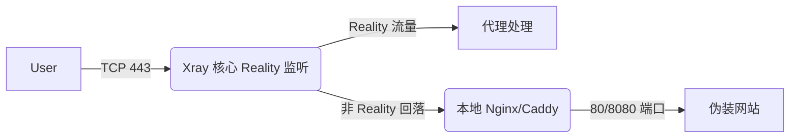

### 方案 B：Nginx 前置（本项目架构）

* **特点**: Nginx 独占 443，分流精确，支持 Reality 回落与 CDN 流量共存。

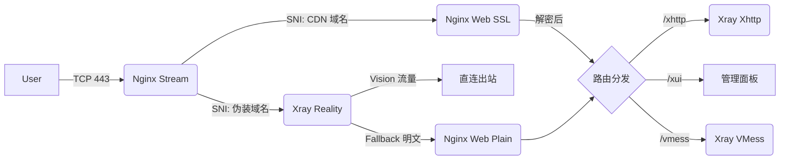

### 深度优劣势对比

| 特性 | Xray 前置 (方案 A) | Nginx 前置 (本项目) | 本项目选择理由 |
|:---|:---|:---|:---|
| **性能** | ⭐⭐⭐⭐⭐ 极致 | ⭐⭐⭐⭐⭐ TCP层分流损耗忽略 | 两者性能差距肉眼不可见 |
| **Web 能力** | ⭐⭐ 仅能简单回落 | ⭐⭐⭐⭐⭐ 路由/压缩/缓存/重写 | 需运行 X-UI、S-UI、Dufs 等多个 Web 服务 |
| **CDN 支持** | ⭐⭐⭐ 配置繁琐 | ⭐⭐⭐⭐⭐ 原生支持 | 需完美处理 CDN 回源 IP 和 Headers |
| **隐蔽性** | ⭐⭐⭐⭐⭐ 原生 Reality | ⭐⭐⭐⭐⭐ 透明分流 | Nginx Stream 不解密 Reality 流量，隐蔽性等同 |
| **维护性** | ⭐⭐⭐ 单点故障 | ⭐⭐⭐⭐ 模块解耦 | Nginx 崩溃不影响 Sing-box；Xray 崩溃 Nginx 仍可展示 Web |

**一句话总结**：如果只需要单一代理服务，Xray 前置足够；如果您想要一台**全能瑞士军刀服务器**，Nginx 前置是唯一正解。

---

## 5. Entrypoint 守护进程生命周期

容器在每次启动（或执行 `docker compose restart`）时，由 `scripts/entrypoint.py`（Python PID 1，argparse 子命令 `run` / `show` / `trim`，Docker `ENTRYPOINT ["dumb-init", "--", "python3", "/scripts/entrypoint.py", "run"]`）**一次性编排 16 段 Python 启动流水线**：加载 `ENV_FILE` + `STATUS_FILE` + `SECRET_FILE` → 基础 env 探测 (`sb_xray.network`) → ISP 测速选路 (`sb_xray.speed_test.run_isp_speed_tests`) → 流媒体/AI 可达性探针 (`sb_xray.routing.media.check_all`) + 密钥对 (`sb_xray.stages.keys`) → 出站 JSON 装配 (`sb_xray.routing.isp.build_client_and_server_configs`) → TLS 证书 (`sb_xray.cert`) → DH 参数 (`sb_xray.stages.dhparam`) → GeoIP 更新 (`sb_xray.stages.geoip`) → 渲染模板 (`sb_xray.config_builder.create_config` + `sb_xray.routing.providers`) → `trim_runtime_configs` 按 `ENABLE_*` 开关对已渲染 `daemon.ini` 做幂等 in-place 过滤 → X-UI / S-UI 初始化 (`sb_xray.stages.panels`) → Nginx htpasswd (`sb_xray.stages.nginx_auth`) → Cron 安装 (`sb_xray.stages.cron`) → 订阅链接 banner → `os.execvp` 接管 supervisord (`sb_xray.stages.supervisord`)。每一个阶段都可以通过 `--skip-stage <name>` 单独跳过用于诊断。Bash 入口 `entrypoint.sh` 已于 Phase 8 彻底退役。

### 5.1 整体生命周期流转图

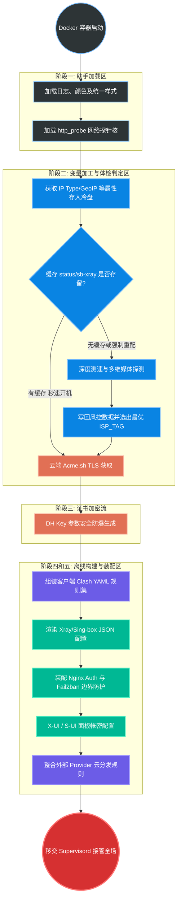

### 5.2 各层核心功能透视

#### §1-6 基础工具层

* **定位**：纯粹被动调用的函数合集，所有上层逻辑的基础设施。
* **代表组件**：
  * `ensure_var`（§6）：三分支缓存系统——① 变量已在当前 shell 则直接返回；② 已在持久化文件 `/.env/sb-xray` 则读取并 export 到 shell；③ 两者均无则执行计算、export 后写文件。
  * `http_probe`（§3）：**所有流媒体和 AI 探测的通用基建**，封装了带伪装 UA、短超时 (3s) 和强制断后重试的 `curl` 探测器。

#### §7-9 网络探测与状态缓存层

这是整个系统的**智能短路核心**，决定了出海方向与极致的容器重启效能。

##### 🧊 冷热数据分离架构

| 数据层 | 存储路径 | 内容特征 | 生命周期 |
|:---|:---|:---|:---|
| **冷盘** | `/.env/sb-xray` | IP 类型 (ASN)、地理归属 (GEOIP)、UUID 私钥等固有属性 | 全新部署时生成一次，永久有效 |
| **热盘** | `/.env/status` | ISP_TAG 优选成绩、ChatGPT/Netflix 连通性探针结果 | 支持用户主动外置挂载，按需刷新 |

##### ⚡ 极速重启短路截断 (Circuit Breaker)

一旦代码侦测到挂载的 `status` 文件内已经存留有效的探针成绩记录，系统直接触发**短路截断**——**抛弃耗时的并发跑分，0.5 秒内完成组件渲染并极速上线**。这避免了容器每次重启都去调用海外 API 测速（导致重启极慢且易被 API 封禁）。

#### §12 证书管理层

* 与 ACME CA 层接轨，负责域名申请签注和私钥分发。
* 引入了 `openssl x509 -checkend 604800` 安全检查，仅对剩余寿命不足 7 天的证书发起强制轮换流，降低被 CA 封禁 IP 的风险。

#### §13-15 配置渲染与流程启动层

* **绝不测速发请求**：该阶段只读内存资源集
* **客户端配置**：遍历 IP 环境变量构建服务端出站配置
* **服务端组配**：注入**全部** ISP 节点的 SOCKS5 出站 JSON（按测速速度降序排列），并生成 Sing-box `urltest` + Xray `observatory`/`balancer` 运行时健康检测配置
* **动态路由规则**：`build_xray_service_rules()` 根据 `*_OUT` 变量值动态切换 `balancerTag`（isp-auto）或 `outboundTag`（direct/具体 tag）
* **外显智能标识**：通过 `IS_8K_SMOOTH` 配合 `IP_TYPE` 判定，在外显订阅上动态渲染策略匹配后缀（住宅流畅标 ` ✈ super` 或代理流畅标 ` ✈ good`）

### 5.3 AI/媒体解锁探测决策流

脚本内置了针对 Gemini/ChatGPT/Netflix 等服务的探测逻辑阵列，决策链遵循下列流程树：

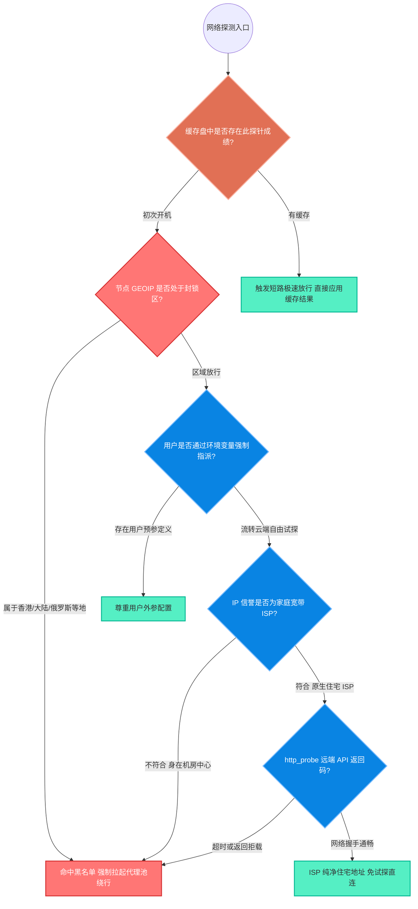

---

## 6. 出站路由与多 ISP 链式落地引擎

为解决 VPS 机房 IP 无法观看 Netflix、Disney+ 及无法正常访问 ChatGPT 等服务的痛点，后端引擎配置了针对流媒体与海外 AI 的全自动链式跳板引擎，并内置**运行时健康检测与自动回退**机制。

### 6.1 出站路由决策

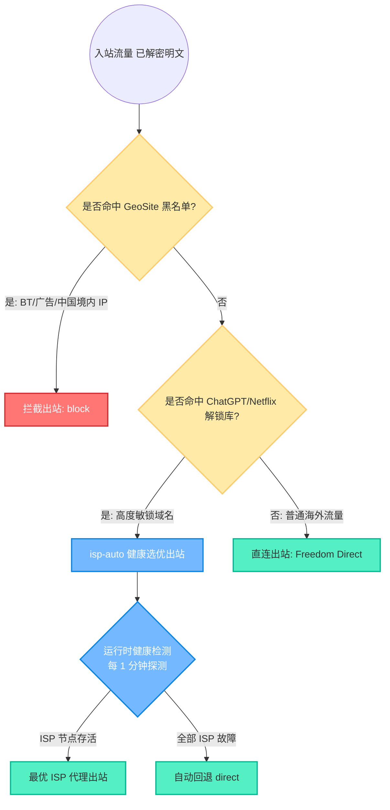

### 6.2 核心出站类型

| 出站类型 | Tag 标签 | 协议 | 作用 |
|:---|:---|:---|:---|
| **直连** | `direct` | Freedom | 直接连接目标网站，默认出站 |
| **拦截** | `block` | Blackhole | 丢弃被屏蔽的流量（广告、恶意 IP 等） |
| **ISP 代理** | `proxy-*` | Socks | 各 ISP 落地 SOCKS5 代理节点，按测速排序注入 |
| **健康选优** | `isp-auto` | urltest / balancer | 包裹所有 ISP + direct，运行时自动选优并回退 |

> **全程透明**：所有的解锁动作在服务器端默默完成，客户端无需任何繁琐的前置 (Dialer) 设置。

### 6.3 ISP 健康检测方案演进

#### 旧方案（启动时选优，无运行时检测）

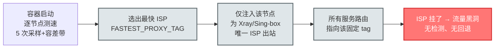

| 特性 | 旧方案 |
|:---|:---|
| 出站节点数 | 仅注入 1 个（最快 ISP） |
| 运行时检测 | **无** |
| ISP 故障时 | **流量黑洞**（ChatGPT/Netflix 等全部不可用） |
| 测速采样 | 5 次截断均值 + 15% 容差带 |
| 路由指向 | 静态 `outboundTag: "proxy-xx-isp"` |

#### 新方案（全量注入 + 运行时健康检测 + 自动回退）

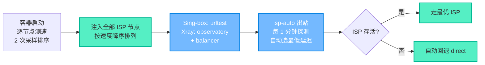

| 特性 | 新方案 |
|:---|:---|
| 出站节点数 | **注入全部 ISP**（按速度排序） |
| 运行时检测 | Sing-box `urltest` / Xray `observatory` 每 1 分钟探测 |
| ISP 故障时 | **自动回退 direct**（Sing-box urltest 含 direct；Xray balancer `fallbackTag: "direct"`） |
| 测速采样 | 2 次（仅用于初始排序，运行时由内核选优） |
| 路由指向 | Sing-box: `outbound: "isp-auto"`；Xray: 动态生成 `balancerTag` / `outboundTag` |

#### 双内核健康检测机制对比

| 机制 | Sing-box | Xray |
|:---|:---|:---|
| **实现** | `urltest` 出站类型 | `observatory` + `balancer` |
| **探测 URL** | `https://www.gstatic.com/generate_204` | 同左 |
| **探测间隔** | 1 分钟 | 1 分钟 |
| **选优策略** | 最低延迟（tolerance 300ms） | `leastPing`（最低延迟） |
| **回退机制** | `outbounds` 列表末尾包含 `direct` | `fallbackTag: "direct"` |
| **故障切换** | `interrupt_exist_connections: true` | observatory 自动标记不健康 |
| **配置生成** | `build_sb_urltest()` → `${SB_ISP_URLTEST}` | `build_xray_balancer()` → `${XRAY_OBSERVATORY_SECTION}` + `${XRAY_BALANCERS_SECTION}` |

#### Xray 动态路由规则

由于 Xray 的 `balancerTag` 和 `outboundTag` 互斥（不能在同一条规则中共存），服务路由规则（openai/netflix/disney 等）**必须动态生成**：

```
*_OUT == "isp-auto" → {"balancerTag": "isp-auto"}     # 走 balancer 健康选优
*_OUT == "direct"   → {"outboundTag": "direct"}        # 直连
*_OUT == "proxy-xx" → {"outboundTag": "proxy-xx"}      # 指定出站（理论场景）
```

由 `build_xray_service_rules()` 在 `analyze_ai_routing_env()` 之后调用，遍历所有 `*_OUT` 变量动态拼接注入 `${XRAY_SERVICE_RULES}` 占位符。

---

## 7. 参考文献

* **架构参考**: [XTLS/Xray-core#4118 — Reality 端口共存模型](https://github.com/XTLS/Xray-core/discussions/4118)
* **XHTTP 标准探讨**: [XTLS/Xray-core#4113](https://github.com/XTLS/Xray-core/discussions/4113)
* **Unix Domain Socket 原理**: POSIX.1-2001 `unix(7)` 规范 — 进程间通信 (IPC) 的高效数据交换机制
* **Nginx Stream 模块**: [Nginx ngx_stream_ssl_preread_module](https://nginx.org/en/docs/stream/ngx_stream_ssl_preread_module.html) — 在不解密 TLS 的前提下提取 SNI 信息
