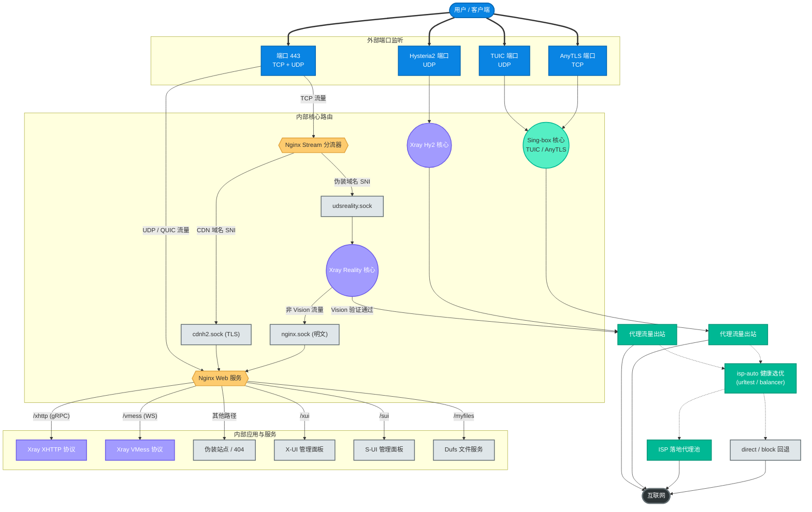
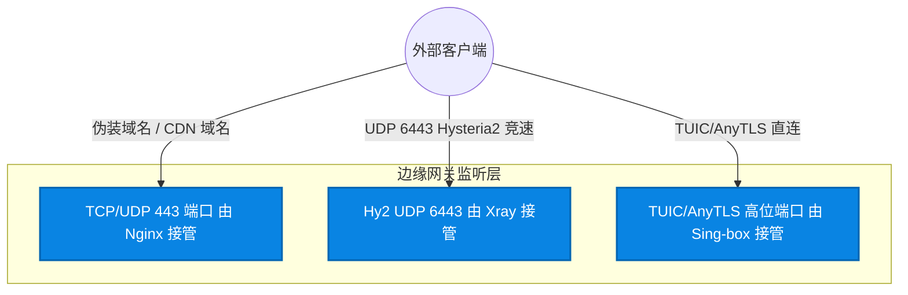
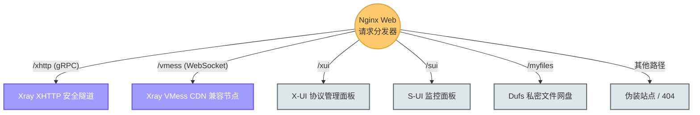
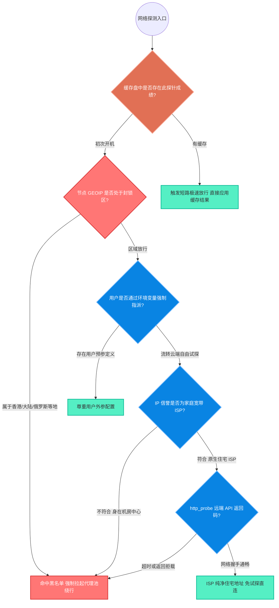
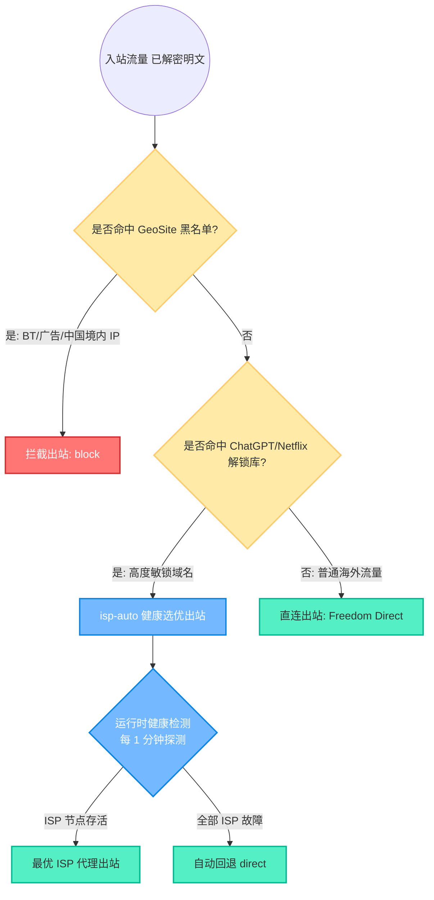
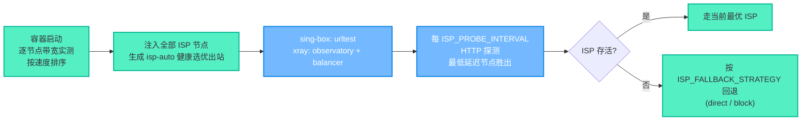
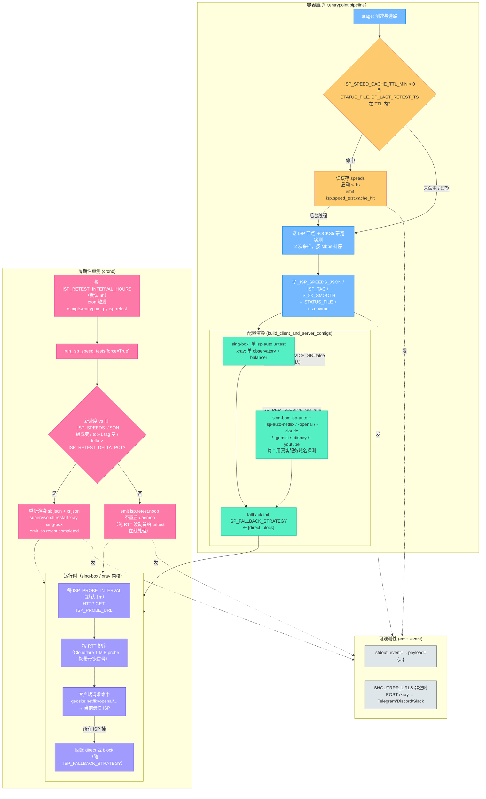

# 01. 系统架构与全流量链路引擎

> 本文档深入剖析 SB-Xray 的核心架构设计——从 Nginx 边界网关的流量拦截与分发，到双引擎内核的协议处理，再到容器启动的 15 段分层初始化流水线——进行全景式解读。

---

## 目录

1. [核心架构理论：Nginx 前置 vs Xray 前置](#1-核心架构理论nginx-前置-vs-xray-前置)
2. [全流量链路深度拆解](#2-全流量链路深度拆解)
3. [内部通信链路：Unix Domain Socket 清单](#3-内部通信链路unix-domain-socket-清单)
4. [架构方案对比与选型分析](#4-架构方案对比与选型分析)
5. [Entrypoint 守护进程生命周期](#5-entrypoint-守护进程生命周期)
6. [出站路由与多 ISP 链式落地引擎](#6-出站路由与多-isp-链式落地引擎)
7. [参考文献](#7-参考文献)

---

## 1. 核心架构理论：Nginx 前置 vs Xray 前置

在代理服务领域，关于 443 端口的接管权一直存在两种主流技术路线。为了实现复杂的多业务级功能，本项目坚定选用了 **Nginx 前置多业务网关** 架构。

> **文献参考**: 本架构设计深度融合并扩展了 XTLS 社区关于端口共存的讨论 [XTLS/Xray-core#4118](https://github.com/XTLS/Xray-core/discussions/4118)。

### 为什么选择 Nginx 作为守门人？

如果由 Xray 独占 443 端口（Xray 前置），虽然配置极简，但其只能作为单一的 Reality 代理服务器。一旦您需要同时运行 **多个可视化 Web 面板 (X-UI/S-UI)**、提供 **文件网盘 (Dufs)**，或是处理来自 **Cloudflare 的 CDN 备用流量**，Xray 简单的 `fallbacks` 机制将捉襟见肘。

**SB-Xray 的 Nginx 前置三大核心优势：**

| 优势 | 技术原理 | 效果 |
|:---|:---|:---|
| **TCP 层 SNI 嗅探** | Nginx `stream` 模块在不解密 TLS 的情况下直接查看客户端请求的 SNI | 零延迟识别流量类型 |
| **零损耗透传** | 伪装域名的 TLS 握手数据通过 Unix Socket 直接转发至 Xray Reality | 性能损耗肉眼不可见 |
| **强大的 Web 路由** | CDN 域名的 HTTPS 请求由 Nginx 解密后按 URL 路径精确分发 | 支持多微服务并行运行 |

---

## 2. 全流量链路深度拆解

我们把复杂的宏观架构拆分为三个微观视角，以便您透彻理解数据包从客户端到服务器的完整旅程。

### 2.1 全景流量分发图

以下图表展示了当一个请求到达服务器时，它所经历的完整路径。



### 2.2 视角一：边缘网关入口层

外部流量如何进入服务器的物理端口。



* **解释**：Hysteria2（由 Xray 原生承载）/ TUIC / AnyTLS 等协议基于纯 UDP 或 QUIC，拥有极强的抗丢包特性，因此直接绕过 Nginx，监听独立的随机高位端口，实现暴力竞速。

### 2.3 视角二：Reality 核心鉴权与回落

当流量通过 443 端口进入系统后，Xray Reality 是如何处理它的。


> **关键安全设计**：配置中限制了 `serverNames: ["${DEST_HOST}"]`。如果攻击者使用错误的 SNI 连接，Reality 直接将流量透传给 `target`。攻击者看到的永远是真实目标站点（如 Cloudflare 测速页面）的正规证书和页面。

### 2.4 视角三：Nginx Web 业务层路由

对于走 CDN 通道或触发回落的流量，Nginx HTTP 引擎如何进行业务分发。



### 2.5 四大场景详细流程

#### 场景一：最强防探测模式（Reality 直连）

* **适用协议**：VLESS + Vision + Reality（主力），VLESS + Xhttp + Reality（备选）
* **客户端行为**：连接服务器 443 端口，SNI 填写**伪装域名**（如 `speed.cloudflare.com`）
* **流转过程**：
  1. **Nginx Stream**：识别伪装域名 SNI，将流量通过 `udsreality.sock` 转发给 **Xray Reality**。
  2. **Xray Reality**：进行 TLS 握手并解密流量。
  3. **Vision 分流**：
     * **VLESS Vision 流量**：验证通过，直接出站代理（最短路径）。
     * **Xhttp 流量 / 浏览器探测**：识别为普通流量，通过 **Fallback** 机制（以明文形式）转发给 `nginx.sock`。
  4. **Nginx Web**：接收明文请求，根据 Path 通过 `grpc_pass` 转发给 Xray Xhttp 模块。

#### 场景二：CDN 或 WebSocket（救火/备用）

* **适用协议**：VMess-WS、VLESS-XHTTP（CDN 模式）
* **客户端行为**：连接 CDN 节点，SNI 填写 **CDN 域名**
* **流转过程**：
  1. **Nginx Stream**：识别 CDN 域名 SNI，转发给 `cdnh2.sock`。
  2. **Nginx Web（`cdnh2.sock`）**：此监听器**开启了 SSL**，负责完成 TLS 握手解密。
  3. **路由分发**：Nginx 根据 Path 转发给 VMess、Xhttp (gRPC) 或管理面板。

#### 场景三：独立端口直连模式

* **适用协议**：Hysteria2 (UDP)、TUIC V5 (UDP)、AnyTLS (TCP)
* **客户端行为**：连接服务器的**独立端口**（Hysteria2/TUIC 支持端口跳跃）
* **流转过程**：流量直接到达独立端口。**Hysteria2 由 Xray 承载**（`templates/xray/04_hy2_inbounds.json`）；**TUIC / AnyTLS 由 Sing-box 承载**（`templates/sing-box/01_tuic_inbounds.json` / `02_anytls_inbounds.json`）。均不经过 Nginx，损耗最小。

#### 场景四：管理与维护

* **访问面板**：必须通过 **CDN 域名** 访问（走场景二路径），如 `https://cdn.您的域名.com/xui`
* **访问订阅**：同样走 CDN 域名路径，必须携带 `?token=${SUBSCRIBE_TOKEN}` 通过鉴权

---

## 3. 内部通信链路：Unix Domain Socket 清单

在上述流程图中，您会频繁看到形如 `udsreality.sock`、`nginx.sock` 的词汇。

### 为什么使用 Socket 而非端口？

传统的内部通信（如 `127.0.0.1:8080`）依然要走操作系统的完整 TCP/IP 协议栈，有开销且占用端口。而 `.sock`（Unix 域套接字）直接在**系统内存中进行进程间数据交换**——延迟极低、不占用网络端口、且无法被外部网络探针扫描。

### 核心 Socket 清单

| Socket 文件名 | 流量方向 | 协议/加密状态 | 作用描述 |
|:---|:---|:---|:---|
| **`udsreality.sock`** | Nginx Stream → Xray Reality | TCP / 原样转发 | **直连主通道**。Nginx 识别伪装域名 SNI 后，将包括 TLS 握手包在内的原始流量交给 Reality 处理。 |
| **`cdnh2.sock`** | Nginx Stream → Nginx Web | TCP / SSL 加密 | **CDN/主站入口**。Nginx 内部 SSL 监听器输送流量，在此解密 HTTPS 请求。 |
| **`nginx.sock`** | Reality Fallback → Nginx Web | HTTP / 明文 | **Reality 回落通道**。Reality 解密后发现不是代理流量，通过此通道把明文请求"退货"给 Nginx。 |
| **`udsxhttp.sock`** | Nginx Web → Xray Xhttp | HTTP/2 gRPC / 明文 | **Xhttp 代理通道**。Nginx 将 Xhttp 请求通过 gRPC 协议转发给 Xray 入站接口。 |
| **`udsvmessws.sock`** | Nginx Web → Xray VMess | WebSocket / 明文 | **VMess 代理通道**。Nginx 将 VMess WebSocket 请求转发给 Xray 入站接口。 |

---

## 4. 架构方案对比与选型分析

### 方案 A：Xray 前置（XTLS 官方推荐 #4118 模式）

* **参考**: [XTLS/Xray-core#4118](https://github.com/XTLS/Xray-core/discussions/4118)
* **特点**: Xray 独占 443 端口，直接处理所有 TLS/Reality 握手。配置极简。
* **局限**: 无法同时作为标准 HTTPS Web 服务器，CDN 流量配置繁琐。


### 方案 B：Nginx 前置（本项目架构）

* **特点**: Nginx 独占 443，分流精确，支持 Reality 回落与 CDN 流量共存。


### 深度优劣势对比

| 特性 | Xray 前置 (方案 A) | Nginx 前置 (本项目) | 本项目选择理由 |
|:---|:---|:---|:---|
| **性能** | ⭐⭐⭐⭐⭐ 极致 | ⭐⭐⭐⭐⭐ TCP层分流损耗忽略 | 两者性能差距肉眼不可见 |
| **Web 能力** | ⭐⭐ 仅能简单回落 | ⭐⭐⭐⭐⭐ 路由/压缩/缓存/重写 | 需运行 X-UI、S-UI、Dufs 等多个 Web 服务 |
| **CDN 支持** | ⭐⭐⭐ 配置繁琐 | ⭐⭐⭐⭐⭐ 原生支持 | 需完美处理 CDN 回源 IP 和 Headers |
| **隐蔽性** | ⭐⭐⭐⭐⭐ 原生 Reality | ⭐⭐⭐⭐⭐ 透明分流 | Nginx Stream 不解密 Reality 流量，隐蔽性等同 |
| **维护性** | ⭐⭐⭐ 单点故障 | ⭐⭐⭐⭐ 模块解耦 | Nginx 崩溃不影响 Sing-box；Xray 崩溃 Nginx 仍可展示 Web |

**一句话总结**：如果只需要单一代理服务，Xray 前置足够；如果您想要一台**全能瑞士军刀服务器**，Nginx 前置是唯一正解。

---

## 5. Entrypoint 守护进程生命周期

容器启动或 `docker compose restart` 时，Python 脚本 `scripts/entrypoint.py` 作为 PID 1（由 `dumb-init` 包裹）按固定顺序跑完启动流水线，最后用 `os.execvp` 把进程交给 `supervisord`，由后者守护 xray / sing-box / nginx 等所有常驻服务。

Entrypoint 有三个子命令:

| 子命令 | 用途 |
|---|---|
| `run`（默认） | 容器启动时执行完整流水线,最终接管 supervisord |
| `show` | 打印订阅链接 banner + TLS 诊断,不改任何文件 |
| `trim` | 按 `ENABLE_*` 开关对已渲染的 `daemon.ini` 做幂等过滤 |

流水线分 15 段,每段一个明确目标,可通过 `--skip-stage <name>` 单独跳过用于排障:

| # | 阶段 | 作用 |
|---:|:---|:---|
| 1 | 加载环境 | 读取 `ENV_FILE` + `STATUS_FILE` + `SECRET_FILE` 到 `os.environ` |
| 2 | 基础网络探测 | 检测 IPv4/IPv6、GeoIP、IP_TYPE、受限地区标志 |
| 3 | ISP 测速选路 | 逐个 ISP 节点带宽实测（v2 流式采样器：warmup 丢弃 + 时间窗 + 首字节起算 + 结构化诊断），按 Mbps 排序写入 `_ISP_SPEEDS_JSON`；每 tag 诊断写入 `_ISP_SPEEDS_DIAG_JSON`（见 [§2.6](./04-ops-and-troubleshooting.md#26-isp-auto-优化控制变量可选)） |
| 4 | 流媒体/AI 可达性探针 | 试探 Netflix / OpenAI / Claude / Gemini 等服务的直连状态 |
| 5 | 密钥对生成 | VLESS UUID、Reality / MLKEM768 密钥、订阅 Token 首次生成并持久化 |
| 6 | 出站 JSON 装配 | 把 ISP 节点渲染成 xray / sing-box 的 SOCKS5 出站,生成 `isp-auto` balancer |
| 7 | TLS 证书 | 调 `acme.sh` 申请 / 续签通配证书(Let's Encrypt / ZeroSSL / Google) |
| 8 | DH 参数 | 生成或复用 Nginx `dhparam.pem`(首次 ~30s,其后秒级) |
| 9 | GeoIP / GeoSite | 按 TTL 更新 `/geo` 下的规则库,dual-symlink 到 xray + sing-box 工作目录 |
| 10 | 模板渲染 | 把 `templates/` 下的 xray / sing-box / nginx / supervisord 模板 envsubst 到 `${WORKDIR}` |
| 11 | 程序裁剪 | 按 `ENABLE_*` 对 `daemon.ini` 做幂等 in-place 过滤(小内存节点降载) |
| 12 | X-UI / S-UI | 面板数据库初始化,仅在对应 `ENABLE_*` 为 true 时执行 |
| 13 | Nginx htpasswd | 写订阅端点的 HTTP Basic Auth 凭据 |
| 14 | Cron 安装 | 注册 `geo-update`(每日 03:00) + `isp-retest`(每 `ISP_RETEST_INTERVAL_HOURS`) |
| 15 | Supervisord 接管 | `os.execvp("supervisord", ...)` — Python 进程退出,supervisord 继续守护 |

流水线结束后,所有 daemon 由 supervisord 管理,重启策略、日志重定向、退出码处理都在 `daemon.ini` 中声明。

### 5.1 整体生命周期流转图

下图把上节 15 段流水线按**职能**聚合成 5 个阶段,展示从容器冷启动到 supervisord 接管的完整路径,以及唯一一处可以"秒速开机"的缓存短路。

```mermaid
flowchart TB
    classDef entry    fill:#0984e3,stroke:#0566b3,stroke-width:2px,color:#fff
    classDef process  fill:#00b894,stroke:#009577,stroke-width:2px,color:#fff
    classDef decision fill:#fdcb6e,stroke:#e0a33e,stroke-width:2px,color:#333
    classDef data     fill:#a29bfe,stroke:#6c5ce7,stroke-width:2px,color:#fff
    classDef external fill:#dfe6e9,stroke:#636e72,stroke-width:2px,color:#333
    classDef terminal fill:#2d3436,stroke:#636e72,stroke-width:3px,color:#fff

    Start(["Docker 容器启动<br/>dumb-init → entrypoint.py run"]):::entry

    subgraph P1 ["① 环境加载"]
        direction TB
        L1["读取 ENV_FILE / STATUS_FILE / SECRET_FILE"]:::process
        L2["基础网络探测<br/>IP_TYPE · GeoIP · 受限地区标志"]:::process
        L1 --> L2
    end

    subgraph P2 ["② 测速选路"]
        direction TB
        D1{"STATUS_FILE 中<br/>ISP_LAST_RETEST_TS<br/>在缓存 TTL 内?"}:::decision
        S1["逐 ISP 节点带宽实测<br/>按 Mbps 排序写入 STATUS_FILE"]:::process
        S2["流媒体/AI 可达性探针<br/>计算 *_OUT 策略"]:::process
        S3["读缓存 speeds<br/>后台线程异步刷新"]:::data
        D1 -- "命中" --> S3
        D1 -- "未命中/过期" --> S1 --> S2
    end

    subgraph P3 ["③ 证书与密钥"]
        direction TB
        C1["ACME TLS 证书申请/续签<br/>acme.sh (Let's Encrypt / ZeroSSL / Google)"]:::process
        C2["UUID · Reality 密钥对 · MLKEM768 种子<br/>首次生成并持久化到 SECRET_FILE"]:::process
        C3["DH 参数<br/>(首次 ~30s,后续秒级)"]:::process
        C1 --> C2 --> C3
    end

    subgraph P4 ["④ 配置渲染与装配"]
        direction TB
        R1["出站 JSON 装配<br/>isp-auto / 按服务分桶 balancer"]:::process
        R2["模板渲染<br/>xray · sing-box · nginx · supervisord"]:::process
        R3["按 ENABLE_* 开关裁剪 daemon.ini<br/>关闭小内存节点的可选子进程"]:::process
        R4["X-UI / S-UI 数据库初始化<br/>Nginx htpasswd 凭据"]:::process
        R5["Cron 安装<br/>geo-update (03:00) · isp-retest (每 6h)"]:::process
        R1 --> R2 --> R3 --> R4 --> R5
    end

    subgraph P5 ["⑤ 接管常驻服务"]
        direction TB
        F1["打印订阅链接 banner"]:::process
        F2[["os.execvp('supervisord', ...)<br/>Python 进程退出<br/>supervisord 成为新 PID 1"]]:::terminal
        F1 --> F2
    end

    Daemons[["xray · sing-box · nginx · cron · X-UI / S-UI / shoutrrr-forwarder<br/>(supervisord 守护,策略在 daemon.ini 中声明)"]]:::external

    Start --> P1 --> P2
    S2 --> P3
    S3 --> P3
    P3 --> P4 --> P5
    F2 -.接管.-> Daemons
```



**图例**: 🔵 入口 / ① 起点　🟢 常规处理步骤　🟡 运行时决策点　🟣 数据读写(缓存 / 密钥持久化)　⚫ 进程移交(`os.execvp` 替换当前进程)　⬜ 移交后由 supervisord 守护的外部服务。

**阅读导引**:

1. **①→②** 是「我在哪、怎么连外网」的体检。`ENV_FILE` 读用户声明,`STATUS_FILE` 读上次运行的缓存,`SECRET_FILE` 读持久化密钥;紧接着用 ipapi.is / ip.sb / ip111.cn 三路探测判 IP 类型与地区。
2. **②** 是整条流水线中**唯一的性能短路**。`ISP_SPEED_CACHE_TTL_MIN`(默认 60 分钟)窗口内冷启动不跑实测,读缓存直接进入 ③;同时起一个后台线程异步跑实测,结果写回 `STATUS_FILE`。缓存过期则串行跑带宽实测 + 服务可达性探针。
3. **③** 是唯一对外部系统强依赖的阶段。证书阶段命中 ACME CA,密钥阶段仅首次生成、之后恒等读缓存;DH 参数首次较慢是单次成本。
4. **④** 全部离线完成 — 拿 ② 得出的 speeds、③ 得出的证书和密钥,渲染出 xray / sing-box / nginx / supervisord 的完整配置,再按 `ENABLE_*` 开关裁剪 `daemon.ini`。
5. **⑤** 用 `os.execvp` 把当前 Python 进程替换为 supervisord。替换之后 Python 上下文整体消失,supervisord 以 PID 1 身份接管 xray / sing-box / nginx / cron 等常驻进程。

### 5.2 各层核心功能透视

#### §1-6 基础工具层

* **定位**：纯粹被动调用的函数合集，所有上层逻辑的基础设施。
* **代表组件**：
  * `ensure_var`（§6）：三分支缓存系统——① 变量已在当前 shell 则直接返回；② 已在持久化文件 `/.env/sb-xray` 则读取并 export 到 shell；③ 两者均无则执行计算、export 后写文件。
  * `http_probe`（§3）：**所有流媒体和 AI 探测的通用基建**，封装了带伪装 UA、短超时 (3s) 和强制断后重试的 `curl` 探测器。

#### §7-9 网络探测与状态缓存层

这是整个系统的**智能短路核心**，决定了出海方向与极致的容器重启效能。

##### 🧊 冷热数据分离架构

| 数据层 | 存储路径 | 内容特征 | 生命周期 |
|:---|:---|:---|:---|
| **冷盘** | `/.env/sb-xray` | IP 类型 (ASN)、地理归属 (GEOIP)、UUID 私钥等固有属性 | 全新部署时生成一次，永久有效 |
| **热盘** | `/.env/status` | ISP_TAG 优选成绩、ChatGPT/Netflix 连通性探针结果 | 支持用户主动外置挂载，按需刷新 |

##### ⚡ 极速重启短路截断 (Circuit Breaker)

一旦代码侦测到挂载的 `status` 文件内已经存留有效的探针成绩记录，系统直接触发**短路截断**——**抛弃耗时的并发跑分，0.5 秒内完成组件渲染并极速上线**。这避免了容器每次重启都去调用海外 API 测速（导致重启极慢且易被 API 封禁）。

#### §12 证书管理层

* 与 ACME CA 层接轨，负责域名申请签注和私钥分发。
* 引入了 `openssl x509 -checkend 604800` 安全检查，仅对剩余寿命不足 7 天的证书发起强制轮换流，降低被 CA 封禁 IP 的风险。

#### §13-15 配置渲染与流程启动层

* **绝不测速发请求**：该阶段只读内存资源集
* **客户端配置**：遍历 IP 环境变量构建服务端出站配置
* **服务端组配**：注入**全部** ISP 节点的 SOCKS5 出站 JSON（按测速速度降序排列），并生成 Sing-box `urltest` + Xray `observatory`/`balancer` 运行时健康检测配置
* **动态路由规则**：`build_xray_service_rules()` 根据 `*_OUT` 变量值动态切换 `balancerTag`（isp-auto）或 `outboundTag`（direct/具体 tag）
* **外显智能标识**：通过 `IS_8K_SMOOTH` 配合 `IP_TYPE` 判定，在外显订阅上动态渲染策略匹配后缀（住宅流畅标 ` ✈ super` 或代理流畅标 ` ✈ good`）

### 5.3 AI/媒体解锁探测决策流

脚本内置了针对 Gemini/ChatGPT/Netflix 等服务的探测逻辑阵列，决策链遵循下列流程树：



---

## 6. 出站路由与多 ISP 链式落地引擎

为解决 VPS 机房 IP 无法观看 Netflix、Disney+ 及无法正常访问 ChatGPT 等服务的痛点，后端引擎配置了针对流媒体与海外 AI 的全自动链式跳板引擎，并内置**运行时健康检测与自动回退**机制。

### 6.1 出站路由决策



### 6.2 核心出站类型

| 出站类型 | Tag 标签 | 协议 | 作用 |
|:---|:---|:---|:---|
| **直连** | `direct` | Freedom | 直接连接目标网站，默认出站 |
| **拦截** | `block` | Blackhole | 丢弃被屏蔽的流量（广告、恶意 IP 等） |
| **ISP 代理** | `proxy-*` | Socks | 各 ISP 落地 SOCKS5 代理节点，按测速排序注入 |
| **健康选优** | `isp-auto` | urltest / balancer | 包裹所有 ISP + direct，运行时自动选优并回退 |

> **全程透明**：所有的解锁动作在服务器端默默完成，客户端无需任何繁琐的前置 (Dialer) 设置。

### 6.3 ISP 健康检测工作机制

容器启动时对每个 ISP 节点做一次带宽实测,把所有节点按速度降序全部注入 xray / sing-box 的出站列表,并生成一个 `isp-auto` 健康选优出站。服务路由(Netflix / OpenAI / Disney 等)指向 `isp-auto`,由内核在运行时持续探测、自动选最低延迟节点、ISP 故障时按策略回退。



| 特性 | 说明 |
|:---|:---|
| 出站节点数 | 全部 ISP 节点（按速度降序排列） |
| 运行时检测 | sing-box `urltest` / xray `observatory` 按 `ISP_PROBE_INTERVAL`（默认 1m）持续探测 |
| ISP 故障回退 | sing-box urltest 的 `outbounds` 末尾追加 fallback tag；xray balancer `fallbackTag` 同源 |
| 周期性重测 | cron 每 `ISP_RETEST_INTERVAL_HOURS`（默认 6h）重跑带宽测试,仅组成/排序变化时重启 daemon |
| 路由指向 | sing-box: `outbound: "isp-auto"`；xray: 动态生成 `balancerTag` / `outboundTag` |

#### 双内核健康检测机制对比

| 机制 | Sing-box | Xray |
|:---|:---|:---|
| **实现** | `urltest` 出站类型 | `observatory` + `balancer` |
| **探测 URL** | `ISP_PROBE_URL`，默认 `https://speed.cloudflare.com/__down?bytes=1048576`（1 MiB 携带带宽信号） | 同左 |
| **探测间隔** | `ISP_PROBE_INTERVAL`，默认 `1m`（小内存节点建议 `5m`） | 同左 |
| **选优策略** | 最低延迟（`ISP_PROBE_TOLERANCE_MS`，默认 300ms） | `leastPing`（最低延迟） |
| **回退机制** | `outbounds` 末尾追加 `ISP_FALLBACK_STRATEGY`（默认 `direct`，可设 `block` 实现 fail-closed） | `fallbackTag` 同左策略 |
| **故障切换** | `interrupt_exist_connections: true` | observatory 自动标记不健康 |
| **服务分桶** | `ISP_PER_SERVICE_SB=true` 时 legacy `isp-auto` + 6 个 `isp-auto-<service>`（Netflix / OpenAI / Claude / Gemini / Disney / YouTube），各自用该服务真实域名做 probe | **不支持**（observatory 全局单例） |
| **配置生成** | `build_sb_urltest()` / `build_sb_urltest_set()` → `${SB_ISP_URLTEST}` | `build_xray_balancer()` → `${XRAY_OBSERVATORY_SECTION}` + `${XRAY_BALANCERS_SECTION}` |

#### Xray 动态路由规则

由于 Xray 的 `balancerTag` 和 `outboundTag` 互斥（不能在同一条规则中共存），服务路由规则（openai/netflix/disney 等）**必须动态生成**：

```
*_OUT == "isp-auto" → {"balancerTag": "isp-auto"}     # 走 balancer 健康选优
*_OUT == "direct"   → {"outboundTag": "direct"}        # 直连
*_OUT == "proxy-xx" → {"outboundTag": "proxy-xx"}      # 指定出站（理论场景）
```

由 `build_xray_service_rules()` 在 `analyze_ai_routing_env()` 之后调用，遍历所有 `*_OUT` 变量动态拼接注入 `${XRAY_SERVICE_RULES}` 占位符。

### 6.4 完整运行时闭环

`isp-auto` 是一个「冷启动缓存 → 速度测量 → 配置渲染 → 内核健康选优 → 周期重测」的完整闭环,操作员通过约十二个 env flag 控制节奏、可观测性与失败语义。



**闭环保证**:
1. **冷启动快** — 缓存命中 <1s 启动,后台异步刷新
2. **选优有带宽信号** — probe URL 默认 Cloudflare 1 MiB,限速节点 RTT 自然变长而下沉
3. **解锁按服务分桶** — 可为 Netflix / OpenAI 等各配独立 balancer + 真实服务域名探测(仅 sing-box,`ISP_PER_SERVICE_SB=true` 启用)
4. **ISP 挂不黑洞** — fallback 可选 `direct`(静默) 或 `block`(fail-closed,适合 CN / HK / RU)
5. **长时间漂移自愈** — 每 6h 周期性重测,仅当组成或排序变化时重启 daemon,避免无谓内存波动
6. **每个决策留痕** — 六种结构化事件(`isp.speed_test.result` / `.cache_hit` / `.error`,`isp.retest.completed` / `.noop` / `.error`),stdout 必落盘,shoutrrr 按需推送

> 所有 flag 在 Dockerfile 里注册了合适的默认值,不改 docker-compose 即可开箱运行。完整表格与典型组合见 [docs/04-ops-and-troubleshooting.md §2.6](./04-ops-and-troubleshooting.md#26-isp-auto-优化控制变量可选)。

---

## 7. 参考文献

* **架构参考**: [XTLS/Xray-core#4118 — Reality 端口共存模型](https://github.com/XTLS/Xray-core/discussions/4118)
* **XHTTP 标准探讨**: [XTLS/Xray-core#4113](https://github.com/XTLS/Xray-core/discussions/4113)
* **Unix Domain Socket 原理**: POSIX.1-2001 `unix(7)` 规范 — 进程间通信 (IPC) 的高效数据交换机制
* **Nginx Stream 模块**: [Nginx ngx_stream_ssl_preread_module](https://nginx.org/en/docs/stream/ngx_stream_ssl_preread_module.html) — 在不解密 TLS 的前提下提取 SNI 信息
