# 02. 协议详解与安全加密体系

> 本文档覆盖 SB-Xray 支持的全部代理协议配置、MLKEM 后量子端到端加密机制、Reality 深度伪装与 Fallback 回落、ACME 自动证书管家，以及 Xray TUN 透明代理进阶配置。

---

## 目录

1. [全协议配置手册](#1-全协议配置手册)
2. [MLKEM 后量子密码学](#2-mlkem-后量子密码学)
3. [XHTTP adv 抗审查字段](#3-xhttp-adv-抗审查字段)
4. [Reality 深度伪装与 Fallback 回落](#4-reality-深度伪装与-fallback-回落)
5. [ACME 全自动证书管家](#5-acme-全自动证书管家)
6. [Xray TUN 模式进阶指南](#6-xray-tun-模式进阶指南)
7. [参考文献](#7-参考文献)

---

## 1. 全协议配置手册

本项目共支持 **10 种** 不同的客户端链接组合，**先按引擎归属分组，组内按推荐度降序**：

**Xray 系（8 种）**：
1. **Reality 旗舰直连** — XTLS-Reality（⭐⭐⭐⭐⭐）
2. **UDP 极速** — Hysteria2、Xhttp-H3+BBR（⭐⭐⭐⭐⭐）
3. **XHTTP 协议族** — Xhttp+Reality直连 + 3 种 CDN 分裂/共走路由（⭐⭐⭐⭐/⭐⭐⭐）
4. **传统 CDN 救火** — Vmess WS-TLS（⭐⭐）

**Sing-box 系（2 种）**：
5. **UDP 备选** — TUIC（⭐⭐⭐）
6. **TCP 伪装** — AnyTLS（⭐⭐⭐）

> 协议命名与订阅节点名（`show` 子命令输出）**完全一致**，便于你在客户端界面里对号入座。

### 1.0 协议总览

| 序号 | 协议/模式 | 引擎 | 传输 | 关键技术 | 订阅轨 | 适用场景 | 推荐度 |
|:---|:---|:---|:---|:---|:---|:---|:---:|
| 1 | **XTLS-Reality** | Xray | TCP/443 | XTLS, Vision | v2rayn + common | 日常主力，极速稳定 | ⭐⭐⭐⭐⭐ |
| 2 | **Hysteria2** | Xray | UDP/6443 | Salamander 混淆, QUIC | v2rayn + common | 移动/弱网，暴力竞速 | ⭐⭐⭐⭐⭐ |
| 3 | **Xhttp-H3+BBR** | Xray | UDP/4443 | HTTP/3, BBR, ML-KEM | **仅 v2rayn** | UDP 直连极速，性能王 | ⭐⭐⭐⭐⭐ |
| 4 | **Xhttp+Reality直连** | Xray | TCP/443 | XHTTP, Reality, ML-KEM, adv+fragment | v2rayn + common | 探索性主力 | ⭐⭐⭐⭐ |
| 5 | **上行Xhttp+TLS+CDN 下行Xhttp+Reality** | Xray | TCP/443 | XHTTP, 分裂路由 | v2rayn + common | 上行走 CDN 隐藏客户端 IP，下行 Reality 直连 | ⭐⭐⭐⭐ |
| 6 | **上行Xhttp+Reality 下行Xhttp+TLS+CDN** | Xray | TCP/443 | XHTTP, 分裂路由 | **仅 v2rayn** | 上行 Reality 直连，下行走 CDN 分担服务器出口 | ⭐⭐⭐⭐ |
| 7 | **Xhttp+TLS+CDN 上下行不分离** | Xray | TCP/443 | XHTTP, TLS | v2rayn + common | 上下行均经 CDN，服务器 IP 被封的保底 | ⭐⭐⭐ |
| 8 | **Vmess** (WS-TLS) | Xray | TCP/443 via CDN | WebSocket, CDN | v2rayn + common | 传统兼容，救火 | ⭐⭐ |
| 9 | **TUIC** | Sing-box | UDP/8443 | QUIC | **仅 v2rayn** | Hysteria2 备选 | ⭐⭐⭐ |
| 10 | **AnyTLS** | Sing-box | TCP/4433 | TCP 指纹伪装 | **仅 v2rayn** | 企业级防火墙 | ⭐⭐⭐ |

> **阅读路径**：订阅模型是所有协议的公共语境，先读 §1.1；所有 UDP 协议共享 ISP 高峰期 QoS 对策，集中在 §1.2。随后 §1.3–§1.9 按 Xray 系（星级降序 + XHTTP 服务端机制 §1.8 贴近 XHTTP 章节）展开，§1.10–§1.11 为 Sing-box 系，§1.12 为服务端落地代理附录。

---

### 1.1 订阅双轨：v2rayn vs common

本项目对外输出 **两条** 订阅轨，**同一套服务端**根据客户端能力分流，客户端只需选对订阅即可。

| 订阅 | 面向客户端 | 加密 | 节点数 | 独有节点 |
|:---|:---|:---|:---:|:---|
| `/v2rayn` **主轨** | v2rayN / Xray-core **≥ 26.3.27** | **ML-KEM-768** 后量子 | 10 | **XHTTP/3 + BBR**（#3） |
| `/common` **通用轨** | mihomo / Karing / OpenClash / 旧版 Xray-core（**< 26.3.27**） | `decryption=none` | 6 | 无（不含 H3 / TUIC / AnyTLS / 上行 Reality 下行 CDN） |

#### 如何判断客户端走哪条轨

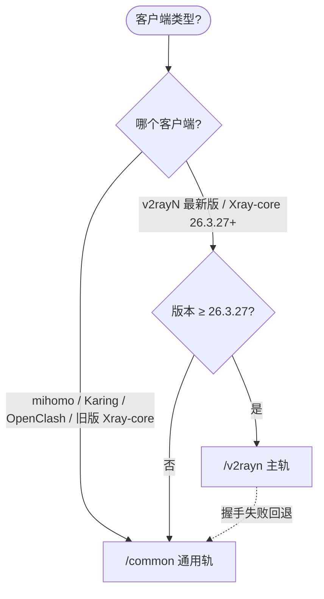

#### 为什么拆两轨

- **ML-KEM-768 抗量子加密**：仅 Xray-core ≥ 26.3.27 客户端支持 `decryption=mlkem768x25519plus...`；老 core 握手失败
- **XHTTP/3 + BBR**：仅 v2rayN（跟随 Xray-core 最新）支持 `xhttp` over H3；其他客户端不实现
- `common` 牺牲 ML-KEM、H3、TUIC 和 `上行Xhttp+Reality下行Xhttp+TLS+CDN` 换更通用的客户端兼容性；TCP 轨的 adv obfs 字段也会被剥离

> **2026-04 架构变化**：原 `v2rayn-adv` 第三轨（独立 adv 字段 + fragment）已合并进 `v2rayn` 主轨的 XHTTP-Reality 节点（§1.6），订阅由三轨精简为两轨。

---

### 1.2 UDP 高峰期 QoS 对策（Hy2 / H3 / TUIC 共用）

> **注意**: 国内部分 ISP（尤其中国移动/联通）在高峰时段（北京时间约 21:00–24:00）对 UDP 流量实施 QoS 限速或丢包，可能导致 **所有 UDP 协议** 连接不稳定甚至完全不可用。本节适用于所有 UDP 协议（Hysteria2、XHTTP/3+BBR、TUIC V5）。

#### 服务端侧抗 QoS 机制

| 协议 | 端口 | 抗 QoS 手段 | 强度 |
|:---|:---:|:---|:---:|
| **Hysteria2** | UDP/6443 | Salamander 混淆（QUIC → 随机 UDP 噪声）+ 独立高位端口 | ⭐⭐⭐⭐⭐ |
| **XHTTP/3 + BBR** | UDP/4443 | Finalmask quicParams BBR 拥塞控制 + Chrome fingerprint + adv obfs 字段 | ⭐⭐⭐⭐ |
| **TUIC V5** | UDP/8443 | 仅标准 QUIC，**无混淆**；依赖高位端口 | ⭐⭐ |

#### 客户端侧自动回退

当 UDP 节点健康检查失败时，**OneSmartPro**（Smart 策略组）和 **FallBackPro**（Fallback 策略组）自动切换到 TCP 节点（Reality / XHTTP / AnyTLS），无需手动干预。

> **实践建议**：高峰期 UDP 大面积挂掉时，TCP 轨通常不受影响。若订阅顺序把 UDP 节点排在首位（如当前 H3 置首以追求性能），客户端自动测速会落到下一个可用 TCP 节点——这是设计意图，非故障。

---

### 1.3 XTLS-Reality (Xray) — 旗舰推荐

> 订阅节点名：`XTLS-Reality`

项目的**主力协议**，具有极高的防探测能力和性能。

* **定位**: 极速、稳定、抗封锁
* **适用客户端**: v2rayN, V2Box, FoXray, Shadowrocket, Sing-box

#### 流量图解

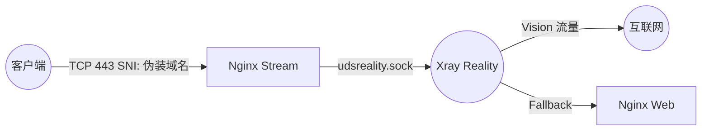

#### 客户端配置

* **连接方式**: TCP / 443 端口
* **URL 示例**:
  ```
  vless://${XRAY_UUID}@${DOMAIN}:${LISTENING_PORT}?encryption=none&flow=xtls-rprx-vision&security=reality&sni=${DEST_HOST}&fp=chrome&pbk=${XRAY_REALITY_PUBLIC_KEY}&sid=${XRAY_REALITY_SHORTID}&type=tcp&headerType=none#🇺🇸 XTLS-Reality ✈ ${NODE_NAME}${NODE_SUFFIX}
  ```
* **核心参数**:
  * `flow`: `xtls-rprx-vision`（必须）
  * `security`: `reality`
  * `sni`: **必须是伪装域名**（即 `${DEST_HOST}`），而非您的主域名
  * `address`: 您的服务器主域名或 IP
  * `sid`: shortId，服务端支持 3 个随机 shortId（`XRAY_REALITY_SHORTID` / `_2` / `_3`）+ 空串兜底，可为不同设备分配不同 shortId 独立轮换

#### 服务端入站

* **配置文件**: `templates/xray/01_reality_inbounds.json`
* **监听地址**: `unix:/dev/shm/udsreality.sock`
* **流转过程**:
  1. 用户连接公网 443 端口
  2. Nginx Stream 识别 SNI，原样转发至 `udsreality.sock`
  3. Xray Reality 进行 TLS 握手
  4. Vision 流量直接代理出站；其他流量回落给 `nginx.sock`

---

### 1.4 Hysteria2 (Xray) — UDP 竞速首选

> 订阅节点名：`Hysteria2`

基于 UDP 的拥塞控制协议，专为恶劣网络环境设计。2026-04 起由 Xray 原生入站承载（原 sing-box 实现已废弃），客户端订阅 URL 参数完全等价，无感迁移。

* **定位**: 暴力竞速、降低延迟；**Salamander 混淆**对抗 ISP UDP QoS
* **订阅轨**: `v2rayn` + `common` 双轨都含此节点
* **适用客户端**: v2rayN、Sing-box、NekoBox、Shadowrocket、Hysteria2 官方客户端

> **UDP QoS 对策**：高峰期 UDP 限速的通用说明见 §1.2；本协议抗 QoS 强度 ⭐⭐⭐⭐⭐（Salamander 混淆 + 独立高位端口）。

#### 流量图解

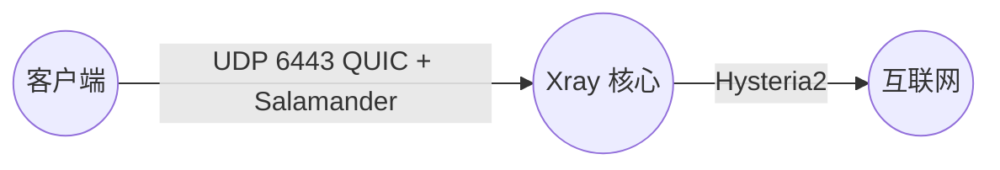

#### 客户端配置

* **连接方式**: UDP / 固定端口 6443（Dockerfile ENV 定义）
* **URL 示例**:
  ```
  hysteria2://${SB_UUID}@${DOMAIN}:${PORT_HYSTERIA2}/?sni=${DOMAIN}&obfs=salamander&obfs-password=${SB_UUID}&alpn=h3#🇺🇸 Hysteria2 ✈ ${NODE_NAME}${NODE_SUFFIX}
  ```
* **核心参数**:
  * `sni`: `${DOMAIN}`（显式指定 SNI，兼容 xray-core v26.1.23+ 原生 hy2 客户端）
  * `obfs=salamander` + `obfs-password`: Salamander 混淆，服务端和客户端共用 `SB_UUID` 作为混淆密码
  * `alpn`: `h3`

> **注意**: 证书由 acme.sh DNS 挑战申请，为 CA 签名证书，无需 `insecure=1`。客户端 URI 必须显式携带 `sni=` 参数，否则 xray-core 原生 hy2 实现可能无法从 URI 隐式推断 SNI，导致 TLS 握手失败。`allowInsecure` 已在 xray-core v26.2.x 中废弃并移除（UTC 2026-06-01 截止），请勿使用。

#### 服务端入站

* **配置文件**: `templates/xray/04_hy2_inbounds.json`（2026-04 起从 sing-box 迁至 Xray 原生入站；客户端订阅 URL 参数完全等价，无感迁移）
* **监听地址**: `::` (All Interfaces)，端口 6443（Dockerfile ENV 固定值）
* **路径**: **直连**（不经过 Nginx；由 Xray 直接承载 QUIC/UDP）
* **Salamander 混淆**: 服务端和客户端使用同一 `SB_UUID` 作为混淆密码

#### Xray 原生客户端配置

从 Xray-core v26.1.23+ 开始原生支持 Hysteria2 出站（v26.1.23 前需使用外置 hy2 二进制）：

```json
{
    "tag": "proxy-hysteria2",
    "protocol": "hysteria2",
    "settings": {
        "address": "${DOMAIN}",
        "port": "${PORT_HYSTERIA2}",
        "password": "${SB_UUID}"
    },
    "streamSettings": {
        "network": "udp",
        "security": "tls",
        "tlsSettings": {
            "serverName": "${DOMAIN}",
            "alpn": ["h3"]
        }
    }
}
```

---

### 1.5 Xhttp-H3+BBR (Xray UDP) — 性能王

> 订阅节点名：`Xhttp-H3+BBR`

**Xray 原生 xhttp-over-HTTP/3** 直连入站，UDP 内核直听 `PORT_XHTTP_H3`（默认 4443），**完全绕过 Nginx**。

* **定位**: UDP 极速，单 RTT + 0-RTT，主轨 v2rayn 首节点
* **订阅轨**: **仅 `v2rayn` 主轨**（common 轨不含）
* **抗 QoS**：Finalmask quicParams 的 BBR + Chrome fingerprint 让包外观等同真实 Chrome HTTP/3；内嵌与 §1.6 相同的 adv obfs 字段，TCP/UDP 双栈抗 DPI

> **UDP QoS 对策**：见 §1.2；本协议抗 QoS 强度 ⭐⭐⭐⭐。高峰期 UDP 限速时建议回退到 §1.6 XHTTP-Reality TCP 轨。

#### 客户端要求（严格）

- **v2rayN / Xray-core ≥ 26.3.27**（推荐最新版）
- **不支持** mihomo / Karing / OpenClash（均未实现 xhttp-h3 传输）→ 这些客户端请用 `/common` 订阅
- 宿主机防火墙需放行 **UDP 4443**（host 网络模式下 `docker-compose.yml` 的 `ports:` 段被忽略，直接操作 iptables/nftables）

#### 流量图解

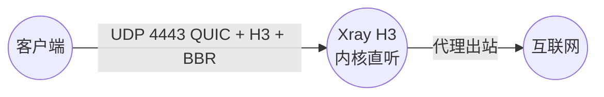

#### 客户端配置

* **URL 示例**:
  ```
  vless://${XRAY_UUID}@${DOMAIN}:${PORT_XHTTP_H3}?encryption=mlkem768x25519plus.native.0rtt.${XRAY_MLKEM768_CLIENT}&security=tls&sni=${DOMAIN}&alpn=h3&fp=chrome&type=xhttp&path=/${XRAY_URL_PATH}-xhttp-h3&mode=auto#🇺🇸 Xhttp-H3+BBR ✈ ${NODE_NAME}${NODE_SUFFIX}
  ```
* **服务端入站**: `templates/xray/02_xhttp_h3_inbounds.json`

---

### 1.6 Xhttp+Reality直连 (Xray TCP) — 含 adv 抗审查字段

> 订阅节点名：`Xhttp+Reality直连`

**XHTTP over TCP/TLS/Reality 主通道**。2026-04 起，原 `02_xhttp_adv` 独立轨的 XHTTP obfuscation 新字段 + Finalmask TCP fragment 已**合并进本节点**，原 `v2rayn-adv` 第三订阅轨撤销。

* **定位**: TCP 旗舰，双向直连；UDP 被 QoS 时的首选回退
* **订阅轨**: `v2rayn` + `common` 双轨都含此节点，但 common 轨**剥离 ML-KEM 和 adv 字段**
* **内嵌抗 DPI 能力**:
  - `xPaddingQueryParam=cf_ray_id` / `xPaddingPlacement=cookie` / `UplinkDataPlacement=auto`
  - Finalmask TCP fragment：`interval=5-20, length=100-200`
* **客户端要求**: v2rayn 主轨 → Xray-core **≥ 26.3.27**；旧 core 握手失败请改用 `/common`

#### 流量图解

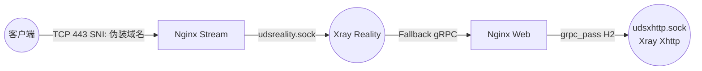

#### 客户端配置

* **URL 示例**:
  ```
  vless://${XRAY_UUID}@${DOMAIN}:${LISTENING_PORT}?encryption=mlkem768x25519plus.native.0rtt.${XRAY_MLKEM768_CLIENT}&security=reality&sni=${DEST_HOST}&fp=chrome&pbk=${XRAY_REALITY_PUBLIC_KEY}&sid=${XRAY_REALITY_SHORTID}&type=xhttp&path=/${XRAY_URL_PATH}-xhttp&mode=auto#🇺🇸 Xhttp+Reality直连 ✈ ${NODE_NAME}${NODE_SUFFIX}
  ```
* **服务端入站**: `templates/xray/02_xhttp_inbounds.json`（主轨，含 adv 字段）+ `02_xhttp_compat_inbounds.json`（common 轨，decryption=none）
* **共享机制**: 入站 UDS 与 §1.7 的 3 种 CDN 模式**同一个 socket**（`udsxhttp.sock`），详见 §1.8

---

### 1.7 XHTTP + CDN 三种模式 (Xray TCP)

> 订阅节点名：`上行Xhttp+TLS+CDN下行Xhttp+Reality` / `上行Xhttp+Reality下行Xhttp+TLS+CDN` / `Xhttp+TLS+CDN上下行不分离`

XHTTP 支持 **请求（客户端→服务器）** 和 **响应（服务器→客户端）** 走不同通道的"分裂路由"，客户端用一条 URL 订阅即可，Xray 底层根据包方向自动分流。

#### 名词说明（很重要）

| 术语 | 含义 |
|:---|:---|
| **请求**（等价旧名"上行"） | 客户端发向服务器的数据。HTTP 里是 `POST /xxx` 的请求体，代理里是你访问外网的**上行流量** |
| **响应**（等价旧名"下行"） | 服务器发回客户端的数据。HTTP 里是 response body，代理里是你收到的**下行流量**（通常远大于请求） |
| **直连（Reality）** | 不经过 CDN；客户端 ↔ 你的 VPS IP 直接 TLS |
| **CDN** | 经 Cloudflare 等 CDN；客户端 ↔ CDN 边缘 ↔ 你的 VPS |

#### 三种分裂模式速查

| § | 订阅节点名 | 上行 | 下行 | 客户端真实 IP | 服务器 IP | 使用场景 |
|:---|:---|:---|:---|:---:|:---:|:---|
| §1.7.1 | `上行Xhttp+TLS+CDN下行Xhttp+Reality` | **CDN** | **Reality 直连** | 隐藏（CDN 看到） | 暴露（下行直连） | 避免服务器日志留你真实 IP |
| §1.7.2 | `上行Xhttp+Reality下行Xhttp+TLS+CDN` | **Reality 直连** | **CDN** | 暴露 | 隐藏（下行走 CDN） | 服务器出口带宽打满时借 CDN 分担 |
| §1.7.3 | `Xhttp+TLS+CDN上下行不分离` | **CDN** | **CDN** | 隐藏 | 隐藏 | 服务器 IP 被封，一切绕道 CDN 的保底 |

所有 3 种分裂模式与 §1.6 XHTTP-Reality 直连 **共享同一个 Xray 入站接口**（`udsxhttp.sock`），Xray 端无需区分来源，详见 §1.8。

> **common 轨裁剪**：`common` 只保留 §1.7.1 和 §1.7.3，不包含 §1.7.2 `上行Xhttp+Reality下行Xhttp+TLS+CDN`；需要该分裂模式时请使用 `/v2rayn` 主轨。

#### 1.7.1 上行Xhttp+TLS+CDN 下行Xhttp+Reality（隐藏客户端 IP）

* **数据流**: 客户端 →（HTTPS 请求）→ Cloudflare →（回源）→ 服务器；服务器 →（Reality 直连响应）→ 客户端
* **典型场景**: 你不想让服务器日志 / 反爬系统记录你的真实 IP，让 CDN 替你发起请求；服务器返回的大流量走 Reality 直连保持速度
* **流量特征**: 请求流量小（HTTPS header + body）可承担 CDN 跳数开销；响应流量大走直连最快
* **流量图解**:
  ```mermaid
  flowchart TB
      User((客户端))
      CDN["Cloudflare/CDN"]
      NginxStream["Nginx Stream"]
      NginxWeb["Nginx Web"]
      Xray(("Xray 核心"))

      User -- "1. 上行 HTTPS" --> CDN
      CDN -- "SNI: CDN域名" --> NginxStream
      NginxStream -- "cdnh2.sock" --> NginxWeb
      NginxWeb -- "grpc_pass" --> Xray

      Xray -- "2. 下行 Reality" --> RealityIn(("Xray Reality"))
      RealityIn -- "Direct" --> User
  ```

#### 1.7.2 上行Xhttp+Reality 下行Xhttp+TLS+CDN（分担服务器出口）

* **数据流**: 客户端 →（Reality 直连请求）→ 服务器；服务器 →（HTTPS 响应）→ Cloudflare →（回流）→ 客户端
* **典型场景**: 服务器上传带宽（服务器→客户端的响应）打满时，让 CDN 边缘替你分担响应带宽压力
* **流量特征**: 请求走直连延迟小；响应走 CDN 借助 CDN 全球节点分流服务器出口负载
* **流量图解**:
  ```mermaid
  flowchart TB
      User((客户端))
      NginxStream["Nginx Stream"]
      NginxWeb["Nginx Web"]
      Reality(("Xray Reality"))
      Xray(("Xray 核心"))
      CDN["Cloudflare/CDN"]

      User -- "1. 上行 Reality SNI: 伪装域名" --> NginxStream
      NginxStream -- "udsreality.sock" --> Reality
      Reality -- "Fallback gRPC" --> NginxWeb
      NginxWeb -- "grpc_pass" --> Xray

      Xray -- "2. 下行 TLS+CDN" --> CDN
      CDN -- "HTTPS" --> User
  ```

#### 1.7.3 Xhttp+TLS+CDN 上下行不分离（全 CDN 保底）

* **数据流**: 客户端 ↔（HTTPS）↔ Cloudflare ↔（回源/回流）↔ 服务器，**两个方向都由 CDN 中转**
* **典型场景**: 服务器 IP 被 GFW 彻底阻断时的**最终保底**；客户端完全看不到服务器真实 IP，安全性最高但有 CDN 跳数开销
* **流量图解**:
  ```mermaid
  flowchart LR
      User((客户端)) -- "HTTPS" --> CDN["Cloudflare/CDN"]
      CDN -- "TCP 443 SNI: CDN域名" --> NginxStream["Nginx Stream"]
      NginxStream -- "cdnh2.sock" --> NginxWeb["Nginx Web"]
      NginxWeb -- "grpc_pass" --> Xray(("Xray 核心"))
  ```

---

### 1.8 XHTTP 服务端双通道共享机制

**所有 XHTTP TCP 节点**（§1.6 直连 + §1.7 的 3 种 CDN 混合模式）**共享同一个 Xray 入站接口** `udsxhttp.sock`；Xray 端无需关心来源是直连还是 CDN。双通道同时利用 **Nginx 双监听** 和 **Xray Fallback** 两个机制：

1. **Reality 直连通道**: 用户 → Reality 解密 → Fallback → `nginx.sock` → Nginx 识别路径 → `grpc_pass` → `udsxhttp.sock`
2. **CDN / 标准 HTTPS 通道**: 用户 → Cloudflare → `cdnh2.sock` → Nginx SSL 解密 → `grpc_pass` → `udsxhttp.sock`

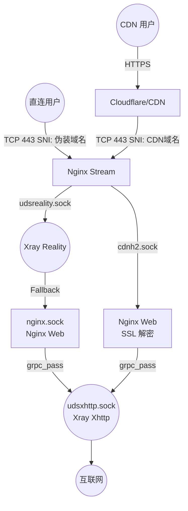

**一鱼多吃**：同一个 Xray Xhttp 入站同时服务直连用户和 CDN 用户；扩展新模式（如未来的 QUIC-over-CDN）无需新增 Xray 入站，只需 Nginx 加一条路由即可。XHTTP/3 节点（§1.5）因走 UDP 直连内核，不经过此通道，独立管理。

---

### 1.9 Vmess (Xray WS-TLS) — 传统 CDN 救火

> 订阅节点名：`Vmess`

最经典的配置组合，支持 Cloudflare CDN 中转。当所有 VLESS 节点因 IP 被阻断失效时，VMess 作为救火队员仍可通过 CDN 连接。

* **订阅轨**: `v2rayn` + `common` 双轨都含此节点
* **适用客户端**: 几乎所有支持 V2Ray 的客户端

#### 流量图解

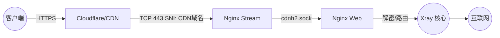

#### 客户端配置

* **URL 示例** (VMess 链接是以下 JSON 的 Base64 编码):
  ```json
  {
    "v": "2",
    "ps": "🇺🇸 Vmess ✈ ${NODE_NAME}${NODE_SUFFIX}",
    "add": "${CDNDOMAIN}",
    "port": "${LISTENING_PORT}",
    "id": "${XRAY_UUID}",
    "aid": "0",
    "scy": "auto",
    "net": "ws",
    "host": "${CDNDOMAIN}",
    "path": "/${XRAY_URL_PATH}-vmess",
    "tls": "tls",
    "sni": "${CDNDOMAIN}",
    "alpn": "h2",
    "fp": "chrome"
  }
  ```
* **核心参数**:
  * `net`: `ws` (WebSocket)
  * `host` / `sni`: 必须使用 `${CDNDOMAIN}`
  * `path`: 必须与服务端一致

> **进阶提醒**：走 CDN 时，Cloudflare 会自动填充正确的 SNI。直连时，现代客户端如发现 `sni` 为空会自动使用 `add` 的内容。为配置健壮性，建议始终显式配置 `sni`。

#### 服务端入站

* **配置文件**: `templates/xray/03_vmess_ws_inbounds.json`
* **监听地址**: `unix:/dev/shm/udsvmessws.sock`
* **流转**: 用户 → 443端口 → Nginx Stream (识别CDN域名) → `cdnh2.sock` → Nginx Web (SSL解密) → `proxy_pass` → `udsvmessws.sock` → Xray

---

### 1.10 TUIC (Sing-box) — UDP 备选

> 订阅节点名：`TUIC`

另一种基于 QUIC 的高性能协议。与 Hysteria2 同属 UDP 竞速组，但 **无 Salamander 混淆**，抗 UDP QoS 能力较弱，作为 Hy2 的备选。

* **连接方式**: UDP / 固定端口 8443（Dockerfile ENV 定义）
* **订阅轨**: **仅 `v2rayn` 主轨**（common 轨不含）

> **UDP QoS 对策**：见 §1.2；本协议抗 QoS 强度 ⭐⭐（仅标准 QUIC，依赖高位端口）。TUIC 只保留在 `/v2rayn` 主轨；`common` 会在 Hy2/H3 不可用时直接依赖 TCP 轨（Reality / XHTTP）。

#### 流量图解

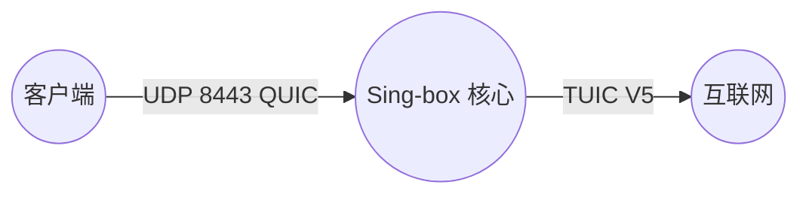

#### 客户端配置

* **URL 示例**:
  ```
  tuic://${SB_UUID}:${SB_UUID}@${DOMAIN}:${PORT_TUIC}?alpn=h3&congestion_control=bbr#🇺🇸 TUIC ✈ ${NODE_NAME}${NODE_SUFFIX}
  ```
* **服务端配置文件**: `templates/sing-box/01_tuic_inbounds.json`
* **路径**: **直连**（不经过 Nginx、不经过 Xray，由 Sing-box 直接承载）

---

### 1.11 AnyTLS (Sing-box) — TCP 伪装

> 订阅节点名：`AnyTLS`

伪装成任意 HTTPS 流量的 TCP 协议。

* **连接方式**: TCP / 固定端口 4433（Dockerfile ENV 定义）
* **订阅轨**: **仅 `v2rayn` 主轨**（common 轨不含；mihomo/Karing 等通用客户端的 anytls outbound 在部分 core 版本下 url-test 会持续返回 -1，故仅在已验证可用的 v2rayN / sing-box 客户端轨道暴露）

#### 流量图解

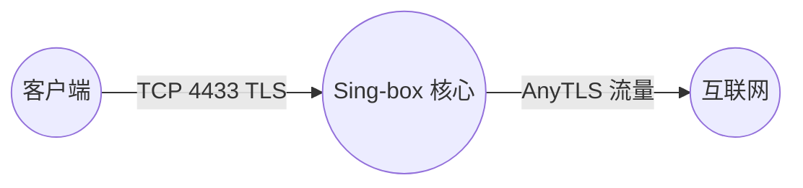

#### 客户端配置

* **URL 示例**:
  ```
  anytls://${SB_UUID}@${DOMAIN}:${PORT_ANYTLS}?security=tls&type=tcp#🇺🇸 AnyTLS ✈ ${NODE_NAME}${NODE_SUFFIX}
  ```
* **服务端配置文件**: `templates/sing-box/02_anytls_inbounds.json`
* **路径**: **直连**（不经过 Nginx，不经过 Xray）

---

### 1.12 关于服务端落地代理的说明

> **问**: 如果服务端配置了 ISP 家宽代理或 WARP，需要在客户端做什么设置吗？
>
> **答**: **不需要**。出站代理是服务端的路由策略。客户端只负责连接到您的 VPS。VPS 根据内部配置决定是直接发往互联网还是转发给 ISP 代理。**对客户端完全透明。**

---

## 2. MLKEM 后量子密码学

在 Xray 的 VLESS 协议及 XHTTP 隧道中，本项目率先启用了 **MLKEM768 后量子端到端加密机制**。

### 2.1 技术背景

| 属性 | 描述 |
|:---|:---|
| **全称** | Module-Lattice-Based Key Encapsulation Mechanism |
| **类别** | 后量子密码学 (Post-Quantum Cryptography, PQC) |
| **标准化** | NIST 于 2024 年正式发布为 [FIPS 203 标准](https://csrc.nist.gov/pubs/fips/203/final) |
| **目的** | 抵御未来量子计算机对传统 RSA/ECC 加密的破解 |

> [!WARNING]
> **切记**：VLESS Encryption（端到端加密层）**不是用来直接建立越境通信通道的**。直接建立越境通信依然依赖其外层的 TLS 或 REALITY/Vision！

### 2.2 为什么需要 VLESS Encryption？

传统的加密算法（如 RSA、ECC）在未来可能被量子计算机"先存储，后破解 (Store Now, Decrypt Later)"。MLKEM 采用基于格的密码学 (Lattice-based cryptography) 免疫此类攻击。

其核心使命是在极其严苛的场景下提供内层绝对的安全保护：

| 场景 | 作用 |
|:---|:---|
| **CDN 裸奔保护** | 流量通过 Cloudflare 等中转时，避免暴露真实 UUID 与数据特征 |
| **多跳节点保护** | 在不受信任的中转机上，即便攻击者拿到客户端配置，也**绝对无法解密历史流量** |
| **Non-TLS 场景** | 伊朗等限速 TLS 但允许 HTTP 的环境 |

### 2.3 安全对比：VLESS Encryption vs 传统协议

| 特性 | SS 2022/AEAD | VMess | VLESS Encryption |
|:---|:---:|:---:|:---:|
| **客户端配置安全** | ❌ | ❌ | ✅ |
| **前向安全 (PFS)** | ❌ | ❌ | ✅ |
| **抗量子加密** | ❌ | ❌ | ✅ |
| **0-RTT 支持** | ✅ | ✅ | ✅ |
| **完美重放防护** | ⚠️ | ⚠️ | ✅ |
| **无需对时** | ✅ | ❌ | ✅ |
| **O(1) 用户查询** | ❌ | ❌ | ✅ |

> **关键安全差异**：
> * **SS/VMess**: 拿到客户端配置 = 解密所有历史和未来流量
> * **VLESS Encryption**: 拿到客户端配置 ≠ 解密任何流量（需要服务端私钥）

### 2.4 配置字符串逐段解析

```
mlkem768x25519plus.native.0rtt.${XRAY_MLKEM768_CLIENT}
```

| 字段 | 含义 | 说明 |
|:---|:---|:---|
| `mlkem768` | MLKEM 安全级别 | NIST Level 3，相当于 AES-192 |
| `x25519plus` | 混合模式 | 同时使用 MLKEM768 + X25519，双重保护 |
| `native` | 外观模式 | 原生外观，流量特征类似 TLSv1.3 |
| `0rtt` | 握手模式 | 启用 0-RTT 快速握手，复用 ticket 免去完整 1-RTT 协商 |
| `${XRAY_MLKEM768_CLIENT}` | 客户端密钥 | 客户端配置密钥（`xray mlkem768` 命令的 CLIENT 输出），与服务端 SEED 配对 |

### 2.5 外观模式对比

| 模式 | 流量特征 | 安全性 | 推荐度 |
|:---|:---|:---|:---:|
| **`native`** | 类 TLSv1.3 头部，性能最佳 | 混入正常流量更安全 | ✅ **推荐** |
| **`xorpub`** | XOR 隐藏公钥特征 | 握手数据变随机可能反引注意 | ⚠️ 可选 |
| **`random`** | 全随机数外观 | 已被列入黑名单 | ❌ 不推荐 |

### 2.6 通信流程

#### 1-RTT 握手（首次连接）

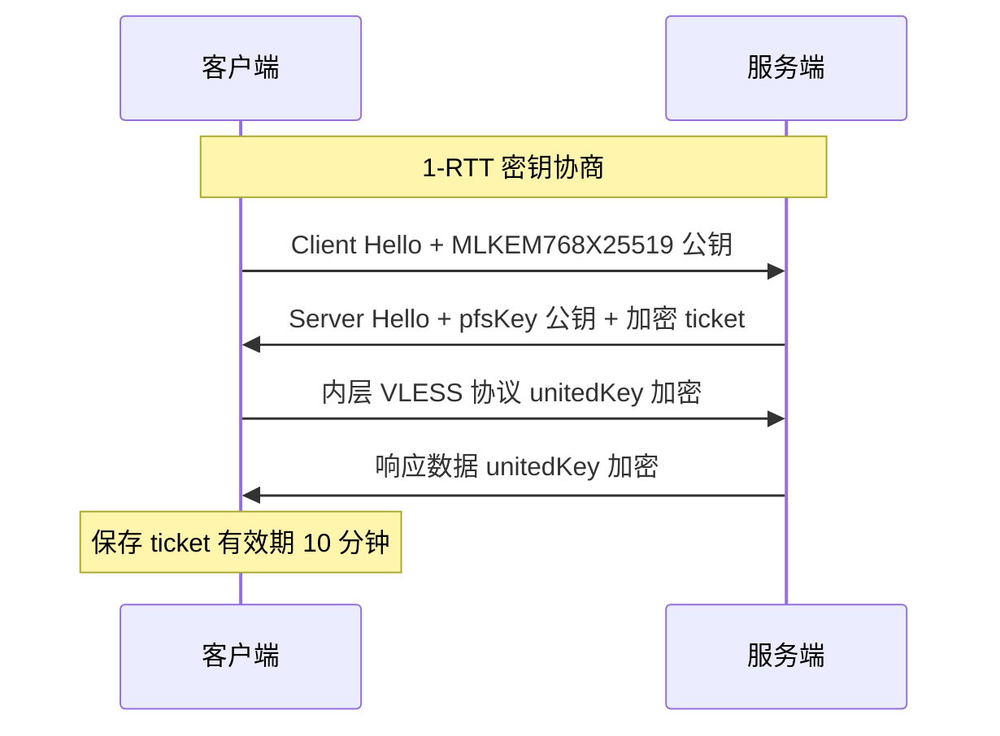

#### 0-RTT 快速握手（后续连接）

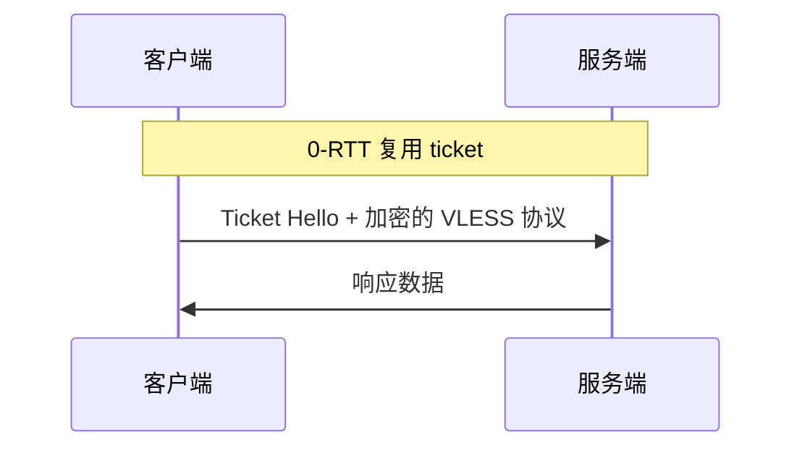

### 2.7 多层加密架构

在本项目的 Xhttp 配置中，数据经历了**三层加密**：

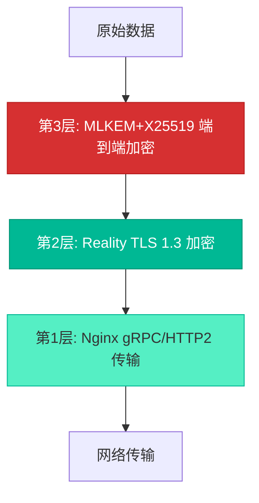

| 加密层 | 协议 | 作用范围 | 密钥持有者 |
|:---|:---|:---|:---|
| **第 1 层** | HTTP/2 (gRPC) | Nginx ↔ Xray | 无加密（内部通信） |
| **第 2 层** | Reality TLS | 客户端 ↔ Nginx | Reality 公钥/私钥 |
| **第 3 层** | MLKEM+X25519 | 客户端 ↔ Xray 核心 | MLKEM Client 密钥 + 临时密钥 |

### 2.8 本项目的配置策略

**默认配置**（推荐）：

```json
// Reality 入站 (01_reality_inbounds.json)
"decryption": "none",           // 保持 XTLS 零拷贝性能
"fallbacks": [ ... ]            // 支持 Xhttp 回落

// Xhttp 入站 (02_xhttp_inbounds.json)
"decryption": "mlkem768x25519plus.native.0rtt.${XRAY_MLKEM768_CLIENT}"  // 防护 Nginx 中间节点
```

**设计理念**：
1. **分层防御**: 不同协议有不同的安全策略
2. **零信任架构**: 不信任中间节点 (Nginx)
3. **性能与安全平衡**: 主力协议 (Reality) 保持性能，备用协议 (Xhttp) 强化安全

> [!NOTE]
> Reality 入站使用 `"decryption": "none"` 是因为：(1) Reality-Vision 是主力协议需保持 XTLS 零拷贝性能；(2) Reality TLS 直连出站无中间节点风险；(3) `fallbacks` 与 `decryption` 不可共存。

### 2.9 MLKEM 故障排查

| 错误 | 原因 | 解决方案 |
|:---|:---|:---|
| `invalid decryption` | 客户端 CLIENT 密钥与服务端 SEED 不匹配 | 确保 `encryption`（CLIENT）与 `decryption`（SEED）值对应 |
| `connection timeout` | 客户端 Xray 版本过低 | 升级到 Xray 1.8.8+ |
| `time sync error` | 时间差超过 90 秒 | 同步系统时间 |

---

## 3. XHTTP adv 抗审查字段

在 §1.6 `Xhttp+Reality直连` 和 §1.5 `Xhttp-H3+BBR` 中多次提到"adv 抗审查字段"。本章展开说明它**是什么、为什么需要、和 ML-KEM 的关系**。

### 3.1 技术背景

| 属性 | 描述 |
|:---|:---|
| **定义** | Xray-core **26.3.27+** 在 xhttp 传输层引入的 4 个 **DPI 对抗字段**的集合：`xPaddingQueryParam` / `xPaddingPlacement` / `UplinkDataPlacement` + 配套的 `finalmask` 包整形模块 |
| **目的** | 让 xhttp 流量的 **外观** 更贴近真实 Chrome HTTPS/HTTP-3 流量，躲避 GFW 的 DPI 特征识别和启发式规则 |
| **层次** | **应用层 + 传输层** 的包外观整形，**不涉及加密**（加密层由 ML-KEM + TLS 负责，见 §2） |
| **引入时间** | 2025-12 Xray-core 26.3.27 发布，本项目 2026-04 从"独立 adv 轨"合并进 XHTTP 主轨 |

### 3.2 为什么需要（与 ML-KEM 分工）

ML-KEM 解决**未来量子计算机的解密风险**；adv 解决**当下的 DPI 识别风险**。两者完全正交：

| 威胁 | 防御手段 | 本章涵盖? |
|:---|:---|:---:|
| GFW 流量分类（基于握手指纹 / padding 特征 / QUIC Initial 包） | **adv 字段 + finalmask** | ✅ |
| 中间人抓包长期保存，2035+ 用量子计算机破解 | **ML-KEM-768 后量子加密** | ❌（见 §2） |
| 被动 SNI 黑名单 | **Reality 伪装 + Fallback** | ❌（见 §4） |

实际部署中**三者叠加**：Reality 骗过 SNI 阶段 → ML-KEM 抗量子解密 → adv + finalmask 让传输特征看起来是 Chrome。

### 3.3 字段逐个解析

#### 3.3.1 XHTTP obfuscation 三字段（应用层）

```jsonc
// templates/xray/02_xhttp_inbounds.json  xhttpSettings.extra
{
  "xPaddingQueryParam": "cf_ray_id",   // padding 放哪个 query 参数名
  "xPaddingPlacement": "cookie",        // padding 放 cookie（不放 URL）
  "UplinkDataPlacement": "auto"         // 上行数据位置（auto = Xray 自决策）
}
```

| 字段 | 作用 | 为什么重要 |
|:---|:---|:---|
| `xPaddingQueryParam` | 给填充字节指定一个 **真实 CDN 会用的 query 参数名**（如 `cf_ray_id` 是 Cloudflare 的 trace ID） | 默认字段名会是 `x_padding` 等特征，DPI 一看就知道是 v2ray；伪装成 CF 真实字段后扫描器看不出区别 |
| `xPaddingPlacement` | 指定填充放在 **HTTP cookie** 而非 URL 查询串 | URL query 里有长 padding 是 DPI 特征；cookie 是正常 Web 行为，天然有长随机值 |
| `UplinkDataPlacement` | 上行实际数据放哪（`auto` = Xray 选最像 Chrome 的位置） | 固定位置易被模式匹配，auto 动态选择更贴近真实浏览器 |

#### 3.3.2 Finalmask 包整形（传输层）

```jsonc
// 02_xhttp_inbounds.json（TCP）
"finalmask": {
  "tcp": [
    { "type": "fragment", "settings": { "interval": "5-20", "length": "100-200" } }
  ]
}

// 02_xhttp_h3_inbounds.json（UDP/QUIC）
"finalmask": {
  "quicParams": { "congestion": "bbr", "...": "..." }
}
```

| 场景 | 字段 | 作用 |
|:---|:---|:---|
| **TCP 轨**（§1.6 / §1.7） | `finalmask.tcp.fragment` | 按 `interval=5-20` 毫秒随机间隔、`length=100-200` 字节随机切片，打散 TCP 流量的**时序特征**和**长度特征** |
| **UDP/QUIC 轨**（§1.5） | `finalmask.quicParams.congestion=bbr` + Chrome fingerprint | 让 QUIC 包的拥塞控制算法和握手指纹与真实 Chrome HTTP/3 **完全一致**，DPI 按"浏览器 QUIC"放行 |

### 3.4 通信流程（对比 DPI 视角）

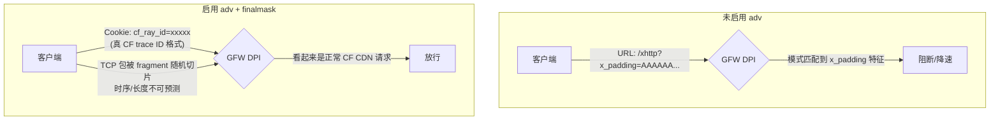

### 3.5 客户端兼容性

| 客户端 | Xray-core 版本 | 能否识别 adv 字段 | 对应订阅 |
|:---|:---|:---:|:---|
| v2rayN（最新） / Xray CLI 26.3.27+ | ≥ 26.3.27 | ✅ | `/v2rayn` 主轨（内嵌 adv） |
| 旧版 Xray-core | < 26.3.27 | ❌ 握手失败 | `/common`（**已剥离 adv 字段**） |
| mihomo / Karing / OpenClash | 未实现 xhttp 扩展 | ❌ | `/common` |

common 轨的 xhttp inbound 文件是 `02_xhttp_compat_inbounds.json`，**不含** adv 三字段、**不含** finalmask、**不含** ML-KEM（`decryption=none`），纯 TLS 兼容模式；订阅中也不再包含 TUIC 和 `上行Xhttp+Reality下行Xhttp+TLS+CDN`。

### 3.6 为什么把 adv 从独立轨合并进主轨

早期 adv 是**独立第三轨**（`02_xhttp_adv_inbounds.json` + `/v2rayn-adv` 订阅），因为担心老 Xray 客户端识别不了新字段。2026-04 评估发现：

1. v2rayN 每次发布跟随 Xray-core 最新，几乎所有真实用户都在 26.3.27+ 范围
2. mihomo / Karing / OpenClash 本就走 `common` 与 adv 无关
3. H3 主轨（§1.5）客户端必然是 26.3.27+，adv 字段已内嵌

→ adv 独立轨和 H3 主轨高度冗余，**合并进主轨后订阅从 3 条精简为 2 条**（§1.1）。

---

## 4. Reality 深度伪装与 Fallback 回落

### 3.1 Reality 伪装进化的本质

Reality 协议的核心理念是：**抛弃自有证书，完全模拟大型科技公司的真实握手特征**。

| 模式 | 探测者看到的结果 | 安全性 |
|:---|:---|:---|
| **旧模式 (TLS)** | 某不知名小域名的 Let's Encrypt 证书 → 特征明显 | ⭐⭐ |
| **Reality 新模式** | 真正来自微软/苹果的完整信任链证书 → 审查者无从下手 | ⭐⭐⭐⭐⭐ |

### 3.2 Fallback 回落机制详解

在 `templates/xray/01_reality_inbounds.json` 中的关键配置：

```json
"fallbacks": [
    {
        "dest": "/dev/shm/nginx.sock",
        "xver": 1
    }
],
"realitySettings": {
    "serverNames": ["${DEST_HOST}"],
    "target": "${DEST_HOST}:443"
}
```

#### 参数详解

| 参数 | 值 | 含义 |
|:---|:---|:---|
| `dest` | `/dev/shm/nginx.sock` | 回落目标 Unix Socket。**绝对不能开启 SSL**（流量已被 Reality 解密） |
| `xver` | `1` | 启用 PROXY Protocol v1，告知 Nginx 用户真实公网 IP |
| `serverNames` | `["${DEST_HOST}"]` | **白名单 SNI**，仅允许伪装域名。错误 SNI → 直接透传给 `target` |
| `target` | `${DEST_HOST}:443` | 伪装透传目标。攻击者看到的永远是 Cloudflare 的正规证书和页面 |

> [!IMPORTANT]
> **PROXY Protocol 配套要求**：因为 Xray 发出了 `xver: 1` 头部，Nginx 端的监听指令**必须**加上 `proxy_protocol` 关键字（即 `listen ... proxy_protocol;`），否则 Nginx 会把头部信息误当 HTTP 内容解析报错。

### 3.3 Fallback 实现"一鱼多吃"

| 流量类型 | 去向 |
|:---|:---|
| **VLESS Vision 流量** | 走 Vision 高速通道直接出站 |
| **Xhttp 流量** | Fallback → Nginx → gRPC → Xray Xhttp |
| **探测流量** | Target 透传（或 Fallback → Nginx → 404 伪装页） |

---

## 5. ACME 全自动证书管家

尽管 Reality 通道不需要自有证书，但为了保护面板入口以及支持 CDN/VMess 等备用协议，系统内建了完善的 `acme.sh` 机制。

### 4.1 CA 机构支持对照

所有 acme.sh DNS-01 签发路径均支持通配符证书（`*.example.com`）。sb-xray 本身 `_build_issue_args` 会自动为每个主域名追加 wildcard，4 张主域+泛域证书一次签出。

| CA 机构 | 通配符 (DNS-01) | EAB | 典型速率限制 | 适用场景 |
|:---|:---:|:---:|:---|:---|
| **Let's Encrypt** | ✅（2018-03 起） | ✗ 无需 | 50 cert/domain/week | 无痛首选，切换无障碍 |
| **ZeroSSL** | ✅ | 自动（acme.sh 静默处理） | pending-order 软限流（>~10 个失败尝试后 24h 冷却） | 账户配额更宽松，但失败后需冷却 |
| **Google Trust Services** | ✅ | ✗ 手动（7 天内一次性有效） | 账户级硬配额 | 企业 / 大账户 |
| Buypass Go | ✗ **不支持通配符** | ✗ | — | **不要用于本项目** |

### 4.2 配置方法

> **默认 `ACMESH_SERVER_NAME=letsencrypt`** — 无需 EAB，通配符签发即开即用。遇到 ZeroSSL `retryafter=86400` 一类的限流时，最快的解锁办法就是切回 Let's Encrypt。

#### Let's Encrypt（默认）

```yaml
environment:
  - ACMESH_SERVER_NAME=letsencrypt
  - ACMESH_REGISTER_EMAIL=admin@your_domain.com
```

#### ZeroSSL（可选）

```yaml
environment:
  - ACMESH_SERVER_NAME=zerossl
  - ACMESH_REGISTER_EMAIL=admin@your_domain.com
  # EAB 凭据可选：留空时 acme.sh 会在首次注册时用邮箱自动生成；
  # 若你已有预分配的 ZeroSSL EAB 凭据，可显式写入以绕过自动申领。
  # - ACMESH_EAB_KID=xxx
  # - ACMESH_EAB_HMAC_KEY=xxx
```

> [!NOTE]
> ZeroSSL 会给同一账户的 pending orders 计数。证书签发前如果 DNS 凭据、域名、网络等问题连续失败多次，CA 会返回 `retryafter=86400`（24 小时冷却）。冷却期内请切换到 Let's Encrypt 直接规避。

#### Google Public CA（可选）

需先获取 EAB 凭据：

```bash
# 在 Google Cloud Shell 中执行
gcloud publicca external-account-keys create
# 记录 keyId 和 b64MacKey
```

```yaml
environment:
  - ACMESH_SERVER_NAME=google
  - ACMESH_REGISTER_EMAIL=admin@your_domain.com
  - ACMESH_EAB_KID=xxxxxxxxxxxx
  - ACMESH_EAB_HMAC_KEY=xxxxxxxx
volumes:
  - ./acmecerts:/acmecerts  # 强烈建议持久化
```

> [!CAUTION]
> Google EAB 凭据有效期仅 **7 天**。务必在生成后 7 天内启动容器完成首次注册。持久化 `/acmecerts` 后账户长期有效。

### 4.3 自动续期机制

* **开机检查**: 每次容器启动自动检查证书有效期，不足 30 天触发续期
* **定时检查**: 内置 `acme.sh` 守护进程定期续期
* **证书覆盖**: 泛域名证书 `*.example.com` + 主域名 `example.com`

#### 证书签发流程图解

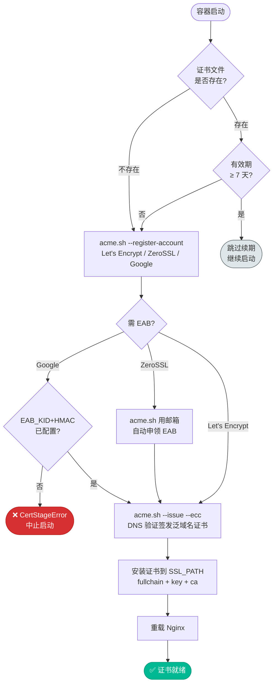

### 4.4 证书常见问题

| 问题 | 解决方案 |
|:---|:---|
| **强制重签** | 清 `./pki/*` 与 `./acmecerts/<domain>_ecc/*`（保留 `account.conf`）后 `docker compose restart` |
| **`retryafter=86400` / rate-limited** | CA 账户冷却（多为 pending orders 堆积）。立即解锁：把 `ACMESH_SERVER_NAME` 切到 `letsencrypt` 重启；不要切 `buypass`（无通配符支持） |
| **`You don't specify aliyun api key`** | SECRET_FILE 的 `ALI_KEY`/`ALI_SECRET`（或 `CF_TOKEN`/`CF_ZONE_ID`/`CF_ACCOUNT_ID`）为空或未加载；Python `_acme_env()` 会把 UPPER_CASE 转换为 acme.sh 插件认的 `Ali_Key` / `CF_Token` 等 mixed-case 别名 |
| **`can not get domain token`** | 检查 DNS A 记录、关闭 Cloudflare 小黄云、放行 TCP 80/443 |
| **`cert 失败：预期文件缺失`** | acme.sh `--install-cert` 静默失败（多因上次失败留了空 store 目录）。清 `./acmecerts/<domain>_ecc/` 后重启即可 |

### 4.5 CA 切换行为（`ACMESH_SERVER_NAME` 修改后发生什么）

`ACMESH_SERVER_NAME` 改名（例如 `zerossl` → `letsencrypt`）**不触发续期，而是触发一次重新签发** —— 但只在现有证书已经过期/接近过期时生效。逐步流程见 `scripts/sb_xray/cert.py::ensure_certificate`：

1. **启动时校验 `/pki/sb_xray_bundle.crt`**
   - 三个文件（`.crt` / `.key` / `-ca.crt`）齐全 **且** `openssl x509 -checkend 604800` 还剩 **> 7 天** → `CertStatus.SKIPPED`，沿用现有证书，不论 `ACMESH_SERVER_NAME` 是什么都**不产生任何动作**。
   - 剩余 ≤ 7 天 **或** 任一文件缺失 → 进入下一步。
2. **`acme.sh --issue --server <新 CA>`** 全新签发，覆盖 `/pki/sb_xray_bundle.*`。acme.sh 账户系统按 CA 隔离：Let's Encrypt 账户文件在 `acmecerts/ca/acme-v02.api.letsencrypt.org/`，ZeroSSL 的在 `acmecerts/ca/acme.zerossl.com/`，二者互不通 —— **不会用旧 CA 账户去续新 CA 的证书，反之亦然**。
3. **后续续期**：Let's Encrypt 证书 90 天有效，第 83 天起（剩 ≤ 7 天）下次容器 restart 会重复第 2 步用 LE 续签。无需再改任何配置。

#### 想**立刻**切换到新 CA（不等旧证书到期）

二选一：

```bash
# 方案 A：主动清证书，立刻强制重签
rm /root/sb-xray/pki/sb_xray_bundle.*
docker compose restart          # 下次启动用 ACMESH_SERVER_NAME 指定的新 CA 签发

# 方案 B：什么都不做，等旧证书剩 ≤ 7 天自然触发（最稳，零停机）
```

#### 清理旧 CA 账户（可选）

`acmecerts/ca/acme.zerossl.com/` 保留不会造成问题，acme.sh 只会用 `ACMESH_SERVER_NAME` 指定的那个。想清爽可以 `find acmecerts/ca/acme.zerossl.com -mindepth 1 -delete && rmdir acmecerts/ca/acme.zerossl.com` —— 丢掉 ZeroSSL 账户无害，哪天切回只是重新注册。

> [!TIP]
> 如果你是因为 ZeroSSL 限流才切到 LE，清 `acmecerts/vpn.example.com_ecc/`（保留 `account.conf`）避免 acme.sh 的本地 store 记录指向 ZeroSSL 签发历史时引起混淆；LE 会创建自己的 domain 目录。

---

## 6. Xray TUN 模式进阶指南

Xray 最新版本对 TUN 入站进行了大幅优化，可在 Linux/macOS 上实现透明代理（类似 VPN）。

### 5.1 Inbound 配置

```json
{
    "tag": "tun-in",
    "protocol": "tun",
    "settings": {
        "mtu": 9000,
        "interface": {
            "name": "tun0",
            "autoSetIpAddress": true,
            "autoSetIpv6Address": true
        }
    },
    "sniffing": {
        "enabled": true,
        "destOverride": ["http", "tls", "quic"],
        "metadataOnly": false
    }
}
```

### 5.2 Routing 路由策略

```json
"routing": {
    "domainStrategy": "AsIs",
    "rules": [
        {
            "inboundTag": ["tun-in"],
            "port": 53,
            "outboundTag": "dns-out"
        },
        {
            "type": "field",
            "ip": ["geoip:private", "geoip:cn"],
            "outboundTag": "direct"
        },
        {
            "type": "field",
            "network": "tcp,udp",
            "outboundTag": "proxy"
        }
    ]
}
```

### 5.3 注意事项

* TUN 模式需要 **Root/Administrator 权限**
* **服务端不需要任何修改** — TUN 只是客户端"抓取"本机流量的方式，服务器看到的仍是标准代理请求

---

## 7. 参考文献

### 官方文档

* **VLESS Encryption PR**: [XTLS/Xray-core#5067](https://github.com/XTLS/Xray-core/pull/5067) — RPRX 的设计文档与安全性分析
* **REALITY 协议**: [XTLS/Xray-core#4915](https://github.com/XTLS/Xray-core/pull/4915)
* **XHTTP 协议**: [XTLS/Xray-core#4113](https://github.com/XTLS/Xray-core/discussions/4113)
* **Vision 流控**: [XTLS/Xray-core#1295](https://github.com/XTLS/Xray-core/discussions/1295)

### 安全研究

* **GFW 对 SS 的 MITM 攻击**: [net4people/bbs#526](https://github.com/net4people/bbs/issues/526)
* **Shadowsocks 移花接木攻击**: [shadowsocks/shadowsocks-org#183](https://github.com/shadowsocks/shadowsocks-org/issues/183)

### 标准化文档

* **NIST FIPS 203**: [ML-KEM 官方标准](https://csrc.nist.gov/pubs/fips/203/final) — MLKEM 后量子加密的实现理论基石
* **NIST 后量子密码学项目**: [csrc.nist.gov/projects/post-quantum-cryptography](https://csrc.nist.gov/projects/post-quantum-cryptography)

### 实现参考

* **Mihomo (Clash Meta)**: v1.19.13+ 已支持 VLESS Encryption
* **Xray-core**: v1.8.8+ 原生支持
* **Google Trust Services CA**: [acme.sh Wiki](https://github.com/acmesh-official/acme.sh/wiki/Google-Trust-Services-CA)
