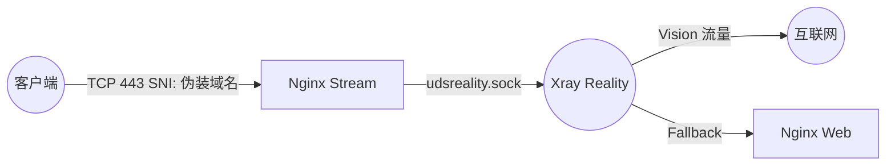
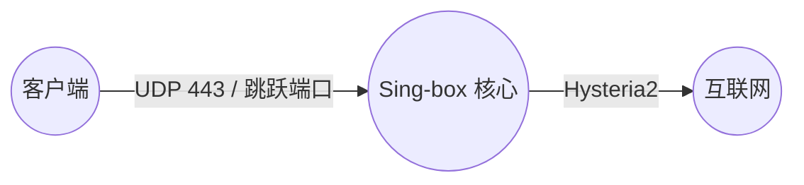
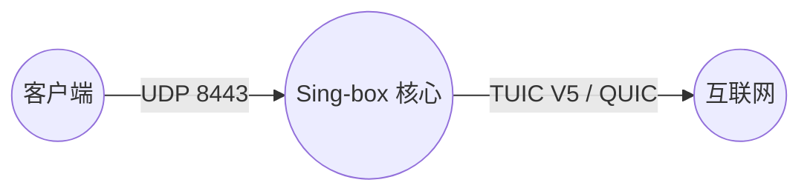
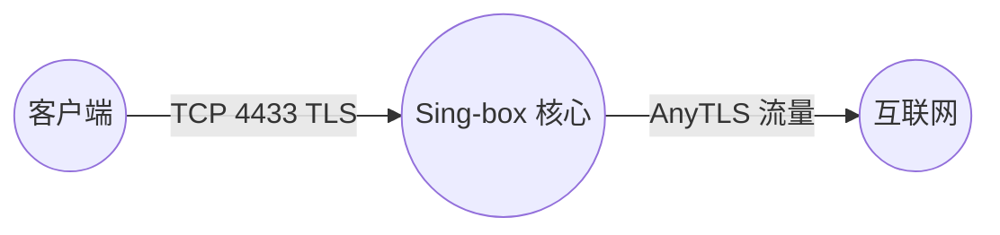
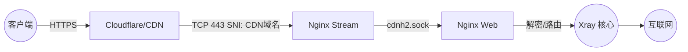
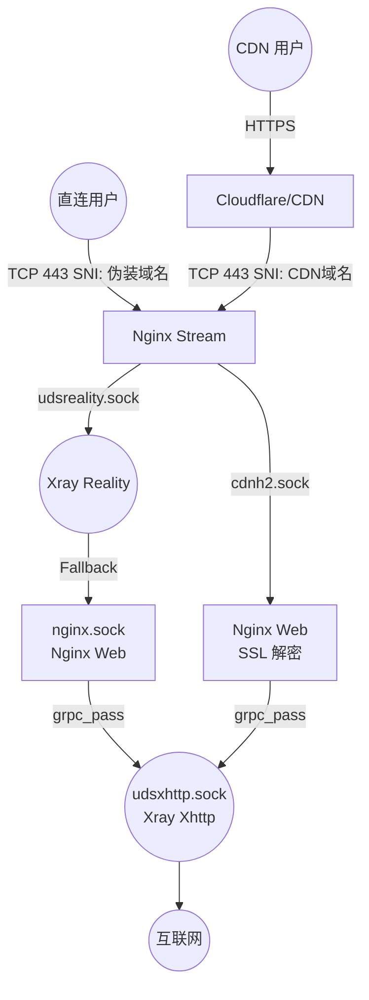
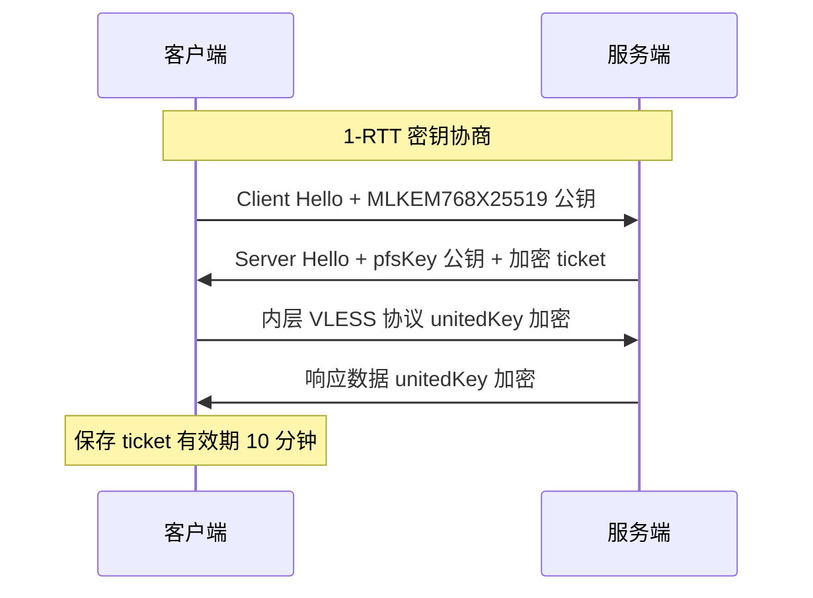
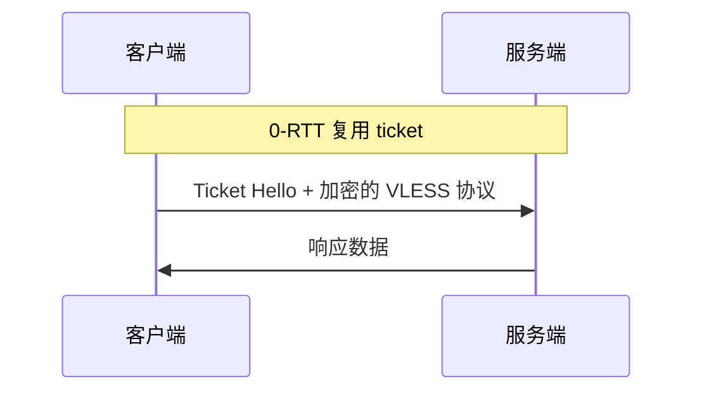
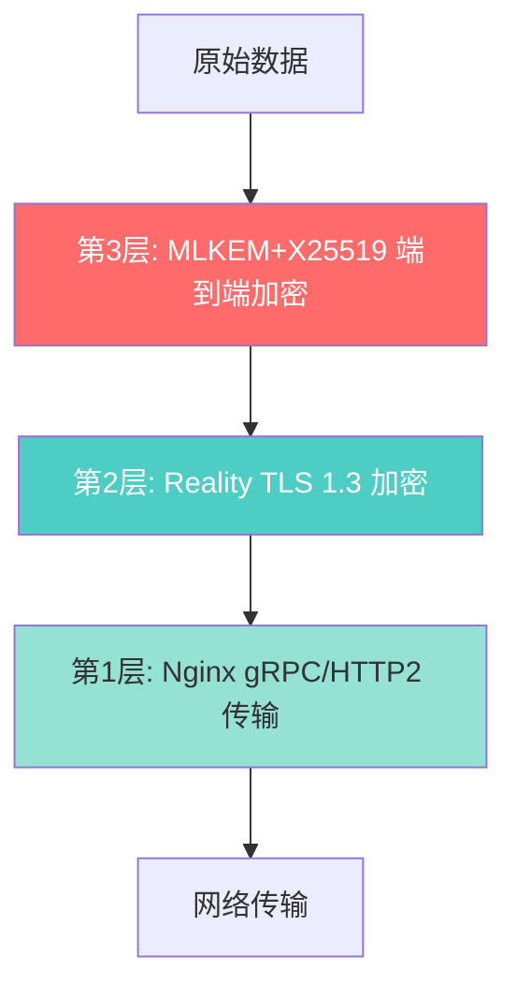
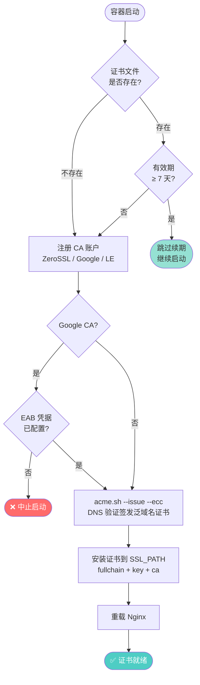

# 02. 协议详解与安全加密体系

> 本文档覆盖 SB-Xray 支持的全部代理协议配置、MLKEM 后量子端到端加密机制、Reality 深度伪装与 Fallback 回落、ACME 自动证书管家，以及 Xray TUN 透明代理进阶配置。

---

## 目录

1. [全协议配置手册](#1-全协议配置手册)
2. [MLKEM 后量子密码学](#2-mlkem-后量子密码学)
3. [Reality 深度伪装与 Fallback 回落](#3-reality-深度伪装与-fallback-回落)
4. [ACME 全自动证书管家](#4-acme-全自动证书管家)
5. [Xray TUN 模式进阶指南](#5-xray-tun-模式进阶指南)
6. [参考文献](#6-参考文献)

---

## 1. 全协议配置手册

本项目共支持 **9 种** 不同的客户端链接组合，覆盖从极速直连到 CDN 保底的全场景需求。

### 1.0 协议总览

| 序号 | 协议/模式 | 引擎 | 关键技术 | 适用场景 | 推荐度 |
|:---|:---|:---|:---|:---|:---:|
| 1 | **VLESS-Vision-Reality** | Xray | XTLS, Vision | 日常主力，极速稳定 | ⭐⭐⭐⭐⭐ |
| 2 | **Hysteria2** | Sing-box | UDP, 拥塞控制 | 移动/弱网，暴力竞速 | ⭐⭐⭐⭐⭐ |
| 3 | **XHTTP-Reality 直连** | Xray | XHTTP, Reality, MLKEM | 探索性主力协议 | ⭐⭐⭐⭐ |
| 4 | **XHTTP 上CDN下直连** | Xray | XHTTP, 混合路由 | 隐藏上行 IP | ⭐⭐⭐⭐ |
| 5 | **XHTTP 上直连下CDN** | Xray | XHTTP, 混合路由 | 优化下行线路 | ⭐⭐⭐⭐ |
| 6 | **XHTTP 全CDN** | Xray | XHTTP, TLS | 最终保底方案 | ⭐⭐⭐ |
| 7 | **TUIC V5** | Sing-box | UDP, QUIC | Hysteria2 的备选 | ⭐⭐⭐ |
| 8 | **AnyTLS** | Sing-box | TCP, 指纹伪装 | 企业级防火墙环境 | ⭐⭐⭐ |
| 9 | **VMess-WS-TLS** | Xray | WebSocket, CDN | 传统兼容，救火备用 | ⭐⭐ |

---

### 1.1 VLESS-Vision-Reality (Xray) — 旗舰推荐

项目的**主力协议**，具有极高的防探测能力和性能。

* **定位**: 极速、稳定、抗封锁
* **适用客户端**: v2rayN, V2Box, FoXray, Shadowrocket, Sing-box

#### 流量图解



#### 客户端配置

* **连接方式**: TCP / 443 端口
* **URL 示例**:
  ```
  vless://${XRAY_UUID}@${DOMAIN}:${LISTENING_PORT}?encryption=none&flow=xtls-rprx-vision&security=reality&sni=${DEST_HOST}&fp=chrome&pbk=${XRAY_REALITY_PUBLIC_KEY}&sid=${XRAY_REALITY_SHORTID}&type=tcp&headerType=none#🇺🇸 XTLS-Reality ✈ ${NODE_NAME}${NODE_SUFFIX}
  ```
* **核心参数**:
  * `flow`: `xtls-rprx-vision`（必须）
  * `security`: `reality`
  * `sni`: **必须是伪装域名**（即 `${DEST_HOST}`），而非您的主域名
  * `address`: 您的服务器主域名或 IP
  * `sid`: shortId，服务端支持 3 个随机 shortId（`XRAY_REALITY_SHORTID` / `_2` / `_3`）+ 空串兜底，可为不同设备分配不同 shortId 独立轮换

#### 服务端入站

* **配置文件**: `templates/xray/01_reality_inbounds.json`
* **监听地址**: `unix:/dev/shm/udsreality.sock`
* **流转过程**:
  1. 用户连接公网 443 端口
  2. Nginx Stream 识别 SNI，原样转发至 `udsreality.sock`
  3. Xray Reality 进行 TLS 握手
  4. Vision 流量直接代理出站；其他流量回落给 `nginx.sock`

---

### 1.2 Hysteria2 (Sing-box) — 竞速首选

基于 UDP 的拥塞控制协议，专为恶劣网络环境设计。

* **定位**: 暴力竞速、降低延迟
* **适用客户端**: Sing-box, NekoBox, Shadowrocket, Hysteria2 官方客户端

#### 流量图解



#### 客户端配置

* **连接方式**: UDP / 固定端口 6443（Dockerfile ENV 定义）
* **URL 示例**:
  ```
  hysteria2://${SB_UUID}@${DOMAIN}:${PORT_HYSTERIA2}/?sni=${DOMAIN}&obfs=salamander&obfs-password=${SB_UUID}&alpn=h3#🇺🇸 Hysteria2 ✈ ${NODE_NAME}${NODE_SUFFIX}
  ```
* **核心参数**:
  * `sni`: `${DOMAIN}`（显式指定 SNI，兼容 xray-core v26.1.23+ 原生 hy2 客户端）
  * `obfs=salamander` + `obfs-password`: Salamander 混淆，将 QUIC 流量伪装为随机 UDP 噪声
  * `alpn`: `h3`

> **注意**: 证书由 acme.sh DNS 挑战申请，为 CA 签名证书，无需 `insecure=1`。客户端 URI 必须显式携带 `sni=` 参数，否则 xray-core 原生 hy2 实现可能无法从 URI 隐式推断 SNI，导致 TLS 握手失败。

#### ISP 高峰期 UDP 限速对策

> **注意**: Hysteria2 基于 UDP 传输。国内部分 ISP（尤其中国移动/联通）在高峰时段（北京时间约 21:00–24:00）对 UDP 流量实施 QoS 限速或丢包，可能导致连接不稳定甚至完全不可用。

本项目采用 **Salamander 混淆**对抗 UDP QoS：

| 方案 | 原理 | 效果 |
|:---|:---|:---|
| **Salamander 混淆** | 将 QUIC 数据包外观完全随机化，DPI 无法识别为 QUIC 流量 | 对抗基于协议识别的 QoS 限速 |
| **独立高位端口** | 不使用固定 443，规避针对特定端口的 UDP 封锁 | 避免端口级别的 QoS 策略 |

> **客户端自动回退**：当 Hysteria2 节点健康检查失败时，OneSmartPro（Smart 策略组）和 FallBackPro（Fallback 策略组）均会自动切换到 TCP 协议节点（Reality / XHTTP / AnyTLS），无需手动干预。

#### 服务端入站

* **配置文件**: `templates/xray/04_hy2_inbounds.json`（2026-04 起从 sing-box 迁至 Xray 原生入站，永久无开关；客户端订阅 URL 参数完全等价，无感迁移）
* **监听地址**: `::` (All Interfaces)，端口 6443（Dockerfile ENV 固定值）
* **路径**: **直连**（不经过 Nginx；由 Xray 直接承载 QUIC/UDP）
* **Salamander 混淆**: 服务端和客户端使用同一 `SB_UUID` 作为混淆密码

#### Xray 原生客户端配置

从 Xray-core v26.1.23+ 开始原生支持 Hysteria2 出站（v26.1.23 前需使用外置 hy2 二进制）：

```json
{
    "tag": "proxy-hysteria2",
    "protocol": "hysteria2",
    "settings": {
        "address": "${DOMAIN}",
        "port": "${PORT_HYSTERIA2}",
        "password": "${SB_UUID}"
    },
    "streamSettings": {
        "network": "udp",
        "security": "tls",
        "tlsSettings": {
            "serverName": "${DOMAIN}",
            "alpn": ["h3"]
        }
    }
}
```

> **注意**: `allowInsecure` 已在 xray-core v26.2.x 中废弃并移除（截止日期 UTC 2026.6.1），请勿使用。服务端使用 CA 签名证书，客户端无需跳过验证。

---

### 1.3 TUIC V5 (Sing-box) — 备用竞速

另一种基于 QUIC 的高性能协议。

* **连接方式**: UDP / 固定端口 8443（Dockerfile ENV 定义）

#### 流量图解



#### 客户端配置

* **URL 示例**:
  ```
  tuic://${SB_UUID}:${SB_UUID}@${DOMAIN}:${PORT_TUIC}?alpn=h3&congestion_control=bbr#🇺🇸 TUIC ✈ ${NODE_NAME}${NODE_SUFFIX}
  ```
* **服务端配置文件**: `templates/sing-box/02_tuic_inbounds.json`
* **路径**: **直连**（不经过 Nginx，不经过 Xray）

#### ISP 高峰期 UDP 限速

> **注意**: TUIC 与 Hysteria2 同属 UDP/QUIC 协议，受到相同的 ISP 高峰期限速影响。TUIC **无 Salamander 混淆**，高峰期抗 QoS 能力弱于 Hysteria2。客户端策略组健康检查失败时会自动切换到 AnyTLS 或 TCP 协议节点。

---

### 1.4 AnyTLS (Sing-box) — TCP 伪装

伪装成任意 HTTPS 流量的 TCP 协议。

* **连接方式**: TCP / 固定端口 4433（Dockerfile ENV 定义）

#### 流量图解



#### 客户端配置

* **URL 示例**:
  ```
  anytls://${SB_UUID}@${DOMAIN}:${PORT_ANYTLS}?security=tls&type=tcp#🇺🇸 AnyTLS ✈ ${NODE_NAME}${NODE_SUFFIX}
  ```
* **服务端配置文件**: `templates/sing-box/03_anytls_inbounds.json`
* **路径**: **直连**（不经过 Nginx，不经过 Xray）

---

### 1.5 VMess-WS-TLS (Xray) — CDN 兼容

最经典的配置组合，支持 Cloudflare CDN 中转。当 IP 被阻断时可作为救火队员。

* **适用客户端**: 几乎所有支持 V2Ray 的客户端

#### 流量图解



#### 客户端配置

* **URL 示例** (VMess 链接是以下 JSON 的 Base64 编码):
  ```json
  {
    "v": "2",
    "ps": "🇺🇸 Vmess ✈ ${NODE_NAME}${NODE_SUFFIX}",
    "add": "${CDNDOMAIN}",
    "port": "${LISTENING_PORT}",
    "id": "${XRAY_UUID}",
    "aid": "0",
    "scy": "auto",
    "net": "ws",
    "host": "${CDNDOMAIN}",
    "path": "/${XRAY_URL_PATH}-vmess",
    "tls": "tls",
    "sni": "${CDNDOMAIN}",
    "alpn": "h2",
    "fp": "chrome"
  }
  ```
* **核心参数**:
  * `net`: `ws` (WebSocket)
  * `host` / `sni`: 必须使用 `${CDNDOMAIN}`
  * `path`: 必须与服务端一致

> **进阶提醒**：走 CDN 时，Cloudflare 会自动填充正确的 SNI。直连时，现代客户端如发现 `sni` 为空会自动使用 `add` 的内容。为配置健壮性，建议始终显式配置 `sni`。

#### 服务端入站

* **配置文件**: `templates/xray/03_vmess_ws_inbounds.json`
* **监听地址**: `unix:/dev/shm/udsvmessws.sock`
* **流转**: 用户 → 443端口 → Nginx Stream (识别CDN域名) → `cdnh2.sock` → Nginx Web (SSL解密) → `proxy_pass` → `udsvmessws.sock` → Xray

---

### 1.6 VLESS-XHTTP 系列 (Xray)

项目集成了 Xray 最新的 XHTTP 协议，提供了 **4 种** 不同配置模式。

> [!NOTE]
> XHTTP 是实验性协议，本项目启用了 **MLKEM** 抗量子加密。请确保客户端内核版本最新。

#### 1.6.1 XHTTP + Reality 直连

* **模式**: 双向直连
* **特点**: 速度最快，延迟最低
* **URL 示例**:
  ```
  vless://${XRAY_UUID}@${DOMAIN}:${LISTENING_PORT}?encryption=mlkem768x25519plus.native.0rtt.${XRAY_MLKEM768_CLIENT}&security=reality&sni=${DEST_HOST}&fp=chrome&pbk=${XRAY_REALITY_PUBLIC_KEY}&sid=${XRAY_REALITY_SHORTID}&type=xhttp&path=/${XRAY_URL_PATH}-xhttp&mode=auto#🇺🇸 Xhttp+Reality直连 ✈ ${NODE_NAME}${NODE_SUFFIX}
  ```
* **流量图解**:
  ```mermaid
  graph LR
      User((客户端)) -- "TCP 443 SNI: 伪装域名" --> NginxStream["Nginx Stream"]
      NginxStream -- "udsreality.sock" --> Reality(("Xray Reality"))
      Reality -- "Fallback gRPC" --> NginxWeb["Nginx Web"]
      NginxWeb -- "grpc_pass H2" --> Xhttp(("Xray Xhttp"))
  ```

#### 1.6.2 上行 CDN + 下行 Reality

* **模式**: 上行走 CDN 隐藏请求 IP，下行走 Reality 直连
* **特点**: "借刀杀人"模式——上行流量小且隐蔽 (HTTPS)，下行流量大且速度快 (Reality)
* **流量图解**:
  ```mermaid
  graph TB
      User((客户端))
      CDN["Cloudflare/CDN"]
      NginxStream["Nginx Stream"]
      NginxWeb["Nginx Web"]
      Xray(("Xray 核心"))

      User -- "1. 上行 HTTPS" --> CDN
      CDN -- "SNI: CDN域名" --> NginxStream
      NginxStream -- "cdnh2.sock" --> NginxWeb
      NginxWeb -- "grpc_pass" --> Xray

      Xray -- "2. 下行 Reality" --> RealityIn(("Xray Reality"))
      RealityIn -- "Direct" --> User
  ```

#### 1.6.3 上行 Reality + 下行 CDN

* **模式**: 上行直连，下行走 CDN
* **特点**: 保护服务器出站 IP 不被长时间占用
* **流量图解**:
  ```mermaid
  graph TB
      User((客户端))
      NginxStream["Nginx Stream"]
      NginxWeb["Nginx Web"]
      Reality(("Xray Reality"))
      Xray(("Xray 核心"))
      CDN["Cloudflare/CDN"]

      User -- "1. 上行 Reality SNI: 伪装域名" --> NginxStream
      NginxStream -- "udsreality.sock" --> Reality
      Reality -- "Fallback gRPC" --> NginxWeb
      NginxWeb -- "grpc_pass" --> Xray

      Xray -- "2. 下行 TLS+CDN" --> CDN
      CDN -- "HTTPS" --> User
  ```

#### 1.6.4 全程 CDN (Full CDN)

* **模式**: 双向都走 CDN
* **特点**: IP 彻底被阻断时的**最终保底方案**
* **流量图解**:
  ```mermaid
  graph LR
      User((客户端)) -- "HTTPS" --> CDN["Cloudflare/CDN"]
      CDN -- "TCP 443 SNI: CDN域名" --> NginxStream["Nginx Stream"]
      NginxStream -- "cdnh2.sock" --> NginxWeb["Nginx Web"]
      NginxWeb -- "grpc_pass" --> Xray(("Xray 核心"))
  ```

#### 1.6.5 XHTTP 服务端机制

XHTTP 同时利用了 **Nginx 双监听架构** 和 **Xray Fallback 机制**：

1. **Reality 直连通道**: 用户 → Reality (解密) → Fallback → `nginx.sock` → Nginx 识别路径 → `grpc_pass` → `udsxhttp.sock`
2. **CDN/标准 HTTPS 通道**: 用户 → `cdnh2.sock` → Nginx SSL 解密 → `grpc_pass` → `udsxhttp.sock`



同一个 Xray 入站接口 (`udsxhttp.sock`) 可以同时服务于**直连用户**和 **CDN 用户**。

### 1.7 关于服务端落地代理的说明

> **问**: 如果服务端配置了 ISP 家宽代理或 WARP，需要在客户端做什么设置吗？
>
> **答**: **不需要**。出站代理是服务端的路由策略。客户端只负责连接到您的 VPS。VPS 根据内部配置决定是直接发往互联网还是转发给 ISP 代理。**对客户端完全透明。**

---

## 2. MLKEM 后量子密码学

在 Xray 的 VLESS 协议及 XHTTP 隧道中，本项目率先启用了 **MLKEM768 后量子端到端加密机制**。

### 2.1 技术背景

| 属性 | 描述 |
|:---|:---|
| **全称** | Module-Lattice-Based Key Encapsulation Mechanism |
| **类别** | 后量子密码学 (Post-Quantum Cryptography, PQC) |
| **标准化** | NIST 于 2024 年正式发布为 [FIPS 203 标准](https://csrc.nist.gov/pubs/fips/203/final) |
| **目的** | 抵御未来量子计算机对传统 RSA/ECC 加密的破解 |

> [!WARNING]
> **切记**：VLESS Encryption（端到端加密层）**不是用来直接建立越境通信通道的**。直接建立越境通信依然依赖其外层的 TLS 或 REALITY/Vision！

### 2.2 为什么需要 VLESS Encryption？

传统的加密算法（如 RSA、ECC）在未来可能被量子计算机"先存储，后破解 (Store Now, Decrypt Later)"。MLKEM 采用基于格的密码学 (Lattice-based cryptography) 免疫此类攻击。

其核心使命是在极其严苛的场景下提供内层绝对的安全保护：

| 场景 | 作用 |
|:---|:---|
| **CDN 裸奔保护** | 流量通过 Cloudflare 等中转时，避免暴露真实 UUID 与数据特征 |
| **多跳节点保护** | 在不受信任的中转机上，即便攻击者拿到客户端配置，也**绝对无法解密历史流量** |
| **Non-TLS 场景** | 伊朗等限速 TLS 但允许 HTTP 的环境 |

### 2.3 安全对比：VLESS Encryption vs 传统协议

| 特性 | SS 2022/AEAD | VMess | VLESS Encryption |
|:---|:---:|:---:|:---:|
| **客户端配置安全** | ❌ | ❌ | ✅ |
| **前向安全 (PFS)** | ❌ | ❌ | ✅ |
| **抗量子加密** | ❌ | ❌ | ✅ |
| **0-RTT 支持** | ✅ | ✅ | ✅ |
| **完美重放防护** | ⚠️ | ⚠️ | ✅ |
| **无需对时** | ✅ | ❌ | ✅ |
| **O(1) 用户查询** | ❌ | ❌ | ✅ |

> **关键安全差异**：
> * **SS/VMess**: 拿到客户端配置 = 解密所有历史和未来流量
> * **VLESS Encryption**: 拿到客户端配置 ≠ 解密任何流量（需要服务端私钥）

### 2.4 配置字符串逐段解析

```
mlkem768x25519plus.native.0rtt.${XRAY_MLKEM768_CLIENT}
```

| 字段 | 含义 | 说明 |
|:---|:---|:---|
| `mlkem768` | MLKEM 安全级别 | NIST Level 3，相当于 AES-192 |
| `x25519plus` | 混合模式 | 同时使用 MLKEM768 + X25519，双重保护 |
| `native` | 外观模式 | 原生外观，流量特征类似 TLSv1.3 |
| `0rtt` | 握手模式 | 启用 0-RTT 快速握手，复用 ticket 免去完整 1-RTT 协商 |
| `${XRAY_MLKEM768_CLIENT}` | 客户端密钥 | 客户端配置密钥（`xray mlkem768` 命令的 CLIENT 输出），与服务端 SEED 配对 |

### 2.5 外观模式对比

| 模式 | 流量特征 | 安全性 | 推荐度 |
|:---|:---|:---|:---:|
| **`native`** | 类 TLSv1.3 头部，性能最佳 | 混入正常流量更安全 | ✅ **推荐** |
| **`xorpub`** | XOR 隐藏公钥特征 | 握手数据变随机可能反引注意 | ⚠️ 可选 |
| **`random`** | 全随机数外观 | 已被列入黑名单 | ❌ 不推荐 |

### 2.6 通信流程

#### 1-RTT 握手（首次连接）



#### 0-RTT 快速握手（后续连接）



### 2.7 多层加密架构

在本项目的 Xhttp 配置中，数据经历了**三层加密**：



| 加密层 | 协议 | 作用范围 | 密钥持有者 |
|:---|:---|:---|:---|
| **第 1 层** | HTTP/2 (gRPC) | Nginx ↔ Xray | 无加密（内部通信） |
| **第 2 层** | Reality TLS | 客户端 ↔ Nginx | Reality 公钥/私钥 |
| **第 3 层** | MLKEM+X25519 | 客户端 ↔ Xray 核心 | MLKEM Client 密钥 + 临时密钥 |

### 2.8 本项目的配置策略

**默认配置**（推荐）：

```json
// Reality 入站 (01_reality_inbounds.json)
"decryption": "none",           // 保持 XTLS 零拷贝性能
"fallbacks": [ ... ]            // 支持 Xhttp 回落

// Xhttp 入站 (02_xhttp_inbounds.json)
"decryption": "mlkem768x25519plus.native.0rtt.${XRAY_MLKEM768_CLIENT}"  // 防护 Nginx 中间节点
```

**设计理念**：
1. **分层防御**: 不同协议有不同的安全策略
2. **零信任架构**: 不信任中间节点 (Nginx)
3. **性能与安全平衡**: 主力协议 (Reality) 保持性能，备用协议 (Xhttp) 强化安全

> [!NOTE]
> Reality 入站使用 `"decryption": "none"` 是因为：(1) Reality-Vision 是主力协议需保持 XTLS 零拷贝性能；(2) Reality TLS 直连出站无中间节点风险；(3) `fallbacks` 与 `decryption` 不可共存。

### 2.9 MLKEM 故障排查

| 错误 | 原因 | 解决方案 |
|:---|:---|:---|
| `invalid decryption` | 客户端 CLIENT 密钥与服务端 SEED 不匹配 | 确保 `encryption`（CLIENT）与 `decryption`（SEED）值对应 |
| `connection timeout` | 客户端 Xray 版本过低 | 升级到 Xray 1.8.8+ |
| `time sync error` | 时间差超过 90 秒 | 同步系统时间 |

---

## 3. Reality 深度伪装与 Fallback 回落

### 3.1 Reality 伪装进化的本质

Reality 协议的核心理念是：**抛弃自有证书，完全模拟大型科技公司的真实握手特征**。

| 模式 | 探测者看到的结果 | 安全性 |
|:---|:---|:---|
| **旧模式 (TLS)** | 某不知名小域名的 Let's Encrypt 证书 → 特征明显 | ⭐⭐ |
| **Reality 新模式** | 真正来自微软/苹果的完整信任链证书 → 审查者无从下手 | ⭐⭐⭐⭐⭐ |

### 3.2 Fallback 回落机制详解

在 `templates/xray/01_reality_inbounds.json` 中的关键配置：

```json
"fallbacks": [
    {
        "dest": "/dev/shm/nginx.sock",
        "xver": 1
    }
],
"realitySettings": {
    "serverNames": ["${DEST_HOST}"],
    "target": "${DEST_HOST}:443"
}
```

#### 参数详解

| 参数 | 值 | 含义 |
|:---|:---|:---|
| `dest` | `/dev/shm/nginx.sock` | 回落目标 Unix Socket。**绝对不能开启 SSL**（流量已被 Reality 解密） |
| `xver` | `1` | 启用 PROXY Protocol v1，告知 Nginx 用户真实公网 IP |
| `serverNames` | `["${DEST_HOST}"]` | **白名单 SNI**，仅允许伪装域名。错误 SNI → 直接透传给 `target` |
| `target` | `${DEST_HOST}:443` | 伪装透传目标。攻击者看到的永远是 Cloudflare 的正规证书和页面 |

> [!IMPORTANT]
> **PROXY Protocol 配套要求**：因为 Xray 发出了 `xver: 1` 头部，Nginx 端的监听指令**必须**加上 `proxy_protocol` 关键字（即 `listen ... proxy_protocol;`），否则 Nginx 会把头部信息误当 HTTP 内容解析报错。

### 3.3 Fallback 实现"一鱼多吃"

| 流量类型 | 去向 |
|:---|:---|
| **VLESS Vision 流量** | 走 Vision 高速通道直接出站 |
| **Xhttp 流量** | Fallback → Nginx → gRPC → Xray Xhttp |
| **探测流量** | Target 透传（或 Fallback → Nginx → 404 伪装页） |

---

## 4. ACME 全自动证书管家

尽管 Reality 通道不需要自有证书，但为了保护面板入口以及支持 CDN/VMess 等备用协议，系统内建了完善的 `acme.sh` 机制。

### 4.1 CA 机构推荐评级

| CA 机构 | 泛域名 | OCSP Stapling | 自动化 | 频率限制 | 推荐度 |
|:---|:---:|:---:|:---:|:---:|:---|
| 🥇 **ZeroSSL** | ✅ | ✅ 完美 | ⭐⭐⭐⭐⭐ | 无限制 | **默认推荐** |
| 🥈 **Google Public CA** | ✅ | ✅ | ⭐⭐⭐ | 高限制 | 需配置 EAB 凭据 |
| 🥉 **Let's Encrypt** | ✅ | ❌ 已停止 | ⭐⭐⭐⭐ | 严格限制 | 不推荐 |

### 4.2 配置方法

#### ZeroSSL（默认推荐）

```yaml
environment:
  - ACMESH_SERVER_NAME=zerossl
  - ACMESH_REGISTER_EMAIL=admin@your_domain.com
```

#### Google Public CA

需先获取 EAB 凭据：

```bash
# 在 Google Cloud Shell 中执行
gcloud publicca external-account-keys create
# 记录 keyId 和 b64MacKey
```

```yaml
environment:
  - ACMESH_SERVER_NAME=google
  - ACMESH_REGISTER_EMAIL=admin@your_domain.com
  - ACMESH_EAB_KID=xxxxxxxxxxxx
  - ACMESH_EAB_HMAC_KEY=xxxxxxxx
volumes:
  - ./acme_data:/root/.acme.sh  # 强烈建议持久化
```

> [!CAUTION]
> EAB 凭据有效期仅 **7 天**。务必在生成后 7 天内启动容器完成首次注册。挂载 `/root/.acme.sh` 后账户永久有效。

### 4.3 自动续期机制

* **开机检查**: 每次容器启动自动检查证书有效期，不足 30 天触发续期
* **定时检查**: 内置 `acme.sh` 守护进程定期续期
* **证书覆盖**: 泛域名证书 `*.example.com` + 主域名 `example.com`

#### 证书签发流程图解



### 4.4 证书常见问题

| 问题 | 解决方案 |
|:---|:---|
| **强制重签** | `rm -rf ./pki/* ./acmecerts/*` 后 `docker compose restart` |
| **OCSP 警告** | 切换到 ZeroSSL |
| **`can not get domain token`** | 检查 DNS A 记录、关闭 Cloudflare 小黄云、放行 TCP 80/443 |

---

## 5. Xray TUN 模式进阶指南

Xray 最新版本对 TUN 入站进行了大幅优化，可在 Linux/macOS 上实现透明代理（类似 VPN）。

### 5.1 Inbound 配置

```json
{
    "tag": "tun-in",
    "protocol": "tun",
    "settings": {
        "mtu": 9000,
        "interface": {
            "name": "tun0",
            "autoSetIpAddress": true,
            "autoSetIpv6Address": true
        }
    },
    "sniffing": {
        "enabled": true,
        "destOverride": ["http", "tls", "quic"],
        "metadataOnly": false
    }
}
```

### 5.2 Routing 路由策略

```json
"routing": {
    "domainStrategy": "AsIs",
    "rules": [
        {
            "inboundTag": ["tun-in"],
            "port": 53,
            "outboundTag": "dns-out"
        },
        {
            "type": "field",
            "ip": ["geoip:private", "geoip:cn"],
            "outboundTag": "direct"
        },
        {
            "type": "field",
            "network": "tcp,udp",
            "outboundTag": "proxy"
        }
    ]
}
```

### 5.3 注意事项

* TUN 模式需要 **Root/Administrator 权限**
* **服务端不需要任何修改** — TUN 只是客户端"抓取"本机流量的方式，服务器看到的仍是标准代理请求

---

## 6. 参考文献

### 官方文档

* **VLESS Encryption PR**: [XTLS/Xray-core#5067](https://github.com/XTLS/Xray-core/pull/5067) — RPRX 的设计文档与安全性分析
* **REALITY 协议**: [XTLS/Xray-core#4915](https://github.com/XTLS/Xray-core/pull/4915)
* **XHTTP 协议**: [XTLS/Xray-core#4113](https://github.com/XTLS/Xray-core/discussions/4113)
* **Vision 流控**: [XTLS/Xray-core#1295](https://github.com/XTLS/Xray-core/discussions/1295)

### 安全研究

* **GFW 对 SS 的 MITM 攻击**: [net4people/bbs#526](https://github.com/net4people/bbs/issues/526)
* **Shadowsocks 移花接木攻击**: [shadowsocks/shadowsocks-org#183](https://github.com/shadowsocks/shadowsocks-org/issues/183)

### 标准化文档

* **NIST FIPS 203**: [ML-KEM 官方标准](https://csrc.nist.gov/pubs/fips/203/final) — MLKEM 后量子加密的实现理论基石
* **NIST 后量子密码学项目**: [csrc.nist.gov/projects/post-quantum-cryptography](https://csrc.nist.gov/projects/post-quantum-cryptography)

### 实现参考

* **Mihomo (Clash Meta)**: v1.19.13+ 已支持 VLESS Encryption
* **Xray-core**: v1.8.8+ 原生支持
* **Google Trust Services CA**: [acme.sh Wiki](https://github.com/acmesh-official/acme.sh/wiki/Google-Trust-Services-CA)
