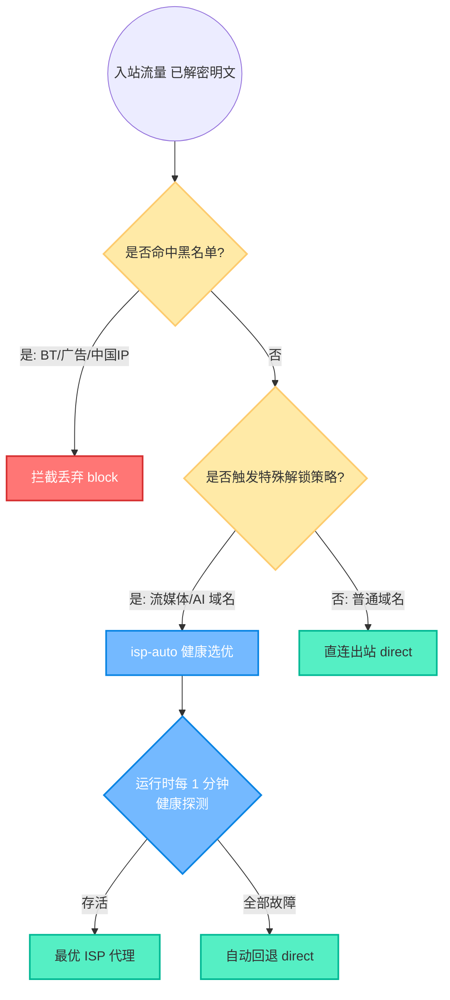
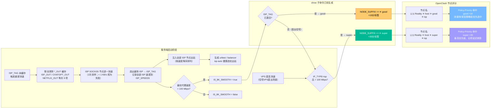
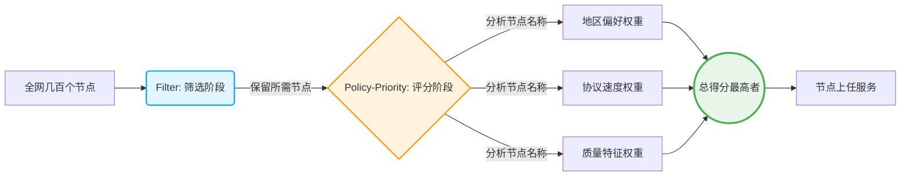
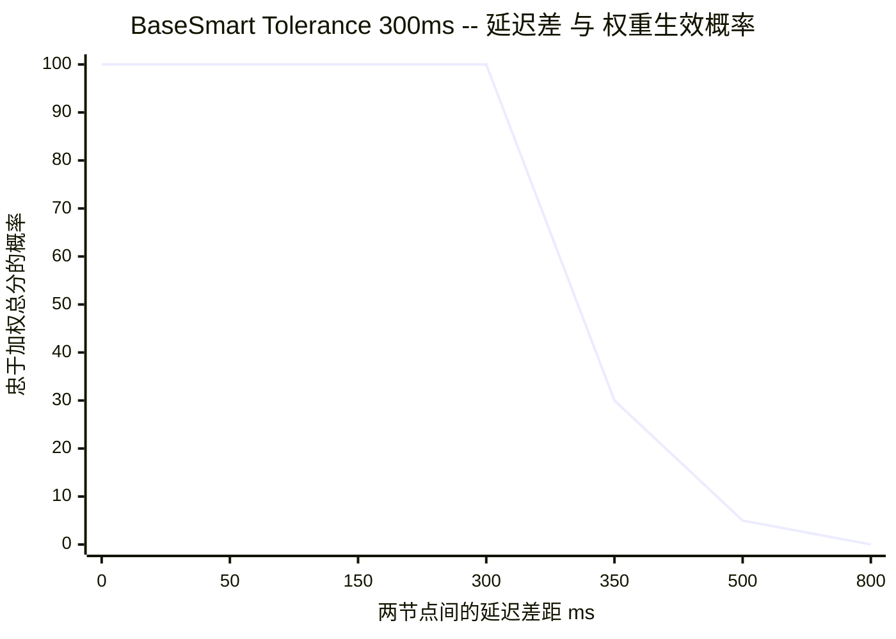
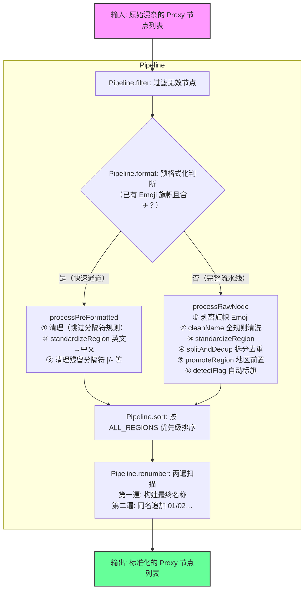

# 03. 智能路由策略与全平台客户端接入指南

> 本文档覆盖从**服务端链式代理多 ISP 落地**，到**客户端 OpenClash 智能调度优选**，再到 **Sub-Store 节点深层清洗**的完整路由方案。

---

## 目录

1. [服务端智能路由与多 ISP 落地策略](#1-服务端智能路由与多-isp-落地策略)
2. [OpenClash Policy-Priority 智能调度](#2-openclash-policy-priority-智能调度)
3. [Sub-Store 节点深层清洗与重命名](#3-sub-store-节点深层清洗与重命名)
4. [客户端模板对比与接入方式](#4-客户端模板对比与接入方式)
5. [参考文献](#5-参考文献)

---

## 1. 服务端智能路由与多 ISP 落地策略

### 1.1 核心痛点

VPS 的 IP 通常被标记为 Hosting（机房），受阻于 Netflix、ChatGPT 等服务的 IP 检测。通过服务端底层动态挂载 ISP（家庭宽带）或原生 SOCKS5 节点，可以让用户在手机/电脑上实现完全**"无感绕过"**。

### 1.2 路由决策工作原理

在 Xray (`xr.json`) 和 Sing-box (`sb.json`) 的底层核心中，配置了高度一致的路由决策引擎，流媒体/AI 域名统一指向 `isp-auto` 健康选优出站：



> **路由决策**：所有服务路由指向 `isp-auto`，由 sing-box `urltest` / xray `balancer` 在运行时自动选优；ISP 全部不可达时按 `ISP_FALLBACK_STRATEGY` 回退（默认 `direct`，可选 `block` 实现 fail-closed）。
>
> **可选增强**（默认关闭或等价默认行为，按需打开）:
> - `ISP_PROBE_URL` — probe URL 默认 Cloudflare 1 MiB，携带带宽信号
> - `ISP_PER_SERVICE_SB=true` — sing-box 为 Netflix / OpenAI / Claude / Gemini / Disney / YouTube 各配独立 balancer
> - `ISP_FALLBACK_STRATEGY=block` — 受限地区 fail-closed
> - `ISP_RETEST_INTERVAL_HOURS` — 默认 6h 周期重测,组成变化才重启 daemon
> - `ISP_SPEED_CACHE_TTL_MIN` — 冷启动 TTL 缓存(默认 60 min) + 后台异步刷新
>
> 完整运行时闭环架构图见 [docs/01-architecture-and-traffic.md §6.4](./01-architecture-and-traffic.md#64-完整运行时闭环); env 变量与典型组合见 [docs/04-ops-and-troubleshooting.md §2.6](./04-ops-and-troubleshooting.md#26-isp-auto-优化控制变量可选)。

### 1.3 多 ISP 环境注入实操

ISP 节点凭据属于敏感信息，**不放入 `docker-compose.yml`**，而是通过远端加密密钥库下发，由 `crypctl` 解密后写入 `/.env/secret`。

#### 远端密钥库格式（`/.env/secret` 内容示例）

```bash
# ISP 1: 洛杉矶原生家宽（变量名前缀必须以 _ISP 结尾）
export LA_ISP_IP='<ISP_IP_1>'
export LA_ISP_PORT='<PORT_1>'
export LA_ISP_USER='your_username'
export LA_ISP_SECRET='your_password'

# ISP 2: 韩国原生家宽
export KR_ISP_IP='<ISP_IP_2>'
export KR_ISP_PORT='<PORT_2>'
export KR_ISP_USER='your_username'
export KR_ISP_SECRET='your_password'
```

> `entrypoint.py` 启动时自动加载 `/.env/sb-xray` + `/.env/status` + `/.env/secret`，无需手动操作。

#### docker-compose.yml 中只需设置兜底出口

```yaml
environment:
  # 锁定模式：强制使用 LA ISP 出口，跳过测速自动选路
  - DEFAULT_ISP=LA_ISP

  # 自动模式：置空，由测速与地区检测自动决策最优出口
  - DEFAULT_ISP=
```

**`DEFAULT_ISP` 的两种模式：**

| 值                     | 行为                                                            |
| :--------------------- | :-------------------------------------------------------------- |
| `LA_ISP`（或任意前缀） | **锁定模式**：强制使用该 ISP 出口，完全跳过测速自动选路逻辑     |
| `""`（空值）           | **自动模式**：启动时测速，根据地区检测 + 速度对比自动选最优出口 |

> **为什么要显式设置 `DEFAULT_ISP=`（空）？** Dockerfile 默认值为 `LA_ISP`，不覆盖则永远锁定 LA 出口。只有在 docker-compose 中显式置空，才能解锁自动选路能力。

配置生效后，入口自动将**所有** ISP 凭据渲染为底层内核支持的 SOCKS5 出站 JSON（按测速速度降序排列），并生成 `isp-auto` 健康选优出站（Sing-box `urltest` / Xray `balancer`）。运行时每 1 分钟探测各 ISP 存活状态，故障自动回退 `direct`。所有的解锁动作在服务器端完成，客户端无需额外配置。

---

### 1.4 节点质量标签自动生成链路

这是项目花大量代码进行网络探测的核心原因：**服务端的测速结果，最终通过节点名称中的质量标签，驱动客户端 OpenClash 的智能调度评分**。



#### 启动日志结构示例

容器启动时，`docker logs sb-xray` 会打印完整决策链路，可直接对照排查：

```
[阶段 2] 测速与选路...
[阶段 2] 清除服务路由缓存（与 ISP_TAG 同步刷新）...
[阶段 2] 环境: IP_TYPE=hosting | 地区=US | DEFAULT_ISP=未设置（自动选路）
[阶段 2] 直连基准: 28.50 Mbps（不参与选路；无代理时用于 IS_8K_SMOOTH 判定）
[阶段 2] 发现 ISP 节点: 2 个，开始逐节点测速（采样=2次）...
[测速] 开始: KR_ISP | 测速源: https://... | 采样: 2次
[测速] KR_ISP | 第 1/2 轮: 9830 KB/s → 75.00 Mbps
[测速] KR_ISP | 第 2/2 轮: 10240 KB/s → 78.12 Mbps
[测速] KR_ISP: 2/2 有效样本，截断均值 76.56 Mbps，标准差 1.56 Mbps [稳定]
[测速] proxy-kr-isp: 76.56 Mbps → 新最优
[测速] 开始: JP_ISP | 测速源: https://... | 采样: 2次
[测速] JP_ISP | 第 1/2 轮: ...
[测速] JP_ISP: 2/2 有效样本，截断均值 70.00 Mbps，标准差 2.10 Mbps [稳定]
[测速] proxy-jp-isp: 70.00 Mbps (最优仍: proxy-kr-isp 76.56 Mbps)
[选路] ════════════════════════════════════════════
[选路] 决策输入:
[选路]   IP_TYPE       = hosting (机房/托管 IP)
[选路]   地区          = US
[选路]   DEFAULT_ISP   = 未设置（自动选路）
[选路]   直连速度      = 28.50 Mbps（不参与选路）
[选路]   最优 ISP 代理 = proxy-kr-isp (76.56 Mbps)
[选路] 原则: 受限地区/非住宅IP→需代理解锁; 住宅IP+非受限→直连兜底
[选路] 非住宅 IP (hosting)，需 ISP 代理解锁流媒体/AI
[选路] 使用最优 ISP 代理: proxy-kr-isp (76.56 Mbps)
[选路] IS_8K_SMOOTH: 出口=proxy-kr-isp | 参考速度=76.56 Mbps | 阈值=100 Mbps → false  → 无质量标签
[选路] ✓ 最终决策: ISP_TAG=proxy-kr-isp | IS_8K_SMOOTH=false
[选路] ════════════════════════════════════════════
[阶段 4] 生成客户端/服务端配置片段...
[ISP] 注入出站: proxy-kr-isp (76.56 Mbps)
[ISP] 注入出站: proxy-jp-isp (70.00 Mbps)
[ISP] Sing-box urltest 已生成: outbounds=["proxy-kr-isp", "proxy-jp-isp", "direct"]
[ISP] Xray observatory + balancer 已生成: selector=["proxy-kr-isp", "proxy-jp-isp"]
```

#### 两种质量标签的含义

| 标签      | 触发条件                                                     | 含义                                                 | OpenClash 加分 |
| :-------- | :----------------------------------------------------------- | :--------------------------------------------------- | :------------: |
| `✈ good`  | ISP 代理激活 + 代理速度 > 100 Mbps                           | 通过 SOCKS5 代理实现 8K 流畅，适合所有需要解锁的业务 |    **+10**     |
| `✈ super` | VPS 本身 IP 为住宅类型（`IP_TYPE=isp`）+ 直连速度 > 100 Mbps | VPS 直出即为原生家宽，无需代理即可 8K，稀缺最高质量  |    **+30**     |

> **关键设计理念**：ISP SOCKS5 代理的目的是**解锁 geo 限制**（ChatGPT/Netflix 等）。选路决策链如下：
>
> 1. `DEFAULT_ISP` 非空 → 手动锁定出口，跳过所有判断
> 2. 受限地区（香港/中国大陆等）**或**非住宅 IP（机房 IP）→ 需要代理：有 ISP 节点时路由指向 `isp-auto`（运行时健康选优 + 自动回退 direct）；无可用节点则回退直连（ERROR）
> 3. 住宅 ISP IP + 非受限地区 → 兜底直连（VPS 本身即原生家宽，直出即可）
>
> `_is_restricted_region` 仅作日志修饰，不单独控制分支走向；IP 类型（`IP_TYPE`）与地区限制同级参与条件评估。
>
> **运行时保障**：即使启动时选中的 ISP 在运行期间故障，Sing-box `urltest` / Xray `observatory` 会在下次探测（`ISP_PROBE_INTERVAL`，默认 1 分钟）后自动切换到存活节点或回退（`ISP_FALLBACK_STRATEGY`，默认 `direct`；`block` 实现 fail-closed），避免流量黑洞。每 `ISP_RETEST_INTERVAL_HOURS`（默认 6h）会周期性重跑带宽测试、仅当组成/排序变化时重渲染配置并重启内核。

#### 8K 判定阈值

| 速度        | 能力                 | 标签生成                         |
| :---------- | :------------------- | :------------------------------- |
| ≥ 100 Mbps  | 8K HDR/60fps 流畅    | IS_8K_SMOOTH=true → 生成质量标签 |
| 25–100 Mbps | 4K 流畅，8K 可能卡顿 | IS_8K_SMOOTH=false → 无质量标签  |
| < 25 Mbps   | 1080P 勉强           | IS_8K_SMOOTH=false → 无质量标签  |

---

## 2. OpenClash Policy-Priority 智能调度

本章深入解析在 OpenClash（Mihomo 内核）的 Smart 模式下，如何通过精密的 `filter`（筛选）和 `policy-priority`（排序）配合 `tolerance`（容忍度）机制，实现真正的**多场景智能路由**。

> [!IMPORTANT]
> 以下所有权重数据均与 `templates/client_template/OneSmartPro.yaml` 配置文件严格同步。

### 2.1 核心设计理念：职责分离

要驾驭成百上千的节点，必须坚持**职责分离**的配置原则：

- **Filter（初筛）**：只负责划定候选节点的范围。例如，只选支持流媒体的，过滤掉香港的。
- **Policy-Priority（定级）**：只负责给范围内的候选者进行「多维打分」。例如，同等条件下，优质节点加分，Reality 协议加分。



### 2.2 节点命名架构与特征提取

节点能够智能化打分的前提是其名字中附带了标签属性。标准格式：

```text
[${NODE_NAME}] ${REGION_INFO}|${PROTOCOL}|${SUFFIX}
```

| 维度类别     | 提取示例                        | 在系统中的用途                                                                   |
| :----------- | :------------------------------ | :------------------------------------------------------------------------------- |
| **地区标识** | `🇭🇰HK`, `🇺🇸US`, `🇯🇵JP`          | 定点分流，如 AI 节点强行加权美国区                                               |
| **特性标签** | `super`, `good`, `高速`         | 业务定速，识别具有极佳体验的专线（`good`/`super` 由服务端测速自动写入，见 §1.4） |
| **协议类型** | `Reality`, `Hysteria2`, `VMess` | 降延迟与抗封锁，新一代协议天然高分                                               |
| **质量后缀** | `super`, `good`                 | 区分节点池的头等舱和经济舱                                                       |

### 2.3 多维度打分与权重叠加法则

所有的评分是**累加**的！OpenClash 将累积节点名上所有匹配到的关键词权重，谁总分高谁当主力。

> [!TIP]
> **叠加公式：节点最终星级 = Σ(关键字命中得分)**

#### 评分标准对照表（与 `OneSmartPro.yaml` 严格同步）

| 考核维度     | 关键字命中匹配      |    权重 (分值)     | 实际节点名示例        | 机制说明                       |
| :----------- | :------------------ | :----------------: | :-------------------- | :----------------------------- |
| **质量标签** | `super`             |        +30         | `✈ super`             | 住宅流畅标识，最高质量节点     |
|              | `good` / `高速`     |        +10         | `✈ good`              | 代理流畅/高速标识              |
| **协议性能** | `Reality` + `XTLS`  |    +20+8=**28**    | `XTLS-Reality ✈`      | 纯 Reality Vision 节点（最高） |
|              | `Reality` + `Xhttp` |    +20+5=**25**    | `Xhttp+Reality直连 ✈` | XHTTP+Reality 直连节点         |
|              | `Hysteria2`         |         +8         | `Hysteria2 ✈`         | UDP QUIC + Salamander 混淆     |
|              | `AnyTLS`            |         +5         | `AnyTLS ✈`            | TCP TLS 伪装，高峰期稳定       |
|              | `TUIC`              |         +3         | `TUIC ✈`              | UDP QUIC，高峰期无混淆较弱     |
|              | `Vmess`             |         +2         | `Vmess ✈`             | WebSocket CDN 兜底             |
| **地区偏好** | _因策略而异_        | _见下方各策略模板_ | —                     | 不同场景有不同地区权重         |

> **关键词大小写敏感**：Mihomo 的 `policy-priority` 关键词匹配为**区分大小写**的字符串包含匹配。节点名中出现什么大小写形式，权重关键词就必须与之完全一致，否则不得分。

### 2.4 Filter 筛选器详解

以下是 `OneSmartPro.yaml` 中实际使用的 Filter 定义：

| Filter 名称                 | 匹配逻辑                                        | 适用策略组  |
| :-------------------------- | :---------------------------------------------- | :---------- |
| **FilterISP**               | 匹配含 `住宅`、`isp`、`ISP`、`AllOne` 的节点    | 家宽-智选   |
| **FilterMedia**             | 匹配含 `流媒体`、`AllOne` 的节点                | 媒体-智选   |
| **FilterAI**                | 匹配含 `AI`、`AllOne` 的节点                    | AI-智选     |
| **FilterFAST**              | 匹配含 `高速` 的节点                            | 高速-智选   |
| **FilterHK/TW/JP/SG/KR/US** | 按各自地区正则匹配                              | 各地区-智选 |
| **FilterOT**                | 排除以上所有已知地区的剩余节点                  | 其他-智选   |

> [!NOTE]
> `AllOne` 是一个特殊标识，用于让某些节点同时出现在家宽、流媒体和 AI 策略组中。

### 2.5 容忍度 (Tolerance) —— 延迟对抗权重的破局点

除了权重外，智能模式还引入「**延迟对抗制衡** (Tolerance Mechanism)」。`tolerance` 是衡量**允许在多少 ms 延迟劣势之内，继续尊重权重得分的"忠诚区间"**。



_图解：当节点延迟差距小于 300ms 时，系统绝对服从高权重分数（100% 忠诚）；一旦差距超过阈值，权重分数迅速崩盘，转而妥协于低延迟节点。_

### 2.6 三套智选模板

| 模板               | 容忍度 | 适用场景                   | 设计理念                                          |
| :----------------- | :----: | :------------------------- | :------------------------------------------------ |
| ⚖️ **BaseSmart**   | 300ms  | 高速-智选、各地区普通优选  | 速度与规矩并重，防止选上卡顿但高权重的节点        |
| 🛡️ **StableSmart** | 800ms  | AI-智选（ChatGPT、Claude） | AI 对 IP 变动极敏感，高容忍度防止频繁换区         |
| 🎬 **MediaSmart**  | 1000ms | 家宽-智选、媒体-智选       | IP 纯净度是**唯一标准**，几乎"只看权重，无视延迟" |

### 2.7 六套 Policy-Priority 策略模板

以下是 `OneSmartPro.yaml` 中定义的完整策略模板（基础权重 + 地区偏好）：

#### PolicyDefault（默认策略，无地区偏置）

```yaml
"高速:10;Reality:20;XTLS:8;Xhttp:5;Hysteria2:8;AnyTLS:5;TUIC:3;Vmess:2;super:30;good:10"
```

#### PolicyISP（家宽策略）

```yaml
# 地区偏好: 🇺🇸:20 > 🇰🇷:10 > 🇯🇵:6 > 🇸🇬:4 > 🇹🇼:2
"高速:10;Reality:20;XTLS:8;Xhttp:5;Hysteria2:8;AnyTLS:5;TUIC:3;Vmess:2;super:30;good:10;🇺🇸:20;🇰🇷:10;🇯🇵:6;🇸🇬:4;🇹🇼:2"
```

#### PolicyMedia（流媒体策略）

```yaml
# 地区偏好: 🇺🇸:15 > 🇰🇷:8 > 🇯🇵:6 > 🇸🇬:4 > 🇹🇼:2
"高速:10;Reality:20;XTLS:8;Xhttp:5;Hysteria2:8;AnyTLS:5;TUIC:3;Vmess:2;super:30;good:10;🇺🇸:15;🇰🇷:8;🇯🇵:6;🇸🇬:4;🇹🇼:2"
```

#### PolicyFast（高速策略）

```yaml
# 地区偏好: 🇺🇸:15 > 🇯🇵:10 > 🇰🇷:8 > 🇸🇬:4 > 🇹🇼:2
"高速:10;Reality:20;XTLS:8;Xhttp:5;Hysteria2:8;AnyTLS:5;TUIC:3;Vmess:2;super:30;good:10;🇺🇸:15;🇯🇵:10;🇰🇷:8;🇸🇬:4;🇹🇼:2"
```

#### PolicyAI（AI 服务策略）

```yaml
# 地区偏好: 🇺🇸:20 > 🇯🇵:10 > 🇰🇷:8 > 🇸🇬:4 > 🇹🇼:2
"高速:10;Reality:20;XTLS:8;Xhttp:5;Hysteria2:8;AnyTLS:5;TUIC:3;Vmess:2;super:30;good:10;🇺🇸:20;🇯🇵:10;🇰🇷:8;🇸🇬:4;🇹🇼:2"
```

### 2.8 配置与实战案例推演

```yaml
# 第一步：指定地区权重模板（此为家宽专用策略）
PolicyISP: "高速:10;Reality:20;vless:10;...;super:30;good:10;🇺🇸:20;🇰🇷:10;🇯🇵:6;🇸🇬:4;🇹🇼:2"

# 第二步：挂载到最终业务的路由组（使用 MediaSmart + FilterISP 双剑合璧）
proxy-groups:
  - name: 家宽-智选
    type: smart       # 由 <<: *MediaSmart 继承 1000ms 容忍度
    filter: "^(?=.*(?i)(住宅|isp|ISP|AllOne))(?!.*(DIRECT|直接连接|5x)).*$"
    policy-priority: *PolicyISP
```

#### 沙盘推演：家宽节点选拔战

**参赛选手**（经过 Filter 之后）：

| 选手  | 节点名称                                  | 延迟       |
| :---- | :---------------------------------------- | :--------- |
| **A** | `[Reality] 🇺🇸US 住宅 Reality vless super` | **180 ms** |
| **B** | `[Reality] 🇰🇷KR 住宅 Hysteria2 super`     | **70 ms**  |
| **C** | `[Reality] 🇭🇰HK 住宅 Reality vless super` | **30 ms**  |

**打分环节**（基于 `PolicyISP`）：

- **选手 A (美国)**：Reality(`20`) + vless(`10`) + 🇺🇸(`20`) + super(`30`) = **80 分** 🏆
- **选手 B (韩国)**：Hysteria2(`8`) + 🇰🇷(`10`) + super(`30`) = **48 分**
- **选手 C (香港)**：Reality(`20`) + vless(`10`) + 🇭🇰(`0`) + super(`30`) = **60 分**

**结果揭晓**：

1. 选手 A 延迟 180ms，选手 C 只有 30ms，延迟差高达 150ms
2. 但家宽模板为 `MediaSmart`，容忍度高达 **1000ms**
3. 延迟差 150ms 远未击穿 1000ms 防线，机制**只看总得分**
4. **选手 A (80 分) 毫无争议地战胜选手 C (60 分)！**

> **推演结论**：完美实现了"哪怕美国慢得要命，只要在可用范围内，绝不用极速香港节点来干扰家宽业务！"

### 2.9 排障与调优 FAQ

| 问题             | 原因                     | 解决方案                                    |
| :--------------- | :----------------------- | :------------------------------------------ |
| 高分节点不被选上 | 延迟差突破了容忍红线     | 检查节点状态或替换为 `MediaSmart`           |
| 修改优先级未生效 | 关键字大小写错误或未重载 | 检查大小写后重启容器拉取最新配置            |
| 追踪权重计算轨迹 | —                        | `grep "policy-priority" /tmp/openclash.log` |

---

## 3. Sub-Store 节点深层清洗与重命名

对于将外部代理服务提供商节点引入本系统的用户，环境节点命名往往杂乱无章。SB-Xray 利用内嵌的 Sub-Store 与强大的 `rename.js` 脚本进行全自动清洗。

### 3.1 清洗流转架构



### 3.2 核心清洗动作

| 阶段                 | 动作                       | 说明                                                                                                       |
| :------------------- | :------------------------- | :--------------------------------------------------------------------------------------------------------- |
| **去重与过滤**       | `Pipeline.filter`          | 拦截含"套餐/到期/剩余/联系客服"等无效信息的噪点节点                                                        |
| **全规则清洗**       | `Utils.cleanName`          | 按 `CleaningRules` 顺序执行：移除括号/序号/IEPL后缀、提取倍率、"解锁"前缀等                                |
| **地名统一归化**     | `Utils.standardizeRegion`  | 将 `Hong Kong`/`HK`/`深港`/`HKT` 统一为 `香港`；贯穿原始通道和预格式化通道                                 |
| **拆分与去重**       | `Utils.splitAndDedup`      | 按分隔符拆分后去重；自动展开组合地名（如 `香港hkt2直连` → `香港` + `直连`，剥离 ISP 遗留孤立序号）         |
| **地区前置**         | `Utils.promoteRegion`      | 将地区关键词移动到 parts 数组首位；返回新数组，不修改原数组                                                |
| **视觉美化**         | `Utils.detectFlag`         | 自动挂载国旗 Emoji，格式化为 `Flag Protocol ✈ Region ✈ Detail`                                             |
| **协议安全移除**     | `processRawNode`           | 使用 `\b词边界\b` 正则移除协议名残留，防止 `ss` 误删 `Russia` 中的子串                                     |
| **协议精简**         | `Utils.shouldHideProtocol` | 有 `Reality` 则隐藏 `vless`，避免冗余标签                                                                  |
| **同名去重编号**     | `Pipeline.renumber`        | 两遍扫描：第一遍生成所有最终名称，第二遍统计重名并追加零填充序号（`01`/`02`…）                             |
| **预格式化残留清理** | `processPreFormatted`      | 跳过分隔符规则（`skipInPreformat`）清洗各段后，对每段执行 `standardizeRegion` 并清理 `\|`/`-` 等残留分隔符 |

### 3.3 处理效果对比

**原始通道（`processRawNode`）**

| 原始命名                               |   协议    | 清洗后结果                               |
| :------------------------------------- | :-------: | :--------------------------------------- |
| `![使用教程与联系客服].txt`            |     —     | **（自动剔除）**                         |
| `🇭🇰 香港01-深港IEPL`                   |    ss     | `🇭🇰 ss ✈ 香港`                           |
| `🇭🇰 Hong Kong丨01`                     |    ss     | `🇭🇰 ss ✈ 香港`                           |
| `🇭🇰香港[1]✈原生家庭(协议一)`           |    ss     | `🇭🇰 ss ✈ 香港 ✈ 原生家庭`                |
| `✨🇭🇰 香港 01 x1.5 \| IPLC -- Reality` |   vless   | `🇭🇰 Reality ✈ IPLC ✈ 香港 ✈ 1.5×`        |
| `🇺🇸美国洛杉矶v6 08 🎯 udp`             |    ss     | `🇺🇸 IPv6 美国 ✈ UDP ✈ 洛杉矶`            |
| `Taiwan-Hsinchu-02-1.0倍`              |    ss     | `🇹🇼 台湾 ✈ 1× ✈ 新竹`                    |
| `🇭🇰香港hkt2-HY2直连`                   | hysteria2 | `🇭🇰 hysteria2 ✈ 香港 ✈ 直连`             |
| `🇨🇳台湾02-动态IP`                      |    ss     | `🇹🇼 ss ✈ 台湾 ✈ 动态IP`                  |
| `解锁流媒体-香港`                      |   vless   | `🇭🇰 vless ✈ 香港 ✈ 流媒体`               |
| `香港01-流媒体`（×3 重复）             |    ss     | `🇭🇰 ss ✈ 香港 ✈ 流媒体 01` / `02` / `03` |

**预格式化通道（`processPreFormatted`）**

已含 Emoji + `✈` 的节点走此快速通道，同样执行地名标准化和分隔符清理：

| 原始命名                          | 协议  | 清洗后结果                     |
| :-------------------------------- | :---: | :----------------------------- |
| `🇭🇰 Hong Kong \| ✈ 流媒体 ✈ 高速` |  ss   | `🇭🇰 ss ✈ 香港 ✈ 流媒体 ✈ 高速` |
| `🇺🇸 United States \| ✈ 流媒体`    | vless | `🇺🇸 vless ✈ 美国 ✈ 流媒体`     |
| `🇬🇧 Great Britain \| ✈ 高速`      |  ss   | `🇬🇧 ss ✈ 英国 ✈ 高速`          |
| `🇯🇵 Japan \| ✈ AI`                | vless | `🇯🇵 vless ✈ 日本 ✈ AI`         |

### 3.4 部署方式

1. 进入 Sub-Store 网页端控制台
2. 找到订阅链接编辑界面 → **脚本操作 (Scripting)**
3. 添加类型为 `Operator` 的处理脚本
4. 将 `rename.js` 代码粘贴进去，保存并预览

### 3.5 扩展与维护

**新增地区支持**：在 `RegionMap` 中添加对应正则即可，`Constants.ALL_REGIONS` 会在脚本初始化时自动缓存（`initFlagRules` 末尾），无需在各函数内手动维护列表。

**新增清洗规则**：在 `CleaningRules` 数组中追加规则对象。若该规则含有分隔符操作且不应作用于已格式化节点，添加 `skipInPreformat: true` 字段使预格式化通道跳过它：

```javascript
// 示例：添加一条不影响预格式化节点的清洗规则
{ desc: "移除特殊前缀", regex: /^特殊-/g, value: "", skipInPreformat: true }
```

**新增国旗规则**：`FlagRules` 数组中的手动规则（繁体/异体字/城市名）优先级高于 `CountryDB` 自动生成的规则，复杂匹配在此处添加。

**调试重命名结果**：在 Sub-Store 脚本编辑界面点击"预览"，可实时看到每个节点的清洗前后对比。

---

## 4. 客户端模板对比与接入方式

### 4.1 模板类型对比

| 模板                 | 定位         | 内核          | 核心机制                              | 策略组 | 适用场景                               |
| :------------------- | :----------- | :------------ | :------------------------------------ | :----: | :------------------------------------- |
| **OneSmartPro.yaml** | 智能完整版   | Mihomo        | Smart 智选 + Policy-Priority 多维权重 |  ~40   | OpenClash / Mihomo 自动选择最优节点    |
| **FallBackPro.yaml** | 故障转移版   | Mihomo        | Fallback 故转 + url-test 自动切换     |  ~50   | OpenClash / ClashMi 稳定优先、自动容灾 |
| **stash.yaml**       | 移动端精简版 | Clash (Stash) | Fallback 故转 + url-test 自动切换     |  ~25   | iOS / macOS Stash 客户端，精简分流     |
| **surge.conf**       | Surge 配置   | Surge         | url-test + 正则分组                   |  ~15   | macOS / iOS Surge 客户端               |

> [!NOTE]
> **两套 Mihomo 模板的核心区别**：
>
> - **OneSmartPro** 使用 Mihomo 最新的 `smart` 策略组类型，通过 `policy-priority` 进行**多维度加权打分**（协议、地区、质量标签），每个场景只需一个策略组即可智能决策。
> - **FallBackPro** 使用传统的 `fallback` + `url-test` 组合，每个地区/场景拆分为「故转 → 自动/手动」**三层嵌套**，更加稳健但策略组数量更多。

### 4.2 核心变量说明

所有客户端模板都支持以下环境变量替换：

| 变量                         | 说明                 | 示例值            |
| :--------------------------- | :------------------- | :---------------- |
| `${DOMAIN}`                  | 服务器主域名         | `example.com`     |
| `${CDNDOMAIN}`               | CDN 域名             | `cdn.example.com` |
| `${LISTENING_PORT}`          | 监听端口             | `443`             |
| `${XRAY_UUID}`               | Xray UUID            | `xxxx-xxxx-xxxx`  |
| `${SB_UUID}`                 | Sing-box UUID        | `yyyy-yyyy-yyyy`  |
| `${PORT_HYSTERIA2}`          | Hysteria2 监听端口   | `6443`            |
| `${PORT_TUIC}`               | TUIC 监听端口        | `8443`            |
| `${PORT_ANYTLS}`             | AnyTLS 端口          | `4433`            |
| `${XRAY_REALITY_PUBLIC_KEY}` | Reality 公钥         | `abcd1234...`     |
| `${XRAY_URL_PATH}`           | WebSocket/XHTTP 路径 | `random32chars`   |
| `${CLASH_PROXY_PROVIDERS}`   | 订阅源配置           | YAML 格式字符串   |

### 4.3 DNS 配置策略

不同客户端模板对 DNS 的处理方式存在显著差异，配置不当会导致节点健康检查全部失败或 YAML 解析错误。

#### 4.3.1 两类已知陷阱

**陷阱一：Stash YAML 解析器不支持 `nameserver-policy` 列表值**

Stash 基于旧版 Clash 解析器，`nameserver-policy` 的值类型硬编码为 `string`（标量）。若将其写为 YAML 列表（`!!seq`），Stash 会抛出解析错误：

```
yaml: unmarshal errors:
  line N: cannot unmarshal !!seq into string
```

**正确写法**（每个 key 仅允许单个字符串值）：

```yaml
nameserver-policy:
  "geosite:private,cn": "119.29.29.29"
  "geosite:geolocation-!cn": "https://1.1.1.1/dns-query"
```

**错误写法**（Mihomo 支持但 Stash 不支持）：

```yaml
nameserver-policy:
  "geosite:private,cn":
    - 119.29.29.29 # ❌ !!seq → Stash 解析失败
    - 223.5.5.5
```

---

**陷阱二：`auto-route: false` 下 DoH 与路由规则形成引导循环**

当 `proxy-server-nameserver` 或 `nameserver-policy` 使用 DoH（`https://1.1.1.1/dns-query`）时，DoH 请求本身是一条发往 `1.1.1.1:443` 的 TCP 连接。此连接会进入 Clash 内部的路由规则匹配：

```
DoH 请求 → 1.1.1.1:443 → 规则匹配 → MATCH,兜底流量
         → 兜底流量代理组（无可用节点，因为健康检查都在失败）
         → DoH 失败 → 节点域名无法解析 → 健康检查继续失败 → 死锁
```

**根本原因**：`auto-route: false` 时 Clash 不修改系统路由表，也不为 DNS 服务器 IP 注入绕过路由，DoH 的 TCP 连接与普通流量走相同的出站规则链。

#### 4.3.2 DNS 配置对比

| 配置项                        |     `stash.yaml`      | `FallBackPro.yaml` | 差异原因                                          |
| :---------------------------- | :-------------------: | :----------------: | :------------------------------------------------ |
| `tun.auto-route`              |        `true`         |      `false`       | Stash 作为系统 VPN 运行，ClashMi 作为本地代理运行 |
| `proxy-server-nameserver` DoH |        ✅ 保留        |      ❌ 删除       | `auto-route: true` 会注入绕过路由，DoH 直连安全   |
| `nameserver-policy` DoH       | ✅ 保留（值为字符串） |      ❌ 删除       | 同上；Stash 还要求值类型为 `string`               |
| `fake-ip-filter`              |        ✅ 保留        |      ✅ 保留       | 两者均需防止本地域名分配假 IP                     |
| nameserver 额外 DNS           |           —           |   `119.29.29.29`   | 删除 DoH 后补充可靠的境外域名解析能力             |

#### 4.3.3 TUN `auto-route` 与 DoH 安全性的关联

| `auto-route` |      系统路由表      | DoH 的出站路径                                            | DoH 能否可靠工作 |
| :----------: | :------------------: | :-------------------------------------------------------- | :--------------: |
|    `true`    |  Clash 注入绕过路由  | DNS 服务器 IP 走物理网卡直连，绕过 TUN                    |     ✅ 安全      |
|   `false`    | 不修改，依赖 OS 默认 | DoH TCP 连接经过 Clash 路由规则 → 可能走代理组 → 引导循环 |    ❌ 有风险     |

> **注意**：`proxy-server-nameserver` 在设计上应走 DIRECT，但 `auto-route: false` 时缺少系统层面的保障，实际行为依赖客户端实现质量。为彻底规避风险，`auto-route: false` 的模板应改用普通 UDP DNS。

#### 4.3.4 各平台接入方式

容器正常运行后，访问 `https://您的CDN域名/sb-xray/` 调出专属面板，获取包含**独立防泄漏 Token** 的订阅链接。

| 平台                  | 推荐客户端                | 接入方式                                                               |
| :-------------------- | :------------------------ | :--------------------------------------------------------------------- |
| **Windows / Android** | v2rayN                    | 复制单条链接进行剪贴板导入；或复制 `/sb-xray/all?token=xxx` 作为订阅源 |
| **macOS / iOS**       | ClashX Pro / Shadowrocket | 复制针对性 YAML 模板链接，选择"从 URL 下载配置"                        |
| **iOS / iPadOS**      | Stash                     | 复制 `/sb-xray/stash?token=xxx`，在“配置”页面选择“从 URL 下载”导入     |
| **OpenWrt**           | OpenClash                 | 复制 `OneSmartPro.yaml?token=xxx` 作为订阅源，内核选择 Mihomo          |

---

## 5. 参考文献

- **开源规则库**: [Mihomo 官方规则 (MetaCubeX/meta-rules-dat)](https://github.com/MetaCubeX/meta-rules-dat)
- **策略参考**: [666OS/YYDS 复合规则库](https://github.com/666OS/YYDS)
- **Mihomo Smart 模式**: [Mihomo 文档 — Proxy Groups](https://wiki.metacubex.one/config/proxy-groups/)
- **Sub-Store**: [sub-store-org/Sub-Store](https://github.com/sub-store-org/Sub-Store)
