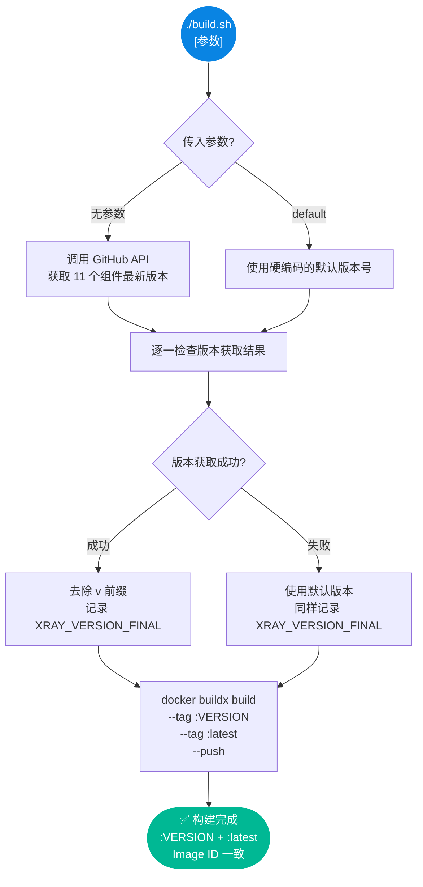
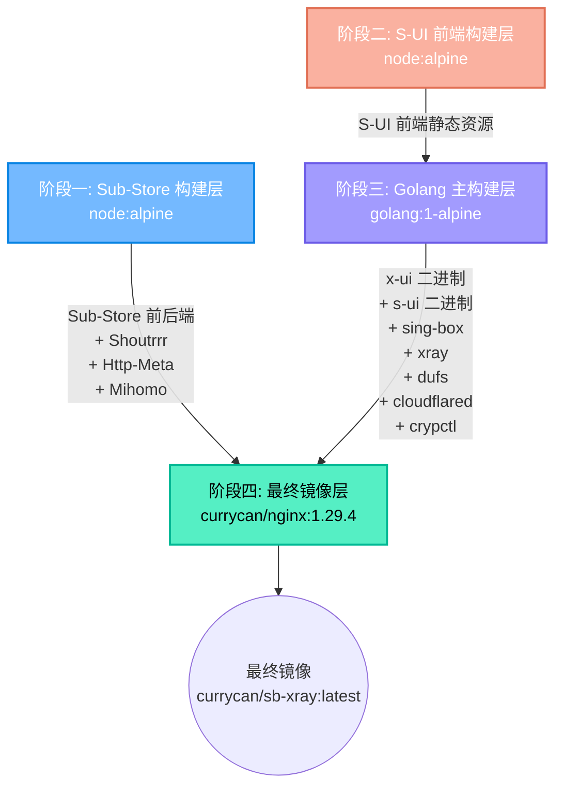
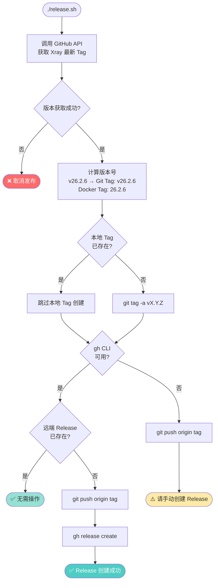
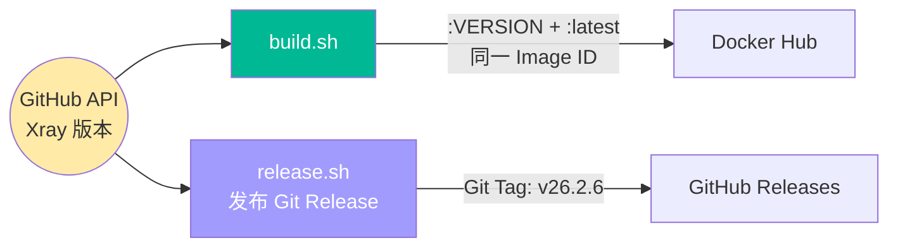

# 05. 构建部署与版本发布指南

> 本文档详细解析 SB-Xray Docker 镜像的完整构建流程，包括环境准备、自动化构建脚本、四阶段 Dockerfile 架构、常见构建问题，以及 Git Release 自动化版本发布机制。

---

## 目录

1. [构建环境准备](#1-构建环境准备)
2. [自动构建脚本](#2-自动构建脚本buildsh)
3. [四阶段 Dockerfile 架构](#3-四阶段-dockerfile-架构)
4. [组件版本管理](#4-组件版本管理)
5. [手动精细构建](#5-手动精细构建)
6. [常见构建问题 FAQ](#6-常见构建问题-faq)
7. [Git Release 版本发布](#7-git-release-版本发布releasesh)

---

## 1. 构建环境准备

### 1.1 必备工具

| 工具 | 最低版本 | 用途 |
|:---|:---|:---|
| **Docker** | 24.0+ | 容器运行时 |
| **Docker Buildx** | 0.11+ | 多架构构建 |
| **jq** | 1.6+ | 解析 GitHub API 返回的 JSON |
| **curl** | 7.68+ | 调用 GitHub API 获取版本 |
| **Git** | 2.30+ | 源码管理 |

### 1.2 多架构构建器配置

```bash
# 检查是否存在 buildx builder
docker buildx ls

# 如不存在，创建一个支持多架构的 builder
docker buildx create --name multiarch --use --bootstrap

# 验证支持的架构
docker buildx inspect --bootstrap
```

### 1.3 GitHub API Token（可选，推荐）

GitHub API 对匿名请求有严格限流（60 次/小时）。推荐设置 Token：

```bash
export GITHUB_TOKEN=ghp_xxxxxxxxxxxxxxxxxxxx
```

---

## 2. 自动构建脚本（build.sh）

`build.sh` 是推荐的构建入口，它自动从 GitHub API 获取所有组件的最新版本号并传递给 Docker。

### 2.1 基本用法

一条命令完成构建并同时推送 `:版本号` 和 `:latest` 两个 tag，两者始终指向同一 Image ID。

```bash
./build.sh              # 自动获取最新版本（推荐）
./build.sh default      # 使用默认版本（适合离线/限速环境）
```

### 2.2 工作流程



### 2.3 版本获取策略

脚本对不同组件采用不同的版本获取方式：

| 策略 | API 端点 | 适用组件 |
|:---|:---|:---|
| **Latest Release** | `/repos/{owner}/{repo}/releases/latest` | Shoutrrr, Mihomo, Http-Meta, Sub-Store, S-UI |
| **Latest Tag** | `/repos/{owner}/{repo}/tags` | Xray (取第一个 tag，含 beta) |
| **Latest Stable Tag** | `/repos/{owner}/{repo}/tags` + 过滤 | Dufs, Cloudflared, 3x-ui, Sing-box (排除 rc/beta/alpha) |

---

## 3. 四阶段 Dockerfile 架构

整个构建过程分为四个精心设计的阶段（Multi-Stage Build），最大程度地减小最终镜像体积。



### 3.1 阶段一：Sub-Store 构建层

**基础镜像**: `node:alpine`

**构建产物**:

| 组件 | 来源 | 构建方式 |
|:---|:---|:---|
| **Shoutrrr** | containrrr/shoutrrr | 预编译二进制下载 |
| **Http-Meta** | xream/http-meta | 预编译 JS Bundle 下载 |
| **Mihomo** | MetaCubeX/mihomo | 预编译二进制下载 |
| **Sub-Store 后端** | sub-store-org/Sub-Store | 预编译 JS Bundle 下载 |
| **Sub-Store 前端** | sub-store-org/Sub-Store-Front-End | **从源码构建** (pnpm build) |

### 3.2 阶段二：S-UI 前端构建层

**基础镜像**: `node:alpine`

**构建过程**:
1. 克隆 S-UI 后端仓库（含 Go 源码）
2. 克隆 S-UI-Frontend 仓库
3. `npm install && npm run build`
4. 将编译后的 `dist/` 移入后端的 `web/html` 目录

### 3.3 阶段三：Golang 主构建层

**基础镜像**: `golang:1-alpine`

**环境特性**: `CGO_ENABLED=1`（启用 CGO 以支持 SQLite）

**构建产物**:

| 组件 | 构建方式 | 压缩 |
|:---|:---|:---|
| **crypctl** | `go build` + UPX | ✅ |
| **Dufs** | 预编译下载 + UPX | ✅ |
| **Cloudflared** | 预编译下载 + UPX | ✅ |
| **X-UI (3x-ui)** | 从源码 `go build` + UPX | ✅ |
| **S-UI** | 从源码 `go build` (含 QUIC/gRPC/ACME tags) + UPX | ✅ |
| **Sing-box** | 预编译下载 + UPX | ✅ |
| **Xray** | 预编译 ZIP 下载 + UPX | ✅ |

> **UPX 压缩**：所有二进制文件使用 `upx --lzma --best` 极限压缩，减小 50-70% 体积。

### 3.4 阶段四：最终镜像层

**基础镜像**: `currycan/nginx:1.29.4`（基于 Alpine 的自定义 Nginx）

**运行时安装**:

```
curl bash iproute2 net-tools tzdata ca-certificates python3 pip
gettext libc6-compat vim libqrencode-tools jq sqlite nodejs
supervisor dumb-init fail2ban acme.sh
```

**关键配置**:

| 配置项 | 值 | 说明 |
|:---|:---|:---|
| `ENTRYPOINT` | `dumb-init -- python3 /scripts/entrypoint.py run` | dumb-init 作为 PID 1，Python `entrypoint.py` 提供 `run` / `show` / `trim` 三个子命令；`run` 负责初始化编排，未迁移阶段 subprocess 回落 `entrypoint.sh`，bash `createConfig` 之后会回调 `entrypoint.py trim` 应用 `ENABLE_*` 降载开关 |
| `CMD` | `supervisord` | Supervisor 管理所有子进程 |
| `HEALTHCHECK` | `supervisorctl status xray` | 每 30 秒检查 Xray 存活 |
| `EXPOSE` | `80 443` | 默认暴露端口 |
| `TZ` | `Asia/Singapore` | 时区 |

---

## 4. 组件版本管理

### 4.1 当前默认版本

以下是 `build.sh` 中硬编码的 Fallback 版本（当 GitHub API 不可用时使用）：

| 组件 | 默认版本 | Build Arg |
|:---|:---|:---|
| Shoutrrr | 0.8.0 | `SHOUTRRR_VERSION` |
| Mihomo | 1.19.0 | `MIHOMO_VERSION` |
| Http-Meta | 1.0.6 | `HTTP_META_VERSION` |
| Sub-Store 前端 | 2.16.13 | `SUB_STORE_FRONTEND_VERSION` |
| Sub-Store 后端 | 2.21.21 | `SUB_STORE_BACKEND_VERSION` |
| S-UI | 1.3.9 | `SUI_VERSION` |
| Dufs | 0.45.0 | `DUFS_VERSION` |
| Cloudflared | 2026.2.0 | `CLOUDFLARED_VERSION` |
| 3x-ui | 2.8.10 | `XUI_VERSION` |
| Sing-box | 1.12.21 | `SING_BOX_VERSION` |
| Xray | 26.2.6 | `XRAY_VERSION` |

### 4.2 版本覆盖

可通过环境变量强制指定版本：

```bash
# 指定特定 Xray 版本
XRAY_VERSION=25.12.15 docker buildx build \
  --build-arg XRAY_VERSION=25.12.15 \
  --tag currycan/sb-xray:custom \
  .
```

---

## 5. 手动精细构建

### 5.1 仅构建单架构（本地测试）

```bash
# 仅构建 amd64（不推送）
docker buildx build \
  --platform linux/amd64 \
  --build-arg XRAY_VERSION=26.2.6 \
  --build-arg SING_BOX_VERSION=1.12.21 \
  --tag currycan/sb-xray:test \
  --load .
```

### 5.2 多架构构建并推送

推荐直接使用 `build.sh`（自动获取版本 + 同时推送两个 tag）：

```bash
./build.sh
```

如需手动指定版本构建：

```bash
docker buildx build \
  --platform linux/amd64,linux/arm64 \
  --build-arg XRAY_VERSION=26.2.6 \
  --build-arg SING_BOX_VERSION=1.13.1 \
  --tag currycan/sb-xray:26.2.6 \
  --tag currycan/sb-xray:latest \
  --push .
```

### 5.3 构建缓存优化

```bash
# 使用 registry 缓存加速重复构建
docker buildx build \
  --platform linux/amd64,linux/arm64 \
  --cache-from type=registry,ref=currycan/sb-xray:cache \
  --cache-to type=registry,ref=currycan/sb-xray:cache,mode=max \
  --push .
```

---

## 6. 常见构建问题 FAQ

### Q1: GitHub API 返回 403 / Rate Limit

**原因**: 未配置 GitHub Token 导致匿名限流（60 次/小时）

**解决**:
```bash
export GITHUB_TOKEN=ghp_xxxxxxxxxxxxxxxxxxxx
./build.sh
```
或使用默认版本模式：`./build.sh default`

### Q2: Sub-Store 前端构建失败

**现象**: `pnpm install` 或 `pnpm run build` 失败

**常见原因**:
* 网络问题导致 npm 包下载失败
* Node.js 版本不兼容

**解决**: 重试或检查 Sub-Store 前端仓库的 `engines` 字段要求

### Q3: UPX 压缩失败

**现象**: `upx: CantPackException`

**常见原因**: 某些二进制已被压缩或具有特殊段

**解决**: 跳过该文件的 UPX 或降级 UPX 版本

### Q4: ARM64 构建报错

**现象**: 在 x86 机器上构建 ARM64 失败

**解决**:
```bash
# 安装 QEMU 用户态模拟
docker run --rm --privileged multiarch/qemu-user-static --reset -p yes
```

### Q5: 如何查看镜像中所有组件版本？

```bash
docker run --rm currycan/sb-xray:latest bash -c "
  echo '=== Xray ===' && xray version
  echo '=== Sing-box ===' && sing-box version
  echo '=== Nginx ===' && nginx -v
  echo '=== Node ===' && node --version
  echo '=== Python ===' && python3 --version
"
```

### Q6: 版本 tag 和 `:latest` 的 Image ID 不一致？

**原因**: 在 `build.sh` 之外又单独执行了一次 `docker buildx build`，导致其中一个 tag 被新构建覆盖。

**解决**: 只用 `./build.sh` 构建，它在同一次 `docker buildx build` 中同时传入 `--tag :VERSION --tag :latest`，两个 tag 天然指向同一 Image ID。

### Q7: 构建后镜像体积过大？

**预期体积**: 约 300-400 MB (compressed)

**优化要点**:
1. 确认 UPX 压缩正常执行
2. 确认使用 `--no-cache` 的 `apk add`
3. 多阶段构建已自动丢弃中间层

---

## 7. Git Release 版本发布（release.sh）

`release.sh` 负责将项目的 Git Release 版本号与 Docker 镜像版本（即 Xray 版本号）保持**自动同步**。

### 7.1 版本同步策略

本项目的版本号直接对齐 **Xray-core 最新 Tag**，确保三者一致：

| 标识 | 格式 | 示例 |
|:---|:---|:---|
| Xray-core Tag | `vX.Y.Z` | `v26.2.6` |
| Docker 镜像 Tag | `X.Y.Z` (无 `v` 前缀) | `26.2.6` |
| Git Release Tag | `vX.Y.Z` | `v26.2.6` |

### 7.2 基本用法

```bash
# 自动获取最新 Xray 版本，创建对应 Git Tag 和 GitHub Release
./release.sh

# 推荐配置 GitHub Token 以避免 API 限流
export GITHUB_TOKEN=ghp_xxxxxxxxxxxxxxxxxxxx
./release.sh
```

### 7.3 工作流程



### 7.4 详细流程说明

| 步骤 | 动作 | 说明 |
|:---:|:---|:---|
| 1 | 获取 Xray 最新版本 | 通过 GitHub API `/repos/XTLS/Xray-core/tags` 获取最新 Tag |
| 2 | 计算 Release Tag | 去除/添加 `v` 前缀以匹配 Docker 与 Git 两种命名规范 |
| 3 | 创建本地 Git Tag | 使用 `git tag -a` 创建附注标签（annotated tag） |
| 4a | 推送 + 创建 Release | 若检测到 `gh` CLI → 自动推送标签并创建 GitHub Release |
| 4b | 仅推送标签 | 若无 `gh` CLI → 推送标签后提示用户手动创建 Release |

### 7.5 幂等性保障

`release.sh` 设计为**可重复执行**，不会产生副作用：

* **本地 Tag 已存在** → 跳过创建，不报错
* **远端 Release 已存在** → 跳过创建，不报错
* **获取版本失败** → 立即中止，不执行任何 Git 操作

### 7.6 与 build.sh 的关系



推荐执行顺序：`./build.sh` → `./release.sh`。两个脚本共享同一版本源，确保 Docker 镜像版本与 Git Release 版本始终一致。
