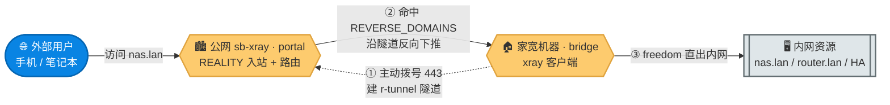
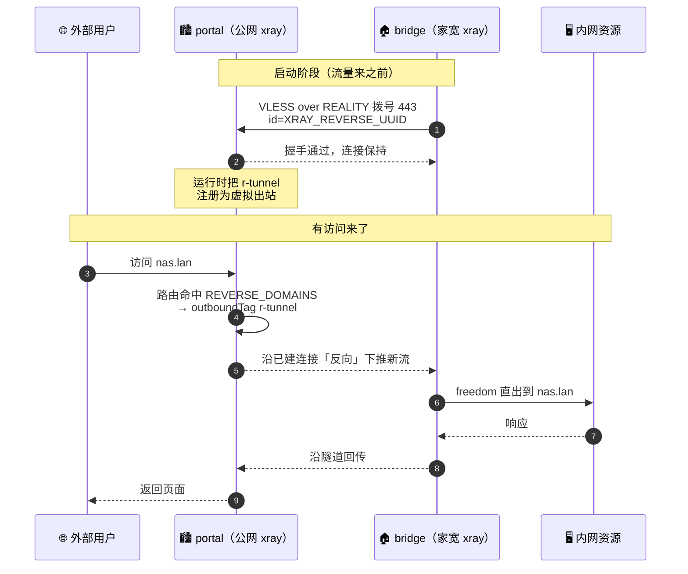
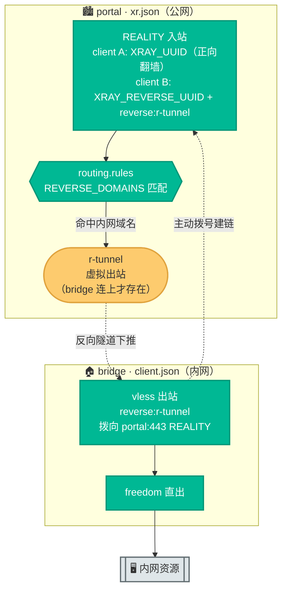
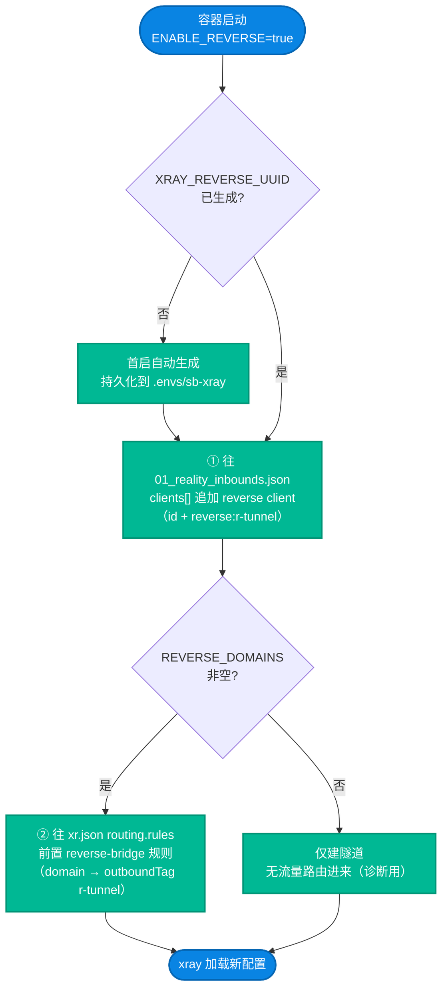

# 05. VLESS Reverse Proxy 内网穿透：设计、实现与部署

把家里的路由器 / NAS / 本地 Web 服务，通过 sb-xray 公网节点**反向暴露**到外网——零公网 IP、零端口映射、复用已有的 REALITY 通道。本文把 reverse 这套机制**从原理讲到代码**：新手能照着部署，工程师能看懂内核为什么这么设计。

> **本文与相邻文档的分工**
> - **本文（05）** 讲 reverse 机制**本身**：portal / bridge 角色、连接为何反向建立、`r-tunnel` 虚拟出站、双 UUID 安全边界，以及**内网穿透**的端到端部署。它是 [08](./08-xray-reverse-bridge.md) 的理论基础。
> - [08. Xray Reverse Bridge 回国架构](./08-xray-reverse-bridge.md) 讲**用同一条 reverse 隧道做「海外回国」**：`CN_EXIT_MODE` 开关、`geosite:cn` 分流、balance 主备故障转移。
> - 一句话：**05 讲隧道怎么来的，08 讲隧道拿来回国**。两者共用 `ENABLE_REVERSE` 与 `r-tunnel`。

---

## 阅读约定：三种信息块

| 图标 | 含义 | 给谁看 |
|---|---|---|
| 📘 **概念卡** | 一句话讲清「是什么、为什么」，零黑话 | 新手必读 |
| 🔧 **配置块** | 可复制的命令 / 配置，标注「自动」还是「需手动」 | 动手部署的人 |
| 🔬 **深挖框** | 内核机制、运行时注册、配置注入等底层细节 | 工程师，新手可跳过 |

**读者导航**：
- **只想内网穿透** → §0（场景）→ §4（部署）→ §5（验证）
- **想搞懂原理** → §1（概念）→ §2（官方设计）→ §3（本项目实现）

---

## 0. 适用场景

📘 reverse 解决一个老问题：**内网里的服务，想在公网访问，但你没有公网 IP**。典型场景：

- 家里跑了 **NAS / Home Assistant / 软路由 Web 界面 / 私有 Git**，出门想访问，但家宽是运营商大内网（NAT 后无公网 IP）。
- 已有一台 sb-xray 公网节点（`vpn.example.com`），不想再单独跑 **frp / cloudflared tunnel / ngrok**，多一套就多一套运维。
- 希望**外部访问流量直接走已有的 REALITY 隧道**——不开新端口、不暴露家宽真实 IP、不增加被探测面。

> 📘 **同一条隧道的另一种玩法**：reverse 隧道既能「把内网服务暴露出去」（本文），也能「把国内流量送回家直出」做海外回国（[08](./08-xray-reverse-bridge.md)）。底层都是这一条 `r-tunnel`，区别只在 portal 的路由规则把哪些流量丢进去。

---

## 1. 核心概念

### 1.1 portal / bridge / 反向隧道

📘 两个角色：

- **portal（门户）** 在公网——就是你的 sb-xray 容器。它接收外部客户端、做路由判断。
- **bridge（桥）** 在内网——家里一台能跑 xray 的机器（软路由 / NAS / 小主机）。

bridge **主动**连向 portal，二者之间形成一条带标签的长连接隧道。portal 上凡是被路由到这个标签的流量，都会被「反向」推到 bridge 那一侧，由 bridge 就近出站。本项目里这条隧道的标签固定叫 **`r-tunnel`**。



| 角色 | 位置 | 职责 | 关键点 |
|---|---|---|---|
| **portal** | 公网 sb-xray 容器 | 接收客户端，按域名把流量送进 `r-tunnel` | `ENABLE_REVERSE=true` + `REVERSE_DOMAINS` |
| **bridge** | 家宽内网机器 | 主动拨向 portal 建隧道；隧道来的流量 freedom 直出 | 跑 `xray -c client.json`，只需能出站访问 portal 443 |

### 1.2 为什么是 bridge 主动拨号（NAT 穿透原理）

📘 家宽通常在运营商 NAT 后面、没有公网 IP，**公网无法主动连进来**。frp / cloudflared 的思路也一样：让内网那台机器**主动**向公网建一条连接，之后双向流量都复用这条已建好的连接。

reverse 正是这个套路：能出站的一方（bridge）主动连公网的一方（portal），握手成功后，**这条连接既能上行也能下行**。portal 想把流量发给内网，不需要新发起连接（它做不到），而是顺着这条已存在的连接「反向」推回去。

> 📘 **这就是「零公网 IP / 零端口映射」的根本原因**——所有 TCP 连接的发起方永远是 bridge，家宽只需要能**出**443，不需要在路由器上开任何入站端口。

### 1.3 和「正向翻墙」有什么不同

📘 正向代理（平时翻墙）：你的设备 → VPS → 国外网站，方向是「出去」。reverse 是反过来：外部用户 → portal →（反向隧道）→ bridge → 内网资源，方向是「进来」。同一台 sb-xray 两件事互不干扰——普通客户端照常翻墙，reverse 客户端只走隧道。

---

## 2. 官方设计与机制

> 能力来自 Xray-core 的 **VLESS 原生 reverse**：v25.10.15（[PR #5101](https://github.com/XTLS/Xray-core/pull/5101)，[commit 12f4a014](https://github.com/XTLS/Xray-core/commit/12f4a014)）引入；v25.12.8（[commit a83253f](https://github.com/XTLS/Xray-core/commit/a83253f)）加上安全边界；v26.3.27（[#5837](https://github.com/XTLS/Xray-core/pull/5837)）补 sniffing。**bridge 端 Xray 版本需 ≥ v25.10.15**，要 sniffing 精细路由则需 ≥ v26.3.27。

### 2.1 一条连接，双向走流量

🔬 reverse 不是「再开一个反向端口」，而是把反向能力**内建进 VLESS 协议**：portal 的某个 client 被标记 `reverse: {tag: "r-tunnel"}` 后，当 bridge 用这个身份拨上来，内核就把这条连接登记为隧道的「下推通道」。之后路由到 `r-tunnel` 的流量，会被**复用这条已存在的连接**多路下推到 bridge。



📘 **新手版**：bridge 先「敲门」并把门一直开着；外部用户来访问时，portal 顺着这扇开着的门把请求塞给 bridge，bridge 在家里把活干完再原路送回。

### 2.2 `r-tunnel` 是「虚拟出站」（运行时注册）

🔬 在 portal 的 `xr.json` 里**你找不到**一个 `tag: "r-tunnel"` 的 outbound——它不是静态写死的。portal 的 REALITY 入站里挂了一个带 `reverse: {tag: "r-tunnel"}` 的 client；当 bridge 用这个 UUID 连上来，Xray 内核在**运行时**把 `r-tunnel` 注册成一个可被路由引用的虚拟出站。

这带来一个关键含义：路由规则写 `outboundTag: "r-tunnel"` 能生效，**但前提是 bridge 已经连上**。bridge 没连上时，`r-tunnel` 不存在，命中它的流量会失败。这点对 [08](./08-xray-reverse-bridge.md) 的 balance 主备模式尤其重要（observatory 探测 `r-tunnel` 存活、断了切备路）。



### 2.3 双 UUID 安全边界

📘 portal 上有**两个**独立 UUID：

| UUID | 用途 | 能否当正向代理上网 |
|---|---|---|
| `XRAY_UUID` | 给普通翻墙客户端 | ✅ 能 |
| `XRAY_REVERSE_UUID` | **只给 reverse 隧道用** | ❌ 禁止 |

🔬 Xray v25.12.8（[commit a83253f](https://github.com/XTLS/Xray-core/commit/a83253f)）起，**带 `reverse` 标记的 UUID 默认禁止用作正向代理**。所以拿到反向隧道凭据的 bridge 不能反过来拿它当普通节点蹭流量、滥用家宽出口——安全边界由内核保证。

> ⚠️ **两个 UUID 必须独立，不能合并成一个。** sb-xray 容器首启时自动生成 `XRAY_REVERSE_UUID` 并持久化到 `.envs/sb-xray`，无需手填，也**不要**把它设成与 `XRAY_UUID` 相同。

### 2.4 bridge 出站必须用「扁平 simplified 格式」

🔬 这是部署时最容易踩的坑。bridge 的 VLESS 出站**必须用扁平化 simplified 格式**（地址 / 端口 / id 直接写在 `settings` 里），**嵌套的 `vnext` / `servers` 格式会被内核静默忽略**——隧道连不上还不报错。本项目的 `templates/reverse_bridge/client.json` 已用正确格式，照模板即可：

```jsonc
{
  "protocol": "vless",
  "tag": "reverse-bridge",
  "settings": {
    "address": "vpn.example.com",   // 扁平：直接写在 settings
    "port": 443,
    "id": "<XRAY_REVERSE_UUID>",
    "flow": "xtls-rprx-vision",
    "encryption": "none",
    "reverse": { "tag": "r-tunnel" } // 这一行让它成为 bridge 出站
  }
}
```

> 🔬 **REALITY 密钥沿用同一对**：bridge 的 `publicKey` / `shortId` 直接用 portal 现有的 REALITY 参数，**不需要**为 reverse 单独再生成一对 key。

### 2.5 sniffing：对穿透流量做精细路由

🔬 Xray v26.3.27（[#5837](https://github.com/XTLS/Xray-core/pull/5837)）给 reverse 流量加了 sniffing，portal 能对穿透流量做 http / tls 嗅探后再按域名路由。对纯内网穿透通常用不到（域名匹配在 `REVERSE_DOMAINS` 已完成），但它让「同一条隧道既穿透又回国分流」成为可能——这是 [08](./08-xray-reverse-bridge.md) 回国分流能精确到 `geosite:cn` 的底层支撑之一。

---

## 3. 本项目的实现

📘 你不需要手写任何 reverse 配置——portal 侧由容器 entrypoint 自动注入，bridge 侧由 `show` 渲染出可直接用的 `client.json`。本节讲清「自动」背后做了什么，便于排障。

### 3.1 portal 侧：启动时自动注入（`config_builder.py`）

🔬 `ENABLE_REVERSE=true` 时，渲染 `xr.json` / `01_reality_inbounds.json` 的过程里会跑 `_apply_reverse_proxy()`，做两件事：



**① 追加 reverse client**（`_inject_reverse_client`）——往 REALITY 入站的 `clients[]` 里**追加**（不替换，保留主 client）一条：

```jsonc
{
  "id": "<XRAY_REVERSE_UUID>",
  "level": 0,
  "email": "reverse@portal.bridge",
  "flow": "xtls-rprx-vision",
  "reverse": { "tag": "r-tunnel" }
}
```

**② 前置路由规则**（`_inject_reverse_route`，仅当 `REVERSE_DOMAINS` 非空）——把规则**插到 `routing.rules` 最前面**，确保优先级高于 geoip/geosite 兜底：

```jsonc
{
  "type": "field",
  "ruleTag": "reverse-bridge",
  "domain": ["domain:home.lan", "domain:nas.lan"],
  "outboundTag": "r-tunnel"
}
```

> 🔬 **设计要点**：只在 `ENABLE_REVERSE=true` 时改 JSON，默认路径完全不碰 REALITY / xr.json，**零回归**。client 用追加而非替换，保留 `XRAY_UUID` 主通道；域名规则前置插入，保证命中优先级。

> 🔬 **回国分流是另一条注入路径**：`CN_EXIT_MODE=reverse`/`balance` 时，由 `_apply_cn_exit()` 把 `geosite:cn` / `geoip:cn` 规则改写到同一个 `r-tunnel`（详见 [08 §2.2](./08-xray-reverse-bridge.md)）。所以 `r-tunnel` 上可能同时有「内网穿透」和「回国」两类流量，互不冲突。

### 3.2 bridge 侧：模板逐段剖析（`templates/reverse_bridge/client.json`）

🔬 bridge 配置只有三块，分流逻辑全在 portal，bridge 只管「隧道进、freedom 出」：

| 块 | 作用 |
|---|---|
| **inbounds** | 一个 `dokodemo-door` api 入站（`127.0.0.1:7979`），仅供本机看连接状态 / 多节点端口错开，不接业务流量 |
| **outbounds** | ① `reverse-bridge`：VLESS over REALITY 拨向 portal，带 `reverse:r-tunnel`；② `direct`：freedom 直出 |
| **routing** | 唯一一条规则 `inboundTag:["r-tunnel"] → direct`——隧道进来的流量一律 freedom 直出 |

> 🔬 **路由的 `inboundTag` 是 `r-tunnel`**：从 portal 反向下推的流量，在 bridge 这侧表现为「以 `r-tunnel` 为入站标签的连接」，所以规则匹配 `inboundTag`（不是 outboundTag）。早期版本这里写错过，会导致流量进来后无规则匹配、直接丢弃。

### 3.3 占位符与一键渲染

🔧 bridge 模板里有 6 个 `${...}` 占位符，由 portal 自动填好：

| 占位符 | 来源 |
|---|---|
| `${XRAY_REVERSE_UUID}` | 容器首启生成 |
| `${DOMAIN}` | portal 域名 |
| `${DEST_HOST}` / `${XRAY_REALITY_PUBLIC_KEY}` / `${XRAY_REALITY_SHORTID}` | portal 的 REALITY 参数 |
| `${LISTENING_PORT}` | api 入站端口 |

`docker exec sb-xray show` 会渲染出一份**占位符已全部填充**的 `reverse_bridge_client.json`，并给出带 token 的下载链接——bridge 直接 wget 即可，不必手抄参数（手抄最易把 UUID / publicKey 抄错）。

---

## 4. 部署教程（内网穿透）

> 想用这条隧道做**海外回国**而非内网穿透，请直接看 [08 §4](./08-xray-reverse-bridge.md)（`CN_EXIT_MODE` + 一键脚本）。本节只讲内网穿透。

### 4.1 portal 启用（公网 sb-xray）

🔧 改 `docker-compose.yml`：

```yaml
services:
  sb-xray:
    environment:
      # ... 已有变量 ...
      - ENABLE_REVERSE=true
      - REVERSE_DOMAINS=domain:home.lan,domain:nas.lan,domain:router.lan
```

- `ENABLE_REVERSE=true` 触发上面 §3.1 的注入逻辑。
- `REVERSE_DOMAINS` 逗号分隔，支持 `domain:` / `full:` / `geosite:` 前缀，命中才走隧道。
  - 留空也能用：隧道会建立但没有流量路由进来（**诊断用**，确认 bridge 能连上 portal）。

重启容器：

```bash
docker compose up -d --force-recreate
```

### 4.2 拿 bridge 配置下载链接

🔧 portal 已渲染好完整 bridge 配置，运行 `show` 取链接：

```bash
docker exec sb-xray show
# 输出里找「🔁 Reverse Bridge 落地机配置」一行，下面是带 token 的下载地址：
# https://<你的域名>/sb-xray/reverse_bridge_client.json?token=<SUBSCRIBE_TOKEN>
```

### 4.3 bridge 部署（家宽内网机器）

🔧 **下载已渲染配置**（占位符已填好）：

```bash
wget "https://<你的域名>/sb-xray/reverse_bridge_client.json?token=<SUBSCRIBE_TOKEN>" \
     -O /etc/xray/client.json
grep '\${' /etc/xray/client.json   # 无输出 = 占位符全部填好
```

> 🔧 **离线 / 不想用 token 时**：从仓库 `templates/reverse_bridge/client.json` 复制原始模板，再用 portal 导出的 6 个值手动替换占位符：
> ```bash
> docker exec sb-xray bash -c '. /.env/sb-xray; env | grep -E "DOMAIN|LISTENING_PORT|DEST_HOST|XRAY_REVERSE_UUID|XRAY_REALITY_PUBLIC_KEY|XRAY_REALITY_SHORTID"'
> ```

🔧 **前台测试**：

```bash
xray run -c /etc/xray/client.json
```

🔧 **正式部署用 systemd**：

```ini
# /etc/systemd/system/xray-reverse-bridge.service
[Unit]
Description=Xray Reverse Bridge (sb-xray)
After=network-online.target

[Service]
ExecStart=/usr/local/bin/xray run -c /etc/xray/client.json
Restart=always
RestartSec=5
LimitNOFILE=65535

[Install]
WantedBy=multi-user.target
```

```bash
systemctl daemon-reload
systemctl enable --now xray-reverse-bridge
journalctl -u xray-reverse-bridge -f
```

> 📘 **OpenWrt 用户**：本项目仓库 `sources/openwrt/cn-exit-setup.sh` 已把「装 xray + 拉配置 + 写 `/etc/init.d/xray-bridge` 开机自启」固化成幂等脚本（详见 [sources/openwrt/README.md](../sources/openwrt/README.md)）。

看到 `[Info] app/reverse: got connection` 类日志即建立成功。

---

## 5. 验证

### 5.1 portal 侧看连接建立

```bash
docker exec sb-xray tail -f /var/log/xray/access.log | grep -i reverse
```

bridge 刚连上时会看到类似：

```
from 1.2.3.4:xxx accepted reverse [REALITY_IN -> r-tunnel] email: reverse@portal.bridge
```

### 5.2 端到端

在外网机（非家宽网络）走 portal 的 socks5 代理访问 `REVERSE_DOMAINS` 里的任意域名：

```bash
curl -x socks5h://<sb-xray-socks5>:1080 http://nas.lan/
```

应返回内网 NAS 的页面。

### 5.3 故障告警（可选）

🔧 bridge 断线时，portal 侧 observatory 会在约 1 分钟内标记隧道 dead。配合事件总线（见 [06](./06-event-bus-shoutrrr.md)），可在 `xr.json` 追加一条 webhook 规则，命中流量失败时推送到 shoutrrr：

```json
{
  "type": "field",
  "ruleTag": "reverse-down",
  "outboundTag": "r-tunnel",
  "webhook": {
    "url": "http://127.0.0.1:18085/reverse_down",
    "deduplication": 300,
    "headers": {"X-Event": "reverse_tunnel_event"}
  }
}
```

---

## 6. 故障排查

### 6.1 bridge 一直连不上

| 症状 | 排查 |
|---|---|
| `REALITY: processed invalid connection` | UUID / shortId 填错——优先用 §4.2 的 `show` 链接重新下载，避免手抄 |
| `tls: handshake failure` | `XRAY_REALITY_PUBLIC_KEY` 填错，或 portal 侧 `DEST_HOST` 不一致 |
| `i/o timeout` | 家宽禁出 443？先 `curl -v https://vpn.example.com:443` 确认能出站 |
| `server rejects account` | bridge 的 UUID 与 portal 的 `XRAY_REVERSE_UUID` 不一致 |
| 连上但无流量 | 隧道用了**嵌套 `vnext` 格式**会被静默忽略——确认 bridge 出站是 §2.4 的扁平格式 |

### 6.2 portal 命中规则但不走 reverse

1. 确认路由规则已注入且靠前：
   ```bash
   docker exec sb-xray cat /sb-xray/xray/xr.json | jq '.routing.rules[0]'
   # 期望看到 ruleTag=reverse-bridge, outboundTag=r-tunnel
   ```
2. 确认 reverse client 已注入：
   ```bash
   docker exec sb-xray cat /sb-xray/xray/01_reality_inbounds.json | jq '.inbounds[0].settings.clients'
   # 期望第二个 client 带 reverse:{tag:r-tunnel}，且 id = XRAY_REVERSE_UUID
   ```
3. 确认 **bridge 已连上**——`r-tunnel` 是运行时虚拟出站（§2.2），bridge 没连上它就不存在，命中规则的流量会失败。

### 6.3 安全边界相关

📘 若把 `XRAY_REVERSE_UUID` 误设成与 `XRAY_UUID` 相同，或想拿 reverse UUID 当普通节点翻墙——内核会拒绝（§2.3）。两个 UUID 必须独立，entrypoint 已自动分别生成。

---

## 7. 关闭 reverse

🔧 改 `docker-compose.yml`：

```yaml
- ENABLE_REVERSE=false
```

重启容器后，entrypoint 下次渲染从原始模板出发（不再注入 reverse client），`01_reality_inbounds.json` / `xr.json` 里的孤儿条目会被覆盖清理。

bridge 端无需特殊处理，它会持续重试连接并失败——自行 `systemctl stop xray-reverse-bridge`（或 OpenWrt `/etc/init.d/xray-bridge stop`）即可。

---

## 8. 附录

### 8.1 与「海外回国」的关系

📘 同一条 `r-tunnel` 隧道两种用途，**可同时开**：

| 用途 | portal 配置 | 路由规则 | 文档 |
|---|---|---|---|
| **内网穿透**（本文） | `REVERSE_DOMAINS=domain:nas.lan,…` | 命中内网域名 → `r-tunnel` | 05 |
| **海外回国** | `CN_EXIT_MODE=reverse`/`balance` | `geosite:cn` / `geoip:cn` → `r-tunnel` | [08](./08-xray-reverse-bridge.md) |

两者都经同一条隧道、同一个 `XRAY_REVERSE_UUID`、同一个 bridge 进程——`geosite:cn` 走回国、`REVERSE_DOMAINS` 列出的内网域名走穿透，互不干扰。

### 8.2 术语速查

| 术语 | 含义 |
|---|---|
| portal | 公网一侧（sb-xray 容器），接收客户端、做路由判断 |
| bridge | 内网一侧（家宽机器），主动拨号建隧道、freedom 直出 |
| `r-tunnel` | reverse 隧道的标签 / portal 上的虚拟出站（运行时注册） |
| `XRAY_REVERSE_UUID` | reverse 隧道专用 UUID，与正向代理 UUID 隔离 |
| `XRAY_UUID` | 普通翻墙客户端用的正向代理 UUID |
| `REVERSE_DOMAINS` | 走 reverse 隧道做内网穿透的域名匹配列表 |
| simplified 格式 | bridge 出站必须用的扁平 VLESS 格式（地址/端口/id 直接写在 settings） |
