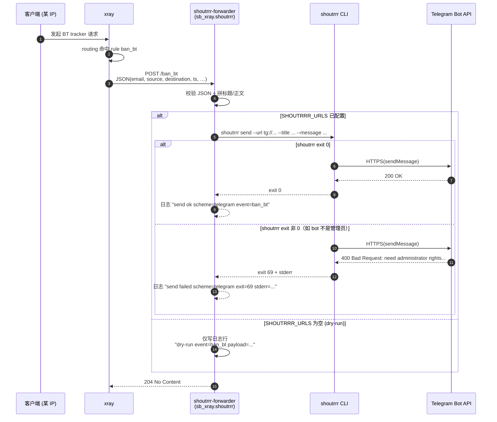

# 事件总线：Xray webhook → shoutrrr 多通道通知

> **状态**：stable（v26.3.27+）
> **适用读者**：想在 Telegram / Discord / Slack / Gotify 实时收到"谁被 ban / 谁踩 BT / 谁走私网 IP"告警的运维用户
> **预计阅读**：7 分钟；**最小上手**：5 分钟（含 bot 提管理员）

## 目录

1. [它做什么](#1-它做什么)
2. [一次事件的完整链路](#2-一次事件的完整链路)
3. [最小配置](#3-最小配置)
4. [环境变量对照表](#4-环境变量对照表)
5. [快速开始：5 分钟接通 Telegram](#5-快速开始5-分钟接通-telegram)
6. [URL 语法速查](#6-url-语法速查)
7. [故障排查速查表](#7-故障排查速查表)
8. [事件 payload 字段说明](#8-事件-payload-字段说明)
9. [进阶：降噪 / 多通道 / 低内存关闭](#9-进阶降噪--多通道--低内存关闭)
10. [诊断命令集（一页速查）](#10-诊断命令集一页速查)
11. [延伸阅读](#11-延伸阅读)

---

## 1. 它做什么

```
         ┌─────────────────────────────────────────────────────────────────┐
         │                       sb-xray 容器内部                            │
         │                                                                  │
         │   ┌──────────┐  命中 ban 规则   ┌─────────────────────┐          │
         │   │   xray   │ ────webhook────► │ shoutrrr-forwarder   │          │
         │   │  (26.x)  │   HTTP POST      │  监听 127.0.0.1:18085│          │
         │   └──────────┘   + JSON payload └──────────┬──────────┘          │
         │        ▲                                    │                    │
         │        │ 用户客户端流量                       │ subprocess         │
         │   ┌────┴─────┐                              ▼                    │
         │   │ 你的用户 │                      ┌──────────────┐             │
         │   └──────────┘                      │ shoutrrr CLI │             │
         │                                     └──────┬───────┘             │
         └────────────────────────────────────────────┼─────────────────────┘
                                                      │ HTTPS
                 ┌────────────────┬───────────────────┼───────────────────┐
                 ▼                ▼                   ▼                   ▼
          ┌───────────┐    ┌───────────┐       ┌───────────┐       ┌──────────┐
          │ Telegram  │    │  Discord  │       │   Slack   │       │  Gotify  │
          │   bot     │    │  webhook  │       │  webhook  │       │  server  │
          └───────────┘    └───────────┘       └───────────┘       └──────────┘
```

**一句话解释**：当有人用你的 VPS 跑 BT、访问广告域、或被 GeoIP CN 规则命中时，Xray 会把"这是谁、从哪儿、到哪儿"一条条推给 forwarder，forwarder 再把消息转发到你的手机 / 群组 / 值班群。

**关键特性：**

- 不配置 `SHOUTRRR_URLS` 也能跑 —— 进入 **dry-run**，事件只进容器日志，不外发。
- 只绑定 `127.0.0.1`，容器外无法访问，不需要开放任何端口。
- 多通道并发 —— 同一条事件可以同时发 Telegram + Discord + 公司 Slack。
- 低内存 VPS 可一键关闭（`ENABLE_SHOUTRRR=false`），`trim` 阶段直接剔除进程。
- 失败透明化 —— shoutrrr 子进程的 exit code 和 stderr 都会被写进 forwarder 日志（token 不泄露），不再"静默 204"。

---

## 2. 一次事件的完整链路



> **204 ≠ 通知送达**。forwarder 返回 204 只表示"事件被接收并已尝试转发"；shoutrrr 子进程的真正结果要看 `shoutrrr-forwarder.out.log` 里的 `send ok` / `send failed` 行。

---

## 3. 最小配置

仓库自带 `docker-compose.yml` 的 `environment:` 段已预置以下三行，**默认 `SHOUTRRR_URLS=` 留空走 dry-run**；想接通时按下面这个**已编码好的示例**把 `SHOUTRRR_URLS=` 后面填上即可：

```yaml
services:
  sb-xray:
    environment:
      # 留空 = dry-run；多通道用英文分号 ";" 分隔
      - SHOUTRRR_URLS=telegram://123456789%3AABCdef...xyz@telegram?chats=-1001234567890
      # 标题前缀；$domain 与顶部 DOMAIN=$domain 同源，由宿主 shell 或 .env 导出节点域名
      - SHOUTRRR_TITLE_PREFIX=[sb-xray:$domain]
      # 监听端口（127.0.0.1 内部绑定，无需开放外网）
      - SHOUTRRR_FORWARDER_PORT=18085
```

> **示例里的两个关键变量**（两处必须按自己的值替换）：
> - `123456789%3AABCdef...xyz` — 你的 **BOT_TOKEN**。原 token 里的 `:` 必须 URL-encode 成 `%3A`；详细来由见 §5 第 5 步和 §6.1
> - `-1001234567890` — 你的 **chat.id**（私有频道/群组是负数，`-100` 前缀；公开频道可直接写 `my_channel` 不带 `@`）；获取方式见 §5 第 3 步

改完后**必须重建容器**（不是 restart）：

```bash
docker compose up -d sb-xray --force-recreate
docker logs sb-xray 2>&1 | grep shoutrrr-forwarder | tail -3
# 期望：[shoutrrr-forwarder] listening on 127.0.0.1:18085 urls=1
```

> **为什么必须 `--force-recreate`**：supervisord 在容器启动时把 env 变量插入到 `[program:shoutrrr-forwarder]` 的 `environment=` 行（通过 `%(ENV_*)s` 插值），`supervisorctl restart shoutrrr-forwarder` 只重启**子进程**，读到的仍是**旧的** env 快照。只有整容器重建才会重新渲染 supervisord 配置。

---

## 4. 环境变量对照表

| 变量 | 必填？ | 默认 | 说明 | 示例 |
|------|--------|------|------|------|
| `SHOUTRRR_URLS` | 否（空 = dry-run） | `""` | 分号分隔的 shoutrrr URL 列表 | `telegram://...;discord://...` |
| `SHOUTRRR_FORWARDER_PORT` | 否 | `18085` | forwarder 监听端口（仅 127.0.0.1 绑定，无需开放外网） | `18085` |
| `SHOUTRRR_TITLE_PREFIX` | 否 | `[sb-xray]` | 推送消息的标题前缀 | `[sb-xray-jp01]` |
| `ENABLE_SHOUTRRR` | 否 | `true` | 低内存部署（≤ 512MB）可设为 `false` 让 trim 阶段整块移除 forwarder program（节省约 30MB RSS） | `true` / `false` |

> **这是唯一真相来源**。`readme.md` / `CHANGELOG.md` / `docker-compose.yml` 里的默认值均应与本表一致，如发生分歧以本表为准。

### 4.1 `SHOUTRRR_TITLE_PREFIX` 里的 shell 变量展开

docker-compose 对 `$VAR` / `${VAR}` 做**宿主 shell / `.env` 替换**，替换后再注入容器。本仓库约定（见 `docker-compose.yml` 顶部 `DOMAIN=$domain` / `CDNDOMAIN=$cdndomain` / `ACMESH_EAB_*=$...`）就是**用宿主 shell 变量传节点身份**，所以：

```yaml
# ✓ 推荐：复用仓库约定里已导出的 $domain，通知标题自带节点域名
- SHOUTRRR_TITLE_PREFIX=[sb-xray:$domain]
# ✓ 也可：纯字面量，多节点时手动区分
- SHOUTRRR_TITLE_PREFIX=[sb-xray-jp01]
```

**前置条件**：`$domain` 必须在 `docker compose up` 所在的 shell 环境或同目录的 `.env` 文件里定义，否则展开为空，标题会变成 `[sb-xray:]`。验证：

```bash
# 宿主机检查
echo "$domain"                                    # 应输出真实域名
# 容器内检查（up 之后）
docker exec sb-xray env | grep -E '^(DOMAIN|SHOUTRRR_TITLE_PREFIX)='
```

**需要字面量 `$`** 的话（极少见，如标题里真想写出 `$foo`）：在 compose 里用 `$$` 转义：

```yaml
- SHOUTRRR_TITLE_PREFIX=$$literal     # 最终值：$literal
```

---

## 5. 快速开始：5 分钟接通 Telegram

> **端到端最小路径**。其他通道（Discord / Slack / Gotify）替换 URL 即可，见 §6。
>
> 这节包含本次真实排查踩过的**所有**坑，按顺序操作可一把过。

### 第 1 步：创建 Telegram bot（30 秒）

1. 在 Telegram 里搜 `@BotFather`
2. 发 `/newbot` → 按提示给 bot 起名 → 拿到形如 `123456789:AAEabc...xyz` 的 **BOT_TOKEN**（注意**有冒号**）
3. 记住 token —— 关掉对话就看不到了，忘了只能 `/token` 重发或 `/revoke`

### 第 2 步：创建频道 / 群组，把 bot 拉进去（1 分钟）

**创建**：

- **公开频道**：有 `@username`，直接用 `@username` 作为 chat；无需拿 chat.id
- **私有频道 / 群组**：必须先拿 chat.id（第 3 步）

**把 bot 拉进去后 ⚠️ 必须做两件事**（**本次真实踩坑**）：

1. 进频道 → **管理员**（Administrators）→ **添加管理员**
2. 搜你的 bot → 添加 → 权限里**勾上 "发送消息"（Post Messages）**

> ❗ **仅作为成员加入频道是不够的**。Telegram 频道里，bot 必须是管理员且带"发送消息"权限，否则 shoutrrr 会得到 `Bad Request: need administrator rights in the channel chat`（exit 69），forwarder 会 204，但频道里什么都看不到。
>
> **超级群（Supergroup）同理**，普通群则只需 bot 在群内即可。

### 第 3 步：拿到 chat.id（私有频道 / 群组专用）

```
浏览器打开 https://api.telegram.org/bot<BOT_TOKEN>/getUpdates
```

**先在群 / 频道里发任意一条消息**，然后刷新上面的 URL，从 JSON 里找 `chat.id`：

```json
{
  "result": [{
    "channel_post": {
      "chat": { "id": -1001234567890, "title": "My Alerts", "type": "channel" }
    }
  }]
}
```

`-1001234567890` 就是 chat.id。**特征：**

- **负数 + `-100` 前缀** = 超级群 / 频道（绝大多数情况）
- **负数（不带 `-100`）** = 普通群
- **正数** = 私聊 chat.id（**不是**你要的）

### 第 4 步：处理 getUpdates 409 冲突（可选）

如果访问上面的 URL 返回：

```json
{"ok":false,"error_code":409,
 "description":"Conflict: can't use getUpdates method while webhook is active;
                use deleteWebhook to delete the webhook first"}
```

说明这个 bot 之前被某个 webhook 服务（n8n / IFTTT / 自建 webhook）占用了。选一条：

- **这个 bot 不再给 webhook 服务用** → 浏览器打开 `https://api.telegram.org/bot<BOT_TOKEN>/deleteWebhook` 清掉
- **这个 bot 还要给其他服务用** → BotFather 新建一个 bot 专给 sb-xray 用，职责分离更清晰

### 第 5 步：组装 URL

**`BOT_TOKEN` 里的冒号 `:` 必须 URL-encode 成 `%3A`**（否则 shoutrrr 会把冒号当"用户名:密码"解析）：

```
原 BOT_TOKEN：   123456789:AAEabc...xyz
URL 里写作：     123456789%3AAAEabc...xyz
```

最终 URL：

```
telegram://123456789%3AAAEabc...xyz@telegram?chats=-1001234567890
```

其中：

- `telegram://` — 固定协议头
- `123456789%3AAAEabc...xyz` — **BOT_TOKEN**（冒号已编码）
- `@telegram?chats=` — 固定字面量
- `-1001234567890` — **chat.id**（私有）或 `my_channel`（公开，不带 `@`）

### 第 6 步：写入 `docker-compose.yml` 并重建

```yaml
- SHOUTRRR_URLS=telegram://123456789%3AAAEabc...xyz@telegram?chats=-1001234567890
- SHOUTRRR_TITLE_PREFIX=[sb-xray-cn2]
```

```bash
docker compose up -d sb-xray --force-recreate
```

### 第 7 步：两步验证

```bash
# A. 直接调 shoutrrr CLI（绕过 forwarder，最快暴露真实错误）
docker exec sb-xray sh -c 'shoutrrr send --url "$SHOUTRRR_URLS" \
  --title "[sb-xray] cli-test" --message "hello"; echo "exit=$?"'
# 期望：exit=0 + Telegram 立刻收到 "hello"
# 常见失败：
#   exit=69 "need administrator rights" → bot 权限问题，回第 2 步
#   exit=69 "chat not found"            → chat.id 错，回第 3 步
#   exit=非 0 "invalid character"       → BOT_TOKEN 冒号未 URL-encode，回第 5 步

# B. 验证 forwarder 链路（容器内部 POST）
docker exec sb-xray curl -sS -o /dev/null -w 'http=%{http_code}\n' \
  -X POST -H 'X-Event: manual.test' \
  -d '{"email":"demo","source":"198.51.100.42"}' \
  http://127.0.0.1:18085/test
# 期望：http=204 + Telegram 收到 "[sb-xray-cn2] manual.test" + 正文带 email/source

# C. 看 forwarder 日志确认是 send ok 而非 send failed
docker exec sb-xray tail -n 5 /var/log/supervisor/shoutrrr-forwarder.out.log
# 期望含：[shoutrrr-forwarder] send ok scheme=telegram event=manual.test
```

---

## 6. URL 语法速查

所有全大写 `占位符` 都是变量；其他字符是固定语法。

### 6.1 Telegram

```
telegram://BOT_TOKEN@telegram?chats=CHAT_ID
```

| 占位符 | 从哪里拿 | 示例 | 注意 |
|--------|---------|------|------|
| `BOT_TOKEN` | BotFather `/newbot` 返回值 | `123456789%3AAAEabc...xyz` | **冒号编码为 `%3A`** |
| `CHAT_ID` | 公开频道 `@name` 或 `name`；私有用 `getUpdates` | `my_channel` 或 `-1001234567890` | 私有必为负数 |

多 chat（同一 bot 发多个目标，逗号分隔）：

```
telegram://TOKEN@telegram?chats=-100123,-100456,@public_channel
```

### 6.2 Discord（基于 webhook）

Discord webhook URL 格式：

```
https://discord.com/api/webhooks/987654321098765432/aBc-DeF_gHi...789AbCdEf
                                 └───────┬────────┘ └──────────┬──────────┘
                                    WEBHOOK_ID                TOKEN
```

对应 shoutrrr URL：

```
discord://TOKEN@WEBHOOK_ID
```

具体写：

```
discord://aBc-DeF_gHi...789AbCdEf@987654321098765432
```

### 6.3 Slack / Gotify / 其他 20+ 通道

语法大全：<https://containrrr.dev/shoutrrr/v0.8/services/overview/>

### 6.4 多通道同时推

`SHOUTRRR_URLS` 内部用**分号** `;` 分隔（这是 sb-xray forwarder 的约定，**不是** shoutrrr 的），每条 URL 并发调用——和 §3 的单通道写法是叠加关系，想同时推给 Telegram + Discord + Gotify 就在原 URL 后追加：

```yaml
- SHOUTRRR_URLS=telegram://123456789%3A...@telegram?chats=-1001234567890;discord://aBc-DeF_...cDeF@987654321098765432;gotify://gotify.example.com/TOKEN3
```

**删除某条通道**直接移除对应段（连同分隔符 `;`）即可。某条通道挂掉不影响其他通道（§9.2 容错）。

> 注意：`telegram://` URL **内部**的 `chats=` 参数用**逗号** `,` 分隔多 chat。不要搞混。

---

## 7. 故障排查速查表

### 7.1 Symptom → 根因（高频）

| 现象 | 最可能根因 | 定位命令 | 修法 |
|------|----------|---------|------|
| **forwarder 返回 204，Telegram 什么都没收到** | bot 不是频道管理员 / 没"发送消息"权限 | `docker exec sb-xray sh -c 'shoutrrr send --url "$SHOUTRRR_URLS" --title t --message m; echo $?'` 看是否 `exit=69 + need administrator rights` | §5 第 2 步，补管理员权限 |
| 日志 `urls=0` | `SHOUTRRR_URLS` 为空 / compose 改了没重建 | `docker exec sb-xray env \| grep SHOUTRRR_URLS` | `docker compose up -d sb-xray --force-recreate` |
| shoutrrr `exit=69 + chat not found` | chat.id 错 / 缺 `-100` 前缀 / bot 没进群 | 重跑 `getUpdates` 核对 chat.id | 用正确的 chat.id |
| shoutrrr `exit=非0 + invalid character` | `BOT_TOKEN` 冒号未 URL-encode | 检查 `$SHOUTRRR_URLS` 里是否有裸 `:`（`@` 左侧） | 把 `:` 改成 `%3A` |
| 日志里看不到 "listening on…" | forwarder 进程没起来 | `docker exec sb-xray supervisorctl status shoutrrr-forwarder` | 状态 `FATAL` 时看 `.err.log` 的 Python traceback |
| "dry-run event=…" 一直刷 | `SHOUTRRR_URLS` 为空 | 同上 | 填 URL 并 `--force-recreate` |
| 健康探针 404 | 路径错了 | `curl -s http://127.0.0.1:18085/healthz`（**只这一条**返回 200） | 用 `/healthz` 做 liveness |
| 通知过多 | Xray `webhook.deduplication` 窗口太小 | `docker exec sb-xray jq '.webhook' /sb-xray/xray/xr.json` | 调大 `window` 到 `"15m"` |
| 标题前缀变空 | compose 里用了 `$var` | `docker exec sb-xray env \| grep TITLE` | 改字面量或用 `$$var` |
| getUpdates 409 冲突 | bot 被别的 webhook 服务占用 | `https://api.telegram.org/bot<TOKEN>/getWebhookInfo` | §5 第 4 步 |

### 7.2 看懂 forwarder 日志的关键行

```
[shoutrrr-forwarder] listening on 127.0.0.1:18085 urls=1
      ↑ 启动正常；urls 数字 = 配置生效的 URL 条数

[shoutrrr-forwarder] send ok scheme=telegram event=ban_bt
      ↑ 成功。scheme 是 URL 前缀（telegram/discord/...），token 不会泄露

[shoutrrr-forwarder] send failed scheme=telegram exit=69 stderr='Bad Request: need administrator rights in the channel chat'
      ↑ shoutrrr 非零退出，exit code 和 stderr 前 400 字符原样透传

[shoutrrr-forwarder] send crashed scheme=telegram err=TimeoutExpired
      ↑ subprocess 本身崩掉（10 秒超时/网络阻塞/etc）

[shoutrrr-forwarder] dry-run event=manual.test payload={"email": "demo", ...}
      ↑ SHOUTRRR_URLS 为空走 dry-run 分支
```

---

## 8. 事件 payload 字段说明

JSON body 由 Xray v26.3.27 PR #5722 定义，forwarder 原样透传到 shoutrrr 消息正文：

| 字段 | 含义 | 示例 |
|------|------|------|
| `email` | 客户端 inbound 所挂的 UUID 标识 | `user01@vless` |
| `level` | Xray user level | `0` |
| `protocol` | 入站协议 | `vless` / `trojan` / `hy2` |
| `network` | 传输层 | `tcp` / `xhttp` / `h3` |
| `source` | 客户端源 IP:port | `198.51.100.42:51234` |
| `destination` | 命中规则的目标 | `tracker.pirate-bay:6881` |
| `routeTarget` / `outboundTag` | 命中的出站 tag | `block` / `direct` / … |
| `inboundTag` | 命中的入站 tag | `reality-443` |
| `ts` | Unix 秒时间戳 | `1745337600` |

HTTP header **`X-Event`** 标示事件类型（`ban_bt` / `ban_geoip_cn` / `ban_ads` / `private-ip`），forwarder 把它拼进通知标题。

---

## 9. 进阶：降噪 / 多通道 / 低内存关闭

### 9.1 降噪（去重窗口）

Xray 的 `webhook.deduplication` 决定"同一源同一事件多长时间只推一次"。默认 5 分钟：

```bash
docker exec sb-xray jq '.webhook' /sb-xray/xray/xr.json
# 默认：{ "deduplication": { "enabled": true, "window": "5m" } }
```

调大窗口（例如 15 分钟）：改 `templates/xray/xr.json` 里 `webhook.deduplication.window` → `"15m"`，重建容器。

### 9.2 多通道并发 + 部分失败隔离

`SHOUTRRR_URLS` 用英文**分号** `;` 分隔，每个 URL 会并发推送：

```yaml
- SHOUTRRR_URLS=telegram://T@telegram?chats=-100;discord://T@WEBHOOK;gotify://gotify.example.com/T
```

**容错**：某条通道挂掉（超时、非 2xx、bot 权限错）不会影响其他通道。forwarder 的 `shoutrrr` 子进程 10 秒超时后放弃该条，继续下一条；每条的成败都会独立记入日志（见 §7.2）。

### 9.3 低内存节点关闭 forwarder

VPS RAM ≤ 512MB 时建议关闭（节省约 30MB RSS）：

```yaml
- ENABLE_SHOUTRRR=false
```

`entrypoint.py trim` 阶段会在 `daemon.ini` 中删掉 `[program:shoutrrr-forwarder]` 整个 block，supervisord 完全不启动该进程。Xray 的 webhook 规则仍然生效，只是推送"落空"（TCP 连不上 127.0.0.1:18085，Xray 自己 swallow error）。

---

## 10. 诊断命令集（一页速查）

> 所有命令默认在 sb-xray **宿主机**执行，进容器的用 `docker exec sb-xray ...`。

```bash
# ────── 进程 & 配置 ──────
docker exec sb-xray supervisorctl status shoutrrr-forwarder
docker exec sb-xray env | grep -E 'SHOUTRRR_|ENABLE_SHOUTRRR'

# ────── 日志（含 send ok / send failed / dry-run） ──────
docker exec sb-xray tail -n 30 /var/log/supervisor/shoutrrr-forwarder.out.log
docker exec sb-xray tail -n 30 /var/log/supervisor/shoutrrr-forwarder.err.log

# ────── 健康探针 ──────
docker exec sb-xray curl -sS http://127.0.0.1:18085/healthz
# 200 + body "ok"

# ────── 直接触发一条事件（forwarder → shoutrrr 全链路） ──────
docker exec sb-xray curl -sS -o /dev/null -w 'http=%{http_code}\n' \
  -X POST -H 'X-Event: manual.test' \
  -d '{"email":"demo","source":"198.51.100.42"}' \
  http://127.0.0.1:18085/test
# http=204 即 forwarder 收到；真正是否送达看上面的日志

# ────── 绕过 forwarder 直接调 shoutrrr CLI（最快定位真实错误） ──────
docker exec sb-xray sh -c 'shoutrrr send --url "$SHOUTRRR_URLS" \
  --title "[sb-xray] cli-test" --message "hello"; echo "exit=$?"'
# exit=0 → Telegram 会收到
# exit=69 + stderr → 照 §7.1 表对照

# ────── Telegram bot 侧自查 ──────
# webhook 是否占用（409 诊断）
curl -s "https://api.telegram.org/bot<BOT_TOKEN>/getWebhookInfo" | jq
# 清掉 webhook
curl -s "https://api.telegram.org/bot<BOT_TOKEN>/deleteWebhook"
# bot 在频道里的权限
curl -s "https://api.telegram.org/bot<BOT_TOKEN>/getChatMember?chat_id=-100...&user_id=<BOT_USER_ID>" | jq
# 期望：status = "administrator" + can_post_messages = true

# ────── Xray webhook 规则是否触发 ──────
docker exec sb-xray jq '.routing.rules[] | select(.webhook)' /sb-xray/xray/xr.json
docker exec sb-xray jq '.webhook' /sb-xray/xray/xr.json  # 去重窗口配置
```

---

## 11. 延伸阅读

- **shoutrrr URL 语法**（Telegram / Discord / Slack / Gotify / Pushover / 等 20+ 通道）：<https://containrrr.dev/shoutrrr/v0.8/services/overview/>
- **Xray webhook 规则字段**（PR #5722）：<https://github.com/XTLS/Xray-core/pull/5722>
- **Telegram Bot API**（chat.id / 管理员权限字段）：<https://core.telegram.org/bots/api>
- **本功能在 sb-xray 里的实现**：
  - 模块：`scripts/sb_xray/shoutrrr.py`
  - 子命令入口：`python3 /scripts/entrypoint.py shoutrrr-forward`
  - supervisord program：`templates/supervisord/daemon.ini` 里的 `[program:shoutrrr-forwarder]`
  - 单测：`tests/test_shoutrrr.py`
