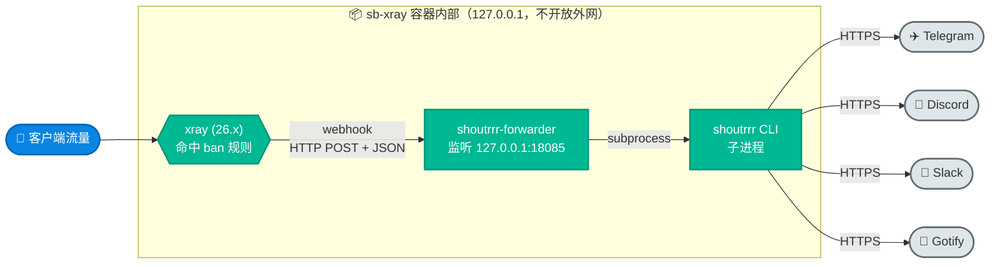
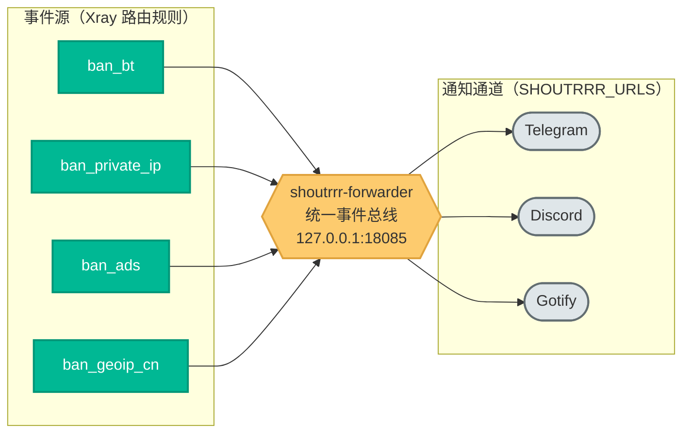
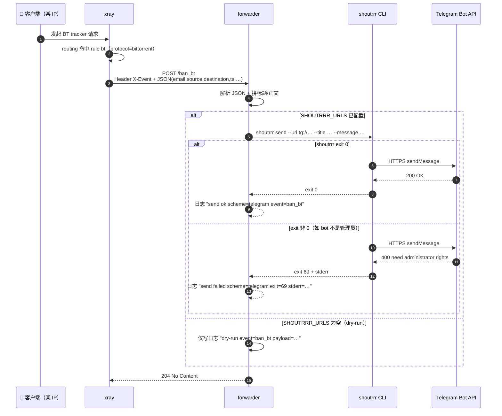
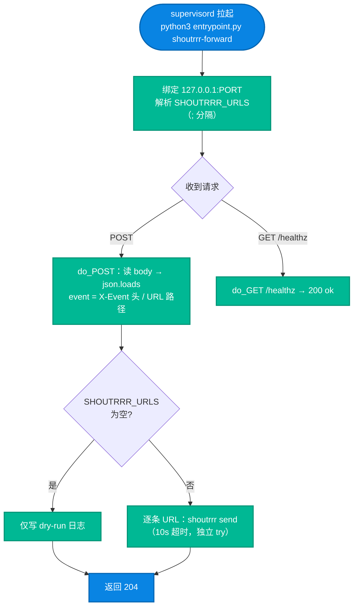

# 06. 事件总线：Xray webhook → shoutrrr 多通道告警

把 sb-xray 节点上「谁在跑 BT、谁踩了私网 IP、谁命中广告域」这类**安全/运维事件**，实时推到你的 Telegram / Discord / Slack / Gotify。本文把这套事件总线**从设计讲到代码**：新手能 5 分钟接通 Telegram，工程师能看懂 forwarder 内部怎么工作、为什么这么设计。

> **能力来源**：Xray-core v26.3.27（[PR #5722](https://github.com/XTLS/Xray-core/pull/5722)）给路由 `rules` 加了 `webhook`——命中规则即发 HTTP 回调。容器内早已自带 [shoutrrr](https://containrrr.dev/shoutrrr/)（多通道通知 CLI，原本只用于 ACME 证书续签提醒）。本模块把两者打通，让 shoutrrr 从「证书一次性通知」升级为项目统一的**事件总线**。

## 阅读约定：三种信息块

| 图标 | 含义 | 给谁看 |
|---|---|---|
| 📘 **概念卡** | 一句话讲清「是什么、为什么」，零黑话 | 新手必读 |
| 🔧 **配置块** | 可复制的命令 / 配置，标注「自动」还是「需手动」 | 动手部署的人 |
| 🔬 **深挖框** | forwarder 内部、webhook 规则、supervisord 注入等底层机制 | 工程师，新手可跳过 |

**读者导航**：
- **只想收到告警** → §0（场景）→ §5（5 分钟接通 Telegram）→ §7（验证）
- **想搞懂原理** → §1（拓扑）→ §2（设计）→ §3（实现细节）

---

## 0. 适用场景

📘 一句话：**让节点上发生的安全事件主动找你，而不是你去 tail 日志找它们。**

| 你关心的问题 | 对应事件 | 默认去重窗口 |
|---|---|---|
| 有人拿我的 VPS 跑 **BT 下载**（容易招版权信 / 被机房警告） | `ban_bt` | 5 分钟 |
| 有人扫描 / 访问**内网私有 IP**（`10.x` / `192.168.x` / `127.x`） | `ban_private_ip` | 30 分钟 |
| 客户端在打**广告域名**（噪声大，了解即可） | `ban_ads` | 15 分钟 |
| 有流量命中 **GeoIP CN 封禁**（未开回国时的默认拦截） | `ban_geoip_cn` | 10 分钟 |

📘 **典型用法**：

- **单人自用**：接 Telegram，BT / 私网扫描一发生就推到手机，第一时间发现节点被滥用。
- **多节点值班**：每台节点 `SHOUTRRR_TITLE_PREFIX` 带上节点名（如 `[sb-xray:jp01]`），全部推进同一个 Telegram 群 / 公司 Slack 值班频道，一眼看出是哪台出事。
- **可观测性**：把告警同时发 Gotify 自建服务做留档，或发 Discord webhook 进监控频道。

> 📘 **为什么不用 `tail access.log | grep`**：日志要人盯、断线即丢、多节点要逐台登录。事件总线把「命中规则」变成**主动推送**——人不在终端前也能收到，且去重、多通道、节点标识都内建。

---

## 1. 它做什么（拓扑）



**关键特性**：

- **不配置也能跑** —— `SHOUTRRR_URLS` 留空时进入 **dry-run**，事件只进容器日志，不外发。
- **零外网暴露** —— forwarder 只绑定 `127.0.0.1`，容器外无法访问，无需开任何端口。
- **多通道** —— 同一条事件可同时发 Telegram + Discord + Slack + Gotify。
- **低内存可关** —— `ENABLE_SHOUTRRR=false` 让 trim 阶段整块移除 forwarder 进程（省约 30MB RSS）。
- **失败透明化** —— shoutrrr 子进程的 exit code 和 stderr 都写进 forwarder 日志（token 不泄露），杜绝「204 但没收到消息」的盲区。

---

## 2. 设计：为什么是「事件总线」

### 2.1 解耦——Xray 只管发 HTTP，forwarder 管所有通道

🔬 核心设计是**生产者 / 消费者解耦**：Xray 不需要知道 Telegram、Discord 长什么样，它只会做一件事——命中规则时往一个固定的本地 HTTP 端点 POST 一条 JSON。「这条事件该发到哪些通道、用什么格式、失败怎么办」全部由 forwarder 这个**中间总线**负责。



📘 **好处**：加一个新通道只改 `SHOUTRRR_URLS`，不动 Xray 配置；加一类新事件只在 `xr.json` 加一条 `webhook` 规则，不动 forwarder 代码。两端独立演进。这正是 references 里「Webhook-as-Bus」的雏形——未来还能接 Sub-Store 节点剔除、用户到期提醒等更多事件源。

### 2.2 一次事件的完整链路



> ⚠️ **204 ≠ 通知送达**。forwarder 返回 204 只表示「事件被接收并已尝试转发」；shoutrrr 子进程的真正结果要看 `shoutrrr-forwarder.out.log` 里的 `send ok` / `send failed` 行（见 §8.2）。这是本模块「失败透明化」设计的关键——Xray 那侧永远 204，真相在 forwarder 日志。

### 2.3 三条设计原则

| 原则 | 怎么做 | 解决什么 |
|---|---|---|
| **默认安全** | 留空 `SHOUTRRR_URLS` → dry-run；只绑 `127.0.0.1` | 没配也不报错、不外泄；不增加攻击面 |
| **失败透明** | 子进程 exit code + stderr 前 400 字符进日志，**只记 URL scheme 不记 token** | 杜绝「静默 204」盲区，又不泄露 bot token |
| **故障隔离** | 每条 URL 独立 `try`，单条失败 `continue` 下一条，10s 超时 | 一个通道挂掉不拖累其他通道 |

---

## 3. 实现细节

📘 你不需要手写任何配置——Xray 侧 webhook 规则在模板里预置，forwarder 由 supervisord 自动拉起。本节讲清「自动」背后做了什么，便于排障。

### 3.1 Xray 侧：webhook 路由规则（`templates/xray/xr.json`）

🔬 模板的 `routing.rules` 里预置了 4 条带 `webhook` 的封禁规则。命中即 ① 阻断流量（`outboundTag: block`）② 向 forwarder POST 一条事件：

| X-Event | ruleTag | 匹配条件 | `deduplication` | 阻断 |
|---|---|---|---|---|
| `ban_bt` | `bt` | `protocol: bittorrent` | `300`（5 分钟） | ✅ |
| `ban_geoip_cn` | `cn-ip` | `ip: geoip:cn` | `600`（10 分钟） | ✅ |
| `ban_ads` | `ad-domain` | `domain: geosite:category-ads-all` | `900`（15 分钟） | ✅ |
| `ban_private_ip` | `private-ip` | `ip: geoip:private` | `1800`（30 分钟） | ✅ |

单条规则长这样：

```jsonc
{
  "type": "field",
  "ruleTag": "bt",
  "protocol": ["bittorrent"],
  "marktag": "ban_bt",
  "outboundTag": "block",
  "webhook": {
    "url": "http://127.0.0.1:18085/ban_bt",  // 指向 forwarder
    "deduplication": 300,                      // ⚠️ 整数秒，不是 "5m" 字符串
    "headers": { "X-Event": "ban_bt" }         // forwarder 据此拼标题
  }
}
```

🔬 **三个易错点**：

1. **`deduplication` 是 `uint32` 秒数**（[PR #5722](https://github.com/XTLS/Xray-core/pull/5722) 定义），**不是 `"5m"` 这种字符串**，也**不是**全局配置——它是**每条规则各自**的整数。语义：同一 `(source, 规则)` 在该秒数窗口内只推一次。
2. **`webhook.url` 指向 forwarder 而非外部服务**——Xray 永远只 POST 到本地 `127.0.0.1:18085`，外部通道由 forwarder 接力。
3. **`ban_geoip_cn` 会随回国模式消失**：开启 `CN_EXIT_MODE=reverse`/`balance` 后，`cn-ip` 规则被改写成回国出站、其 `marktag`/`webhook` 被剥离（否则正常回国流量会持续误报 ban_geoip_cn）。所以**只有未开回国时**才会收到 `ban_geoip_cn`。详见 [05](./05-reverse-proxy-guide.md) / [08](./08-xray-reverse-bridge.md)。

### 3.2 forwarder 侧：HTTP 接收器（`scripts/sb_xray/shoutrrr.py`）

🔬 forwarder 是个约 150 行的 `ThreadingHTTPServer`，逻辑极简：



关键实现点（对应排障）：

| 行为 | 实现 |
|---|---|
| **事件类型识别** | 取 `X-Event` 请求头（Xray webhook 走这条）；缺失则读 body 里的 `event` 字段（容器内 `events.py` POST 到 `/xray` 时事件名包在 body 里），再退回 URL 路径（`/ban_bt` → `ban_bt`），最后 `unknown` |
| **消息拼装** | 4 个内置 ban 事件 → 人话摘要：标题 = `"{SHOUTRRR_TITLE_PREFIX} 🚫 BT 下载已拦截"` 等中文标题，正文 = 「用户 X 尝试连接 Y」+ 来源/入站/时间；`isp.speed_test.result` → 标题 `📊 ISP 测速结果`，正文 = 选定线路/评级/直连基准 + 各线路逐行（含 ✓/✗ 与失败原因）；`isp.retest.completed` → 标题 `🔄 ISP 重测 · 线路已切换`，正文 = 切换结论（`old → new`）+ 原因/重启状态 + 折入的测速摘要；`isp.retest.noop` → 标题 `🔁 ISP 重测 · 线路不变`，正文 = 测速摘要 + 维持结论（含波动百分比）；**这两类 retest 卡发出时，同一重测周期内那次 `isp.speed_test.result` 的独立推送被抑制**（仍记日志不外推），测速摘要折进 retest 卡，使「测速 + 切换决策」合为一条通知；`substore.sub_fetch.failed` → 标题 `🔴 订阅拉取失败`，正文 = 失败订阅逐行（含是否机场 + 原因）+ 共 N/M 条失败；未登记的事件 → 标题 = `"{SHOUTRRR_TITLE_PREFIX} {event}"`，正文 = 每字段一行 `key: value`（剔除空值与 `event` 键、`ts` 转可读） |
| **多 URL 发送** | **同一事件的多条 URL 顺序发送**（`for url in urls`），每条独立 `try` + 10s 超时；单条失败 `continue`，不影响后续 |
| **多事件并发** | `ThreadingHTTPServer`——不同事件各开线程处理，互不阻塞 |
| **token 安全** | 日志只记 URL 的 **scheme**（`telegram`/`discord`），从不打印完整 URL |
| **失败透明** | 子进程 `returncode != 0` → 记 `send failed`（含 stderr 前 400 字符）；抛异常（超时等）→ 记 `send crashed` |
| **健康探针** | `GET /healthz` → `200 ok`（liveness 用，**只有这一条路径**返回 200） |
| **坏 JSON** | body 解析失败 → `400 bad json`，不进发送逻辑 |

> 🔬 **为什么调 shoutrrr CLI 而非内联 HTTP**：shoutrrr 已内置 20+ 通道的 URL 解析与重试逻辑（且容器里本来就有），用 `subprocess` 复用它，forwarder 只做「接收 + 拼装 + 调用」，代码极薄。代价是每条通知 fork 一个进程——量级很低（去重后事件稀疏），不构成瓶颈。

### 3.3 supervisord 集成与 env 注入坑

🔬 forwarder 由 supervisord 作为常驻 program 管理（`templates/supervisord/daemon.ini`）：

```ini
[program:shoutrrr-forwarder]
command=python3 /scripts/entrypoint.py shoutrrr-forward
autorestart=true
priority=18
environment=SHOUTRRR_URLS="%(ENV_SHOUTRRR_URLS)s",SHOUTRRR_FORWARDER_PORT="%(ENV_SHOUTRRR_FORWARDER_PORT)s",SHOUTRRR_TITLE_PREFIX="%(ENV_SHOUTRRR_TITLE_PREFIX)s"
```

> ⚠️ **改了 env 必须 `--force-recreate`，不能 `supervisorctl restart`**。supervisord 在**容器启动**时通过 `%(ENV_*)s` 把环境变量插值进 program 的 `environment=` 行；`supervisorctl restart shoutrrr-forwarder` 只重启**子进程**，读到的仍是**旧的** env 快照。只有整容器重建才会重新渲染 supervisord 配置。

---

## 4. 最小配置与环境变量

🔧 仓库 `docker-compose.yml` 的 `environment:` 段已预置以下三行，**默认 `SHOUTRRR_URLS=` 留空走 dry-run**；接通时填上 URL 即可：

```yaml
services:
  sb-xray:
    environment:
      # 留空 = dry-run；多通道用英文分号 ";" 分隔
      - SHOUTRRR_URLS=telegram://123456789%3AABCdef...xyz@telegram?chats=-1001234567890
      # 标题前缀；$domain 与顶部 DOMAIN=$domain 同源，由宿主 shell / .env 导出
      - SHOUTRRR_TITLE_PREFIX=[sb-xray:$domain]
      # 监听端口（127.0.0.1 内部绑定，无需开放外网）
      - SHOUTRRR_FORWARDER_PORT=18085
```

> 示例里两处**必须**按自己的值替换：`123456789%3AABCdef...xyz` 是 **BOT_TOKEN**（冒号要编码成 `%3A`，见 §5/§6.1）；`-1001234567890` 是 **chat.id**（私有频道/群为负数带 `-100` 前缀；公开频道直接写 `my_channel`，见 §5 第 3 步）。

### 4.1 环境变量对照表（唯一真相来源）

| 变量 | 必填？ | 默认 | 说明 | 示例 |
|------|--------|------|------|------|
| `SHOUTRRR_URLS` | 否（空 = dry-run） | `""` | 分号分隔的 shoutrrr URL 列表 | `telegram://...;discord://...` |
| `SHOUTRRR_FORWARDER_PORT` | 否 | `18085` | forwarder 监听端口（仅 127.0.0.1） | `18085` |
| `SHOUTRRR_TITLE_PREFIX` | 否 | `[sb-xray]` | 推送消息的标题前缀 | `[sb-xray:jp01]` |
| `ENABLE_SHOUTRRR` | 否 | `true` | 低内存部署（≤ 512MB）设 `false`，trim 阶段整块移除 forwarder（省约 30MB RSS） | `true` / `false` |

> `readme.md` / `CHANGELOG.md` / `docker-compose.yml` 里的默认值均应与本表一致，分歧以本表为准。

### 4.2 `SHOUTRRR_TITLE_PREFIX` 里的 shell 变量展开

🔧 docker-compose 对 `$VAR` / `${VAR}` 做**宿主 shell / `.env` 替换**后再注入容器。本仓库约定用宿主 shell 变量传节点身份（见 `docker-compose.yml` 顶部 `DOMAIN=$domain`）：

```yaml
# ✓ 推荐：复用已导出的 $domain，标题自带节点域名
- SHOUTRRR_TITLE_PREFIX=[sb-xray:$domain]
# ✓ 也可：纯字面量，多节点手动区分
- SHOUTRRR_TITLE_PREFIX=[sb-xray-jp01]
```

**前置条件**：`$domain` 必须在 `docker compose up` 所在 shell 或同目录 `.env` 里定义，否则展开为空、标题变 `[sb-xray:]`。需要字面量 `$` 时用 `$$` 转义（`$$literal` → `$literal`）。

```bash
echo "$domain"                                              # 宿主机：应输出真实域名
docker exec sb-xray env | grep -E '^(DOMAIN|SHOUTRRR_TITLE_PREFIX)='  # 容器内核对
```

改完 env 后**重建容器**（见 §3.3 为什么不能 restart）：

```bash
docker compose up -d sb-xray --force-recreate
docker logs sb-xray 2>&1 | grep shoutrrr-forwarder | tail -3
# 期望：[shoutrrr-forwarder] listening on 127.0.0.1:18085 urls=1
```

---

## 5. 快速开始：5 分钟接通 Telegram

> 端到端最小路径，含真实排查踩过的**所有**坑，按顺序操作可一把过。其他通道替换 URL 即可，见 §6。

### 第 1 步：创建 Telegram bot（30 秒）

1. Telegram 搜 `@BotFather`，发 `/newbot` → 起名 → 拿到形如 `123456789:AAEabc...xyz` 的 **BOT_TOKEN**（**有冒号**）。
2. 记住 token——关掉对话就看不到，忘了只能 `/token` 重发或 `/revoke`。

### 第 2 步：创建频道 / 群组，把 bot 拉进去（1 分钟）

- **公开频道**：有 `@username`，直接用 `@username` 作 chat，无需 chat.id。
- **私有频道 / 群组**：必须先拿 chat.id（第 3 步）。

**把 bot 拉进去后 ⚠️ 必须做两件事**：

1. 进频道 → **管理员**（Administrators）→ **添加管理员**。
2. 搜你的 bot → 添加 → 权限里**勾上「发送消息」（Post Messages）**。

> ❗ **仅作为成员加入是不够的**。频道里 bot 必须是管理员且有「发送消息」权限，否则 shoutrrr 得到 `Bad Request: need administrator rights in the channel chat`（exit 69），forwarder 仍 204，但频道里什么都看不到。**超级群同理**；普通群只需 bot 在群内即可。

### 第 3 步：拿 chat.id（私有频道 / 群组专用）

浏览器打开 `https://api.telegram.org/bot<BOT_TOKEN>/getUpdates`，**先在群/频道里发任意一条消息**，刷新后从 JSON 找 `chat.id`：

```json
{ "result": [{ "channel_post": { "chat": { "id": -1001234567890, "type": "channel" } } }] }
```

特征：**负数 + `-100` 前缀** = 超级群/频道（绝大多数）；**负数不带 `-100`** = 普通群；**正数** = 私聊（不是你要的）。

### 第 4 步：处理 getUpdates 409 冲突（可选）

若返回 `409 Conflict: can't use getUpdates method while webhook is active`，说明 bot 被别的 webhook 服务占用：

- 不再给那个服务用 → 浏览器打开 `https://api.telegram.org/bot<BOT_TOKEN>/deleteWebhook` 清掉。
- 还要给其他服务用 → BotFather 新建一个 bot 专给 sb-xray，职责分离。

### 第 5 步：组装 URL

**`BOT_TOKEN` 里的冒号 `:` 必须 URL-encode 成 `%3A`**（否则 shoutrrr 把冒号当「用户名:密码」解析）：

```
原 BOT_TOKEN：   123456789:AAEabc...xyz
最终 URL：        telegram://123456789%3AAAEabc...xyz@telegram?chats=-1001234567890
```

- `telegram://` 协议头 · `123456789%3A...` BOT_TOKEN（冒号已编码）· `@telegram?chats=` 固定字面量 · `-1001234567890` chat.id（公开频道写 `my_channel`，不带 `@`）。

### 第 6 步：写入 `docker-compose.yml` 并重建

```yaml
- SHOUTRRR_URLS=telegram://123456789%3AAAEabc...xyz@telegram?chats=-1001234567890
- SHOUTRRR_TITLE_PREFIX=[sb-xray-cn2]
```

```bash
docker compose up -d sb-xray --force-recreate
```

### 第 7 步：两步验证

```bash
# A. 直接调 shoutrrr CLI（绕过 forwarder，最快暴露真实错误）
docker exec sb-xray sh -c 'shoutrrr send --url "$SHOUTRRR_URLS" \
  --title "[sb-xray] cli-test" --message "hello"; echo "exit=$?"'
# 期望：exit=0 + Telegram 立刻收到 "hello"
# 常见失败：
#   exit=69 "need administrator rights" → bot 权限问题，回第 2 步
#   exit=69 "chat not found"            → chat.id 错，回第 3 步
#   exit=非0 "invalid character"        → BOT_TOKEN 冒号未编码，回第 5 步

# B. 验证 forwarder 全链路（容器内部 POST）
docker exec sb-xray curl -sS -o /dev/null -w 'http=%{http_code}\n' \
  -X POST -H 'X-Event: manual.test' \
  -d '{"email":"demo","source":"198.51.100.42"}' \
  http://127.0.0.1:18085/test
# 期望：http=204 + Telegram 收到 "[sb-xray-cn2] manual.test"，正文带 email/source

# C. 看日志确认是 send ok 而非 send failed
docker exec sb-xray tail -n 5 /var/log/supervisor/shoutrrr-forwarder.out.log
# 期望含：[shoutrrr-forwarder] send ok scheme=telegram event=manual.test
```

---

## 6. URL 语法速查

所有全大写 `占位符` 都是变量；其他字符是固定语法。完整 20+ 通道见 <https://containrrr.dev/shoutrrr/v0.8/services/overview/>。

### 6.1 Telegram

```
telegram://BOT_TOKEN@telegram?chats=CHAT_ID
```

| 占位符 | 从哪里拿 | 示例 | 注意 |
|--------|---------|------|------|
| `BOT_TOKEN` | BotFather `/newbot` | `123456789%3AAAEabc...xyz` | **冒号编码为 `%3A`** |
| `CHAT_ID` | 公开 `@name`/`name`；私有用 `getUpdates` | `my_channel` 或 `-1001234567890` | 私有必为负数 |

多 chat（同一 bot 发多目标，**逗号**分隔）：`telegram://TOKEN@telegram?chats=-100123,-100456,@public_channel`

### 6.2 Discord（基于 webhook）

Discord webhook URL `https://discord.com/api/webhooks/WEBHOOK_ID/TOKEN` 对应：

```
discord://TOKEN@WEBHOOK_ID
```

### 6.3 多通道同时推

🔧 `SHOUTRRR_URLS` 内部用**分号** `;` 分隔（这是 sb-xray forwarder 的约定，**不是** shoutrrr 的）。想同时推 Telegram + Discord + Gotify：

```yaml
- SHOUTRRR_URLS=telegram://123456789%3A...@telegram?chats=-1001234567890;discord://aBc...cDeF@987654321098765432;gotify://gotify.example.com/TOKEN3
```

删除某通道直接移除对应段（连同 `;`）。某通道挂掉不影响其他（§10.2）。

> ⚠️ 不要搞混：通道之间用**分号** `;`；`telegram://` URL **内部**的 `chats=` 多 chat 用**逗号** `,`。

---

## 7. 验证

🔧 最快的两步（详见 §5 第 7 步）：

1. **绕过 forwarder 直调 shoutrrr CLI**——`exit=0` 说明 URL/权限都对，最快定位真实错误。
2. **POST 到 forwarder**——`http=204` 说明 forwarder 链路通，是否真送达看 `shoutrrr-forwarder.out.log` 的 `send ok`。

🔧 **健康探针**（liveness）：

```bash
docker exec sb-xray curl -sS http://127.0.0.1:18085/healthz   # 200 + body "ok"
```

---

## 8. 故障排查

### 8.1 现象 → 根因（高频）

| 现象 | 最可能根因 | 定位命令 | 修法 |
|------|----------|---------|------|
| **forwarder 204，Telegram 没收到** | bot 不是频道管理员 / 无「发送消息」权限 | `docker exec sb-xray sh -c 'shoutrrr send --url "$SHOUTRRR_URLS" --title t --message m; echo $?'` 看是否 `exit=69 + need administrator rights` | §5 第 2 步补权限 |
| 日志 `urls=0` | `SHOUTRRR_URLS` 空 / 改了没重建 | `docker exec sb-xray env \| grep SHOUTRRR_URLS` | `docker compose up -d sb-xray --force-recreate` |
| shoutrrr `exit=69 + chat not found` | chat.id 错 / 缺 `-100` / bot 没进群 | 重跑 `getUpdates` 核对 | 用正确 chat.id |
| shoutrrr `exit=非0 + invalid character` | BOT_TOKEN 冒号未编码 | 检查 `$SHOUTRRR_URLS` 里 `@` 左侧有无裸 `:` | `:` 改 `%3A` |
| 看不到 "listening on…" | forwarder 没起来 | `docker exec sb-xray supervisorctl status shoutrrr-forwarder` | `FATAL` 时看 `.err.log` 的 traceback |
| "dry-run event=…" 一直刷 | `SHOUTRRR_URLS` 为空 | 同上 | 填 URL 并 `--force-recreate` |
| 健康探针 404 | 路径错 | `curl -s http://127.0.0.1:18085/healthz`（**只这一条**返回 200） | 用 `/healthz` |
| 通知过多 | 规则 `deduplication` 秒数太小 | `docker exec sb-xray jq '.routing.rules[] \| select(.webhook) \| {ruleTag, dedup: .webhook.deduplication}' /sb-xray/xray/xr.json` | 调大对应规则的整数秒（§10.1） |
| 标题前缀变空 | compose 用了未定义的 `$var` | `docker exec sb-xray env \| grep TITLE` | 改字面量或 `$$var` |
| getUpdates 409 | bot 被别的 webhook 占用 | `https://api.telegram.org/bot<TOKEN>/getWebhookInfo` | §5 第 4 步 |

### 8.2 看懂 forwarder 日志的关键行

```
[shoutrrr-forwarder] listening on 127.0.0.1:18085 urls=1
      ↑ 启动正常；urls = 生效的 URL 条数

[shoutrrr-forwarder] send ok scheme=telegram event=ban_bt
      ↑ 成功。scheme 是 URL 前缀，token 不会泄露

[shoutrrr-forwarder] send failed scheme=telegram exit=69 stderr='Bad Request: need administrator rights in the channel chat'
      ↑ shoutrrr 非零退出；exit code + stderr 前 400 字符原样透传

[shoutrrr-forwarder] send crashed scheme=telegram err=TimeoutExpired
      ↑ 子进程本身崩掉（10 秒超时 / 网络阻塞 等）

[shoutrrr-forwarder] dry-run event=manual.test payload={"email": "demo", ...}
      ↑ SHOUTRRR_URLS 为空走 dry-run
```

---

## 9. 事件 payload 字段说明

📘 JSON body 由 Xray [PR #5722](https://github.com/XTLS/Xray-core/pull/5722) 定义。4 个内置 ban 事件的通知正文是从中提炼的人话摘要（`email` 取 `@` 前段、`source` 去端口、`ts` 转本地时间，空字段省略），收到的效果形如：

```text
[sb-xray] 🚫 BT 下载已拦截

用户 user01 尝试连接
tracker.example.org:6881

来源: 198.51.100.42
入站: reality-443 · vless/tcp
时间: 06-07 22:31:40
```

未登记的事件（如 §5 验证用的 `manual.test`）退回每字段一行 `key: value`（剔除空值、`ts` 转可读）。payload 原始字段：

| 字段 | 含义 | 示例 |
|------|------|------|
| `email` | 客户端 inbound 所挂的 UUID 标识 | `user01@vless` |
| `level` | Xray user level | `0` |
| `protocol` | 入站协议 | `vless` / `trojan` / `hy2` |
| `network` | 传输层 | `tcp` / `xhttp` / `h3` |
| `source` | 客户端源 IP:port | `198.51.100.42:51234` |
| `destination` | 命中规则的目标 | `tracker.pirate-bay:6881` |
| `outboundTag` / `routeTarget` | 命中的出站 tag | `block` / `direct` |
| `inboundTag` | 命中的入站 tag | `reality-443` |
| `ts` | Unix 秒时间戳 | `1745337600` |

HTTP 头 **`X-Event`** 标示事件类型——取值为 `ban_bt` / `ban_geoip_cn` / `ban_ads` / `ban_private_ip`（见 §3.1），forwarder 把它拼进通知标题。

### 9.1 watchtower 自动更新通知（host 侧 canary）

📘 除 Xray webhook 外，还有一类事件来自**主机侧**:每台节点的 `sbx-canary-check.sh`（cron 周期跑，详见 [`../sources/vps/README.md`](../sources/vps/README.md)）在镜像自动更新后做业务自检，经**同一个 forwarder** 推中文卡片。它们不走 Xray PR #5722 的 payload，字段由脚本自定义。

| 事件（`X-Event`） | 触发 | 卡片字段 |
|---|---|---|
| `watchtower.canary.updated` | 自检 4/4 通过 **且** 检测到镜像 digest 跳变 | `镜像构建`（镜像 `org.opencontainers.image.version` label，如 `26.6.10-<sha>`）+「四项自检全部通过」 |
| `watchtower.canary.failed` | 任一自检失败（退出码 1） | 节点角色 / 失败项 / `镜像构建` / 处置 runbook |

🔬 `镜像构建` 取脚本发的 `built` 字段（版本 label）；脚本未带该字段时 formatter 回退到 `new`/`image`（镜像 digest），两者皆无才显示「未知」。无 digest 跳变时静默（不每天刷屏），首次运行只落盘 digest、不报「已更新」。

---

## 10. 进阶：降噪 / 多通道 / 低内存关闭

### 10.1 降噪（去重窗口）

🔬 每条 webhook 规则各有一个 `deduplication`（**整数秒**），决定「同一源同一事件多长时间只推一次」。查看当前各规则的窗口：

```bash
docker exec sb-xray jq '.routing.rules[] | select(.webhook) | {ruleTag, dedup: .webhook.deduplication}' /sb-xray/xray/xr.json
# 例：{"ruleTag":"bt","dedup":300} {"ruleTag":"cn-ip","dedup":600} ...
```

调大窗口：改 `templates/xray/xr.json` 里对应规则的 `webhook.deduplication`（如 `300` → `900`），重建容器。

> ⚠️ **常见误区**：`deduplication` 不是 `{"enabled": true, "window": "5m"}` 这种对象，也没有全局 `.webhook` 配置——它就是**每条规则下的一个整数秒数**。

### 10.2 多通道并发 + 部分失败隔离

🔬 `SHOUTRRR_URLS` 用英文**分号** `;` 分隔多通道。**同一事件的多条 URL 顺序发送**（每条 10s 超时），但**不同事件由 `ThreadingHTTPServer` 并发处理**。容错：某通道挂掉（超时 / 非 2xx / 权限错）只跳过该条、继续下一条，每条成败独立记日志（§8.2）。

### 10.3 低内存节点关闭 forwarder

🔧 VPS RAM ≤ 512MB 时建议关闭（省约 30MB RSS）：

```yaml
- ENABLE_SHOUTRRR=false
```

🔬 `entrypoint.py trim` 阶段会在 `daemon.ini` 删掉 `[program:shoutrrr-forwarder]` 整块，supervisord 完全不启动该进程。Xray 的 webhook 规则仍生效，只是 POST 到 `127.0.0.1:18085` 时 TCP 连不上、Xray 自己 swallow error，不影响代理转发。

---

## 11. 诊断命令集（一页速查）

> 默认在 sb-xray **宿主机**执行；进容器的用 `docker exec sb-xray ...`。

```bash
# ── 进程 & 配置 ──
docker exec sb-xray supervisorctl status shoutrrr-forwarder
docker exec sb-xray env | grep -E 'SHOUTRRR_|ENABLE_SHOUTRRR'

# ── 日志（send ok / send failed / dry-run）──
docker exec sb-xray tail -n 30 /var/log/supervisor/shoutrrr-forwarder.out.log
docker exec sb-xray tail -n 30 /var/log/supervisor/shoutrrr-forwarder.err.log

# ── 健康探针 ──
docker exec sb-xray curl -sS http://127.0.0.1:18085/healthz   # 200 + "ok"

# ── 触发一条事件（forwarder → shoutrrr 全链路）──
docker exec sb-xray curl -sS -o /dev/null -w 'http=%{http_code}\n' \
  -X POST -H 'X-Event: manual.test' \
  -d '{"email":"demo","source":"198.51.100.42"}' \
  http://127.0.0.1:18085/test

# ── 绕过 forwarder 直调 shoutrrr CLI（最快定位真实错误）──
docker exec sb-xray sh -c 'shoutrrr send --url "$SHOUTRRR_URLS" \
  --title "[sb-xray] cli-test" --message "hello"; echo "exit=$?"'

# ── Telegram bot 侧自查 ──
curl -s "https://api.telegram.org/bot<BOT_TOKEN>/getWebhookInfo" | jq   # webhook 是否占用（409）
curl -s "https://api.telegram.org/bot<BOT_TOKEN>/deleteWebhook"          # 清掉 webhook
curl -s "https://api.telegram.org/bot<BOT_TOKEN>/getChatMember?chat_id=-100...&user_id=<BOT_USER_ID>" | jq
# 期望：status="administrator" + can_post_messages=true

# ── Xray webhook 规则 & 去重窗口 ──
docker exec sb-xray jq '.routing.rules[] | select(.webhook)' /sb-xray/xray/xr.json
docker exec sb-xray jq '.routing.rules[] | select(.webhook) | {ruleTag, dedup: .webhook.deduplication}' /sb-xray/xray/xr.json
```

---

## 12. 延伸阅读

- **shoutrrr URL 语法**（Telegram / Discord / Slack / Gotify / Pushover 等 20+ 通道）：<https://containrrr.dev/shoutrrr/v0.8/services/overview/>
- **Xray webhook 规则字段**（PR #5722）：<https://github.com/XTLS/Xray-core/pull/5722>
- **Telegram Bot API**（chat.id / 管理员权限字段）：<https://core.telegram.org/bots/api>
- **本功能在 sb-xray 里的实现**：
  - 接收器模块：`scripts/sb_xray/shoutrrr.py`（子命令入口 `python3 /scripts/entrypoint.py shoutrrr-forward`）
  - Xray webhook 规则：`templates/xray/xr.json` 的 4 条 ban 规则
  - supervisord program：`templates/supervisord/daemon.ini` 的 `[program:shoutrrr-forwarder]`
  - 单测：`tests/test_shoutrrr.py`
- **相关文档**：[05. VLESS Reverse Proxy](./05-reverse-proxy-guide.md) · [08. Xray Reverse Bridge 回国架构](./08-xray-reverse-bridge.md)（`ban_geoip_cn` 随回国模式消失的来龙去脉）
