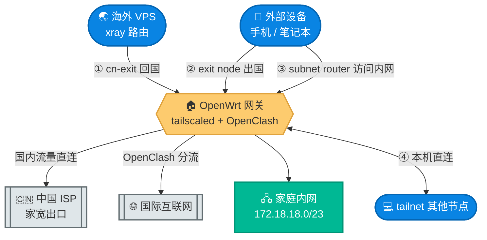
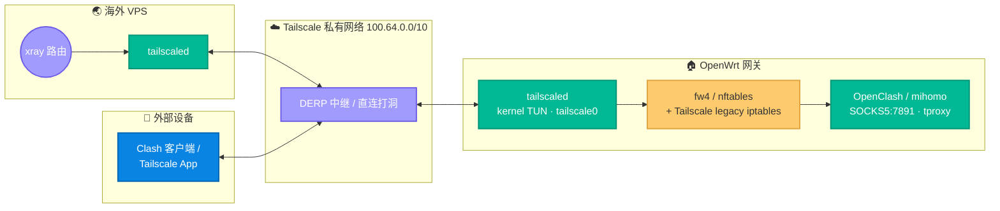
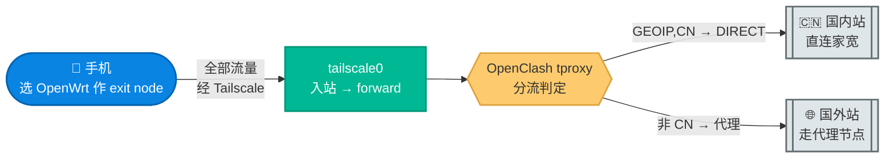

# 07. Tailscale 代理架构设计与配置指南

本文把 OpenWrt 上 Tailscale 这套「一机多用」的代理网关讲透：它**同时**承担回国出口、出国分流、内网穿透三类流量，外加把路由器自己接进 Tailscale 私有网络。文章从概念讲到底层，配图配命令，**新手能照着做、工程师能看懂为什么**。

> **本文与 [08. Xray Reverse Bridge 回国架构设计与配置](./08-xray-reverse-bridge.md) 的分工**：本文讲 Tailscale + OpenClash SOCKS5 这条回国链路（`CN_EXIT_MODE=socks5`）；08 讲 Xray 反向隧道那条链路（`CN_EXIT_MODE=reverse`）及两者主备的 balance 模式。两套方案怎么选见 08 的附录。

---

## 阅读约定：三种信息块

全文用三个图标分层，各取所需：

| 图标 | 含义 | 给谁看 |
|---|---|---|
| 📘 **概念卡** | 一句话讲清「是什么、为什么」，零黑话 | 新手必读 |
| 🔧 **配置块** | 可复制的命令 / 配置，标注「脚本已自动」还是「需手动」 | 动手部署的人 |
| 🔬 **深挖框** | 内核路由、nftables、fwmark 等底层机制 | 工程师，新手可跳过 |

**读者导航**：
- **新手快速上手** → 看 §1（概念）→ §3（流量图解，理解数据怎么走）→ §4.1（一键脚本）
- **工程师 / 排障** → 看 §2（架构）→ §4.2（手动逐步与原理）→ §6（踩坑实录）

---

## 0. 全局总览：一台 OpenWrt，四个角色

📘 **一句话**：把 OpenWrt 路由器装上 Tailscale 后，它就成了私有网络（tailnet）里的一个「多功能节点」，同时干四件事。下图是四个角色的同框总览，后面 §3 会逐个拆开看。



| 角色 | 谁发起 | 流量方向 | 用途 | 依赖 |
|---|---|---|---|---|
| ① **cn-exit 回国** | 海外 VPS | VPS → OpenWrt → 家宽 | 境外设备访问大陆限定服务 | OpenClash SOCKS5 |
| ② **exit node 出国** | 外部设备 | 设备 → OpenWrt → 互联网 | 在外用家宽 IP 上网 + 自动分流 | OpenClash tproxy |
| ③ **subnet router** | 外部设备 | 设备 → OpenWrt → LAN | 在外访问家里 NAS 等内网服务 | 子网路由 |
| ④ **本机直连** | OpenWrt | OpenWrt → 其他节点 | 路由器主动连 tailnet 设备 | 无 |

---

## 1. 基础概念（新手必读，零配置）

### 1.1 Tailscale 是什么

📘 Tailscale 是一个「**零配置的私有网络**」工具。它在你所有设备之间拉起一张加密的虚拟局域网——无论设备在家、在公司还是在 4G 网络下，彼此都能像在同一个路由器下一样直接通信。

它由三块拼成：
- **WireGuard**：底层的加密隧道协议（快、现代、内核级）。
- **自动组网**：你不用手配 IP、不用开端口、不用记对方地址，登录同一个账号即自动互联。
- **NAT 打洞**：两台都在「内网」（没有公网 IP）的设备，Tailscale 用 STUN/DERP 技术帮它们直接打通；打不通时用中继服务器兜底。

📘 **类比**：传统 VPN 像「所有人挤进一个总机房再转接」；Tailscale 像「给每台设备发一张对讲机，按一下就直接通话」。

### 1.2 tailnet / CGNAT 段 / MagicDNS

- 📘 **tailnet**：你这个账号下所有设备组成的私有网络，就叫一个 tailnet。
- 📘 **100.64.0.0/10（CGNAT 段）**：Tailscale 给每台设备分配一个 `100.x.y.z` 的虚拟 IP，这个 IP 在整个 tailnet 内唯一且固定。这个网段是运营商级 NAT 专用段（CGNAT），不会和你家里的 `192.168.x` / `172.x` 真实网段冲突。**记住这个网段，后面踩坑全和它有关。**
- 📘 **MagicDNS**：Tailscale 自带的 DNS，让你能用 `主机名`（如 `openwrt-cn`）代替 `100.x` 数字 IP 访问设备。

> 🔬 本项目刻意 `--accept-dns=false` 关闭了 MagicDNS 接管本机 DNS——OpenWrt 上 DNS 由 OpenClash/dnsmasq 主导，让 Tailscale 再插一脚会和 fake-ip 机制打架（见 §6.6）。

### 1.3 三种关键角色：subnet router / exit node / 本机直连

这是 Tailscale 把「一台设备」变成「一个网关」的三个能力开关：

- 📘 **subnet router（子网路由器）**：默认情况下，tailnet 里只有装了 Tailscale 的设备能互访。但你家 NAS、摄像头没装 Tailscale。把 OpenWrt 设为 subnet router（`--advertise-routes=${TS_ADVERTISE_ROUTES}`），它就**代理**整个家庭网段——其他设备访问该网段内的地址时，流量先到 OpenWrt，再转给内网设备。**一台代言一片。**

> 📘 **关于网段值**：本文图示与命令里出现的家庭内网网段是**示例占位**，真实值由 `config.env` 的 `TS_ADVERTISE_ROUTES` 决定（默认见 [`config.env.example`](../sources/openwrt/config.env.example)）。下文凡需精确对应配置的命令/校验，统一写成 `${TS_ADVERTISE_ROUTES}` 变量名，请按自家 LAN 网段替换。

- 📘 **exit node（出口节点）**：把 OpenWrt 设为 exit node（`--advertise-exit-node`），其他设备可以选择「让我所有上网流量都从这台出去」。你在国外用手机选了家里的 OpenWrt 作 exit node，看到的就是家宽的中国 IP。**等于一个家用 VPN 出口。**

- 📘 **本机直连**：OpenWrt 自己也是 tailnet 成员，它上面的进程能主动 `ping`/连接其他节点的 `100.x` IP。

> ⚠️ subnet router 和 exit node 都需要在 [Tailscale 管理后台](https://login.tailscale.com/admin/machines) 手动**批准**后才生效——`--advertise-*` 只是「申报」，管理员点头才算数。

### 1.4 userspace-networking vs kernel TUN（本项目为什么选 kernel TUN）

📘 tailscaled 有两种工作模式，差别在于「Tailscale 的流量走不走内核」：

| | userspace-networking | **kernel TUN（本项目）** |
|---|---|---|
| 网卡 | 无 `tailscale0` 网卡 | 创建 `tailscale0` 虚拟网卡 |
| 实现 | 用户态 gVisor 网络栈 | 内核转发 |
| 吞吐 | 低（用户态拷贝） | 高（内核直转） |
| subnet router / exit node | ❌ 不支持 | ✅ 支持 |
| 防火墙 | 无需配置（流量不过 netfilter） | 需配 zone / forwarding |

🔬 **为什么 userspace 模式「零防火墙」也能跑 SOCKS5 回国**：userspace 模式下 Tailscale 流量从不进内核 netfilter，VPS 经隧道访问本机 7891 端口走的是 tailscaled 用户态 socket，不需要任何防火墙放行。但代价是没有 `tailscale0` 网卡 → 无法做 subnet router / exit node。本项目需要这两个能力，所以切到 kernel TUN——**代价是必须正确配置防火墙 zone 和转发规则**（§4.2）。

### 1.5 OpenClash / mihomo / fake-ip 是什么

为后文铺垫，先认识 OpenWrt 上这套分流引擎：

- 📘 **OpenClash**：OpenWrt 上的一个透明代理插件，负责「哪些流量直连、哪些走代理」的智能分流。
- 📘 **mihomo**：OpenClash 底层的代理内核（Clash.Meta 的延续），真正干活的引擎。
- 📘 **fake-ip（假 IP）**：一种 DNS 加速技巧。当你访问 `www.google.com`，mihomo **不立即**做真实 DNS 解析，而是先返回一个假 IP（如 `198.18.0.5`），等真正建连时再按域名决定走代理还是直连。好处是省一次 DNS 往返、且按域名分流更准。

> 🔬 **fake-ip 的副作用预告**：假 IP 只在 mihomo 内部有意义。如果某个流量**没经过 mihomo 的 DNS** 就拿到了假 IP（比如需要直连的 VPS 域名被解析成假 IP），它会连不上真实服务器。这正是 §6.5、§6.6 两个坑的根源。本项目用「fake-ip 过滤名单」让特定域名（如 VPS）绕过假 IP，解析真实地址。

---

## 2. 架构设计

### 2.1 组件全景

📘 **一句话**：这张图展示三方（VPS / OpenWrt / 外部设备）各自跑了什么、靠什么连起来。看清「谁在哪、装了啥」，再看 §3 的流量就不晕。



🔬 **走读**：① 三方都跑 `tailscaled`，经 Tailscale 私有网络（优先直连打洞，失败走 DERP 中继）互通；② OpenWrt 上 `tailscale0` 的流量进入内核 netfilter（`fw4` + Tailscale 自己的 legacy iptables 两套栈并存）；③ OpenClash 在 netfilter 里拦截需要分流的流量。

### 2.2 角色与依赖矩阵

| 角色 | tailscale0 入站/出站 | 经过 OpenClash？ | 关键内核配置 |
|---|---|---|---|
| ① cn-exit 回国 | 入站到本机 7891 | ✅ 作为 SOCKS5 服务端 | zone input ACCEPT |
| ② exit node 出国 | 入站转发到 wan | ✅ tproxy 拦截分流 | forward + masq + `tailscale→wan` |
| ③ subnet router | 入站转发到 lan | ❌ 直接转 LAN | forward `tailscale↔lan` |
| ④ 本机直连 | 本机出站 | ❌ | 无（路由表直连） |

### 2.3 两套 netfilter 栈如何共存（工程师向）

🔬 kernel TUN 模式下，内核里**同时**有两套独立的包过滤栈，理解它们的边界是排障的关键：

| | Tailscale | OpenClash |
|---|---|---|
| 用的栈 | **legacy** `iptables`（filter/nat/mangle） | **`inet fw4`**（nftables） |
| 标记 | `ts-forward` 给 exit 流量打 `0x0400`；`ts-postrouting` 做 masquerade | tproxy 打 `0x162`(354) |
| 入口 | `tailscale0` 进入 forward 链 | TCP redirect→`:7892`，UDP tproxy→`:7895` |

🔬 **关键洞察（曾导致长时间误判）**：OpenClash 的拦截**不限接口**。在 `fw4` 里：
- `dstnat` 链**末尾**有 `ip protocol tcp jump openclash`（所有进入路由器的 TCP 都被劫持到 redirect）
- `mangle_prerouting` 有 `jump openclash_mangle`（UDP/DNS 走 tproxy/fake-ip）

所以 `tailscale0` 进来的 exit node 流量**天然就被 OpenClash 接管**，无需任何额外规则。

> 🔬 **nftables 链是顺序执行的**：你会看到 `iifname tailscale0 jump dstnat_tailscale`（OpenClash 给 Tailscale 做 fullcone 的子链跳转）。**别误以为流量到此终结**——`jump` 子链不是 terminal 动作，子链返回后包继续在父链下行，最终仍命中末尾的 `jump openclash`。曾因为只看到这一行 `iifname tailscale0 jump` 就误判「Tailscale 流量被单独处理、不经 OpenClash」，浪费了大量时间加无用规则。

---

## 3. 流量图解：四个角色逐个拆开

每个角色一张图 + 逐跳走读。📘 看箭头理解「数据从哪到哪」；🔬 看走读理解「内核每一跳干了什么」。

### 3.1 角色① · cn-exit 回国

📘 **一句话**：海外 VPS 上的境外用户访问爱奇艺/网银等大陆限定服务时，VPS 把这部分流量经 Tailscale 隧道丢给家里的 OpenWrt，由 OpenClash 用家宽 IP 直连——于是大陆服务以为「这是个国内用户」。


🔬 **逐跳走读**：
1. 境外用户的 Clash 配置里，`GEOSITE,CN / GEOIP,CN` 命中的流量被送往 VPS 节点。
2. VPS 的 xray 路由把这些流量交给名为 `cn-exit` 的 outbound——一个指向 `<openwrt-ts-ip>:7891` 的 SOCKS5 出站。
3. 这个 SOCKS5 连接经 Tailscale 隧道（VPS 的 `100.x` → OpenWrt 的 `100.x`）抵达 OpenWrt 的 `tailscale0`，进入 input 链（zone input ACCEPT 放行）。
4. OpenClash 接受 SOCKS5，mihomo 按 `DIRECT` 规则用家宽出口直连大陆服务。

> 🔬 这条链路是**入站**到本机服务（7891），不是转发。它对 kernel TUN 的唯一硬要求就是 `tailscale` zone 的 `input=ACCEPT`。
>
> ⚠️ 这里有个隐藏的认证坑：若机场订阅给 mihomo 开了 SOCKS 认证，VPS 经 Tailscale 来的源 IP 落在 `100.64.0.0/10`，默认不在免认证名单里 → 握手被拒、整条链路不通。解法见 §6.4。

### 3.2 角色② · exit node 出国分流

📘 **一句话**：你在国外，手机选了家里的 OpenWrt 作 exit node，**所有**上网流量都从家里出。但聪明的是——OpenClash 会再分流一次：访问国内网站（cip.cc）直接用家宽 IP，访问国外网站（Google）则继续走你家路由器上配置的代理节点。一举两得。



🔬 **逐跳走读**：
1. 手机选定 exit node 后，它的全部出网流量经 Tailscale 隧道到 OpenWrt 的 `tailscale0`，源 IP 落在 `100.64.0.0/10`。
2. 流量进入 forward 链。`tailscale→wan` 转发 + `masq` 保证它能出公网。
3. **同时**，OpenClash 的 `dstnat` / `mangle_prerouting` 拦截链对所有接口生效（§2.3），把这股流量也拉进 tproxy 分流。
4. mihomo 按规则判定：`GEOIP,CN` → DIRECT 家宽直出；非 CN → 你家路由器配置的代理节点。

> ✅ **这是纯默认配置就工作的**——`cn-exit-setup.sh` 配好 `tailscale→wan` 转发后，OpenClash 的无接口限制拦截链自动接管，**不需要**手写任何 redirect/tproxy 规则。
>
> ⚠️ 验证这个角色**必须用真正的外网设备**（手机关 WiFi 用 4G）。用同网段/异网段的局域网设备测会得到假阴性，原因见 §6.5。

### 3.3 角色③ · subnet router 访问内网

📘 **一句话**：你在外面想访问家里的 NAS（落在 `${TS_ADVERTISE_ROUTES}` 网段内），但 NAS 没装 Tailscale。OpenWrt 作 subnet router「代言」整个家庭网段，你的设备访问该网段地址时，流量经 OpenWrt 转给内网设备。


🔬 **逐跳走读**：
1. 前提：管理后台已批准 OpenWrt 申报的子网路由（`${TS_ADVERTISE_ROUTES}`，§1.3）。
2. 外部设备的 Tailscale 学到「这片网段经 OpenWrt 节点可达」，自动建立路由。
3. 流量经隧道到 `tailscale0`，进 forward 链，`tailscale→lan` 转发放行，转给真实内网设备。
4. 回程靠 `tailscale` zone 的 `masq=1` 做源地址转换，内网设备无需知道 Tailscale 的存在。

### 3.4 角色④ · 本机直连 tailnet

📘 **一句话**：OpenWrt 自己也是 tailnet 的一员，它上面的进程能直接 `ping`/连接其他节点的 `100.x` IP——比如 keepalive 脚本定时 `ping` VPS 维持隧道活性。


🔬 这是 kernel TUN 相比 userspace 的「免费红利」：有了 `tailscale0` 网卡和内核路由，本机进程访问 `100.x` 就和访问普通网段一样，无需任何代理设置。本项目用它跑 keepalive（§4.2）。

---

## 4. 配置说明

### 4.1 一键脚本（推荐路径）

🔧 **脚本已自动**：仓库 `sources/openwrt/cn-exit-setup.sh` 把下面所有配置固化成**幂等脚本**（重复跑不叠加、不破坏）。本文这套 Tailscale 链路对应 `CN_EXIT_MODE=socks5`，绝大多数人用这个就够了：

```sh
# 路由器上直接下载：
mkdir -p /root/sb-xray-openwrt && cd /root/sb-xray-openwrt
for f in cn-exit-setup.sh config.env.example; do
  wget -O "$f" "https://raw.githubusercontent.com/currycan/sb-xray/main/sources/openwrt/$f"
done
cp config.env.example config.env
vi config.env          # CN_EXIT_MODE=socks5；填 VPS_DOMAIN / PEER_TS_IP / TS_HOSTNAME / TS_VERSION
sh cn-exit-setup.sh
```

脚本各关键函数职责一览（想知道某一步在干嘛时对照看）。下表只列与本文链路相关的主流程函数，按 `main` 调用顺序排列；脚本里还有 `load_config` / `backup_file` / `download_verify` 等通用辅助函数未一一列出：

| 函数 | 职责 | 对应本文 |
|---|---|---|
| `validate_config` | 校验 `config.env` 必填项与模式合法性，缺项即 `die` | §4.1 |
| `detect_arch` | 探测 CPU 架构，挑对应 tailscaled 二进制 | §4.2 |
| `generate_nodes_list` | 生成 `/etc/cn-exit/nodes.list`（所有模式都跑，供解耦遍历 + cn-bridge 拨号） | §4.4 |
| `ensure_tun` | 确保 `/dev/net/tun` 存在（缺则装 `kmod-tun`） | §1.4 |
| `install_tailscale` | 下载 tailscaled + 写 `init.d`（state 持久化 + 开机自启 + boot auto-up） | §4.2 |
| `setup_tun_network` | 建 `tailscale` 接口 / zone / 转发（uci 幂等） | §4.2 |
| `setup_udp_gro` | WAN 网卡 UDP GRO 优化（ethtool + hotplug 持久化） | §4.2 |
| `setup_tailscale` | `tailscale up` 全 flag（无 `--accept-routes`） | §4.2 |
| `install_keepalive_cron` | 每分钟 4 轮 `ping` 对端维持隧道（角色④） | §6.7 |
| `setup_tailscale_firewall_bypass` | OpenClash 钩子放行 Tailscale UDP，绕过 tproxy | §6.6 |
| `setup_tailscale_persistent_bypass` | 写 `99-cn-exit-tailscale.nft`，OpenClash 重启窗口期端口抢占兜底（verify 硬 check） | §6.6 |
| `setup_socks_skip_auth` | 注入 `100.64.0.0/10` 进 mihomo 免认证名单 | §6.4 |
| `setup_openclash_decouple` | VPS 域名 DIRECT 规则 + fake-ip 过滤 | §6.5 |
| `setup_socks5_force_direct` | 注入 `IN-PORT,7891,DIRECT`，socks5 入站回国流量强制直出 | §6.8 |
| `setup_global_reorder` | 注入 GLOBAL select 组，把 DIRECT/REJECT 排到选单最后（纯 UI 顺序，幂等） | §4.2 |
| `install_monitor` / `setup_monitor_cron` | 安装 `cn-bridge-monitor` 探活并挂 cron（默认每 2 分钟一轮） | §4.4 |
| `verify` | 端到端自检（socks5/balance 链路段 10 项 + 一项模式无关守卫） | §5 |

> 🔬 上表只是「本文链路相关」的子集——脚本里还有 `mode_uses_tailscale` / `mode_uses_reverse` 模式判定、reverse 链路专属的 `install_xray_bridge` / `install_cn_bridge` 等函数（属 [08. Xray Reverse Bridge](./08-xray-reverse-bridge.md) 的范畴）。`generate_nodes_list` / `setup_global_reorder` / `setup_monitor_cron` 三者对 socks5 与 reverse 两套方案都跑，所以两篇都会提到。

脚本完成后会提示去管理后台批准 routes 和 exit node（§1.3）。

### 4.2 手动逐步（理解每一步）

下面是脚本背后做的事，逐条解释「为什么这样配」。手动部署或排障时对照。

#### Tailscale 守护进程（init.d）

🔧 写 `/etc/init.d/tailscale`，几个**不能省**的点：

```sh
START=95
STOP=10
# ...
procd_set_param command /usr/sbin/tailscaled \
    --state=/etc/tailscale/tailscaled.state \   # ← 必须持久化路径，不能放 /var
    --socket=/var/run/tailscale/tailscaled.sock \
    --port=41641                                 # ← 固定 UDP 端口，便于防火墙放行
```

- 🔬 **state 必须放 `/etc/tailscale/`**：OpenWrt 的 `/var` 是 tmpfs，重启即清空。state 放那里会丢登录态、每次重启注册成一个新节点（`openwrt-cn` → `openwrt-cn-1` → `-2`…），见 §6.2。
- 🔬 **`START=95/STOP=10` 不能注释掉**：否则 tailscaled 从不开机自启，见 §6.3。
- 🔬 **`start_service` 末尾的 boot auto-up**（关键）：
  ```sh
  procd_close_instance
  (sleep 8; /usr/sbin/tailscale up --timeout=60s --accept-dns=false \
      --advertise-routes=${TS_ADVERTISE_ROUTES} --advertise-exit-node \
      --hostname=openwrt-cn >/dev/null 2>&1) &
  ```
  tailscaled 进程起来 ≠ 它会连接。只有 prefs 里 `WantRunning=true` 才自动连。这一位可能被历史排障操作置 `false`，导致「daemon 在跑但 VPN stopped、回国服务不恢复」。后台显式 `up` 兜底，让断电重启无条件回到声明状态。见 §6.3。

#### `tailscale up` 参数

🔧 **`cn-exit-setup.sh` 自动执行**，手动等价命令：

```sh
tailscale up --reset --timeout=120s --accept-dns=false \
    --advertise-routes=${TS_ADVERTISE_ROUTES} \
    --advertise-exit-node \
    --hostname=openwrt-cn
```

- 🔬 **`--reset`**：`up` 是「全量替换 prefs」的语义，清掉历史残留再应用本次 flag（登录态不受影响）。
- 🔬 **`--timeout`**：`up` 默认无限等后端进入 Running，挂住会卡死整个流程。
- 🔬 **`--accept-dns=false`**：不让 MagicDNS 接管本机 DNS（§1.2）。
- ⚠️ 🔬 **严禁加 `--accept-routes`**：这是「三次死机」的真凶，详见 §6.1。本机自己就是 subnet router，不需要接受任何对端路由。

> ⚠️ 手动重跑 `tailscale up` 时**必须带全所有非默认 flag**，否则报 `requires mentioning all non-default flags`。要么带全，要么加 `--reset`。

#### 防火墙 zone 与转发

🔧 **`cn-exit-setup.sh` 自动执行**（带幂等守卫），手动等价：

```sh
# 1. 注册 tailscale0 为网络接口（供 zone 匹配）
uci set network.tailscale=interface
uci set network.tailscale.proto='none'
uci set network.tailscale.device='tailscale0'
uci commit network

# 2. tailscale 防火墙 zone：input/output/forward 全 ACCEPT + masq
uci add firewall zone
uci set firewall.@zone[-1].name='tailscale'
uci set firewall.@zone[-1].input='ACCEPT'
uci set firewall.@zone[-1].output='ACCEPT'
uci set firewall.@zone[-1].forward='ACCEPT'
uci set firewall.@zone[-1].masq='1'
uci add_list firewall.@zone[-1].network='tailscale'
uci commit firewall

# 3. 三条转发：subnet router(↔lan) + exit node(→wan)
#    tailscale→lan, lan→tailscale, tailscale→wan
```

- 🔬 `input=ACCEPT` → 支撑角色①（VPS 入站 7891）。
- 🔬 `tailscale↔lan` 转发 → 支撑角色③（subnet router）。
- 🔬 `tailscale→wan` 转发 + `masq=1` → 支撑角色②（exit node 出公网）。**doc 原版常漏掉 `tailscale→wan`，导致 exit node 上不了网。**
- ⚠️ 手动执行 `uci add` 时**重复跑会叠加** zone/转发。脚本用 `uci show ... | grep` 探测守卫避免，手动操作请先检查是否已存在。

#### OpenClash 侧三件事

🔧 **`cn-exit-setup.sh` 自动执行**：

1. **fake-ip 过滤**（`openclash_custom_fake_filter.list` 加入 `<VPS_DOMAIN>`）：让 VPS 域名解析**真实 IP**，不发假 IP。否则 reverse bridge / 本机访问 VPS 会因拿到假 IP 连不上。见 §6.5。
2. **DIRECT 规则**（`openclash_custom_rules.list` 加 `DOMAIN,<VPS_DOMAIN>,DIRECT`）：VPS 域名直连不进代理，防环路。
3. **skip-auth 注入**（`openclash_custom_overwrite.sh` 把 `100.64.0.0/10` unshift 进 `skip-auth-prefixes`）：放行 Tailscale 来源免 SOCKS 认证。见 §6.4。
   - ⚠️ 注入后必须 **`/etc/init.d/openclash restart`**（不是 `reload`）——overwrite 钩子只在 restart 的配置生成流程里跑。

#### UDP GRO 转发优化（吞吐）

🔧 **`cn-exit-setup.sh` 自动执行**，手动等价：

```sh
# 对 WAN 物理网卡开 GRO 转发聚合（需内核≥6.2 + Tailscale≥1.54）
ethtool -K <wan-netdev> rx-udp-gro-forwarding on rx-gro-list off
```

- 🔬 聚合入站 UDP 降低 subnet router / exit node 的转发 CPU 开销，tailscaled 启动时检测到次优会打印 GRO 警告。
- 🔬 ethtool 设置**重启即失**，所以同时写 `/etc/hotplug.d/iface/99-tailscale-udp-gro`，在 wan 每次 ifup 时重应用（PPPoE 重拨 / DHCP 续约后兜底）。

### 4.3 Tailscale 管理后台：批准 routes 与 exit node

🔧 **必须手动**（一次性）：

1. 打开 [https://login.tailscale.com/admin/machines](https://login.tailscale.com/admin/machines)
2. 找到你的 OpenWrt 节点（如 `openwrt-cn`）
3. 点 `...` → **Edit route settings**
4. 勾选 **Subnet routes** 下你申报的网段（`${TS_ADVERTISE_ROUTES}`）
5. 勾选 **Use as exit node**
6. 保存

> 📘 不做这一步，§3.2 和 §3.3 两个角色不工作——`--advertise-*` 只是申报，管理员批准才生效。

### 4.4 VPS 侧

🔧 VPS 侧只需两件事（SOCKS5 地址/端口由 OpenWrt 决定，VPS 配置保持不变）：

1. VPS 装 Tailscale 并加入**同一账号**，拿到它的 `100.x` IP。
2. xray 的 `cn-exit` outbound 指向 `<openwrt-ts-ip>:7891` 的 SOCKS5。在 `docker-compose.yml` 中取消注释并填值：

   ```yaml
   - CN_EXIT_MODE=socks5              # 显式选择回国链路走 SOCKS5
   - ENABLE_SOCKS5_PROXY=true         # SOCKS5 总开关（默认 true）
   - CN_EXIT_SOCKS5_HOST=100.x.x.x    # tailscale ip 查到的 OpenWrt 节点 IP
   - CN_EXIT_SOCKS5_PORT=7891         # OpenClash 默认 SOCKS5 端口
   ```

   📘 临时停用本方案不必清空 HOST：把 `ENABLE_SOCKS5_PROXY` 设为 `false`（或 `CN_EXIT_MODE` 设为 `off`）即可，改回来同样一键恢复。

   > ℹ️ `CN_EXIT_PROBE_URL` / `CN_EXIT_PROBE_INTERVAL` 仅在 `balance`（SOCKS5 + r-tunnel 主备）模式生效，单链路 `socks5` 不需要。回国相关变量完整速查见 [04. 运维 §2.7](./04-ops-and-troubleshooting.md#27-回国出站cn_exit_mode-家族可选)。

---

## 5. 验证：每个角色怎么自测

🔧 脚本 `verify()` 对 socks5/balance 链路跑 10 项自检（`mode_uses_tailscale` 段：8 项硬 check + 2 项软 check，软项时序未就绪不算失败），外加一项模式无关的 `lan_ac_traffic` 守卫。手动按角色验证：

```sh
# 基础：网卡 + 登录态 + 端口
ip link show tailscale0                 # 角色基础：tailscale0 存在
tailscale status                        # 不应是 "Tailscale is stopped."
tailscale debug prefs | grep WantRunning   # 应为 true

# 角色① cn-exit（在 VPS 上跑）
curl --socks5 <openwrt-ts-ip>:7891 https://cip.cc   # 应显示家宽中国 IP

# 角色④ 本机直连
tailscale ping <peer-ts-ip>             # 应返回 pong
```

> ⚠️ **角色② exit node 必须用真正外网设备测**（手机关 WiFi 用 4G，选 OpenWrt 作 exit node）：
> - 访问 `cip.cc` → 显示**家宽中国 IP**（国内走 DIRECT）
> - 访问 `ip.sb` → 显示**代理节点 IP**（国外走代理）
>
> 用局域网设备测会假阴性，原因见 §6.5。

> ⚠️ 测试回国出口时用 `cip.cc` 这类**命中 `geosite:cn` 的域名**。别用 `myip.ipip.net`——它的域名不在 `geosite:cn` 里，会被 mihomo 当国外流量又走一次代理，显示成代理节点 IP，误导你以为分流坏了（§6.8）。

---

## 6. 踩坑实录（真实排障记录）

这一节是本项目部署过程中实际踩过的坑，按「现象 → 根因 → 解法」整理。排障时按现象速查。

### 6.1 整机死机失联：路由黑洞真凶

- **现象**：跑完安装、浏览器授权成功后，整台 OpenWrt 突然 LAN/SSH/LuCI 全失联，像死机，重启才恢复。
- **根因**：`tailscale up` 带了 **`--accept-routes`**。kernel TUN 模式下，若 tailnet 里任何其他节点（**包括早已下线的旧路由器**）持有「已批准的、与本机 LAN 重叠的 `${TS_ADVERTISE_ROUTES}` 子网路由」，accept-routes 会把这条路由装进内核策略路由（`ip rule 5270 → table 52`）→ 发往 LAN 的所有回包被丢进隧道黑洞 → 整机失联。userspace 模式从不装内核路由，所以这颗雷在切 kernel TUN 后才引爆。
- 🔬 **活体特征**（区分真死机）：LAN ping 不通，但 `ssh root@<本机TailscaleIP>` 能连（tailscaled 自身的包带 fwmark 走 `rule 5210` 逃逸黑洞）。
- **解法**：`tailscale up` **永不加 `--accept-routes`**。本机自己就是 subnet router 本体，不需要接受任何对端路由。
- 🔬 **远程急救**（无需断电）：经 LuCI（监听 Tailscale IP）的 ubus 调 `rc init tailscale stop`。

### 6.2 重启后丢登录态、反复注册新节点

- **现象**：每次重启，tailnet 里多出一个 `openwrt-cn-1` / `-2` / `-3`。
- **根因**：state 文件放在 `/var`（tmpfs），重启清空。
- **解法**：state → `/etc/tailscale/tailscaled.state`（持久化分区）。清理后台里的僵尸旧节点。

### 6.3 重启后 tailscaled 在跑但 VPN 是 stopped

- **现象**：重启后 `tailscaled` 进程在，但 `tailscale status` 显示 `Tailscale is stopped.`，回国服务不恢复。
- **根因**：两层——① `init.d` 的 `START/STOP` 曾被注释 → 根本不自启；② 即便自启，`start_service` 只拉起 daemon 不调 `up`，而 prefs 里 `WantRunning=false`（被历史排障置位）→ daemon 不主动连接。
- 🔬 **自检盲点**：旧 `verify` 用 `tailscale status | grep -v 'Logged out'` 判断「已登录」，但这对 `Tailscale is stopped.` 也返回真（它确实没 "Logged out" 字样），把这个 bug 掩盖了。
- **解法**：① 取消注释 `START=95/STOP=10`；② `start_service` 末尾加 boot auto-up（§4.2），断电重启无条件回声明状态。

### 6.4 cn-exit SOCKS5 握手被要求认证而失败

- **现象**：角色①（回国）不通，mihomo 日志显示 SOCKS 认证失败。
- **根因**：机场订阅给 mihomo 的 SOCKS/HTTP 入站开了 `authentication`，下发的 `skip-auth-prefixes` 只含 RFC1918 私网段。kernel TUN 模式下 VPS 经 Tailscale 来的源 IP 是 `100.64.0.0/10`（CGNAT），不在豁免内 → 握手被要求认证。
- **解法**：用 OpenClash 官方 `openclash_custom_overwrite.sh` 钩子，幂等地把 `100.64.0.0/10` unshift 进 `skip-auth-prefixes`（订阅更新后自动重补）。
- ⚠️ **必须 `openclash restart` 而非 `reload`**——`reload` 只热载规则，不触发 overwrite 钩子。

### 6.5 测试 exit node 得到假阴性「不工作」

- **现象**：用局域网里的 Mac 测 exit node，访问外网全部失败（`curl` 返回 000），DNS 还返回了 `198.19.x.x` 这种内部地址，看起来像 fake-ip 和 tproxy 撞车的 fatal 冲突。
- **根因**：**测试方法错了**，不是配置错了。Mac 在异网段（`172.16.16.0/23`），它的 DNS 查询**没经过 exit node** → 没进 mihomo 的 fake-ip 流程 → 拿到的假 IP 在本机语境下无意义，又被 tproxy 拦截，于是全挂。conntrack 里根本没有相应连接。
- **真相**：换成**真正外网设备**（手机关 WiFi 用 4G），exit node 分流**纯默认配置就完美工作**：DNS 经 exit node → 进 mihomo → fake-ip 正常 → tproxy 正确分流。
- **教训**：⚠️ exit node 必须用真正脱离本地网络的设备测（手机 4G）。局域网/异网段设备的 DNS 路径不经 exit node，必然假阴性。

### 6.6 Tailscale 自身 UDP 被 tproxy 误劫持

- **现象**：隧道打洞不稳 / 偶发连接异常；OpenClash 重启后短时间内 mihomo 日志刷 `listenLocalConn address already in use`、直连退化到 DERP。
- **根因**：OpenClash 的 mangle 链可能把 tailscaled 自己的加密 UDP（disco/STUN，端口 `41641`）也打上 tproxy 标记。
- **解法（两层兜底，缺一不可）**：
  1. `setup_tailscale_firewall_bypass` 写 OpenClash 原生钩子，在 `openclash_mangle*` 链顶部对 `udp sport/dport 41641` 做 `return`，绕过 tproxy。钩子自带去重、OpenClash 重启后自动重跑。
  2. `setup_tailscale_persistent_bypass` 写 `/etc/nftables.d/99-cn-exit-tailscale.nft`，作为**重启窗口期**的兜底（见下）。

> 🔬 **为什么只靠钩子不够——OpenClash 重启窗口期**：上面第 1 层的 `return` 规则挂在 `openclash_mangle*` 链上，OpenClash 重启会 `flush` 这些链，而原生钩子要到启动流程靠后一步才重新注入——这中间有约 20s 的窗口期。窗口内 tailscaled 的 UDP 被打标进 TUN，mihomo 的 EIN NAT 绑同源端口 `41641` 与 tailscaled 冲突（`address already in use` 刷屏 + 直连退化 DERP）。
>
> 第 2 层 `setup_tailscale_persistent_bypass` 用 `fw4` 持久 `include` 进 `inet fw4` 表的特性兜底——`/etc/nftables.d/*.nft` 被 include 进 fw4 主表，OpenClash 只 flush 自己的 `openclash_*` 链、不会动它。它写两条 `priority -149` 的链（挂在 OpenClash mangle `-150` 之后）：output 链用 `route` 类型，把命中流量的 fwmark 清零触发重路由回主表、不再进 utun；prerouting 链同理。
>
> 🔬 **关键约束**：规则**只匹配 OpenClash 的 fwmark `0x162`**（OpenClash 多年固定值 → `ip rule lookup 354`），**不能写 `mark != 0`**——那会误清 tailscaled 自身的 `0x80000` 防环路标记。窗口期之外没有 `0x162` 标记，规则不命中、零开销。
>
> ✅ **这是 verify 的硬 check**：`verify()` 用 `nft list chain inet fw4 cn_exit_ts_output` 验证「持久 bypass 链已加载」——链没加载即报硬失败（区别于 `防火墙 bypass 规则已注入` 那条软项）。

### 6.7 空闲一段时间后 SOCKS5 失联

- **现象**：长时间不用后，VPS 连本机 SOCKS5 超时；手动 `tailscale ping` 一下又好了。OpenClash 重启后这种失联尤其久（重启会 flush 防火墙、打断直连）。
- **根因**：VPS 公网、OpenWrt 在 NAT 后，直连靠 OpenWrt 主动出站的 41641 映射；该映射空闲老化即回退 DERP，必须 OpenWrt 再次主动发包重建（反向 ping 无效——映射已老化，VPS 不知道 OpenWrt 新的公网映射地址）。
- **解法**：`install_keepalive_cron` 生成 `/usr/bin/cn-ts-keepalive`，cron 内一分钟跑 4 轮（~15s 粒度）ping 热备列表保活；`KEEPALIVE_PEERS` 可填多个热备做冗余（EIM NAT 下保住 41641 映射即惠及全部 VPS）。OpenClash 防火墙钩子末尾追加 `cn-ts-keepalive once`，重启注入 bypass 后立即唤醒一轮，把直连恢复窗口从「等下一个 cron 分钟」压到秒级。

### 6.8 `myip.ipip.net` 测试陷阱

- **现象**：测回国出口时用 `myip.ipip.net`，显示的是代理节点 IP（日本/美国），以为分流坏了。
- **根因**：`myip.ipip.net` 的域名不在 `geosite:cn` 里，被 mihomo 当国外流量又走了一次代理。
- **解法**：测回国出口用 `cip.cc`、`ip.cn` 这类命中 `geosite:cn` 的域名。
- **彻底对齐**：`setup_socks5_force_direct` 注入 `IN-PORT,7891,DIRECT`，让经 SOCKS5 入站（cn-exit socks5 腿）的回国流量强制纯直出、不再二次分流，这类灰色域名也直接出家宽。其与 reverse bridge 的 r-tunnel 腿的质量对齐、以及 balance 主备如何收口两条腿，属 [08. Xray Reverse Bridge](./08-xray-reverse-bridge.md) 的范畴，详见该文。

---

## 7. 回滚与附录

### 7.1 回滚到 userspace 模式

如果 kernel TUN 出问题想退回零防火墙的 userspace 模式：

```sh
# 用迁移前的 install.sh 版本重跑（git 历史里找未引入 kernel TUN 的版本）
git log --oneline -- openwrt/install.sh    # 找到迁移前的提交
git checkout <那个提交> -- openwrt/install.sh
sh openwrt/install.sh
```

遗留的 `tailscale` 防火墙 zone 无害（userspace 下流量不过 netfilter，规则自然失效）；如需彻底清理，手动 `uci delete` 对应 zone 与 forwarding 即可。

### 7.2 术语速查表

| 术语 | 一句话解释 |
|---|---|
| **tailnet** | 你账号下所有设备组成的私有网络 |
| **CGNAT 段 `100.64.0.0/10`** | Tailscale 给每台设备分的虚拟 IP 网段 |
| **MagicDNS** | Tailscale 自带 DNS，用主机名代替 IP |
| **subnet router** | 把某台设备设为「代言整个网段」的网关 |
| **exit node** | 把某台设备设为「全流量出口」的 VPN 出口 |
| **kernel TUN** | tailscaled 创建 `tailscale0` 网卡、走内核转发的模式 |
| **fake-ip** | mihomo 先返回假 IP、建连时再按域名分流的加速技巧 |
| **tproxy** | 透明代理，内核把流量重定向给本机代理端口而不改目标 |
| **fwmark** | 内核给数据包打的标记，用于策略路由 / 分流判定 |
| **DERP** | Tailscale 的中继服务器，直连打洞失败时兜底 |

---

> **相关文档**：[08. Xray Reverse Bridge 回国架构设计与配置](./08-xray-reverse-bridge.md) · [01. 系统架构与流量链路](./01-architecture-and-traffic.md) · [05. VLESS Reverse Proxy（出境代理另一方案）](./05-reverse-proxy-guide.md)

## 上游组件出处

本文回国链路涉及的上游：

- Tailscale — <https://github.com/tailscale/tailscale>
- OpenClash — <https://github.com/vernesong/OpenClash>（仓库内配置见 [`../sources/openclash/`](../sources/openclash/readme.md)；OpenWrt 备选客户端 nikki 见 [`../sources/nikki/`](../sources/nikki/README.md)）
- Mihomo（OpenClash 内核）— <https://github.com/MetaCubeX/mihomo>
- geosite / geoip 规则数据 — <https://github.com/MetaCubeX/meta-rules-dat>
