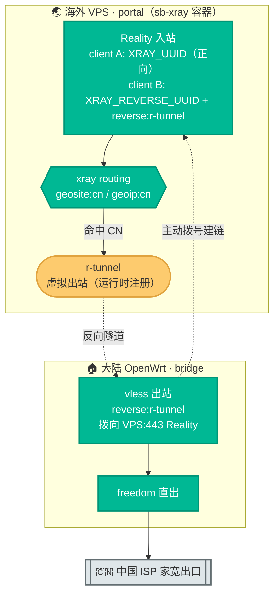
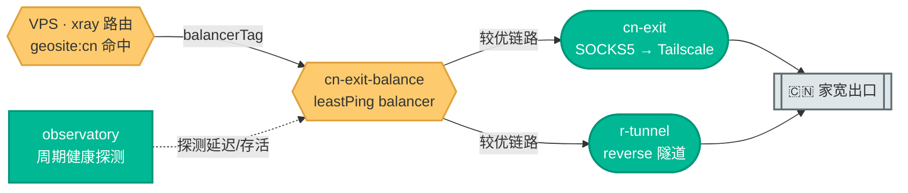

# 08. Xray Reverse Bridge 回国架构设计与配置指南

本文把「**用 Xray 反向代理（reverse bridge）做海外回国**」这套链路讲透：境外设备访问大陆限定服务时，海外 VPS 把国内流量经一条**由家里主动建立**的加密隧道丢回大陆软路由，从家宽 IP 直出。文章从概念讲到底层，配图配命令，**新手能照着做、工程师能看懂为什么**。

> **本文与相邻文档的分工**：
> - [05. VLESS Reverse Proxy 部署指南](./05-reverse-proxy-guide.md) 讲 reverse 这套机制本身（portal/bridge、双 UUID、内网穿透）。
> - [07. Tailscale 代理架构设计与配置](./07-tailscale-proxy-architecture.md) 讲**另一套**回国方案（Tailscale + OpenClash SOCKS5）。
> - 本文 08 专讲**用 reverse bridge 回国**：架构、流量图解、`CN_EXIT_MODE` 开关与主备故障转移、完整踩坑。两套回国方案怎么选见 §7.2。

---

## 阅读约定：三种信息块

| 图标 | 含义 | 给谁看 |
|---|---|---|
| 📘 **概念卡** | 一句话讲清「是什么、为什么」，零黑话 | 新手必读 |
| 🔧 **配置块** | 可复制的命令 / 配置，标注「自动」还是「需手动」 | 动手部署的人 |
| 🔬 **深挖框** | 路由注入、虚拟出站、observatory 等底层机制 | 工程师，新手可跳过 |

**读者导航**：
- **新手快速上手** → §1（概念）→ §3（流量图解）→ §4（配置）
- **工程师 / 排障** → §2（架构）→ §3.2（balance 主备）→ §6（踩坑实录）

---

## 0. 全局总览：谁主动连谁，流量怎么回家

📘 **一句话**：大陆软路由（bridge）**主动**拨向海外 VPS（portal）建一条长连接隧道；之后 VPS 把命中 `geosite:cn` 的国内流量沿这条隧道**反向**送回大陆，由 bridge 用家宽直出。全程不需要家里有公网 IP，也不需要在家宽上开任何端口。


| 角色 | 位置 | 职责 | 关键点 |
|---|---|---|---|
| **portal** | 海外 VPS（如 dc99-3） | 接收客户端，按 `geosite:cn` 把国内流量送进 `r-tunnel` | `ENABLE_REVERSE=true` + `CN_EXIT_MODE=reverse`/`balance` |
| **bridge** | 大陆 OpenWrt | 主动拨向 portal 建隧道；隧道来的流量 freedom 直出 | 跑 `xray -c client.json`，只需能出站访问 VPS 443 |

> 📘 **为什么是 bridge 主动拨号**：大陆家宽通常没有公网 IP、还在运营商 NAT 后面，VPS 无法主动连进来。reverse 反过来——让能出站的一方（bridge）主动连公网的一方（portal），隧道建成后流量就能**双向**走。这正是它不需要公网 IP / 不需要开端口的根本原因。

---

## 1. 基础概念（新手必读，零配置）

### 1.1 reverse / portal / bridge 是什么

📘 portal（门户）在公网，bridge（桥）在内网。bridge 主动连 portal，二者之间形成一条带标签的隧道；portal 上凡是路由到这个标签的流量，都会被「反向」推到 bridge 那侧出去。本项目里这条隧道的标签固定叫 **`r-tunnel`**。

### 1.2 它和「正向翻墙」有什么不同

📘 平时翻墙是：你的设备 → VPS → 国外网站（**出国**）。reverse bridge 回国是：境外设备 → VPS →（反向隧道）→ 大陆家宽 → 大陆网站（**回国**）。同一台 sb-xray 既能出国也能回国，互不干扰。

### 1.3 双 UUID 隔离

📘 portal 上有两个 UUID：`XRAY_UUID` 给普通翻墙客户端用，`XRAY_REVERSE_UUID` **只给 reverse 隧道用**。两者严格分离——拿到反向隧道 UUID 的 bridge 不能用它当普通代理上网，避免家宽出口被滥用。`XRAY_REVERSE_UUID` 容器首启自动生成并持久化，无需手填。

### 1.4 `r-tunnel` 是「虚拟出站」

🔬 portal 的 `xr.json` 里**找不到**一个 `tag: "r-tunnel"` 的 outbound——它不是静态配置的。portal 的 Reality 入站里挂了一个带 `reverse: {tag: "r-tunnel"}` 的 client；当 bridge 用这个 UUID 连上来，Xray 内核在**运行时**把 `r-tunnel` 注册成一个可被路由引用的虚拟出站。所以路由规则写 `outboundTag: "r-tunnel"` 能生效，但前提是 **bridge 已连上**——这点对下面 balance 模式很关键。

---

## 2. 架构设计

### 2.1 组件全景



### 2.2 `CN_EXIT_MODE`：回国出口的总开关

📘 国内流量走哪条回国链路，由 `docker-compose.yml` 的 `CN_EXIT_MODE` 显式决定：

| `CN_EXIT_MODE` | 国内流量出口 | 说明 | 本文相关 |
|---|---|---|---|
| `socks5` | `cn-exit` SOCKS5 出站 | Tailscale/OpenClash 方案（见 [07](./07-tailscale-proxy-architecture.md)） | 否 |
| `reverse` | `r-tunnel` 反向隧道 | **本方案** | ✅ §3.1 / §4 |
| `balance` | `cn-exit` + `r-tunnel` 主备 | 两条链路并挂、自动故障转移 | ✅ §3.2 |
| `off` | 封禁（不回国） | — | — |

> 留空 `CN_EXIT_MODE` 时按既有变量派生（向后兼容）：`CN_EXIT_SOCKS5_HOST` 有值且 `ENABLE_SOCKS5_PROXY=true` → `socks5`；否则 `REVERSE_CN_EXIT=true` → `reverse`；否则 `off`。**建议显式设置** `CN_EXIT_MODE`，不要再依赖「有没有值」的隐式判断。

> 📋 `CN_EXIT_*` / `REVERSE_DOMAINS` 等回国相关变量的完整默认值速查见 [04. 运维 §2.7](./04-ops-and-troubleshooting.md#27-回国出站cn_exit_mode-家族可选)。

🔬 **portal 侧路由改写**（`scripts/sb_xray/config_builder.py`）：容器启动渲染 `xr.json` 时，把 `cn-ip`（默认封禁）规则下移到 `private-ip` 之前、剥离 ban 标记，并前置 `geosite:cn`、`geoip:cn` 两条回国规则（`reverse` 写 `outboundTag: r-tunnel`，`balance` 写 `balancerTag: cn-exit-balance`），同时前置两条豁免：`full:www.gstatic.com → direct`（健康检查豁免，防止 mihomo/OpenClash 默认探测域名被卷进回国隧道，隧道一断全节点健康检查崩）、`geosite:geolocation-!cn → direct`（海外直出护栏，见 §2.3）。

### 2.3 回国路由策略（哪些流量回国，哪些海外直出）

📘 一句话：**只有真·国内服务回国，已知海外服务一律海外直出**。portal 的 `xr.json` 路由按顺序匹配，下表即优先级：

| 顺序 | 规则 | 命中流量 | 去向 |
|---|---|---|---|
| 1 | 服务级规则（`geosite:netflix` / `google` / …） | 显式海外服务 | isp-auto / direct |
| 2 | `geosite:geolocation-!cn → direct` | **已知海外兜底**（护栏） | 海外直出（VPS 出口） |
| 3 | `geosite:cn → 回国` | 国内服务 | `r-tunnel` / `cn-exit-balance` |
| 4 | `geoip:cn → 回国` | 国内 IP 兜底 | `r-tunnel` / `cn-exit-balance` |
| 5 | 默认 | 其余海外 | 海外直出 |

🔬 **第 2 层护栏的作用**：`geosite:cn` 的语义是「在中国境内可直连」的域名，部分被上游标记 `@cn` 的海外 CDN（`dl.google.com`、`*.gvt1.com`、`*.googleapis.com` 等）也会被算作可直连而收入其中。一旦这类域名落进回国规则，Google Play 等地区敏感应用会从国内 IP 访问而失效。第 2 层 `geolocation-!cn → direct` 作为**安全网**，先把已知海外服务切走，确保海外服务始终走海外出口，不受 `geosite:cn` 数据集差异影响。规则库由 `scripts/sb_xray/geo.py` 维护：`geosite.dat` 取自 MetaCubeX，`geoip.dat` 取自 Loyalsoldier。

> ⚠️ **广告拦截范围**：`category-ads-all` 覆盖主流广告域名，长尾广告可能漏网。如需更强拦截，可在客户端侧以独立 rule-provider 广告库补强（不影响回国分流）。

### 2.4 bridge 侧路由

🔬 bridge 的 `client.json` 路由只有一条：`inboundTag: ["r-tunnel"] → direct`。即「从反向隧道进来的流量，一律交给 freedom 出站直出」。bridge 不做任何分流——分流判断全在 portal 完成。

---

## 3. 流量图解

### 3.1 reverse 模式（CN_EXIT_MODE=reverse）

📘 整条链路「谁主动连谁、流量怎么回家」见 [§0 全局总览](#0-全局总览谁主动连谁流量怎么回家)；本节只把 reverse 单链路逐跳拆给工程师看。


🔬 **逐跳走读**：
1. 客户端 `GEOSITE,CN / GEOIP,CN` 命中的流量送往 VPS 节点。
2. portal 的 xray 路由把它交给 `r-tunnel` 虚拟出站。
3. 流量沿 bridge 早先建好的 Reality 隧道反向回到 OpenWrt，以 `inboundTag: r-tunnel` 进入。
4. bridge 路由把它交给 `freedom`，用家宽出口直连大陆服务。

### 3.2 balance 模式（CN_EXIT_MODE=balance）：主备故障转移

📘 **一句话**：把 reverse 隧道（`r-tunnel`）和 Tailscale SOCKS5（`cn-exit`）**两条回国链路同时挂上**一个 `leastPing` balancer，由 observatory 周期探测，哪条快/可用就走哪条；任一条断了自动切到另一条。适合既跑了 OpenClash 又跑了 xray bridge、想让回国不中断的场景。



🔬 **机制**：portal 生成一个 `cn-exit-balance` balancer（`selector: ["cn-exit","r-tunnel"]`，策略 `leastPing`，`fallbackTag: direct`），并把 `cn-exit`、`r-tunnel` 加入 observatory 的 `subjectSelector`。国内流量改用 `balancerTag` 引用它。探测地址由 `CN_EXIT_PROBE_URL`（默认 `http://connect.rom.miui.com/generate_204`，大陆可达返回 204）、`CN_EXIT_PROBE_INTERVAL`（默认 `30s`）控制，探测**直接经各出站发起、不经路由规则**。

> ℹ️ **observatory 为全局单例**：若已启用 ISP balancer（已存在 observatory），balance 模式只把 `cn-exit`、`r-tunnel` 合并进其 `subjectSelector`，探测地址/间隔沿用既有 observatory 的设置，`CN_EXIT_PROBE_URL`/`CN_EXIT_PROBE_INTERVAL` 不生效。两条回国腿对外网探测地址均可达，故障判定不受影响。

> ✅ **能力确认（Xray 26.3.27 实测）**：`r-tunnel` 是运行时动态注册的**虚拟出站**，实测可被 observatory 纳入探测：bridge 在线时 balancer 选 `r-tunnel`；停掉 bridge 后约一个探测周期内自动切换 `cn-exit`，回国不中断；bridge 恢复后回切 `r-tunnel`。若你的 Xray 版本实测发现 balancer 始终只走 `cn-exit`（即 `r-tunnel` 未被探测到），请退回 `CN_EXIT_MODE=reverse` 或 `socks5` 单链路模式。部署后按 §6.4 确认两条链路都被选中过，再宣称「主备生效」。

---

## 4. 配置说明

### 4.1 portal 侧（VPS · docker-compose.yml）

🔧 **reverse 单链路**：

```yaml
- CN_EXIT_MODE=reverse
- ENABLE_REVERSE=true
# - REVERSE_DOMAINS=domain:lan   # 顺带做内网穿透时填；纯回国可留空
```

🔧 **balance 主备**（额外需要 SOCKS5 那条就绪，见 [07](./07-tailscale-proxy-architecture.md)）：

```yaml
- CN_EXIT_MODE=balance
- ENABLE_REVERSE=true
- ENABLE_SOCKS5_PROXY=true
- CN_EXIT_SOCKS5_HOST=<OpenWrt 的 Tailscale IP>
# - CN_EXIT_PROBE_URL=http://connect.rom.miui.com/generate_204   # 可选，默认即可
# - CN_EXIT_PROBE_INTERVAL=30s
```

重启容器并确认日志：

```sh
docker compose down && docker compose up -d
docker compose logs sb-xray | grep -E "CN-exit|r-tunnel"
# reverse 预期：CN-exit: cn-ip/geosite:cn 规则改为 r-tunnel
# balance 预期：CN-exit(balance): selector=['cn-exit', 'r-tunnel'] leastPing
```

🔧 **多 VPS 批量初始化**：每台 VPS 用 `sources/vps/vps-cn-exit-init.sh`（用法详见 [sources/vps/README.md](../sources/vps/README.md)）一键写 `.env`（回国项以 `${VAR}` 注入 docker-compose）、装 Tailscale 入网、配 VPS 侧 keepalive、拉起容器，嵌进你的 provisioning 即可。各台 `XRAY_REVERSE_UUID` 自动生成持久化、互不冲突；socks5 腿命脉是 Tailscale 链路，务必每台都入 tailnet。配一次永不改 env，回国拨号切换全在 OpenWrt 侧 `cn-bridge` 完成。

### 4.2 balance 降级守卫：缺变量时会发生什么

📘 **一句话**：`balance` 不是「写了就一定双腿」——它对前置变量有硬依赖，缺哪个就静默降级。下表是 portal 渲染 `xr.json` 时（`scripts/sb_xray/config_builder.py` 的 `_apply_cn_exit_balance`）的实测行为，**降级只打日志、不报错**，所以务必照「如何验证」核对，别凭 `CN_EXIT_MODE=balance` 就以为生效。

| 缺失的前置变量 | portal 实际行为 | 后果 | 日志关键字 |
|---|---|---|---|
| `CN_EXIT_SOCKS5_HOST` 未设置/为空 | **整档 balance 改写跳过**，回国规则不被注入 | CN 流量保持 base 模板的 `block`——**不回国**（被封禁） | `CN-exit(balance): CN_EXIT_SOCKS5_HOST 未设置,跳过` |
| `ENABLE_REVERSE` 不为 `true` | **退化为仅 socks5 单腿**（不挂 r-tunnel，不建 balancer） | 回国可用但**无主备**，只走 SOCKS5 那条 | `CN-exit(balance): ENABLE_REVERSE!=true,r-tunnel 不可用,balance 退化为仅 socks5` |
| 两者都齐 | 正常生成 `cn-exit-balance` balancer（`selector: ["cn-exit","r-tunnel"]`，`leastPing`） | 双腿主备生效 | `CN-exit(balance): selector=['cn-exit', 'r-tunnel'] leastPing` |

🔧 **如何验证降级**：重启后 `docker compose logs sb-xray | grep "CN-exit(balance)"`，比对上表日志关键字——看到「未设置,跳过」说明根本没回国，看到「退化为仅 socks5」说明丢了 r-tunnel 主备。要双腿生效，`CN_EXIT_SOCKS5_HOST` 和 `ENABLE_REVERSE=true` 缺一不可。

### 4.3 拿落地机配置下载链接

🔧 portal 已把所有参数填好，渲染出一份可直接用的 bridge 配置。运行 `show` 取链接：

```sh
docker exec sb-xray show
# 找到「🔁 Reverse Bridge 落地机配置」一行，下面是带 token 的下载地址：
# https://<你的域名>/sb-xray/reverse_bridge_client.json?token=<SUBSCRIBE_TOKEN>
```

### 4.4 bridge 侧（大陆 OpenWrt）

🔧 **推荐：一键脚本**。仓库 `sources/openwrt/cn-exit-setup.sh` 已把「装 xray + 带 token 拉取已渲染 `client.json` + 写 `/etc/init.d/xray-bridge` 开机自启 + 自检」固化成幂等脚本，`CN_EXIT_MODE=reverse` 时只跑 bridge 相关步骤、不碰 Tailscale。

```sh
# 路由器上直接下载（持久，可反复重跑）：
mkdir -p /root/sb-xray-openwrt && cd /root/sb-xray-openwrt
for f in cn-exit-setup.sh config.env.example; do
  wget -O "$f" "https://raw.githubusercontent.com/currycan/sb-xray/main/sources/openwrt/$f"
done
cp config.env.example config.env
vi config.env          # CN_EXIT_MODE=reverse；填 VPS_DOMAIN / SUBSCRIBE_TOKEN / XRAY_VERSION
sh cn-exit-setup.sh

# 或内联一行（免建文件）：
CN_EXIT_MODE=reverse VPS_DOMAIN=<你的域名> \
  SUBSCRIBE_TOKEN=<token> XRAY_VERSION=26.3.27 \
  sh cn-exit-setup.sh
```

> `balance` 模式把 `CN_EXIT_MODE` 改成 `balance` 并补齐 Tailscale 相关变量即可（脚本会同时装 Tailscale 与 bridge）。详见 [sources/openwrt/README.md](../sources/openwrt/README.md)。

🔧 **手动等价**（不想用脚本时）：

```sh
# arm64（uname -m 显示 aarch64）；x86 软路由改 Xray-linux-64.zip
wget -O /tmp/xray.zip https://github.com/XTLS/Xray-core/releases/download/v26.3.27/Xray-linux-arm64-v8a.zip
opkg update && opkg install unzip
unzip /tmp/xray.zip xray -d /usr/bin/ && chmod +x /usr/bin/xray

mkdir -p /etc/xray
wget "https://<你的域名>/sb-xray/reverse_bridge_client.json?token=<SUBSCRIBE_TOKEN>" -O /etc/xray/client.json
grep '\${' /etc/xray/client.json   # 无输出 = 占位符已全部填好

cat > /etc/init.d/xray-bridge << 'EOF'
#!/bin/sh /etc/rc.common
START=99
USE_PROCD=1
start_service() {
    procd_open_instance
    procd_set_param command /usr/bin/xray run -config /etc/xray/client.json
    procd_set_param respawn
    procd_set_param stdout 1
    procd_set_param stderr 1
    procd_close_instance
}
EOF
chmod +x /etc/init.d/xray-bridge
/etc/init.d/xray-bridge enable && /etc/init.d/xray-bridge start
```

> 📘 bridge 与 OpenClash 可并存：xray-bridge 拨向 VPS 的连接是路由器**自身**出站流量，OpenClash 默认不接管本机流量，二者通常互不干扰（细节同回国方案一的注意事项）。

### 4.5 客户端

📘 客户端操作与方案一完全相同（客户端只负责把国内流量送到 VPS，具体走哪条回国链路由 portal 的 `CN_EXIT_MODE` 决定）：把订阅里的 **`国内流量`** 策略组从「直接连接」切到你的 sb-xray VPS 节点即可。人在国内时记得切回「直接连接」。

### 4.6 多节点高可用：多公网 VPS + `cn-bridge` 拨号

单条 bridge 是单点——那台 VPS 宕机，走它的回国就断。多公网部署让每台 VPS 都成为独立回国入口：家里 OpenWrt 对**热备**节点常驻拨通、**冷备**节点平时不拨、故障时一条命令顶上。

🔧 **配置**（`sources/openwrt/config.env`）：`BRIDGE_NODES` 列全部 VPS 节点池，`BRIDGE_HOT` 指定常驻热备：

```sh
# 每项 名:FQDN:token，空格分隔；token 为各 VPS show 输出 ?token= 后那段（可各异）
BRIDGE_NODES="dc99:dc99.example.com:tokA jp:jp.example.com:tokB cn2:cn2.example.com:tokC"
BRIDGE_HOT=dc99,jp     # 常驻拨通的热备；其余为冷备
```

`sh cn-exit-setup.sh` 会生成节点清单 `/etc/cn-exit/nodes.list`、安装 `cn-bridge` 工具，并对热备各拨一条独立 `xray-bridge-<名>` 进程（api 端口自动错开，避免多进程都监听 7979 冲突）。

🔧 **`cn-bridge` 拨号工具**（运行时随时切换，不改任何 VPS 配置）：

```sh
cn-bridge list            # 列出全部节点 + 拨号/进程状态
cn-bridge up cn2          # 把冷备 cn2 拨通（下 client + 起进程 + 开机自启）
cn-bridge down cn2        # 断开（停 + disable + 删 client/service）
cn-bridge status          # ESTABLISHED 概览 + 列表
cn-bridge                 # 交互菜单
```

📘 **热备 / 冷备语义**：

- **热备**（`BRIDGE_HOT`）：常驻拨通，有 r-tunnel 腿。r-tunnel 走 freedom 直出、不经 OpenClash 二次分流，质量更纯净；但 `balance` 的 `leastPing` **仅按探测 RTT 选路、不含任何质量偏置**——RTT 更低的那条腿被选中，与「纯净度」无关。若某时刻 socks5 腿 RTT 更低，leastPing 会选 socks5，并不保证优先走 r-tunnel。
- **冷备**：未拨、没有 r-tunnel 腿，但只要它在 tailnet 里就仍有 **socks5 腿**（经 Tailscale 回国），`balance` 的 observatory 探测 r-tunnel 失败后**自动用 socks5 兜底——不黑洞**。故障时 `cn-bridge up <名>` 秒级升它为双腿。

> ⚠️ 所有回国流量最终都从家里**同一条家宽上行**出去。多 VPS 是**入口冗余**（某台挂了切别台），**不增加**回国出口带宽。

📘 **两腿质量对齐**：socks5 腿的回国流量到家里 OpenClash 后会被二次分流，灰色域名（如部分 IP 查询站）可能被判海外走代理出口而回国失败。脚本注入 `IN-PORT,7891,DIRECT` 规则，把经 SOCKS5 入站（7891）的回国流量强制纯直出，对齐 r-tunnel——长期只有 socks5 腿的冷备台也满质量。注意按入站端口区分、不能按来源 IP（socks5 来源与 exit-node 终端同为 Tailscale CGNAT `100.64.0.0/10`，按 IP 会误伤终端的海外流量）。

🔧 **监控告警**：`cn-bridge-monitor`（cron 周期跑）探活热备 r-tunnel 隧道 + Tailscale 守护 / 离线 peer，连续失败去抖后 telegram 告警、恢复发通知。在 `config.env` 填 `ALERT_TG_TOKEN` / `ALERT_TG_CHAT` 启用（与 VPS shoutrrr 用同一个 bot 即可）。

---

## 5. 验证

📘 **关键思路**：海外 VPS 本身就在海外，回国要证明的是「CN 流量从中国 IP 出去」，与发起客户端无关。所以**不需要单独的海外测试设备**，在 VPS 上自包含验证即可。

🔧 **portal 配置已生效**：

```sh
docker compose exec sb-xray cat /sb-xray/xray/xr.json | python3 -m json.tool | grep -E 'r-tunnel|cn-exit-balance|cn-geosite'
# reverse：cn-geosite/cn-ip 的 outboundTag 为 r-tunnel
# balance：cn-geosite/cn-ip 用 balancerTag cn-exit-balance，且 routing.balancers 有 cn-exit-balance
```

🔧 **隧道已建链**（bridge 起来后，在 VPS 看 xray 日志出现 r-tunnel 相关握手 / 连接）。

🔧 **回国出口 IP**：在 VPS 跑一个本地 xray/sing-box 客户端回环连自己的 VLESS 入站，`curl -x` 访问命中 `geosite:cn` 的回显站确认是中国 ISP IP：

```sh
curl -x <本地客户端代理> http://cip.cc
# 期望显示大陆家宽 IP / 归属地
```

> ⚠️ 别用 `myip.ipip.net` / `ip.sb` 验证——它们不在 `geosite:cn`，会被当国外流量走出国链路，显示 VPS/代理 IP，是**假象**。务必用确定命中 `geosite:cn` 的国内回显（如 `cip.cc`）。

🔧 **balance 故障转移**：两条链路都在 → curl 得中国 IP；停掉 OpenWrt 的 `xray-bridge`（r-tunnel 断）→ 等一个 `CN_EXIT_PROBE_INTERVAL` → 再 curl 仍是中国 IP（自动切 `cn-exit`）；重启 bridge 恢复。

---

## 6. 踩坑实录

### 6.1 reverse bridge 连不上 VPS

常见原因：`XRAY_REVERSE_UUID` 两侧不一致、Reality `publicKey`/`shortId` 抄错、VPS 防火墙未放行 443/TCP、bridge 出站被本机 OpenClash 截走。用 `show` 重新下载已渲染配置可排除前两类（参数由 portal 自动填，不会手抄出错）。

### 6.2 国内流量没走 reverse，而是走了 SOCKS5

📘 历史版本靠「`CN_EXIT_SOCKS5_HOST` 有没有值」隐式决定，SOCKS5 会**默默优先**于 reverse。现在改用显式 `CN_EXIT_MODE`：想强制走 reverse 就设 `CN_EXIT_MODE=reverse`，不必再清空 SOCKS5 的 HOST。

### 6.3 隧道一断，所有节点健康检查全挂

🔬 mihomo/OpenClash 默认拿 `www.gstatic.com` 做健康检查，而 `geosite:cn` 收录了 `full:www.gstatic.com`。若它被卷进回国隧道，隧道一断健康检查全部失败、客户端节点集体掉线。portal 已自动前置 `full:www.gstatic.com → direct` 豁免规则规避此坑（见 §2.2）。

### 6.4 balance 模式：确认 r-tunnel 真被选中过

🔬 由于 §3.2 的能力边界，balance 部署后**必须**确认 `r-tunnel` 确实参与了均衡，而非永远只走 `cn-exit`。两种验证：

**① 非侵入（推荐先做）**——看两条腿是否都在承载流量。portal 上查 xray 统计：

```sh
docker exec sb-xray xray api statsquery --server=127.0.0.1:7978 2>/dev/null \
  | grep -E 'reverse@portal.bridge|cn-exit>>>traffic'
# 期望：user>>>reverse@portal.bridge>>>traffic（r-tunnel 腿）与
#       outbound>>>cn-exit>>>traffic（socks5 腿）的 uplink/downlink 均 > 0 且随使用增长
```

> `r-tunnel` 是运行时虚拟出站、不在 `xr.json` 静态出站里，故 `xray api bi` 可能报 `unknown service RoutingService`（容器只开 StatsService）；用 `statsquery` 看 `reverse@portal.bridge` 用户流量即可佐证 bridge 已连上并在传数据。

**② 侵入（故障转移演练）**——停一条腿看是否自动切换：停 bridge（`cn-bridge down <名>`，r-tunnel 断）观察回国是否仍通（切到 SOCKS5）；反之停 OpenClash（SOCKS5 断）观察是否仍通（走 r-tunnel）。两个方向都验证过，才算主备成立。若 `r-tunnel` 始终不被探测命中，退回单链路 `reverse` / `socks5`。

### 6.5 测试陷阱

用对域名（`cip.cc` 命中 `geosite:cn`），别用 `myip.ipip.net`（见 §5 警告）；在 VPS 本机而非家里 WiFi 下测（家里测不出回国效果）。

### 6.6 ISP 重测会顺带重注入回国路由（跨子系统耦合）

🔬 回国分流与 ISP 测速是**同一份 `xr.json`**。`isp-retest`（cron 周期跑）一旦发现 ISP 节点集合变化或路由类别翻转，会调用 `config_builder.create_config()` 整份重渲染——而重渲染必然重跑 `_apply_cn_exit`，按当前 `CN_EXIT_MODE` 重注入回国路由规则。含义有二：① 回国分流不是「配一次定死」，每次 ISP 重测重启 daemon 都会重建一遍；② 若运行时 env 与首启不一致（如某变量被改），重渲染会以**当前** env 为准，可能与你预期的回国姿态不同。排查回国异常时，若恰逢 ISP 重测窗口，先确认这次重渲染用的 `CN_EXIT_MODE` / `CN_EXIT_SOCKS5_HOST` / `ENABLE_REVERSE` 是否仍是你想要的（见 §4.2 降级守卫）。

---

## 7. 附录

### 7.1 与 reverse 内网穿透的关系

📘 同一条 reverse 隧道既能做「回国出口」（本文，`CN_EXIT_MODE=reverse`/`balance`），也能做「内网穿透」（访问家里 NAS 等，配 `REVERSE_DOMAINS`）。两者可同时开：`geosite:cn` 走回国、`REVERSE_DOMAINS` 列出的内网域名走穿透，都经同一条 `r-tunnel`。内网穿透细节见 [05](./05-reverse-proxy-guide.md)。

### 7.2 两套回国方案怎么选

| 维度 | 方案一 Tailscale SOCKS5（[07](./07-tailscale-proxy-architecture.md)） | 本方案 reverse bridge |
|---|---|---|
| 大陆侧依赖 | OpenWrt + OpenClash + kmod-tun（kernel TUN） | OpenWrt 能跑 xray、能出站 443 即可 |
| 公网 IP | 不需要 | 不需要 |
| 适用场景 | 已有 OpenClash、要 exit node/subnet router | 无 kmod-tun、或纯回国/内网穿透 |
| 与本方案并用 | `CN_EXIT_MODE=balance` 两条主备 | — |

### 7.3 术语速查

| 术语 | 含义 |
|---|---|
| portal | 公网一侧（海外 VPS），接收客户端、做路由判断 |
| bridge | 内网一侧（大陆 OpenWrt），主动拨号建隧道、freedom 直出 |
| `r-tunnel` | reverse 隧道的标签 / portal 上的虚拟出站 |
| `XRAY_REVERSE_UUID` | reverse 隧道专用 UUID，与正向代理 UUID 隔离 |
| `cn-exit` | SOCKS5 回国出站（方案一），balance 时与 r-tunnel 并挂 |
| `cn-exit-balance` | balance 模式的 leastPing balancer 标签 |
