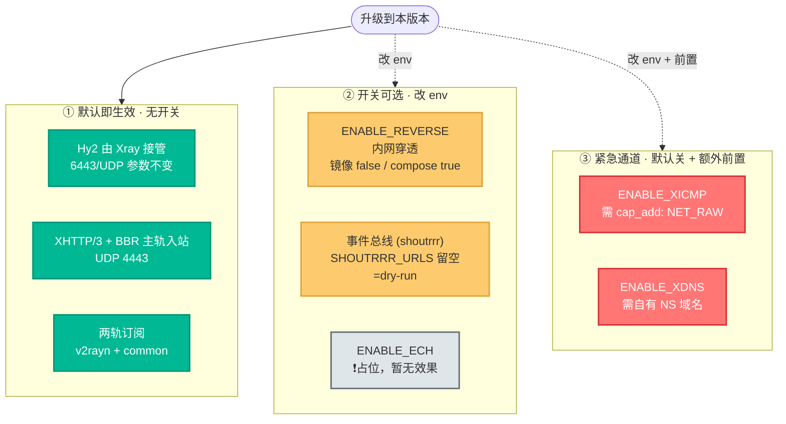
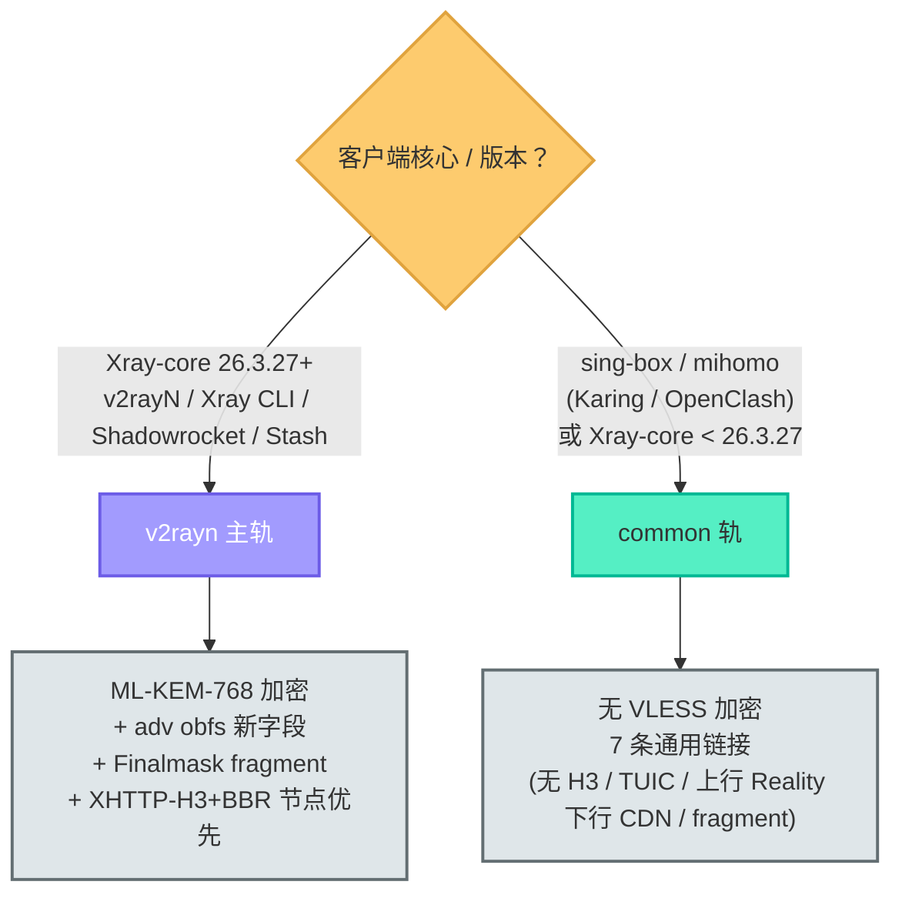
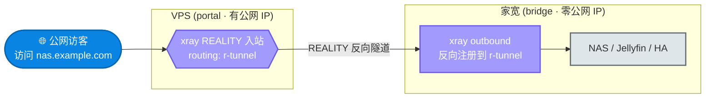
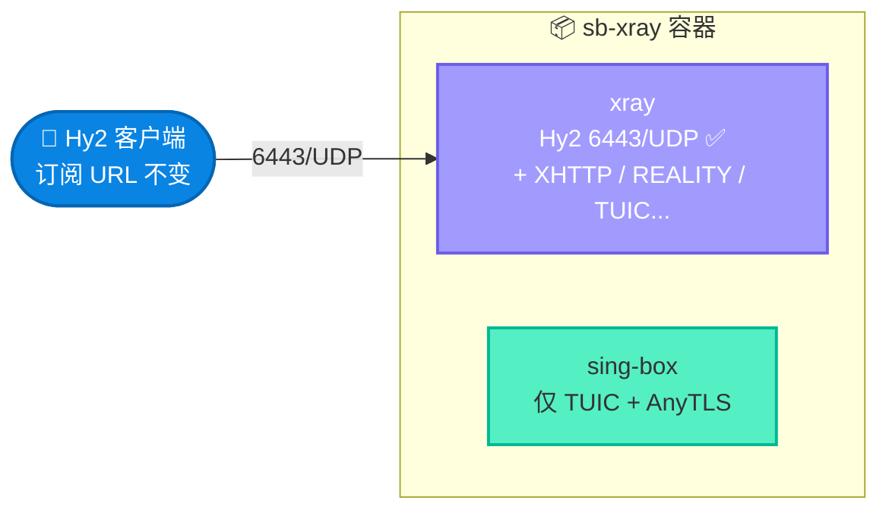
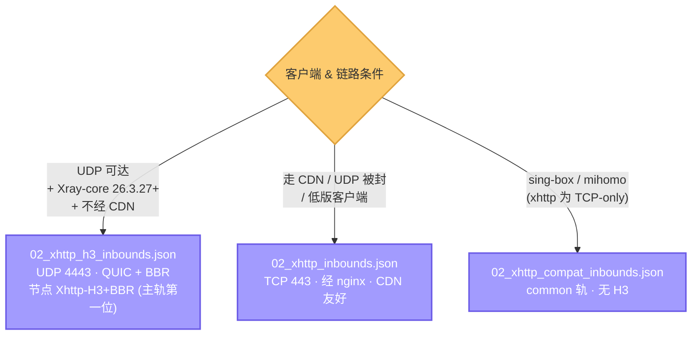
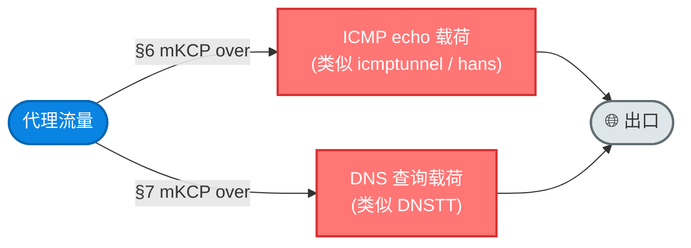

# 09. 特性开关与可选能力指南

把 sb-xray 容器里**默认即生效的进阶能力**（Hy2 由 Xray 接管、XHTTP/3+BBR、两轨订阅）和**按需打开的可选特性**（内网穿透、事件总线、抗封锁紧急通道）一次讲清。每个能力按"**做什么 / 何时用 / 怎么开 / 如何验证 / 故障排查**"五段式组织，新手照着开，工程师看懂为什么。

> **默认安全姿态（镜像内默认）**：不改任何 env、用镜像内默认值时，容器行为是 —— Hy2 由 Xray 接管但客户端参数无感；所有实验性入站（XICMP / XDNS / ECH）关闭；`ENABLE_REVERSE` 镜像内默认 `false`；webhook 事件总线以 dry-run 模式运行（仅本地日志，不发外部通知）。**升级即用，零配置不踩雷。**
>
> ⚠️ **标准 compose 部署不同**：`docker-compose.yml` 把 `ENABLE_REVERSE` 有意覆盖为 `true`（`${ENABLE_REVERSE:-true}`），故标准 compose 部署下 reverse **默认开**。两个默认值都正确、有意为之，权威口径见 §3 与 [docs/04](./04-ops-and-troubleshooting.md) §2.7（04 为 env 权威 owner）。

> **本文定位（详述 vs 仅索引）**：本文是全部 feature flag 的**总索引**（§9 速查表），也是**无独立主文档的能力**——紧急通道（XICMP/XDNS，§6/§7）、两轨订阅（§2）、XHTTP/3 主轨（§5）、ECH 占位（§8）、降载 flag（§11）——的**唯一详述地**。已有独立主文档的能力，本文只放概念卡 + 入口，详述在对应文档：
>
> - **协议机制**（mKCP 参数、finalmask 封装、应急 inbound 模板）→ [docs/02](./02-protocols-and-security.md) §1.13（机制 owner；§6/§7 仅留开关与连通性验证）
> - **env / 默认值权威口径**（含 `ENABLE_REVERSE` 双默认）→ [docs/04](./04-ops-and-troubleshooting.md) §2.7（env owner；本文引用，不自立口径）
> - **Reverse Proxy 完整部署** → [docs/05](./05-reverse-proxy-guide.md)（§3 仅放概念卡 + 入口）
> - **事件总线完整文档** → [docs/06](./06-event-bus-shoutrrr.md)（§1 仅放概念卡 + 入口）

## 阅读约定：三种信息块

| 图标 | 含义 | 给谁看 |
|---|---|---|
| 📘 **概念卡** | 一句话讲清「是什么、为什么」，零黑话 | 新手必读 |
| 🔧 **配置块** | 可复制的命令 / 配置，标注「自动」还是「需手动」 | 动手部署的人 |
| 🔬 **深挖框** | 协议机制、模板字段、客户端兼容性等底层细节 | 工程师，新手可跳过 |

---

## 能力总览

容器里的能力按**「要不要动手」**分三层：升级即生效的、改一个 env 就能开的、以及需要额外前置（容器能力 / NS 域名）的抗封锁备选。



📘 **怎么读这张图**：

- **绿色第①层**：你什么都不用做，升级后自动拥有。唯一要确认的是宿主机防火墙放行了 XHTTP/3 的 UDP 端口（见 §5）。
- **黄/灰第②层**：改 `docker-compose.yml` 一两个环境变量即可，互不影响，按需开关。注意 `ENABLE_REVERSE` 镜像内默认 `false` 但**标准 compose 部署已默认 `true`**（回国 `balance` 链路依赖），双口径见 §3 与 [docs/04](./04-ops-and-troubleshooting.md) §2.7。
- **红色第③层**：仅在**常规通道全被封**的极端场景才用，牺牲带宽换可达性，且需要额外前置条件。

**读者导航**：
- **只想升级后确认一切正常** → §4（Hy2）→ §5（XHTTP/3 防火墙）→ §10（通用排查）
- **想暴露家宽服务 / 流媒体落地** → §3（Reverse Proxy）
- **想收安全告警** → §1（事件总线）
- **被重度封锁找备选** → §6（XICMP）/ §7（XDNS）
- **小内存机器要瘦身** → §11（降载 flag）

---

## 1. 事件总线（webhook → shoutrrr）

📘 一句话：**让节点上的安全事件主动找你**——Xray ban 规则命中 → webhook POST → `shoutrrr` CLI → Telegram / Discord / Slack / Gotify。


适合想实时知道节点被 BT / 广告流量骚扰、客户端触发私网 IP 防护、或国内回源审计的运维用户。默认 dry-run（`SHOUTRRR_URLS` 留空时只进容器日志，不外发）。

**→ 完整产品文档（含架构图、序列图、Telegram 5 分钟快速开始、故障排查速查表）：[`06-event-bus-shoutrrr.md`](./06-event-bus-shoutrrr.md)**

---

## 2. 两轨订阅（v2rayn + common）

**做什么**：订阅分两轨。adv 能力（XHTTP obfuscation 字段 `xPaddingQueryParam` / `xPaddingPlacement` / `UplinkDataPlacement` + Finalmask `tcp.fragment`）**内置于 `02_xhttp_inbounds.json` 主轨**，无独立 adv 轨。按客户端核心选轨：



| 轨道 | URL 路径 | 目标客户端 | 包含能力 |
|---|---|---|---|
| **v2rayn** (主轨) | `https://${CDNDOMAIN}/sb-xray/v2rayn?token=${SUBSCRIBE_TOKEN}` | **Xray-core 26.3.27+**（v2rayN / Xray CLI / Shadowrocket / Stash 等） | ML-KEM-768 + adv obfs 新字段 + Finalmask fragment + **XHTTP-H3 + BBR 节点优先** |
| **common** | `https://${CDNDOMAIN}/sb-xray/common?token=${SUBSCRIBE_TOKEN}` | **mihomo / OpenClash / Karing / 低版 Xray-core（<26.3.27）** | 无 VLESS 加密 + 7 条通用链接（无 H3 / TUIC / 上行 Reality 下行 CDN / fragment） |

🔬 **为什么是两轨**：
- XHTTP-H3 客户端必然 Xray-core 26.3.27+，已在 `02_xhttp_h3_inbounds.json` 内嵌 adv obfs 字段
- v2rayN 跟随 Xray-core 最新发布，绝大多数 v2rayN 用户都在 26.3.27+ 范围内，主轨直接吃 adv 字段
- Karing / OpenClash 走 `common`（sing-box / mihomo 不认 ML-KEM）
- **一套主轨吃最新 Xray-core，一套 common 吃其他**

**何时用 common 而非主轨**：
- 客户端核心是 **sing-box / mihomo**（Karing / OpenClash）
- 或 Xray-core 版本 **< 26.3.27**（碰到 obfs 新字段会握手失败）

🔧 **如何验证**：

```bash
docker exec sb-xray sh -c 'echo v2rayn:;        base64 -d /sb-xray/subscribe/v2rayn        | wc -l'
docker exec sb-xray sh -c 'echo common:;        base64 -d /sb-xray/subscribe/common        | wc -l'
# 确认无 v2rayn-adv 独立轨产物：
docker exec sb-xray sh -c 'ls /sb-xray/subscribe/ | grep -c v2rayn-adv'
# 期望：0（adv 能力在主轨，无独立 adv 订阅产物）
```

**故障排查**：
- 旧订阅 URL 是 `/v2rayn-adv`：**改订阅 URL 为 `/v2rayn`** —— 主轨包含全部 adv 能力
- 主轨节点全部延迟 -1：客户端版本 < 26.3.27，**改订阅 `/common`**
- 订阅不含 Vmess-Adv 节点：v2rayN URL 标准不支持 `fm=` 字段承载 Finalmask header-custom，故无此类节点

---

## 3. VLESS Reverse Proxy 内网穿透

**做什么**：让**零公网 IP 的家宽落地机**通过 REALITY 隧道反向挂载到 VPS，在 VPS 侧按域名路由把流量回源到家宽内网。相当于 frp / cloudflared tunnel 的替代，但用同一套 Xray 二进制 + 同一条 REALITY 隧道。



**何时用**：
- 想在家宽暴露 NAS / Home Assistant / 家庭 IoT 服务，不想走 cloudflared tunnel 或买公网 IP
- 想让流媒体（Netflix / Disney）走家宽真实 ISP 出口以匹配 residential IP 需求
- VPS 要让部分业务"落地"到家宽以获得更好的国内访问路径

🔧 **怎么开**：完整部署步骤见 [`05-reverse-proxy-guide.md`](./05-reverse-proxy-guide.md)。

> 📘 **`ENABLE_REVERSE` 双默认**：镜像内默认 `false`（watchtower 兜底）；标准 compose 部署经 `${ENABLE_REVERSE:-true}` 覆盖为 `true`，故标准 compose 部署下 reverse **已默认开**。权威口径见 [docs/04](./04-ops-and-troubleshooting.md) §2.7（env owner，本文不自立口径）。下方示例为显式声明，标准 compose 部署可省 `ENABLE_REVERSE`（已默认 `true`），仅需补 `REVERSE_DOMAINS`。

核心 env 配置：

```yaml
    environment:
      # VPS（portal）侧
      - ENABLE_REVERSE=true            # 标准 compose 部署已默认 true，可省
      - REVERSE_DOMAINS=domain:home.lan,domain:nas.example.com,domain:jellyfin.example.com
```

落地机（bridge）侧部署时用 `templates/reverse_bridge/client.json` 作为 Xray outbound 模板，把自己注册为 `r-tunnel` 的反向连接源。

🔧 **如何验证**：

```bash
# 1. 确认 VPS 侧注入成功
docker exec sb-xray cat /sb-xray/xray/01_reality_inbounds.json \
  | jq '.inbounds[0].settings.clients | length'
# 启用 reverse 后应 = 2（原主 UUID + reverse UUID）

docker exec sb-xray cat /sb-xray/xray/01_reality_inbounds.json \
  | jq '.inbounds[0].settings.clients[] | select(.reverse)'
# 应看到 reverse: {tag: "r-tunnel"} 的条目

# 2. 确认 routing 规则
docker exec sb-xray cat /sb-xray/xray/xr.json \
  | jq '.routing.rules[0]'
# 应看到 ruleTag: "reverse-bridge" 指向 r-tunnel outbound

# 3. 从 VPS 访问 REVERSE_DOMAINS 列出的任一域名，应能穿透到家宽内网
```

**故障排查**：
- `jq: error: object .reverse not a bool`：Xray v26.3.27 里 `reverse` 是 `{tag:string}` 对象而非 bool；落地机模板用**扁平化 simplified 格式**，嵌套 `servers[]` 会被静默忽略
- bridge 断连：检查家宽侧 xray 日志，常见原因是出口网络封 REALITY；换条链路再试
- 撤销 reverse：`ENABLE_REVERSE=false` + `docker compose up -d` 重建容器；entrypoint 从原始模板重新渲染，孤儿条目被覆盖清理

---

## 4. Xray 原生 Hysteria2

**做什么**：Hy2 入站后端**永久**从 sing-box 切到 Xray，**无 feature flag**。端口 / 密码 / obfs / ALPN 完全等价，客户端订阅 URL 完全不变。



**何时用**：**无任何操作**。升级到本版本即永久生效 —— sing-box 不再承载 Hy2，仅保留 TUIC + AnyTLS。

**怎么开**：不需要开关。Hy2 永久由 xray 接管，没有回退路径（见 [CHANGELOG](../CHANGELOG.md)）。

🔧 **如何验证**：

```bash
# 端口由 xray pid 绑定（不是 sing-box）
docker exec sb-xray ss -ulnp | grep 6443
# 期望：users:(("xray",pid=...))

# entrypoint 启动日志（基础端口在 Stage 4/17 probe 段打印）
docker logs sb-xray 2>&1 | grep 'base ports'
# 期望：[<时间戳>] [INFO] [sb_xray.entrypoint] base ports: hy2=6443 tuic=8443 anytls=4433
# （端口归属进程以上面 ss 输出的 users:(("xray",…)) 为准，日志行本身不标注进程）

# sing-box 目录只剩 tuic + anytls
docker exec sb-xray ls /sb-xray/sing-box/
# 期望：01_tuic_inbounds.json  02_anytls_inbounds.json  cache.db  sb.json

# 端到端握手测试（容器内用 sing-box 作 client 连 xray 服务端）
# 期望：http_code=200，time_total < 0.1s
```

**故障排查**：
- 客户端原本能连、升级后连不上：确认 `PORT_HYSTERIA2=6443` 没被外部覆盖；xray `-test` 输出是否 `Configuration OK`
- 想短期回退：升级前先 `docker tag currycan/sb-xray:latest currycan/sb-xray:backup` 备份当前镜像，需回退时 `docker tag currycan/sb-xray:backup currycan/sb-xray:latest && docker compose up -d`

---

## 5. XHTTP/3 + BBR 主轨入站

**做什么**：纯 UDP + HTTP/3 + BBR 拥塞控制的 XHTTP 入站（`templates/xray/02_xhttp_h3_inbounds.json`）。与 `02_xhttp_inbounds.json`（TCP / 经 nginx / CDN 友好）**互补不替换**。模板内置 adv 字段（`xPaddingQueryParam` / `xPaddingPlacement` / `UplinkDataPlacement`）—— 因 H3 客户端必然 Xray-core 26.3.27+，直接上 adv，不分 h3-base / h3-adv 两份。

📘 **H3 与 TCP 两条入站如何分流**——客户端 / 链路条件决定走哪条：



对应节点 `Xhttp-H3+BBR` **进入 `v2rayn` 主轨**（排第一位，性能优先；客户端按实测 RTT 重排，显示序保留 H3 优先）。`common` 不含 H3 节点（sing-box / mihomo 不支持 xhttp-h3 transport）。

**何时用**：
- 所有 `v2rayN 26.3.27+` / `Xray CLI 26.3.27+` 客户端**自动拿到 H3 节点**，BBR/QUIC 弱网吞吐优势直接生效
- 低版本 Xray-core 客户端命中 H3 节点会延迟 -1 自动跳过，其他节点不受影响

**不能用的场景**（仍需 02_xhttp 兜底）：
- 走 CDN 的链路：Cloudflare 到源站**不支持 H3 upstream**（截至 2026-04），CDN-fronted 部署必须走 `02_xhttp` 的 TCP/443 链路
- 企业 wifi / 部分运营商封锁 UDP 非 443：`02_xhttp` 的 TCP/443 能过，`02_xhttp_h3` 的 UDP/4443 不能过
- Xray-core 低于 26.3.27 的客户端：不识别 xhttp-h3

🔬 **不支持的客户端（走 common 轨）**：**mihomo（OpenClash）和 sing-box（Karing）的 xhttp transport 是 TCP-only**，不支持 QUIC / H3。这类客户端继续走 `02_xhttp_compat_inbounds.json` 的 `common` 订阅轨（`decryption: "none"` + TCP xhttp，不含任何 H3 节点，也不含 TUIC 和上行 Reality 下行 CDN 节点）。

🔧 **怎么开**：**无需任何操作**，升级到本版本即自动启用。仅需确认宿主机防火墙放行 UDP `${PORT_XHTTP_H3:-4443}`：

```bash
# 宿主机放行 UDP 4443（host 网络模式下 docker-compose ports: 段被忽略，直接操作 iptables/nftables）
iptables -I INPUT -p udp --dport 4443 -j ACCEPT
# 持久化（Debian/Ubuntu）
iptables-save > /etc/iptables/rules.v4
```

若需改端口：在 `docker-compose.yml` 环境变量覆盖 `PORT_XHTTP_H3=xxxx`（避开 TUIC 8443、Hy2 6443）。

🔧 **如何验证**：

```bash
# 配置渲染
docker exec sb-xray ls /sb-xray/xray/ | grep xhttp_h3
# 期望：02_xhttp_h3_inbounds.json

# 端口监听（默认 4443）
docker exec sb-xray ss -ulnp | grep 4443
# 期望：users:(("xray",...))

# v2rayn 主轨订阅里包含 Xhttp-H3+BBR
docker exec sb-xray sh -c 'base64 -d /sb-xray/subscribe/v2rayn | grep Xhttp-H3'
# 期望：vless://...@domain:4443?...alpn=h3&...#Xhttp-H3+BBR...
```

**故障排查**：
- xray 启动崩溃：最常见是 `PORT_XHTTP_H3` 被其他协议占用（与 TUIC 8443、Hy2 6443 冲突）
- v2rayN 里 Xhttp-H3 延迟 -1：检查客户端版本（需 26.3.27+）；检查宿主机 UDP/4443 防火墙；对于走 CDN 的链路放弃 H3 走 02_xhttp
- 吞吐没提升：BBR 在高质量链路上与 CUBIC 差别不大；在丢包率 >1% 的链路上效果才明显
- Karing / OpenClash 看不到 H3 节点：符合预期 —— common 轨不含 H3（sing-box / mihomo 不支持）

---

## 6. XICMP 紧急通道

📘 **抗封锁备选**：把代理流量藏进网络包的载荷里，伪装成普通的网络诊断流量穿过封锁。XICMP 用 **ICMP echo（ping）报文**承载，XDNS（§7）用 **DNS 查询**承载。两条通道的协议机制（mKCP 参数、finalmask 封装、inbound 模板）详见 [docs/02](./02-protocols-and-security.md) §1.13；本节聚焦开关与连通性验证。



**做什么**：用 ICMP echo 报文载荷承载代理流量（类似 icmptunnel / hans），走 mKCP transport。配置文件命名带 `_emergency_` 特征以示区分。

**何时用**：**抗封锁备选 / 极端场景专用**。常规通道（REALITY / XHTTP-TCP / XHTTP-H3 / Hy2 / TUIC / AnyTLS）性能和隐蔽性都远超 XICMP；**只有当常规通道全部被封、仅 ICMP 可通时才启用**。牺牲带宽换可达性。

🔧 **怎么开**：

1. **容器必须有 NET_RAW 能力**（默认没有）。标准 `docker-compose.yml` 的 `cap_add` 只含 `NET_ADMIN` / `SYS_MODULE`，**需自行新增 `NET_RAW`**（不是取消注释，compose 里无此注释行）：

```yaml
    cap_add:
      - NET_ADMIN     # compose 已有
      - SYS_MODULE    # compose 已有
      - NET_RAW       # ← 按需自加（XICMP 必需）
```

2. **env 启用**：

```yaml
    environment:
      - ENABLE_XICMP=true
      - PORT_XICMP_ID=12345   # 16-bit ICMP id，默认 12345，可改
```

3. **客户端配置**：XICMP 没有标准化 URL 分享格式，需要**手动拼 xray 客户端 JSON**（模板参考 `templates/xray/05_xicmp_emergency_inbounds.json`，交换 inbound → outbound 即可）。

🔧 **如何验证**：

```bash
# 配置渲染 + 权限
docker exec sb-xray sh -c 'ls /sb-xray/xray/ | grep xicmp && cat /proc/self/status | grep CapEff'
# 期望：05_xicmp_emergency_inbounds.json 存在；CapEff 含 cap_net_raw

# 客户端测试（需要有 XICMP client 工具或自建 xray client）
ping vpn.example.com  # 确认 ICMP 可达
# 然后用 xray client 通过 XICMP outbound 访问任一 HTTPS 站
```

**故障排查**：
- `ENABLE_XICMP=true` 但 xray 启动报 permission denied：忘了加 `cap_add: NET_RAW`
- ICMP 被路由器 rate-limit：XICMP 默认 `mtu=1400 / tti=100ms`，与 Linux 默认 ICMP rate limit 容易冲突，吞吐被限到几 KB/s。这是 protocol inherent 限制，不是 bug

---

## 7. XDNS 紧急通道

**做什么**：用 DNS 查询载荷承载代理流量（类似 DNSTT），走 mKCP 高 TTI transport。配置文件命名带 `_emergency_` 特征以示区分。

**何时用**：**抗封锁备选 / 比 XICMP 更极端的场景**——连 ICMP 都不通但 DNS 能用（例如某些企业 wifi 只放过 DNS）。同样属于牺牲带宽保可达性的备选通道，不要用作常规协议。

🔧 **怎么开**：

1. **必须有用户控制的 NS 域名**。例如你控制 `ns1.example.com` 并把它的权威 NS 记录指向你的 VPS（`XDNS_DOMAIN` 设为这个域名）：

```yaml
    environment:
      - ENABLE_XDNS=true
      - XDNS_DOMAIN=ns1.example.com
      - PORT_XDNS=5353    # 默认 5353 UDP，避开 53 的 systemd-resolved
```

2. **DNS 权威服务器配置**：`ns1.example.com` 的 A 记录指向 VPS IP；`PORT_XDNS` 端口允许 UDP 入站；（可选）在上游 DNS 提供商配置 delegation glue。

🔧 **如何验证**：

```bash
docker exec sb-xray ls /sb-xray/xray/ | grep xdns
# 期望：06_xdns_emergency_inbounds.json

docker exec sb-xray ss -ulnp | grep 5353

# 客户端侧用 dig 测试 NS 能响应（不通就说明 delegation 没做好）
dig @ns1.example.com TXT probe.ns1.example.com
```

**故障排查**：
- `XDNS_DOMAIN=""` 但 `ENABLE_XDNS=true`：xray 仍会启动入站但 schema 里 `domains: [""]` 无效，后续请求都会被丢弃；必须配
- 延迟极高（>600ms）：XDNS 的 `tti=600`（模板默认），用 600ms 的 RTT 做通讯是**故意的**——这是极端场景下的换速保通
- 被防火墙识别：XDNS 把载荷塞到 DNS 查询里，深度 DPI 能识别非标准查询模式；只对穷举式封锁有效

---

## 8. ECH 占位开关

**做什么**：**目前仅占位**。Dockerfile 注册了 `ENABLE_ECH=false` env，但 TLS 层的 `tlsSettings.echConfigList` 尚未接入任何入站模板。**启用暂无实际效果**。

**何时用**：**暂时不要依赖**。留作 TLS ECH 真正实现后再启用。

**追踪**：
- TLS ECH 集成仍在计划中，当前版本仅为 env 占位
- 上游 Xray v26.3.27 [#5725](https://github.com/XTLS/Xray-core/pull/5725) 提供 ECH 字段

---

## 9. Feature Flag 与 Env 变量速查表

| 变量 | 默认 | 作用 | 相关文件 |
|---|---|---|---|
| `ENABLE_XICMP` | `false` | XICMP **紧急通道**（需 `cap_add=NET_RAW`；极端封锁场景备选） | `templates/xray/05_xicmp_emergency_inbounds.json` |
| `ENABLE_XDNS` | `false` | XDNS **紧急通道**（需 `XDNS_DOMAIN`；极端封锁场景备选） | `templates/xray/06_xdns_emergency_inbounds.json` |
| `ENABLE_ECH` | `false` | ❗占位，暂无效果 | - |
| `ENABLE_REVERSE` | 镜像 `false` / compose `true` | VLESS Reverse Proxy 内网穿透。**双口径**：镜像内默认 `false`（Dockerfile `ENV`，watchtower 兜底）；标准 compose 部署覆盖为 `true`（`${ENABLE_REVERSE:-true}`，回国 `balance` 链路依赖）。**权威说明见 [docs/04](./04-ops-and-troubleshooting.md) §2.7（env owner）** | `templates/reverse_bridge/client.json` |
| `PORT_XHTTP_H3` | `4443` | XHTTP/3 监听 UDP 端口 | - |
| `PORT_XICMP_ID` | `12345` | XICMP 的 16-bit ICMP id | - |
| `PORT_XDNS` | `5353` | XDNS 监听 UDP 端口 | - |
| `PORT_HYSTERIA2` | `6443` | Hy2 监听 UDP 端口（xray 接管后不变） | - |
| `PORT_TUIC` | `8443` | TUIC UDP（sing-box） | - |
| `PORT_ANYTLS` | `4433` | AnyTLS TCP（sing-box） | - |
| `XDNS_DOMAIN` | `""` | XDNS 权威 NS 域名 | - |
| `REVERSE_DOMAINS` | `""` | 逗号分隔域名列表，命中走 reverse 隧道 | - |
| `SHOUTRRR_URLS` | `""` | shoutrrr 推送 URL（dry-run 留空） | `scripts/sb_xray/shoutrrr.py` |
| `SHOUTRRR_FORWARDER_PORT` | `18085` | forwarder HTTP 端口 | - |
| `SHOUTRRR_TITLE_PREFIX` | `[sb-xray]` | 推送标题前缀 | - |
| `ENABLE_SUBSTORE` | 镜像 `true` / compose `true` | **降载开关**（opt-out）。`=false` 关掉 sub-store + http-meta（省 ~130–200 MB） | `scripts/sb_xray/config_builder.py` |
| `ENABLE_XUI` | 镜像 `true` / compose `false` | **降载开关**（opt-out）。`=false` 关掉 x-ui 面板（省 ~35–55 MB）；标准 compose 已设 `false` | `scripts/sb_xray/config_builder.py` |
| `ENABLE_SHOUTRRR` | 镜像 `true` / compose `true` | **降载开关**（opt-out）。`=false` 关掉 shoutrrr-forwarder 事件转发（省 ~20–30 MB） | `scripts/sb_xray/config_builder.py` |
| `LOG_LEVEL` | `warning` | xray + sing-box 日志级别（debug/info/warning/error） | - |
| `SB_LOG_LEVEL` | `INFO` | Python entrypoint 日志级别（DEBUG/INFO/WARNING/ERROR/CRITICAL）；与 `LOG_LEVEL` 分离避免冲突 | - |
| `NO_COLOR` | *(空)* | 非空 → 禁用 entrypoint 日志 ANSI 彩色；容器 stdout 非 TTY 时自动禁用 | - |
| `NGINX_ACCESS_LOG` | `minimal` | nginx 访问日志档位：`minimal`(仅记非 2xx/3xx 异常请求) / `full`(全量) / `off`(关闭)。默认精简，压制高频访问日志体积。**权威说明见 [docs/04](./04-ops-and-troubleshooting.md) §6.7** | `scripts/sb_xray/config_builder.py` |
| `LOG_ROTATE_SIZE` | `50M` | logrotate 单文件触发轮转的大小阈值 | `templates/logrotate/sb-xray.conf` |
| `LOG_ROTATE_KEEP` | `3` | logrotate 保留的压缩历史份数（单文件总量 ≈ size × (keep+1)） | `templates/logrotate/sb-xray.conf` |
| `LOG_ROTATE_CRON` | `0 * * * *` | logrotate 调度频率（cron 表达式）；空串禁用 | `scripts/sb_xray/stages/cron.py` |

---

## 10. 通用故障排查

### 10.1 确认容器健康

```bash
docker ps --filter name=sb-xray --format "{{.Names}}\t{{.Status}}"
# 期望：Up ... (healthy)

docker exec sb-xray supervisorctl status
# 期望：10 program 全部 RUNNING
```

### 10.2 配置渲染失败

```bash
docker exec sb-xray xray -test -confdir /sb-xray/xray/ 2>&1 | tail -20
# 期望：Configuration OK

# 查哪个模板 envsubst 留了字面量
docker exec sb-xray sh -c 'grep -rn "\\\${[A-Z_]*}" /sb-xray/xray/ || echo "all clean"'
# 出现字面量说明 env 变量未设置；检查 Dockerfile ENV 或 docker-compose environment
```

### 10.3 发布前校验（两道质量门）

发布镜像前跑两个独立脚本，都以**退出码**作为质量门（`0` 通过 / 非 `0` 失败），CI 与本地一致：

```bash
cd /path/to/sb-xray

# 门 1：smoke test —— 配置渲染 + 运行时行为
SKIP_COMPOSE=1 bash scripts/test_smoke.sh   # 仅静态（CI 用）
bash scripts/test_smoke.sh                  # 含 docker 运行时检查（需要本地跑着 sb-xray 容器）
# 期望：通过: 52  失败: 0

# 门 2：geosite 质量门 —— 下载 manifest 里的 geosite.dat，验证回国路由两条硬性要求：
#   ① geosite:cn 干净（不含被上游 @cn 标记的海外 CDN，避免 Google Play 等被误送回国）
#   ② 服务端引用的全部 geosite 分类齐全（缺任一分类对应分流规则会失效）
.venv/bin/python scripts/verify_geosite_clean.py
# 退出码 0 = 通过（"geosite:cn 干净且所需分类齐全"）；退出码 1 = 不达标（逐条打印缺失/污染）
```

### 10.4 订阅输出

```bash
docker exec sb-xray show-config
# 交互式打印两轨订阅 URL（v2rayn / common）+ QR 码（qrencode 可用时）
```

### 10.5 快速回滚到上一版镜像

```bash
# 前提：升级前已 docker tag ...:latest ...:backup 备份当前镜像
ssh <vps> "docker tag currycan/sb-xray:backup currycan/sb-xray:latest && cd /root/sb-xray && docker compose up -d"
# 30 秒内回滚到上一版镜像
```

### 10.6 日志定位

```bash
docker exec sb-xray sh -c 'ls /var/log/supervisor/'
# xray.out.log / xray.err.log / sing-box.out.log / nginx.err.log / shoutrrr-forwarder.out.log 等

docker exec sb-xray tail -100 /var/log/supervisor/xray.err.log
```

---

## 11. 降载 flag（低内存部署 opt-out）

📘 一句话：**给 ≤512 MB RAM 的小机器瘦身**——三个 opt-out 开关按需关掉非核心常驻进程，合计可省 ~220–320 MB 常驻 RSS。代理核心（xray / sing-box / nginx）不受影响。

**做什么**：`config_builder.py` 渲染 supervisord 的 `daemon.ini` 时，按每个进程对应的 `ENABLE_*` 开关决定是否纳入守护。语义是 **opt-out**——进程**默认保留**，仅当对应 flag 显式设为 `false`（大小写不敏感）才剔除：

| 开关 | 关掉的进程 | 省下 RSS | 镜像默认 | 标准 compose |
|---|---|---|---|---|
| `ENABLE_SUBSTORE` | `sub-store` + `http-meta`（两个 V8 实例） | ~130–200 MB | `true` | `true` |
| `ENABLE_XUI` | `x-ui` 面板 | ~35–55 MB | `true` | **`false`**（compose 已关） |
| `ENABLE_SHOUTRRR` | `shoutrrr-forwarder` 事件转发 | ~20–30 MB | `true` | `true` |

🔬 **三方默认值为何不一致**：镜像内 `ENV` 全为 `true`（watchtower 兜底，保功能完整）；`docker-compose.yml` 把 `ENABLE_XUI` 有意设为 `false`（x-ui 面板对多数部署非必需，默认省内存），`ENABLE_SUBSTORE` / `ENABLE_SHOUTRRR` 标准 compose 维持 `true`。关掉 `ENABLE_SHOUTRRR` 同时会停掉事件总线（§1），按需取舍。

**何时用**：宿主机内存吃紧（≤512 MB），且不需要对应能力——不用面板订阅管理就关 `ENABLE_XUI`，不用 sub-store 聚合订阅就关 `ENABLE_SUBSTORE`，不收事件告警就关 `ENABLE_SHOUTRRR`。

🔧 **怎么开**：在 `docker-compose.yml` 的 `environment` 里把对应 flag 设为 `false`（compose 默认未列的 env 按需自加）：

```yaml
    environment:
      - ENABLE_SUBSTORE=false   # 关掉 sub-store + http-meta
      # ENABLE_XUI 标准 compose 已默认 false，无需重复
      - ENABLE_SHOUTRRR=false   # 关掉事件转发（同时停用 §1 事件总线）
```

🔧 **如何验证**：

```bash
# supervisord 守护进程列表里不应再出现被关掉的进程
docker exec sb-xray supervisorctl status
# 期望：关掉的进程（如 sub-store / http-meta / x-ui / shoutrrr-forwarder）不在列表

# 直接看渲染后的 daemon.ini
docker exec sb-xray sh -c 'grep -c "^\[program:sub-store\]" /etc/supervisor.d/daemon.ini'
# 期望：ENABLE_SUBSTORE=false 时为 0
```

**故障排查**：
- 设了 `false` 但进程仍在：确认值是字面 `false`（大小写不敏感），非 `0` / `no`；改完需 `docker compose up -d` 重建容器让 entrypoint 重渲 `daemon.ini`
- watchtower 自动更新后又出现被关进程：watchtower 不读 compose，仅从旧容器 inspect env 重建；若旧容器没带该 `false` env，新镜像会用镜像内默认 `true`——运维 `git pull && docker compose up -d` 同步后恢复

---

## 相关资源

- [CHANGELOG.md](../CHANGELOG.md) —— 版本发布日志
- [docs/01-architecture-and-traffic.md](./01-architecture-and-traffic.md) —— 架构与流量拓扑
- [docs/02-protocols-and-security.md](./02-protocols-and-security.md) —— 协议与安全设计
- [docs/03-routing-and-clients.md](./03-routing-and-clients.md) —— 路由与客户端
- [docs/04-ops-and-troubleshooting.md](./04-ops-and-troubleshooting.md) —— 运维与故障排查
- [docs/00-build-release.md](./00-build-release.md) —— 构建与发布流程
- [docs/05-reverse-proxy-guide.md](./05-reverse-proxy-guide.md) —— VLESS Reverse Proxy 部署指南
- [docs/06-event-bus-shoutrrr.md](./06-event-bus-shoutrrr.md) —— 事件总线完整文档
- [references/implementation-notes.md](../references/implementation-notes.md) —— 实施过程笔记（本地维护）

### 上游组件出处

本文涉及的客户端内核与规则源：

- Xray-core — <https://github.com/XTLS/Xray-core>
- Sing-box — <https://github.com/SagerNet/sing-box>
- Mihomo（Karing / OpenClash 内核）— <https://github.com/MetaCubeX/mihomo>
- OpenClash — <https://github.com/vernesong/OpenClash>（仓库内配置见 [`../sources/openclash/`](../sources/openclash/readme.md)）
- Sub-Store — <https://github.com/sub-store-org/Sub-Store>
- geosite / geoip 规则数据 — <https://github.com/MetaCubeX/meta-rules-dat>
