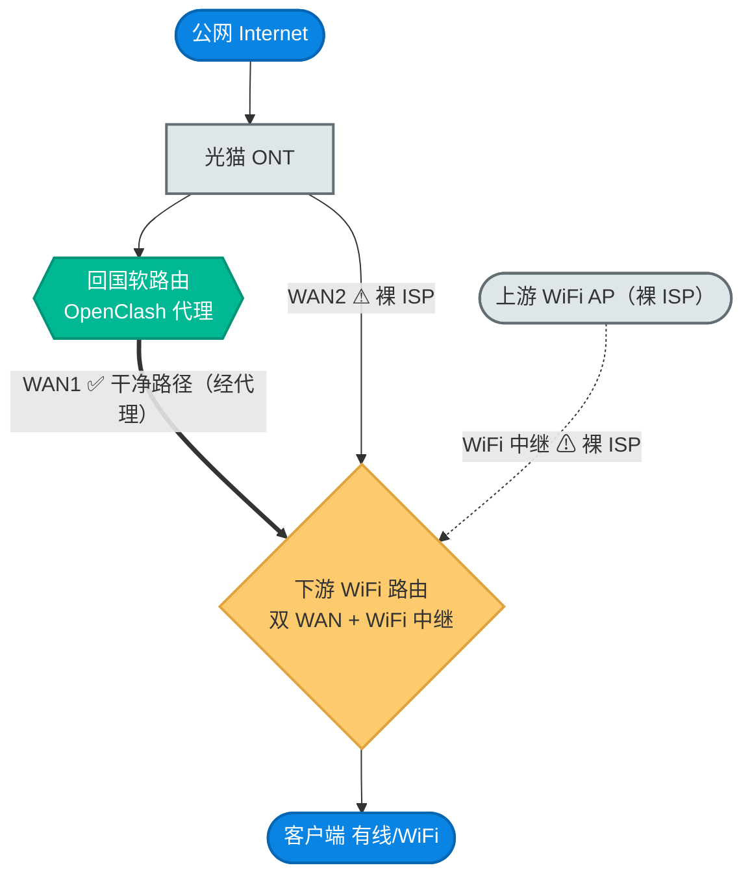

# 10. 多 WAN 下游路由防泄露：架构、原理与排障

当一台「双 WAN + WiFi 中继」的下游 WiFi 路由挂在回国软路由后面时，**只有一条上联是被代理的干净路径，其余上联都是裸 ISP 直出**。这篇讲清这套拓扑长什么样、泄露从哪两条隐蔽旁路冒出来、用哪两道闸堵住，以及泄露真出现时按什么步骤定位和修复。给在多上联家庭网络里跑回国/代理的人看。

> **默认姿态**：回国出口是 **IPv4-only**（不代理 IPv6）。下游路由默认应**禁用 LAN 公网 IPv6**、并把**客户端 DNS 钉死只走代理软路由**。两者任一缺失，客户端就会从裸 ISP 旁路直出，ipleak 暴露真实位置 / DNS。

## 阅读约定：三种信息块

| 图标 | 含义 | 给谁看 |
|---|---|---|
| 📘 **概念卡** | 一句话讲清「是什么、为什么」，零黑话 | 新手必读 |
| 🔧 **配置块** | 可复制的命令 / 配置，标注「自动」还是「需手动」 | 动手部署的人 |
| 🔬 **深挖框** | 解析链路、SLAAC/peerdns、fake-ip 等底层机制 | 工程师，新手可跳过 |

## 拓扑总览



**读者导航**：想先理解为什么会漏 → 读 §1、§2；要动手收口 → 直接 §3 两道闸；线上已经在漏、要定位 → 跳 §4 排障 playbook。

---

## 1. 这套网络长什么样（角色与数据流）

📘 四个角色，各司其职：

| 角色 | 职责 | 是否「干净」 |
|---|---|---|
| **光猫 ONT** | 把宽带接入转成以太，本身是裸 ISP 链路 | ⚠ 裸 ISP |
| **回国软路由（OpenClash）** | 唯一做代理/分流的设备，境外走代理、境内直连 | ✅ 干净出口 |
| **下游 WiFi 路由** | 给客户端发 WiFi / DHCP，自身有**多条上联** | 取决于走哪条上联 |
| **上游 WiFi AP** | 下游路由 WiFi 中继连上去的另一个热点 | ⚠ 裸 ISP |

📘 **关键不变量（也是隐患根源）**：下游 WiFi 路由是**多上联**的——
- **WAN1** 接回国软路由 → 这条经过代理，是干净路径；
- **WAN2** 直接接光猫 → 裸 ISP；
- **WiFi 中继** 连上游 WiFi AP → 也是裸 ISP。

下游路由默认会**同时**受这三条上联影响。只要不显式约束，客户端的 DNS 和 IPv6 就可能从 WAN2 / WiFi 中继这两条裸 ISP 旁路直出——这就是泄露的土壤。

---

## 2. 泄露从哪来（两条隐蔽旁路）

📘 **旁路一 · 公网 IPv6 经 SLAAC 下发**
下游路由从某条裸 ISP 上联（WAN2 或 WiFi 中继）拿到**公网 IPv6 前缀**后，若 LAN 侧仍是 IPv6 server，会经 SLAAC/RA 把这个公网前缀**下发给所有客户端**。客户端于是有了公网 IPv6 出口——而回国是 **IPv4-only**，不代理 v6——凡是能走 IPv6 的流量**直接绕过代理**从裸 ISP 出去，ipleak 暴露真实 IPv6 与位置。

📘 **旁路二 · 多 WAN 把裸 ISP 的 DNS 注入解析器**
下游路由的 dnsmasq 默认对每条 WAN 启用 `peerdns`，把**每一条上联**拿到的 ISP DNS 都写进 `resolv.conf.auto`。结果解析器列表里既有代理软路由、又有裸 ISP——dnsmasq 用到裸 ISP 那条时，客户端 DNS 就落到本地 ISP 解析器上。现象很典型：**网页出口在境外，但 ipleak 的 DNS 栏显示本地 ISP**（甚至境外域名被投毒解析）。

🔬 **为什么经代理路径就不漏**：代理软路由的 clash 用 fake-ip 模式——境外域名先返回一个 fake IP（如 `198.x` 段），真正解析发生在**代理出口**，所以解析器呈现为出口地。而裸 ISP 旁路是**本地直接真解析**，解析器自然是本地 ISP，且易被投毒。两道闸的目标，就是让客户端的 v6 和 DNS **只能走代理路径**。

---

## 3. 怎么防（两道闸）

### 闸 1 · 关掉下游路由的 LAN 公网 IPv6

📘 **做什么**：让下游路由 LAN 侧不再下发任何公网 IPv6（关 RA/DHCPv6/SLAAC、不切分委派前缀、WAN 不拉 IPv6 PD），堵死「旁路一」。

📘 **何时用**：任何挂在 IPv4-only 回国出口后面的下游路由；尤其**恢复出厂后必做**——出厂会把抑制配置清空，公网 v6 泄露随之重现。

🔧 **怎么开**（幂等，只动 IPv6 不碰 IPv4/SSH）：
```sh
sh openwrt-init.sh ipv6        # 仅跑 setup_lan_ipv6；KEEP_IPV6=1 可跳过(自建 v6 出口者)
```
> 复用 IPv6 防泄露能力，默认 `KEEP_IPV6=0`。细节见 [`../sources/openwrt/README.md`](../sources/openwrt/README.md) §5.8。

🔧 **如何验证**：
```sh
ip -6 addr show br-lan          # 期望: 只有 fe80 链路本地，无 2xxx/3xxx 公网 GUA
# 客户端(重连 WiFi 清残留后):
curl -6 -m6 https://ipv6.ip.sb  # 期望: 失败(无公网 v6 出口)
```

🔧 **故障排查**：客户端仍显示公网 v6 → 多半是旧地址缓存，**断开重连 WiFi**（或等租约过期）即清；下游 `br-lan` 又冒出公网 GUA → 检查是否只关了 RA 而没删委派前缀 / 没关裸 ISP 上联的 v6（`ipv6` 子命令两者都会处理）。

### 闸 2 · 把客户端 DNS 钉死只走代理软路由

📘 **做什么**：让下游路由的 DNS **只**转发给回国软路由，忽略其余裸 ISP 上联注入的 DNS，堵死「旁路二」。同时确保软路由自身不把它的 WAN ISP DNS 混进解析器。

📘 **何时用**：下游路由是多 WAN / 有 WiFi 中继时必做；单上联也可加固。

🔧 **怎么开**：
```sh
# 下游 WiFi 路由：DNS 只转给代理软路由，忽略 resolv.conf.auto 里的裸 ISP 上游
uci set dhcp.@dnsmasq[0].noresolv='1'
uci -q delete dhcp.@dnsmasq[0].server
uci add_list dhcp.@dnsmasq[0].server='<软路由LAN_IP>'
uci commit dhcp && /etc/init.d/dnsmasq restart
```
软路由侧 OpenClash 默认已固化 **`append_wan_dns='0'`**（模板 `op-amd` / `op-arm`），不会再把本地 WAN ISP DNS 塞进 clash nameserver——无需手动改。

🔧 **如何验证**：
```sh
dig +short www.google.com   @<下游路由>   # 期望: fake-ip(198.x) —— 走代理解析，干净
dig +short www.qq.com       @<下游路由>   # 期望: 真实国内 IP —— 分流正确
curl -4 -m8 https://ipv4.ip.sb            # 期望: 出口仍是境外代理出口
```
最终判据：**浏览器开 ipleak.net，DNS 栏不再出现本地 ISP**。

🔧 **故障排查**：CDN 类域名（如 akamai 探测域名）可能被 fake-ip 过滤排除、按设计走国内 DNS 真解析——**它不是有效泄露判据**，以普通境外网站 + ipleak 整体结果为准。改完解析全断 → 多半是 `server=` 写错或软路由不可达，回退见 §4。

---

## 4. 排障 playbook（症状 → 隔离 → 定位 → 修复）

🔧 **① 症状识别**
- ipleak 出口 IP = 境外代理出口，但 **DNS 栏 = 本地 ISP** → 旁路二（DNS 泄露）。
- ipleak **IPv6 栏出现公网地址** / 客户端有 `2xxx::` 全局地址 → 旁路一（IPv6 泄露）。

🔧 **② 隔离（关键：分跳对比，别凭猜）**
直接对比「直查代理软路由」与「经下游路由」的解析结果，锁定哪一跳在漏：
```sh
dig +short whoami.akamai.net @<软路由LAN_IP>   # 直查软路由
dig +short whoami.akamai.net @<下游路由>        # 经下游路由
```
若软路由干净、下游路由漏 → 问题在下游的多 WAN DNS 注入。

🔧 **③ 定位**
```sh
cat /tmp/resolv.conf.d/resolv.conf.auto        # 见多条上游(含裸 ISP) = 旁路二
ip -6 addr show br-lan | grep 'inet6 [23]'     # 有公网 GUA = 旁路一
uci show dhcp.lan | grep -E 'ra=|dhcpv6='      # ra='server' = 还在下发 v6
```

🔧 **④ 修复（改前必备份，可秒回滚）**
```sh
cp /etc/config/dhcp     /etc/config/dhcp.bak.$(date +%Y%m%d%H%M%S)
cp /etc/config/openclash /etc/config/openclash.bak.$(date +%Y%m%d%H%M%S)   # 在软路由上
# 然后执行 §3 闸 1 + 闸 2；回退即把对应 .bak 拷回并重启相应服务。
```

> ⚠ **判据纪律**：修复是否成功，**唯一硬标准是浏览器 ipleak 实测**（境外网站正常 + DNS 栏无本地 ISP + IPv6 栏空）。命令行 `dig` 只能辅助隔离，不作为「已修复」的最终结论。

---

## 相关资源

- [`./03-routing-and-clients.md`](./03-routing-and-clients.md) — 路由分流与客户端配置
- [`./04-ops-and-troubleshooting.md`](./04-ops-and-troubleshooting.md) — 运维排障总册（§2.7 `CN_EXIT_MODE` 回国出站）
- [`./07-tailscale-proxy-architecture.md`](./07-tailscale-proxy-architecture.md) — Tailscale 回国架构
- [`./08-xray-reverse-bridge.md`](./08-xray-reverse-bridge.md) — Xray 反向桥
- [`../sources/openwrt/README.md`](../sources/openwrt/README.md) — OpenWrt 侧脚本（§5.8 `ipv6` 子命令）
- [`../CHANGELOG.md`](../CHANGELOG.md)
