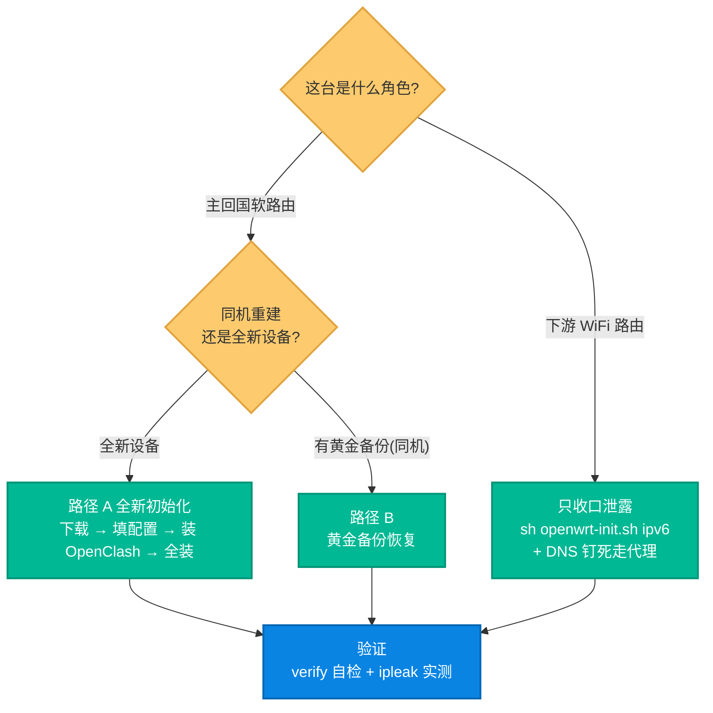

# 11. 重新初始化一台 OpenWrt 节点：从零部署与灾难恢复

换新设备、刷机重置、或同一台机想重建时，怎样把一台 OpenWrt 路由器重新拉成可用的回国/代理节点。这篇给出**先判角色 → 选路径 → 验证**的可复现流程：主回国软路由走全新初始化或黄金备份恢复，下游 WiFi 路由只需收口泄露。配置字段的逐项说明仍以 [`../sources/openwrt/README.md`](../sources/openwrt/README.md) 为准，本篇聚焦「重建」这件事的整体编排。

> **默认姿态**：`openwrt-init.sh` 幂等可重跑——重复执行安全。防泄露在全装流程里**默认生效**（关 LAN 公网 IPv6、OpenClash `append_wan_dns=0`），无需额外开关。真实配置值（VPS 域名 / token / Tailscale IP 等）从你的**私有运维凭据**取（不随仓库分发），模板见 `config.env.example`。

## 阅读约定：三种信息块

| 图标 | 含义 | 给谁看 |
|---|---|---|
| 📘 **概念卡** | 一句话讲清「是什么、为什么」，零黑话 | 新手必读 |
| 🔧 **配置块** | 可复制的命令 / 配置，标注「自动」还是「需手动」 | 动手部署的人 |
| 🔬 **深挖框** | 幂等机制、身份自恢复等底层细节 | 工程师，新手可跳过 |

## 总览



**读者导航**：主节点全新部署 → §2 + §3；同机快速重建 → §4；只是下游路由漏了 → §6；每条路径收尾都做 §5 验证。

---

## 1. 先判角色

📘 两种 OpenWrt 在本项目里职责完全不同，重建步骤也不同：

| 角色 | 职责 | 重建方式 |
|---|---|---|
| **主回国软路由** | 跑 OpenClash + Tailscale/xray 反向桥，做回国落地与本地分流 | 路径 A（全新）或路径 B（备份恢复） |
| **下游 WiFi 路由** | 仅给客户端发 WiFi/DHCP，挂在主软路由后面 | **不跑全装**，只收口泄露（§6） |

> ⚠ 在下游路由上跑全装 `sh openwrt-init.sh` 是错的——会给它装 Tailscale / 纳管 OpenClash / 反向桥，不符合下游角色。

---

## 2. 前置条件

🔧 动手前确认：
- 固件为 **OpenWrt / ImmortalWrt 22.03+**（需 `fw4`/nftables；旧 iptables 固件不支持）。
- 路由器能访问公网（国内直连 GitHub raw 常失败，见步骤 1 备注）。
- `socks5` / `balance` 模式需**先装 OpenClash 本体**（本脚本只管配置，不装本体）。
- 手边有真实配置值（VPS 域名、订阅 token、Tailscale 信息）——从私有运维凭据取，勿手敲猜测。

---

## 3. 路径 A · 全新初始化（5 步）

🔧 **① 下载脚本到路由器**
```sh
ssh root@<路由器IP>
mkdir -p /root/sb-xray-openwrt && cd /root/sb-xray-openwrt
for f in openwrt-init.sh config.env.example cn-bridge cn-bridge-monitor nodes.list.example; do
  wget -O "$f" "https://raw.githubusercontent.com/currycan/sb-xray/main/sources/openwrt/$f"
done
```
> 国内拉 GitHub raw 失败时：让路由器先走代理，或在能访问 GitHub 的机器下载后传入（OpenWrt 无 sftp，`scp` 不行时用 `ssh root@<路由器IP> 'cat > /root/sb-xray-openwrt/openwrt-init.sh' < openwrt-init.sh`）。`cn-bridge` / `cn-bridge-monitor` 缺失不要紧，主脚本会自动补下载。

🔧 **② 填配置**
```sh
cp config.env.example config.env
vi config.env          # 或把私有凭据里的权威 config.env 传上来覆盖
```
按场景选 `CN_EXIT_MODE`（`socks5` / `reverse` / `balance`，默认/推荐 `balance`）。多 VPS 高可用再建 `nodes.list`（每行 `<名> <FQDN> <token>`）。逐字段填法见 [`../sources/openwrt/README.md`](../sources/openwrt/README.md) 步骤 2 的三个场景模板。

🔧 **③ 装 OpenClash 本体（socks5/balance 必需）**
```sh
sh openwrt-init.sh openclash      # 幂等装/更新 OpenClash 插件本体
```

🔧 **④ 全装**
```sh
sh openwrt-init.sh                # 按 CN_EXIT_MODE 跑完整流水线(幂等可重跑)
```

🔧 **⑤ Tailscale 授权**（仅首次、且未配 OAuth 时）
脚本跑到 `tailscale up` 若未登录会**打印登录 URL 并停下**——浏览器授权一次即继续；随后到 Tailscale 后台 → 本机 → **Edit route settings** → 勾 subnet routes + **Use as exit node**。
> 配了 OAuth 身份自恢复则全程无人值守，见 §5。

---

## 4. 路径 B · 黄金备份恢复（同机重建更快）

📘 同一台设备重置/刷机后想最快回到已验证状态：用整机黄金备份恢复，再跑一次脚本对齐。

🔧 步骤：
```sh
# 1) 还原整机配置备份(你的私有备份归档，按时间点选最近的验证通过点)
#    OpenWrt: sysupgrade -r <golden-backup>.tar.gz   (或 LuCI → 备份/恢复 上传)
# 2) 重启后跑一次脚本对齐(幂等，补齐版本/cron/防泄露等)
cd /root/sb-xray-openwrt && sh openwrt-init.sh
```
适用：硬件不变、只是配置丢了。换了新硬件则走路径 A。

---

## 5. 身份零断点与验证

🔬 **Tailscale 身份自恢复（零断点）**：设备重置会丢 Tailscale state → 新身份新 IP，而各 VPS 可能写死了本机固定 Tailscale IP。在 `config.env` 配好 OAuth 四项后，重置恢复 = **传文件 + 跑脚本**全程无人值守：免交互现场铸 key 登录 → API 删旧设备并恢复固定 IP → API 批准 routes。不配则维持「打印 URL 手动授权 + 后台手动改 IP」。字段见 `config.env.example` 的 Tailscale 身份自恢复段。

🔧 **验证（每条路径收尾都做）**：`sh openwrt-init.sh` 结尾会**自动跑 `verify`**，打印 `[ OK ] / [FAIL]` 计数，硬失败以非 0 退出；想单独复查可重跑脚本（幂等）。
- 自检关注：Tailscale 在线 + exit node 已批准、反向桥隧道已通、OpenClash 配置无漂移、**LAN 未下发公网 IPv6**。
- **最终硬判据**：浏览器开 ipleak.net —— 出口为预期地区、**DNS 栏无本地 ISP、IPv6 栏空**。命令行只作辅助，不作为「已好」的结论。

---

## 6. 下游 WiFi 路由的简化路径

📘 下游路由**不跑全装**，只需堵两条泄露旁路（原理见 [`./10-multi-wan-leak-prevention.md`](./10-multi-wan-leak-prevention.md)）：

🔧
```sh
# 关 LAN 公网 IPv6(幂等，只动 IPv6 不碰 IPv4/SSH)
sh openwrt-init.sh ipv6           # 无需 config.env；KEEP_IPV6=1 可跳过
# DNS 钉死只走上游代理软路由
uci set dhcp.@dnsmasq[0].noresolv='1'
uci -q delete dhcp.@dnsmasq[0].server
uci add_list dhcp.@dnsmasq[0].server='<代理软路由LAN_IP>'
uci commit dhcp && /etc/init.d/dnsmasq restart
```
> 恢复出厂会清掉这些抑制 → 重置后重跑上面两段即可。

---

## 相关资源

- [`../sources/openwrt/README.md`](../sources/openwrt/README.md) — OpenWrt 脚本与逐字段配置说明（场景模板、子命令）
- [`./10-multi-wan-leak-prevention.md`](./10-multi-wan-leak-prevention.md) — 多 WAN 下游路由防泄露（原理与排障）
- [`./04-ops-and-troubleshooting.md`](./04-ops-and-troubleshooting.md) — 运维排障总册（§2.7 `CN_EXIT_MODE`）
- [`./07-tailscale-proxy-architecture.md`](./07-tailscale-proxy-architecture.md) · [`./08-xray-reverse-bridge.md`](./08-xray-reverse-bridge.md) — 两条回国腿的架构
- [`../CHANGELOG.md`](../CHANGELOG.md)
