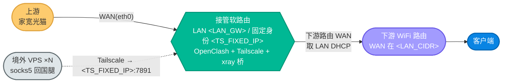

# 12. 灾备切换：软路由整机替换与固定身份零断点接管

当承载回国全栈的主软路由需要**整机替换**（硬件故障、灾备演练、换机升级）时，本手册给出一套**可并行验证、可分级回退、对 VPS 侧零改动**的接管流程：让一台替换机无缝顶上现役机的角色——OpenClash + Tailscale + xray 反向桥，并夺取那枚 VPS 回国腿唯一认的固定 Tailscale 身份。新手照抄即可，工程师能看懂每一步为什么这么设计、踩过哪些坑。

> **默认姿态 / 能力来源**：回国全栈的对外契约**只有一枚固定 Tailscale IP**（VPS 侧 socks5 回国腿硬编码它）——换机、换 LAN 网段对 VPS 侧零影响，只要把这枚 IP 转到替换机。部署脚本 `sources/openwrt/openwrt-init.sh` **幂等可重跑**，承载装栈/通告路由/重建防火墙/自检。单机从零初始化与黄金备份恢复见 [`./11-openwrt-reinitialize.md`](./11-openwrt-reinitialize.md)，本篇专注「一台替换另一台」的切换编排。

## 阅读约定：三种信息块

| 图标 | 含义 | 给谁看 |
|---|---|---|
| 📘 **概念卡** | 一句话讲清「是什么、为什么」，零黑话 | 新手必读 |
| 🔧 **配置块** | 可复制的命令 / 配置，标注「自动」还是「需手动」 | 动手切换的人 |
| 🔬 **深挖框** | 身份单例、防火墙旁路、mint key、dnsmasq list 选项等底层机制 | 工程师，新手可跳过 |

## 参数占位符约定

本手册所有环境特定值用占位符；**真实值不入库**，按下表去查。动手前先把它们替换成你的实际值。

| 占位符 | 含义 | 真实值去哪查 |
|---|---|---|
| `<TS_FIXED_IP>` | 固定 Tailscale 身份 IP（VPS 回国腿唯一契约） | `.credentials/openwrt-config.env` 的 `TS_EXPECTED_IP` |
| `<LAN_CIDR>` / `<LAN_GW>` | 接管机目标 LAN 网段 / 网关地址 | 由你定（可镜像现役机网段，便于下游零再寻址） |
| `<TAKEOVER_MGMT>` | 接管机 provisioning 阶段的当前管理地址 | 接管机现网地址（预检时实测） |
| `<INCUMBENT_LAN>` | 现役机的 LAN / SSH 地址 | `.credentials/openwrt.txt` |
| `<DOWNSTREAM_LAN>` | 下游 WiFi 路由的 LAN 管理地址 | `.credentials/openwrt.txt` |
| `<HOME_EXIT_IP>` | 期望的家宽出口 IP（回国验证基线） | 现役机上 `curl ip.3322.net` 实测记下 |
| `<HOT_NODE>` / `<PEER_TS_IP>` | 热备桥接节点名 / keepalive 探测目标 | `.credentials/openwrt-config.env` 的 `BRIDGE_HOT` / `KEEPALIVE_PEERS` |
| SSH 密码 | 接管机 / 下游路由 SSH | `.credentials/openwrt.txt`（命令里用 `sshpass`，secret 不回显） |

> 📘 **凭据纪律**：命令里的 secret 一律从设备 `config.env` 现读（`grep…|cut`），不回显、不写日志、不进入库文档。

## 总览：拓扑与安全态梯度

🔧 **终态拓扑**（接管完成后）：



📘 **安全态梯度**——切换全程随时知道「我在哪、整体怎么退」。**核心设计：第 9 节（身份交接）是唯一不可逆分界线，之前任何一步卡住都能零代价丢弃接管机**。

| 态 | 处在哪些步骤 | 生产现状 | 整体回退 | 回退成本 |
|---|---|---|---|---|
| **A 并行态** | §3–§8 | 现役机生产中，接管机仅临时身份 | 丢弃接管机（`tailscale down`），现役机毫发无损 | 零中断 |
| **B 身份已交接** | §9–§10 | 接管机持 `<TS_FIXED_IP>`，现役机已登出但开机配置完好 | 身份回退（接管机让出 IP → 现役机重夺，见 §15） | 几十秒中断 |
| **C 物理已换线** | §11–§12 | 上行在接管机，现役机失上行但开机 | 插回现役机上行线 + 身份回退 | 数分钟 |
| **D 终态** | §13 后 | 现役机关停下线 | 黄金备份恢复现役机 + 重跑 init | 高 |

**读者导航**：
- **只想照着切** → §1（铁律）→ §3 顺序做到 §13 → §16（验收清单）
- **想搞懂为什么** → §1 + §14（故障排查与已知坑实战汇编）
- **切换中卡住了** → §15（总回退表）+ §14 对症

---

## 1. 三条铁律（动手前必懂）

📘 整套切换的安全性建立在三条机制约束上，违反任何一条都会断回国或夺不到身份。

1. **唯一硬契约 = 固定身份 IP**。境外 VPS 的回国腿只认 `<TS_FIXED_IP>`，**不认 LAN 网段**。所以「换机 + 换网段」对 VPS 侧零改动，只需做到两件事：① 把 `<TS_FIXED_IP>` 转到接管机；② 把 `TS_ADVERTISE_ROUTES` 改成 `<LAN_CIDR>`（全栈唯一依赖 LAN 网段处，源码无网段硬编码）。

2. **Tailscale 身份是单例**。同一时刻只有一台能持 `<TS_FIXED_IP>`。夺 IP 前，现役机**必须先 `tailscale logout` + 停服**，否则它会重注册重抢该 IP。

3. **tagged 节点 `tailscale up` 必带 `--advertise-tags`**。身份用了 tag（默认 `tag:openwrt`）的节点，`tailscale up` 不带 `--advertise-tags=tag:openwrt` 会被拒、停在 `stopped`。

> 🔬 **关于自动登录**：`openwrt-init.sh` 内置的 `ts_mint_authkey`（用 OAuth client 铸一次性 auth key）在实战中可能产出**无效 key**，导致 `tailscale up` 退化为交互式登录并超时 → 拿不到 IP、后续身份恢复整段被跳过。**因此本手册一律用 OAuth client secret 直连作 auth-key 手动登录**（§7），不依赖脚本自动登录。

---

## 2. 前置与凭据

📘 切换在你的**管理机**（能 SSH 到接管机的笔记本）上驱动。

🔧 一次备齐（本机）：

- **接管机 SSH**：`root@<TAKEOVER_MGMT>`，密码见 `.credentials/openwrt.txt`。命令用 `sshpass -p "$PW"` 包装，密码从文件提取、不进命令字面：
  ```sh
  PW=$(awk -F'：' '/密码/{print $2; exit}' .credentials/openwrt.txt)   # 按你的凭据文件格式调整
  rt() { sshpass -p "$PW" ssh -o StrictHostKeyChecking=accept-new -o ConnectTimeout=8 root@"$1" "${@:2}"; }
  # 用法: rt <TAKEOVER_MGMT> 'command'
  ```
  > 🔬 **zsh 分词陷阱**：管理机若是 zsh，`ssh $OPTS …`（把多个选项塞进变量）**不分词**，会报 `keyword stricthostkeychecking extra arguments`。ssh 选项必须**内联**在函数里，或用 `${=OPTS}` 强制分词。
- **权威配置** `.credentials/openwrt-config.env`：传到设备后改名 `config.env`。**唯一要改的键**：`TS_ADVERTISE_ROUTES=<LAN_CIDR>`。校验保持：`CN_EXIT_MODE`、`TS_EXPECTED_IP=<TS_FIXED_IP>`、`TS_HOSTNAME`、`BRIDGE_HOT`、`TS_OAUTH_CLIENT_ID/SECRET`。
- **节点清单** `.credentials/node.list` → 设备落盘改名 `nodes.list`（脚本默认查找名）。
- **主脚本** `sources/openwrt/openwrt-init.sh`（幂等可重跑；缺失的拨号/监控工具会自动补下载）。

---

## 3. 只读预检（不改任何东西）

📘 **做什么**：确认接管机够格承载回国全栈，并探明它的网口角色，决定后续分支。
📘 **何时用**：每次切换的第 0 步，强制。

🔧 **怎么做**（SSH 到 `<TAKEOVER_MGMT>` 逐条只读）：
```sh
nft --version                          # 需 fw4/nftables（旧 iptables 固件不支持）
ubus call system board                 # 固件版本（需 OpenWrt/ImmortalWrt 22.03+）、架构
ls -l /dev/net/tun                     # TUN 是否在
ls -l /etc/init.d/openclash            # OpenClash 本体是否已装（balance 模式必需）
uci show network | grep -E '\.(lan|wan)\.'   # 哪个口是 LAN/WAN、WAN 是否 DHCP
ip -4 addr; ip route                   # 现网地址与默认路由
ping -c2 223.5.5.5                      # IP 连通（先别 ping 域名，可能撞上游 fake-ip）
```

✅ **如何验证**（全中才继续）：
- `nft --version` 有版本号——否则固件不支持，**STOP，换固件**。
- 固件 ≥ 22.03；记下架构（`x86/64`→amd64 用 op-amd 模板；`aarch64`→arm 用 op-arm，脚本自动选）。
- `/dev/net/tun` 存在（缺则脚本会装 `kmod-tun`，记一笔）。
- `/etc/init.d/openclash` 存在且可执行（OpenClash 即便不是 opkg 包，init 脚本可执行即满足契约）。
- IP 连通 OK。
- 记清楚：`<TAKEOVER_MGMT>` 落在哪个网口（LAN 还是独立 WAN/管理口）、WAN 是否 DHCP。

🔬 **故障排查**：若接管机此刻挂在现役机/下游级联下出网，上游 OpenClash 会把境外域名 DNS **劫持成 fake-ip**（`github.com`→`198.x`）。这不影响 init 下载——脚本默认走 `GH_PROXY`（GitHub 镜像），用一次小文件下载验证即可：
```sh
wget -T20 -O /tmp/t "https://<你的GH_PROXY>/https://raw.githubusercontent.com/<owner>/sb-xray/main/sources/openwrt/nodes.list.example" && head -1 /tmp/t
# 期望：取回文件内容 → init 下载链路可用
```

↩️ **回退**：本步只读，无需回退。任一硬项不过 → 不开工，先解决固件/网络。

---

## 4. 配置三件套落盘到接管机

📘 **做什么**：把权威配置落到接管机，并改好唯一的网段键。此步及之后到 §8 全程处于**安全态 A**（现役机零影响）。

🔧 **怎么做**（本机；OpenWrt 无 sftp，用 `ssh cat` 传）：
```sh
# 传三件套
rt <TAKEOVER_MGMT> 'mkdir -p /root/sb-xray-openwrt'
rt <TAKEOVER_MGMT> 'cat > /root/sb-xray-openwrt/openwrt-init.sh' < sources/openwrt/openwrt-init.sh
rt <TAKEOVER_MGMT> 'cat > /root/sb-xray-openwrt/config.env'      < .credentials/openwrt-config.env
rt <TAKEOVER_MGMT> 'cat > /root/sb-xray-openwrt/nodes.list'      < .credentials/node.list
# 设网段键 + 收紧权限
rt <TAKEOVER_MGMT> 'cd /root/sb-xray-openwrt && sed -i "s#^TS_ADVERTISE_ROUTES=.*#TS_ADVERTISE_ROUTES=<LAN_CIDR>#" config.env && chmod 600 config.env'
```

✅ **如何验证**（接管机上）：
```sh
cd /root/sb-xray-openwrt
grep '^TS_ADVERTISE_ROUTES=' config.env          # = <LAN_CIDR>
grep -cvE '^\s*(#|$)' nodes.list                 # 真实节点数（注意：grep -c . 会把注释行也算进去）
grep -E '^(CN_EXIT_MODE|TS_EXPECTED_IP|TS_HOSTNAME|BRIDGE_HOT)=' config.env   # 逐项核对
ls -l openwrt-init.sh config.env nodes.list      # 三个都在
```

> 🔬 **`config.env` 内容经 stdin 直送设备**，不进管理机上下文/日志，符合凭据纪律。本机权威配置里 `TS_ADVERTISE_ROUTES` 可能仍是旧网段——本步只在**设备侧**覆盖；待 §13 收尾再决定是否回写本机权威值。

↩️ **回退**：只是文件落盘，无影响。`rm -rf /root/sb-xray-openwrt/` 重来即可。

---

## 5. 设接管机 LAN 为目标网段

📘 **做什么**：把接管机 LAN 设成 `<LAN_CIDR>`。**必须在全装前设好**——init 的自检会断言「Tailscale 宣告的 routes == 内核实际 LAN CIDR」，LAN 不对则自检失败。
📘 **何时用**：若预检发现接管机 LAN 已是目标网段，本步跳过。

🔧 **怎么做**（接管机）：

- **若你是经 LAN 口管理接管机**（改 LAN 会断当前 SSH），带自动回滚兜底防自锁：
  ```sh
  # N 分钟内没在新网段重连成功 → 自动还原 LAN（防把自己锁在外面）
  ( sleep 600 && uci set network.lan.ipaddr='<原LAN_IP>' && uci commit network && /etc/init.d/network restart ) &
  echo "GUARD_PID=$!"
  uci set network.lan.ipaddr='<LAN_GW>'
  uci set network.lan.netmask='<LAN_NETMASK>'        # /23 = 255.255.254.0
  uci commit network && /etc/init.d/network restart
  # 用 <LAN_GW> 重连成功后：kill $GUARD_PID 取消兜底
  ```
- **若你是经 WAN/管理口管理接管机**（改 LAN 不影响你的 SSH）：用 `/etc/init.d/network reload` 而非 `restart`——**reload 只重配变更的 LAN，不 bounce WAN**，不会断你经 WAN 的 SSH：
  ```sh
  uci set network.lan.ipaddr='<LAN_GW>'
  uci set network.lan.netmask='<LAN_NETMASK>'
  uci commit network && /etc/init.d/network reload
  ```

✅ **如何验证**：
```sh
ip -4 addr show br-lan | grep '<LAN_GW>'    # LAN 已是新地址
uci show dhcp.lan                           # 确认对下游发 DHCP（dhcpv4='server'）
# 经 WAN 管理者再确认 WAN 地址未受影响、SSH 仍在
```

↩️ **回退**：经 LAN 管理时，兜底进程会在超时后自动还原 LAN；或主动 `uci set network.lan.ipaddr='<原LAN_IP>'; uci commit network; /etc/init.d/network restart`。

---

## 6. 确认 OpenClash 本体就绪

📘 **做什么**：`CN_EXIT_MODE` 含 socks5 的模式需要 OpenClash 本体（init 只管配置不装本体）。

🔧 **怎么做 + ✅ 如何验证**（接管机）：
```sh
ls -l /etc/init.d/openclash             # 存在且可执行
opkg list-installed | grep -i openclash # 看版本（非 opkg 装则此处可能为空，以 init 脚本存在为准）
```
> 复核发现本体缺失/异常才需补装（幂等）：`cd /root/sb-xray-openwrt && sh openwrt-init.sh openclash`。

↩️ **回退**：本步不影响生产（仍在态 A）。

---

## 7. 全装：接管机停在临时身份（= 并行验证态）

📘 **做什么**：在接管机上装满回国全栈（17 类组件：节点清单、Tailscale、xray、桥隧道、OpenClash 配置、CDN 优选、监控、防火墙旁路），但**暂不夺** `<TS_FIXED_IP>`——让接管机以临时身份上线，现役机继续生产。

🔧 **怎么做**（接管机后台跑；BusyBox 可能无 `setsid`，用 `nohup`。日志写设备本地路径）：
```sh
cd /root/sb-xray-openwrt
printf '#!/bin/sh\ncd /root/sb-xray-openwrt && sh openwrt-init.sh > initrun.out 2>&1\necho "___EXIT=$?___" >> initrun.out\n' > _run.sh
chmod +x _run.sh && nohup ./_run.sh >/dev/null 2>&1 </dev/null &
# 轮询（CDN 首跑会扫数千个候选 IP、刷屏，grep 掉进度条）
tail -f initrun.out | grep -viE 'available|优选中|tcp延迟'
```

✅ **如何验证**：日志出现 `___EXIT=` 即跑完。自检（`verify`）在末尾自动跑：
- **预期有 1 条硬失败**：`[FAIL] Tailscale IP 为预期固定值 <TS_FIXED_IP>`——**这是设计内的**（并行验证阶段还没夺固定 IP，现役机仍持有），不是问题。
- `[FAIL] WAN UDP GRO` 之类是性能软项，网卡不支持可忽略。
- 其余（bridge 隧道 ESTABLISHED、热备节点、OpenClash 配置/dashboard、节点清单、防泄露 IPv6 关闭、socks5 强制 direct）应通过。

🔬 **注意 verify 与实际可能不符**：init 跑完后 `tailscale status` 常是 `NeedsLogin`/`Logged out`（因上文 mint key bug 自动登录未成）。即便自检里写「tailscale 已登录」，**以 `tailscale status` 实测为准**——若未登录，执行下面的手动上临时身份。

### 7b · 手动上临时身份（绕过 mint bug）

🔧（接管机；secret 只进设备 shell 变量，不回显）：
```sh
cd /root/sb-xray-openwrt
SECRET=$(grep "^TS_OAUTH_CLIENT_SECRET=" config.env | cut -d= -f2- | tr -d '"')
tailscale up --reset --auth-key="${SECRET}?preauthorized=true" \
  --advertise-tags=tag:openwrt --timeout=100s --accept-dns=false \
  --advertise-routes=<LAN_CIDR> --advertise-exit-node --hostname=<TS_HOSTNAME>
tailscale ip -4    # 记下这个【临时IP】，§9 要用
```
✅ **如何验证**：`tailscale status` = Running；`tailscale ip -4` 出一个**临时 IP**（不是 `<TS_FIXED_IP>`）；节点名大概率带 `-1` 后缀（因现役机仍占用原 hostname）。

↩️ **回退（§4–§7 通用）**：仍是态 A。接管机 `tailscale down` 丢弃即可，现役机零影响。

---

## 8. 并行验证（不碰生产，放心测）

📘 **做什么**：在现役机毫发无损的前提下，确认接管机的回国栈真能用。**这是免费的安全检查点——验收全过才允许进 §9 不可逆分界线**。

🔧 **怎么做 + ✅ 如何验证**（接管机，逐条达标）：
```sh
tailscale ping -c 2 --timeout 8s <PEER_TS_IP>   # 期望: pong from <HOT_NODE> …（直连打洞或经 DERP）
pgrep -f xray | wc -l                            # 桥进程在
netstat -tn | grep -c ':443.*ESTABLISHED'        # 到 VPS:443 的桥隧道条数 > 0
/etc/init.d/openclash status                     # running
netstat -ltn | grep -E ':7891|:9090'             # socks5 + dashboard 在听
# 回国出口（关键）：经本机 socks5 打 CN 站点 → 应是家宽出口 IP
curl -s --socks5-hostname 127.0.0.1:7891 https://myip.ipip.net   # 期望: <HOME_EXIT_IP>（中国家宽）
```

🔬 **验回国只看 CN-DIRECT 出口**：从设备自身 socks5 打**境外**站点会显示**代理出口**（境外 IP），那是「出国」方向，不是回国——别被它误导。回国看的是经 socks5 打 **CN 域名**（走 DIRECT）的出口，应为家宽 IP。用 `ip.3322.net` / `myip.ipip.net`；**勿用 `4.ipw.cn`，该站常返空**。

> 🔬 **`--socks5-hostname` 不是 `--socks5`**：级联态下设备本地解析会撞上游 fake-ip，用 `--socks5-hostname` 让 OpenClash 远端解析才准。

↩️ **回退**：任一条不达标就**停在这里排障**——现役机仍生产、零中断。修不好就放弃本次（`tailscale down`），态 A 退出。

---

## 9. 身份交接（⚠️ 不可逆分界线；回国唯一中断窗口，几十秒）

📘 **做什么**：把 `<TS_FIXED_IP>` 从现役机转到接管机。**这是态 A→B 的不可逆边界**，跨过后回退变重（见 §15）。
📘 **何时用**：仅当 §8 全部验收通过、且你接受几十秒回国中断时。

🔧 **9.1 先只读识别两个 nodeId（零中断，破坏性操作前先核对）**——身份单例，删错设备代价高：
```sh
cd /root/sb-xray-openwrt
CID=$(grep "^TS_OAUTH_CLIENT_ID=" config.env|cut -d= -f2-|tr -d '"')
CSEC=$(grep "^TS_OAUTH_CLIENT_SECRET=" config.env|cut -d= -f2-|tr -d '"')
TOK=$(curl -s https://api.tailscale.com/api/v2/oauth/token -d "client_id=$CID" -d "client_secret=$CSEC" \
  | sed -n 's/.*"access_token"[^"]*"\([^"]*\)".*/\1/p')
[ -n "$TOK" ] && echo TOKEN_OK || echo TOKEN_FAIL
curl -s -H "Authorization: Bearer $TOK" https://api.tailscale.com/api/v2/tailnet/-/devices > dev.json
# BusyBox 无 jq，用 awk RS="}" 按 IP 精确匹配取 nodeId
OLD=$(awk 'BEGIN{RS="}"} index($0,"<TS_FIXED_IP>"){if(match($0,/"nodeId":"[^"]+"/)){s=substr($0,RSTART,RLENGTH);gsub(/"nodeId":"|"/,"",s);print s;exit}}' dev.json)
SELF=$(awk 'BEGIN{RS="}"} index($0,"<上一步记下的临时IP>"){if(match($0,/"nodeId":"[^"]+"/)){s=substr($0,RSTART,RLENGTH);gsub(/"nodeId":"|"/,"",s);print s;exit}}' dev.json)
echo "OLD=$OLD SELF=$SELF"   # 二者都非空、不相等，才往下
```
✅ 核对：`OLD` 对应现役机（持 `<TS_FIXED_IP>` 的节点）、`SELF` 对应接管机（持临时 IP 的节点），两者非空且不同。

🔧 **9.2 现役机：释放身份 + 停服（单例，必须先做）**——此刻起回国短暂中断：
```sh
ssh root@<INCUMBENT_LAN> 'tailscale logout; /etc/init.d/tailscale stop'
# 期望: 现役机 tailscale 停止（其普通路由不依赖 Tailscale，下游基础上网不受影响）
```

🔧 **9.3 接管机：删旧节点 + 夺固定 IP + 批准路由 + 带 tag 拉起**：
```sh
# 删旧节点（现役机 logout 后该节点可能已注销，DELETE 得 404 属正常）
curl -s -o /dev/null -w "DELETE=%{http_code}\n" -X DELETE -H "Authorization: Bearer $TOK" \
  https://api.tailscale.com/api/v2/device/$OLD
# 把本机设为固定 IP（返回 null = 成功）
curl -s -X POST -H "Authorization: Bearer $TOK" -H "Content-Type: application/json" \
  https://api.tailscale.com/api/v2/device/$SELF/ip -d '{"ipv4":"<TS_FIXED_IP>"}'
/etc/init.d/tailscale restart; sleep 3
# 批准 routes（子网 + exit node）
curl -s -X POST -H "Authorization: Bearer $TOK" -H "Content-Type: application/json" \
  https://api.tailscale.com/api/v2/device/$SELF/routes -d '{"routes":["<LAN_CIDR>","0.0.0.0/0","::/0"]}'
# tagged 节点必带 --advertise-tags 才能真正 up
tailscale up --timeout=60s --accept-dns=false --advertise-routes=<LAN_CIDR> \
  --advertise-exit-node --hostname=<TS_HOSTNAME> --advertise-tags=tag:openwrt
```

✅ **如何验证**：
```sh
tailscale ip -4                              # = <TS_FIXED_IP>
tailscale status --json | grep -m1 '"Online"'   # true（注意：up 后约 12s 才转 true，勿误判）
curl -s -H "Authorization: Bearer $TOK" https://api.tailscale.com/api/v2/device/$SELF/routes
#   enabledRoutes 应含 <LAN_CIDR>、0.0.0.0/0、::/0
```
> 🔬 **routes POST 可能返回空**：这是已知现象，**别凭首次响应下结论**——用上面的 GET 复核 `enabledRoutes`，没批上就重 POST 一次。

↩️ **回退**：进了态 B，见 §15「身份回退」。要点：**先让接管机让出 IP，再让现役机重夺**，避免单例冲突。

> ⚠️ **不要在此处重跑全量 `openwrt-init.sh` 想「收敛」**：重跑会再次触发 mint key bug 把 tailscale 重置成 `NeedsLogin` → 回国断。若确实重跑了，跑完须重做 §7b 手动登录 + §9.3 整套 API 夺 IP 才能恢复。仅想看 verify 直接看本节验收即可。

---

## 10. VPS 金标准验证（接管前别碰物理上行）

📘 **做什么**：从一台境外 VPS 真打一遍，确认回国全链在接管机上端到端通。这是回国的金标准——本机 socks5 通**不等于** VPS 通（差一个 Tailscale 跳）。

🔧 **怎么做**（任一 VPS 上）：
```sh
curl -s --socks5 <TS_FIXED_IP>:7891 https://ip.3322.net   # 勿用 4.ipw.cn
```
✅ **如何验证**：出口 = `<HOME_EXIT_IP>`（家宽）。→ VPS → Tailscale `<TS_FIXED_IP>` → 接管机 socks5 → 家宽，全栈可用，VPS 侧零改动。

🔬 **故障排查：VPS 经 socks5 返回空**。若本机 `curl --socks5-hostname 127.0.0.1:7891` 正常、但 VPS 经 `<TS_FIXED_IP>:7891` 返回空 → 多半是**防火墙 tailscale→7891 入站规则漂移**（服务重启/换 WAN 后 runtime 规则丢失）。修法：重跑 `sh openwrt-init.sh` 重建防火墙——但**注意它会重置 tailscale**（见 §9 末警告），跑完按其恢复身份。

↩️ **回退**：不通 → 走身份回退（态 B → A），现役机重做主力。

---

## 11. 物理上行交接 + 下游路由接入

📘 **做什么**：把生产上行落到接管机（同一条家宽 → 同一出口 IP），并把下游 WiFi 路由接到接管机 LAN。

🔧 **11.1 接管机上行**：把现役机的上行线拔下插到**接管机 WAN**。接管机 WAN（DHCP）会从上游拿地址。
> ⚠️ **管理地址会变**：接管机 WAN 换到上游后，原 `<TAKEOVER_MGMT>` 失效，改走 **Tailscale `<TS_FIXED_IP>`** 或 **LAN `<LAN_GW>`** 管理。

✅ 验证：
```sh
ip route | grep default                            # 默认路由经 WAN 起来
curl -s --socks5 <TS_FIXED_IP>:7891 https://ip.3322.net   # VPS 侧复验，仍 <HOME_EXIT_IP>
tailscale netcheck | grep -iE 'UDP|DERP'           # 去掉级联 NAT 后 UDP 常转 true（直连打洞，延迟降低）
```

🔧 **11.2 下游 WiFi 路由接入**——本次实战的关键易错点：

- 物理：下游路由的 WAN 口接到**接管机 LAN**；在下游路由上 `ifup wan`，确认它拿到 `<LAN_CIDR>` 段的 DHCP 地址、默认路由 via `<LAN_GW>`。
- **DNS 重指（必做，否则关停现役机后下游 DNS 立即全断）**——下游 dnsmasq 原本可能钉死指向现役机：
  ```sh
  uci -q delete dhcp.@dnsmasq[0].server
  uci add_list dhcp.@dnsmasq[0].server='<LAN_GW>'
  uci set dhcp.@dnsmasq[0].noresolv='1'
  uci commit dhcp && /etc/init.d/dnsmasq restart
  ```
  > 🔬 **必须 `add_list` 不能 `uci set`**：dnsmasq 的 `server` 是 **list 选项**，初始化脚本用 `config_list_foreach` 读取；`uci set` 存成字符串会被忽略 → 生成配置无 `server=` 行 → 所有解析 `REFUSED`。先 `uci -q delete` 清掉旧值再 `add_list`。
- ⚠️ **换网段后下游路由可能远程失联**：下游路由的 SSH 通常只开在它自己的 LAN；换接管机网段后，你的管理隧道可能丢到下游 LAN 段的路由，且下游 WAN 口 SSH 多被其防火墙挡（连上即被关）。**所以这一步 DNS 重指多半要在能本地访问下游路由的客户端上做**。
- IPv6 收口（若下游路由曾恢复出厂、丢了抑制配置）：`sh openwrt-init.sh ipv6`（见 [`./10-multi-wan-leak-prevention.md`](./10-multi-wan-leak-prevention.md) 与 [`./11-openwrt-reinitialize.md`](./11-openwrt-reinitialize.md) §6）。

✅ **如何验证**（下游路由上）：
```sh
nslookup www.baidu.com 127.0.0.1     # CN 域名 → 真实 IP
nslookup www.google.com 127.0.0.1    # 境外域名 → fake-ip（198.x）= 分流正确
```
并在一台下游客户端开 **ipleak.net**：出口=预期地区、**DNS 栏无家宽运营商解析器、IPv6 栏空**。

↩️ **回退**：出口异常/下游不通 → 把上行线插回现役机（态 C → B），需要时再身份回退。

---

## 12. 断电持久性测试（下线现役机前的硬门槛）

📘 **做什么**：确认接管机**断电重启后自主**回到 `<TS_FIXED_IP>` + 回国通。这是允许关停现役机的硬门槛——历史上同类切换失败，正是替换机重启后丢身份（其 tailscaled 状态跑在 `/tmp`、重启即丢）。

> ⚠️ **实测教训（必读）**：
> - **不要用后台 ssh 发 reboot**（`(sleep N; reboot) &` 会随 ssh 关闭被 SIGHUP → 把服务停了却不真重启，回国中断且什么都没测到）。要软重启就**前台** `ssh root@<LAN_GW> reboot`。
> - **最可靠的是物理断电重上电**（拔电 → 等约 10s → 重上电）——这才真测「停电自愈」，与关停现役机后的真实场景一致。

🔧 **怎么做**：物理断电重上电接管机（现役机此时仍开机兜底）。

✅ **如何验证**（回来后 SSH 接管机）：
```sh
cut -d. -f1 /proc/uptime                       # < 300 → 证明真断电过（非半停）
tailscale ip -4                                # 仍 = <TS_FIXED_IP>（无需手动 up，开机自主恢复）
tailscale status --json | grep -m1 '"Online"'  # true（up 后约 12s 才转）
/etc/init.d/openclash status                   # running
# VPS: curl -s --socks5 <TS_FIXED_IP>:7891 https://ip.3322.net  → 仍 <HOME_EXIT_IP>
```

🔧 **异常恢复**：若回来后 `tailscale status` = stopped/NeedsLogin：
```sh
/etc/init.d/tailscale start
# 若仍 stopped：
tailscale up --timeout=60s --accept-dns=false --advertise-routes=<LAN_CIDR> \
  --advertise-exit-node --hostname=<TS_HOSTNAME> --advertise-tags=tag:openwrt
# 若 IP 不是 <TS_FIXED_IP>：按 §9.3 API 流程重夺
```

↩️ **回退**：**任一项不过 = 不许关停现役机**。插回现役机上行线 + 身份回退（态 C → B → A），排查接管机 tailscaled state 是否落在持久分区（而非 `/tmp`）。

---

## 13. 关停现役机 + 收尾

📘 **做什么**：确认接管机扛住断电后，彻底完成切换。

🔧 **操作 / ✅ 验证**：
- 关停被替换的现役机。
- 更新 `.credentials/openwrt.txt`：主路由 SSH / dashboard 地址 → 接管机的新管理入口；注明网段与设备状态。
- 若本机权威配置 `openwrt-config.env` 的 `TS_ADVERTISE_ROUTES` 仍是旧网段，回写为 `<LAN_CIDR>`，保持本机权威值与现网一致。
- 把本次切换过程追加进 `.local/` 运维过程记录（不入库）。

↩️ **回退**：现役机已关但配置完好 → 重新开机 + 身份回退即可恢复；再不行用黄金备份整机恢复（见 [`./11-openwrt-reinitialize.md`](./11-openwrt-reinitialize.md) 路径 B）+ 重跑 init。

---

## 14. 故障排查与已知坑（实战汇编）

按「症状 → 根因 → 处置」组织，覆盖整套切换里最容易踩的坑。

| 症状 | 根因 | 处置 |
|---|---|---|
| init 跑完 `tailscale status` = NeedsLogin | `ts_mint_authkey` 产出无效 key，`tailscale up` 退化交互登录超时 | 用 §7b 的 OAuth secret 直连作 `--auth-key` 手动登录（**必带 `--advertise-tags`**） |
| `tailscale up` 被拒、停在 `stopped` | tagged 节点未带 tag | `tailscale up … --advertise-tags=tag:openwrt` |
| 夺 IP 后 `tailscale status` = stopped | API 改 IP + restart 后需重新 up | 同上，带 tag 重新 `up` |
| API DELETE 旧节点得 404 | 现役机 `logout` 已把该节点从 tailnet 注销 | 正常，非错误，继续 |
| routes POST 返回空 | 已知响应现象 | GET `/routes` 复核 `enabledRoutes`，没批上重 POST |
| VPS 经 socks5 返回空（本机 127.0.0.1 正常） | 防火墙 tailscale→7891 入站规则 runtime 漂移 | 重跑 `sh openwrt-init.sh` 重建防火墙（注意会重置 tailscale，跑完按 §9 恢复） |
| 软 reboot 后服务全停但机器没真重启 | 后台 ssh 子进程被 SIGHUP，停服却没完成 reboot | 别后台化；持久性测试用**物理断电** |
| 下游 dnsmasq 全部 `REFUSED` | `server` 用 `uci set` 存成字符串，被 `config_list_foreach` 忽略 | 改用 `uci add_list`（先 `uci -q delete`） |
| 改 LAN 后管理机断连 | `/etc/init.d/network restart` bounce 了 WAN | 经 WAN 管理时用 `network reload` 不用 restart |
| 换网段后下游路由 SSH 连不上 | 管理隧道丢了到下游 LAN 段的路由 + 下游 WAN SSH 被防火墙挡 | 下游改配置（如 DNS 重指）改在能本地访问它的客户端上做 |
| `tailscale ping` 走 DERP 中继、延迟高 | 多重级联 NAT 下直连打洞失败 | 物理换线到上游直连后 `netcheck` 多转 UDP=true，自然改善 |
| 自检报 `[FAIL] Tailscale IP 为预期固定值` | 并行验证阶段还没夺固定 IP | 设计内，§9 交接后即转通过 |
| 验回国看到境外 IP | 从设备自身 socks5 打境外站会显代理出口 | 验回国只看经 socks5 打 **CN 域名** 的出口（DIRECT → 家宽） |

---

## 15. 总回退表（卡在哪一步都能查）

| 当前态 | 触发场景 | 回退动作 |
|---|---|---|
| **A**（§3–§8） | 任一验收不过 | 接管机 `tailscale down` 丢弃；现役机零影响。**零中断** |
| **B**（§9–§10） | 交接后回国不通 / 要回现役机 | ① 接管机 `tailscale down`（让出 `<TS_FIXED_IP>`）；② 现役机 `/etc/init.d/tailscale start && tailscale up …`，API 把现役机设回 `<TS_FIXED_IP>` + 批准其 LAN routes。**先让接管机让出，再让现役机夺**，避免单例冲突 |
| **C**（§11–§12） | 物理换线后异常 | 插回现役机上行线 + 执行态 B 身份回退 |
| **D**（§13 后） | 关停现役机后才暴雷 | 现役机重新开机 + 身份回退；或黄金备份整机恢复 + 重跑 init |

---

## 16. 最终硬判据（交付前逐条打勾）

- [ ] **回国金标准**：VPS `curl --socks5 <TS_FIXED_IP>:7891 https://ip.3322.net` 出口 = `<HOME_EXIT_IP>`（家宽）
- [ ] **出国 + 防泄露**：`<LAN_CIDR>` 下游客户端 ipleak.net → 出口预期地区、**DNS 无家宽运营商、IPv6 空**
- [ ] **身份**：接管机 `tailscale ip -4` = `<TS_FIXED_IP>`，`enabledRoutes` 含 `<LAN_CIDR>`
- [ ] **持久**：物理断电重上电后，以上全部仍自主成立（§12）
- [ ] **VPS 侧零改动**：全程未改任何 VPS 配置

---

## 相关资源

- [`./11-openwrt-reinitialize.md`](./11-openwrt-reinitialize.md)：单台 OpenWrt 节点从零初始化与黄金备份恢复（本篇的「装一台机」底座）
- [`./10-multi-wan-leak-prevention.md`](./10-multi-wan-leak-prevention.md)：多 WAN 下游路由的防泄露（下游 IPv6/DNS 收口）
- [`./07-tailscale-proxy-architecture.md`](./07-tailscale-proxy-architecture.md)：Tailscale 回国架构与固定身份机制
- [`./08-xray-reverse-bridge.md`](./08-xray-reverse-bridge.md)：xray 反向桥与多公网高可用
- [`./04-ops-and-troubleshooting.md`](./04-ops-and-troubleshooting.md)：运维与排障（含 env 全集、`CN_EXIT_MODE`）
- [`../CHANGELOG.md`](../CHANGELOG.md)
