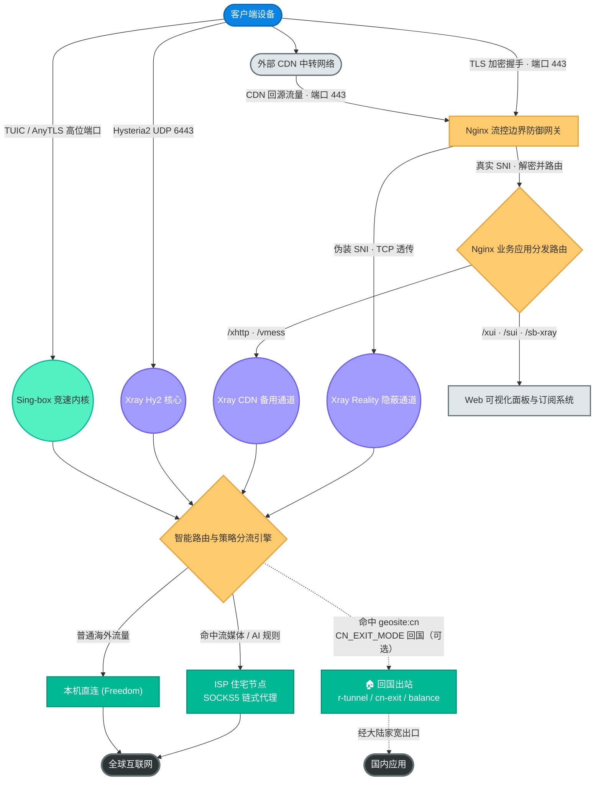

# SB-Xray 平台 🚀

> 专业级全栈网络调度与代理安全网关

<div align="center">
  

  <h3>您的企业级高性能网络安全枢纽</h3>
  <p>打破网络壁垒、聚合多协议、实现无感智能调度的终极云端边缘网关。</p>

  <p>
    <a href="https://hub.docker.com/r/currycan/sb-xray">
      
    </a>
    <a href="https://github.com/currycan/sb-xray/stargazers">
      
    </a>
    <a href="https://github.com/currycan/sb-xray/network/members">
      
    </a>
    <a href="https://github.com/currycan/sb-xray/issues">
      
    </a>
    
    
    <a href="https://github.com/XTLS/Xray-core">
      
    </a>
    <a href="https://github.com/SagerNet/sing-box">
      
    </a>
    
  </p>

  <p>
    <a href="#-全景架构图-architecture-overview">全景架构</a> •
    <a href="#-核心企业级特性-enterprise-features">核心特性</a> •
    <a href="#-官方文档全集-documentation">官方文档</a> •
    <a href="#-安装与快速接入-quick-start">快速接入</a> •
    <a href="#-完整配置指南-configuration">配置指南</a> •
    <a href="#-目录结构-project-layout">目录结构</a>
  </p>
</div>

---

**SB-Xray** 是一个基于 Docker 容器化技术构建的**商业级网络流量分发与代理聚合平台**。它摒弃了传统单一代理软件的单薄性，创新性地将 **Nginx 前置流量整形**、**Xray 与 Sing-box 双核引擎**、**后量子安全加密 (MLKEM)** 以及 **自动化资产清洗 (Sub-Store)** 完美融为一体。

通过本系统，您可以零门槛建立起一套涵盖服务器搭建、多级 ISP 智能落地分流、直至移动端/桌面端一键订阅配置下发的全周期网络环境。

## 🗺️ 全景架构图 (Architecture Overview)

为了直观展现系统的数据吞吐能力与安全屏障设计，我们绘制了以下宏观架构图：



## 🌟 核心企业级特性 (Enterprise Features)

每条特性给一句卖点 + 深入文档指针，机制原理在对应 docs 内详述。

- **🚀 智能双核引擎驱动**：Xray 主理 Reality + XTLS-Vision 隐蔽主干，Sing-box 承载 TUIC / AnyTLS 弱网竞速，双核分工互补。原理见 [01. 架构](./docs/01-architecture-and-traffic.md)，协议手册见 [02. 协议与安全](./docs/02-protocols-and-security.md)。
- **🛡️ 零信任前置网关**：Nginx 统一接管 443，握手阶段按 SNI 透明分流 Reality / CDN / 管理面板，对外只暴露高纯度 Web 伪装。原理见 [01. 架构](./docs/01-architecture-and-traffic.md)。
- **🔐 金融级抗量子加密**：XHTTP / VLESS 通道实装 MLKEM768 后量子密码学（NIST FIPS 203），内置 ACME 机器人自动签发泛域名证书并在到期前无感重签。见 [02. 协议与安全](./docs/02-protocols-and-security.md)。
- **🔀 业务级智能路由分发**：多 ISP SOCKS5 落地按带宽 + RTT 自动选优（`isp-auto`），流媒体 / AI 按服务独立 balancer，`CN_EXIT_MODE=balance` 双腿动态主备回国，内嵌 Sub-Store 在下发前清洗节点。见 [03. 路由与客户端](./docs/03-routing-and-clients.md)、[04. 运维 §2.6](./docs/04-ops-and-troubleshooting.md#26-isp-auto-优化控制变量可选)、[08. Reverse Bridge](./docs/08-xray-reverse-bridge.md)。

> 完整运行时闭环架构图见 [01. 架构 §7.4](./docs/01-architecture-and-traffic.md#74-完整运行时闭环)；全部 env 开关见 [04. 运维 §2](./docs/04-ops-and-troubleshooting.md#2-环境变量完整参考)。

---

## 📚 官方文档全集 (Documentation)

为了给您提供清晰且有理论支撑的操作指引，我们将原来繁杂的文档重新进行了系统化梳理与合并。强烈建议按照以下顺序阅读：

| 模块分类                | 文档链接                                                                       | 内容简介与理论支撑                                                                                                     |
| :---------------------- | :----------------------------------------------------------------------------- | :--------------------------------------------------------------------------------------------------------------------- |
| ⚙️ **构建部署指南**     | [**👉 00. 构建部署指南**](./docs/00-build-release.md)                          | 详解 `build.sh` 自动构建脚本、三阶段 Dockerfile 架构、10 个组件的版本管理策略与常见构建问题 FAQ。                      |
| 🟢 **架构与原理剖析**   | [**👉 01. 系统架构与网络流量链路详解**](./docs/01-architecture-and-traffic.md) | 深度解析 Nginx 前置分流原理、微观 Unix Socket 链路、架构方案对比以及 `entrypoint.py`（Python PID 1，`run` / `show` 子命令）守护进程的五大生命周期扇区。      |
| 🔵 **安全加固与协议**   | [**👉 02. 协议详解与安全加密体系**](./docs/02-protocols-and-security.md)       | 涵盖全部 10 种协议（Xray 系 8 种 + Sing-box 系 2 种）配置手册、MLKEM 后量子加密理论与实践、Reality Fallback 回落机制、ACME 证书管家以及 TUN 模式进阶指南。 |
| 🟡 **调度中枢与客户端** | [**👉 03. 智能路由策略与全平台客户端接入**](./docs/03-routing-and-clients.md)  | 详解 OpenClash Policy-Priority 六维加权评分体系、Sub-Store 深层节点清洗引擎，以及动态 ISP 链式落地的底层实现。         |
| 🔴 **系统运维与监控**   | [**👉 04. 运维管理与故障排查手册**](./docs/04-ops-and-troubleshooting.md)      | 包含多面板入口导航、订阅端点双重认证安全防扫描策略、证书运维以及应对 502/404/证书失效等故障的汇总排错指南。            |
| 🔄 **内网穿透专题**     | [**👉 05. VLESS Reverse Proxy 部署指南**](./docs/05-reverse-proxy-guide.md)    | 家宽落地机反向挂载到 VPS 的端到端部署：portal 侧 `ENABLE_REVERSE` 开关、bridge 侧 simplified outbound 模板、双 UUID 隔离、故障排查与撤销流程。 |
| 📣 **事件通知专题**     | [**👉 06. 事件总线：Xray webhook → shoutrrr**](./docs/06-event-bus-shoutrrr.md)          | 把"谁被 ban / 谁踩 BT / 谁走私网 IP"等 Xray 事件经 shoutrrr 实时推送到 Telegram / Discord / Slack / Gotify 的部署配置与排错指南。 |
| 🛰️ **Tailscale 架构**  | [**👉 07. Tailscale 代理架构设计与配置**](./docs/07-tailscale-proxy-architecture.md) | 一台 OpenWrt 四个角色（cn-exit 回国 / exit node 出国分流 / subnet router 内网穿透 / 本机直连）的架构原理、流量图解、kernel TUN 与 OpenClash/fake-ip 配置详解，以及路由黑洞等真实踩坑实录。 |
| 🔁 **Reverse Bridge 架构** | [**👉 08. Xray Reverse Bridge 回国架构设计与配置**](./docs/08-xray-reverse-bridge.md) | 用 Xray 反向代理做海外回国：portal/bridge 角色、`r-tunnel` 虚拟出站、`CN_EXIT_MODE` 四档开关与 socks5+r-tunnel 主备故障转移（balance）的架构原理、流量图解与踩坑实录。 |
| 🎚️ **特性开关与可选能力** | [**👉 09. 特性开关与可选能力指南**](./docs/09-feature-flags-and-capabilities.md) | 全部 `ENABLE_*` 特性开关的「做什么 / 何时用 / 怎么开 / 如何验证 / 故障排查」五段式索引，并独家详述无独立主文档的能力（XICMP/XDNS 紧急通道、订阅端点、XHTTP/3）。 |
| 🧱 **多 WAN 防泄漏专题** | [**👉 10. 多 WAN 出口与防泄漏**](./docs/10-multi-wan-leak-prevention.md) | 下游 WiFi 路由多上联拓扑中 IPv6 旁路与 DNS 旁路两条泄露路径的成因、防泄漏规则配置与排障。 |
| 🔧 **OpenWrt 重建与切换** | [**👉 11. OpenWrt 重建与割接**](./docs/11-openwrt-rebuild-and-cutover.md) | OpenWrt 节点三种重建场景（全新初始化 / 黄金备份恢复 / 整机切换接管）的分步操作手册；切换对 VPS 侧零改动，支持并行验证与分级回退。 |
| 📜 **版本发布日志**     | [**👉 CHANGELOG（Keep a Changelog 格式）**](./CHANGELOG.md)                    | Added / Changed / Fixed / Removed / Security / Migration notes 全分类列表，附生产 E2E 验证证据与 30 秒回滚命令。|

---

## ⚡ 安装与快速接入 (Quick Start)

**1. 前置准备工作**
确保您的宿主机已安装 Docker 环境，并放行了 TCP `80`、`443` 以及高位 UDP 端口（如果需要 Hysteria2 竞速）。准备好您的**主域名**与**CDN防护域名**，并将其 DNS 的 A 记录指向该服务器 IP。

**2. 克隆并配置部署清单**

仓库根目录已提供维护好的 `docker-compose.yml`，克隆后只需修改 3 个必填环境变量：

```bash
git clone https://github.com/currycan/sb-xray.git
cd sb-xray
vim docker-compose.yml    # 改好以下 3 项后保存
```

| 必填变量 | 示例 | 说明 |
|---|---|---|
| `DOMAIN` | `xray.example.com` | 主域名（Reality / 高位端口协议使用），DNS A 记录指向本机 |
| `CDNDOMAIN` | `cdn.example.com` | CDN 保护域名（XHTTP / VMess-WS 使用），DNS CNAME 指向 CDN |
| `DECODE` | `your-32-char-random-secret` | 订阅解码密钥（任意 32 位字符串） |

可选的 CA 选择、节点后缀、流媒体路由、isp-auto 优化、小内存降载开关等均有合理默认值，参照 `docker-compose.yml` 文件内注释或 [完整配置指南](#-完整配置指南-configuration) 按需调整。

> **架构选择要点**：
>
> - `network_mode: host` — 直连宿主机网络栈，绕过 Docker NAT 带来的 UDP 性能损耗与 QUIC / Hysteria2 端口跳跃限制
> - `mem_limit: 460m` — 小内存 VPS 的安全围栏，防止 xray VSZ 暴涨触发宿主级 OOM；节点内存 ≥ 2 GB 时可放宽或移除
> - `ulimits.nofile: 65536` — 高并发连接下避免 "too many open files"
> - `ENABLE_SUBSTORE` / `ENABLE_XUI` / `ENABLE_SUI` / `ENABLE_SHOUTRRR` — 小内存节点降载开关，每个组件注释里标了内存回收量（`ENABLE_SUI` 对应的 s-ui 面板已不再内置）
> - `tty: true` — 保留终端分配，便于 `docker exec sb-xray bash` 交互排障

**3. 一键启动引擎**

```bash
docker compose up -d
```

启动成功后，执行 `docker logs -f sb-xray`。系统将会输出生成的强密码账户、节点 UUID、订阅专属防泄漏 Token 及您的私密入口链接。

---

## 📋 完整配置指南 (Configuration)

### 环境变量全集

仓库根 `docker-compose.yml` 内按段落给出了所有可用 env 的用法注释；完整分层表格（核心配置 / 证书 / 节点降载 / Shoutrrr 事件总线 / `isp-auto` 十余个优化开关 / 自动检测状态）见 [04. 运维与排障 §2](./docs/04-ops-and-troubleshooting.md#2-环境变量完整参考)。下面速查表只列最常被问到的几项：

| 类别 | 关键变量 | 默认 | 要点 |
|:---|:---|:---|:---|
| **必填** | `DOMAIN` / `CDNDOMAIN` / `DECODE` | — | 主域名 / CDN 域名 / 订阅解码密钥 |
| **证书** | `ACMESH_SERVER_NAME` | `letsencrypt` | 也可 `zerossl` / `google`（后两者需 EAB 凭据） |
| **伪装** | `DEST_HOST` | `www.microsoft.com` | Reality 伪装目标站点；推荐改 `speed.cloudflare.com` |
| **ISP 节点** | `<PREFIX>_ISP_IP` / `_PORT` / `_USER` / `_SECRET` | — | 多 ISP 全部声明，`isp-auto` 自动选优 |
| **节点后缀** | `NODE_SUFFIX` | 空 | 附加到所有生成节点名尾部（如 ` ✈ 高速`） |
| **日志** | `LOG_LEVEL` / `SB_LOG_LEVEL` | `warning` / `INFO` | xray / sing-box 用前者，Python entrypoint 用后者，刻意分离 |
| **降载开关** | `ENABLE_SUBSTORE` / `ENABLE_XUI` / `ENABLE_SUI` / `ENABLE_SHOUTRRR` | `true`（`ENABLE_XUI` 在 `docker-compose.yml` 默认 `false`） | 小内存节点按需关闭可省 20–200 MB；x-ui 面板开箱默认不启用，需用时在 `docker-compose.yml` 改 `ENABLE_XUI=true`；`ENABLE_SUI` 已废弃（s-ui 不再内置） |
| **资源** | `GOMEMLIMIT` / `GOGC` | `320MiB` / `50` | Go 四件套共享 GC 上限 |
| **事件总线** | `SHOUTRRR_URLS` | 空 | 留空 = 仅写本地日志；填 Telegram / Discord URL 推送 |
| **`isp-auto` 优化** | `ISP_PROBE_URL` / `ISP_PER_SERVICE_SB` / `ISP_FALLBACK_STRATEGY` / `ISP_RETEST_INTERVAL_HOURS` 等 | 有默认 | 开箱即用，按需调优见 [04. 运维 §2.6](./docs/04-ops-and-troubleshooting.md#26-isp-auto-优化控制变量可选) |
| **回国出站** | `CN_EXIT_MODE` / `CN_EXIT_SOCKS5_HOST` / `CN_EXIT_PROBE_URL` 等 | `balance`（compose 默认） | 海外节点把国内流量回送国内（访问 B 站 / 网易云 / 银行等）；四档开关与变量见 [04. 运维 §2.7](./docs/04-ops-and-troubleshooting.md#27-回国出站cn_exit_mode-家族可选) |

> Provider 订阅、Hysteria2 / TUIC / AnyTLS 端口覆盖、实验性 feature flag（`ENABLE_XICMP` / `ENABLE_XDNS` / `ENABLE_ECH` / `ENABLE_REVERSE`）等非日常调整项也都在 [04. 运维 §2](./docs/04-ops-and-troubleshooting.md#2-环境变量完整参考) 内列出；海外节点回国出站（`CN_EXIT_MODE` 四档）见 [04. 运维 §2.7](./docs/04-ops-and-troubleshooting.md#27-回国出站cn_exit_mode-家族可选)。

### 部署细节指针

挂载卷表、Provider 订阅引入、运维命令清单按主题在 docs 内就地详述，门面只留指针：

- **挂载卷与持久化目录**（证书 / 订阅文件 / 面板数据库 / 规则缓存的宿主机映射表）→ [04. 运维 §1.3](./docs/04-ops-and-troubleshooting.md#13-挂载卷与持久化目录)
- **引入外部机场订阅源（Provider）**（`PROVIDERS` env / `providers.yaml` 文件挂载两种方式 + `super` / `good` 质量标签）→ [03. 路由与客户端 §3.8](./docs/03-routing-and-clients.md#38-引入外部机场订阅源provider)
- **常用运维命令速查**（启停 / 查看配置 / 按核重启 / 进容器排障）→ [04. 运维 §1.4](./docs/04-ops-and-troubleshooting.md#14-常用运维命令速查)

---

## 🗂️ 目录结构 (Project Layout)

```
sb-xray/
├── docker-compose.yml        # 部署清单
├── build.sh                  # 构建脚本（离线模式 = 读 versions.json；refresh 模式 = 调 API 刷新）
├── release.sh                # Release 脚本（自动同步 Git tag 与镜像版本）
├── versions.json             # 所有组件版本 + 二进制 SHA256 的单一真相源（CI 每日刷新）
├── Dockerfile                # 四阶段构建文件
├── CONTRIBUTING-diagrams.md  # 维护者文档图表样式指引（调色板 / 形状 / pre-submit checklist）
├── scripts/
│   ├── entrypoint.py         # 容器启动守护进程（Python PID 1；argparse run/show/trim/geo-update/isp-retest/shoutrrr-forward）
│   ├── sb_xray/
│   │   ├── events.py             #  结构化事件总线（stdout JSON + 可选 shoutrrr 推送）
│   │   ├── speed_test.py         #  ISP 带宽实测 + TTL 冷启动缓存
│   │   ├── cert.py               #  acme.sh 封装 + 续签判定
│   │   ├── config_builder.py     #  渲染 xray/sing-box/nginx/supervisord 模板
│   │   ├── routing/
│   │   │   ├── isp.py            #     isp-auto balancer + 服务分桶渲染
│   │   │   ├── media.py          #     流媒体/AI 可达性探针
│   │   │   └── service_spec.py   #     服务 → probe URL 单一真相源
│   │   └── stages/
│   │       ├── cron.py           #     geo-update + isp-retest crontab 注册
│   │       ├── isp_retest.py     #     周期重测编排（6h）
│   │       └── …
│   └── show                  # `entrypoint.py show` 子命令 shim
├── templates/
│   ├── xray/                 # Xray 入站 / 出站 / 路由 JSON 模板
│   ├── sing-box/             # Sing-box 入站 / 出站 / 路由 JSON 模板
│   ├── nginx/                # Nginx 站点配置模板
│   ├── supervisord/          # Supervisor 进程管理配置模板
│   └── …                     # Dufs / client_template / providers / proxies 等
├── docs/
│   ├── 00-build-release.md                   # 构建部署与版本发布
│   ├── 01-architecture-and-traffic.md        # 系统架构与全流量链路
│   ├── 02-protocols-and-security.md          # 协议详解与安全加密
│   ├── 03-routing-and-clients.md             # 路由决策与客户端分发
│   ├── 04-ops-and-troubleshooting.md         # 运维与排障（含 env 全集、回国 CN_EXIT_MODE）
│   ├── 05-reverse-proxy-guide.md             # VLESS Reverse Proxy 内网穿透部署
│   ├── 06-event-bus-shoutrrr.md              # shoutrrr 事件总线指南
│   ├── 07-tailscale-proxy-architecture.md    # Tailscale 代理架构（含 socks5 回国半边）
│   ├── 08-xray-reverse-bridge.md             # Xray Reverse Bridge 回国架构与 CN_EXIT_MODE
│   └── 09-feature-flags-and-capabilities.md  # 特性开关（ENABLE_*）总索引与可选能力详述
├── tests/                    # pytest 单元/集成测试（~380 用例）
└── sources/                  # 静态资源与伪装站点素材
```

> 容器内 `/geo` 目录由 `./geo:/geo` 卷挂载，用于持久化 GeoIP / GeoSite 规则库（避免重启重下 ~100 MB）。

---

## 🛠️ 开发与跨平台构建 (Development)

详细的构建说明请参阅 [**👉 00. 构建部署指南**](./docs/00-build-release.md)。

<details>
<summary>点击查看快速构建命令</summary>

```bash
./build.sh              # 离线模式（默认）：读 versions.json 构建，不触网
./build.sh refresh      # 刷新模式：GitHub API → 写回 versions.json → 构建
./build.sh --local      # 单架构 amd64，--load 到本地，不 push；可与上面组合
```

`versions.json` 是所有组件版本 + 二进制 SHA256 的单一真相源，由 `daily-build.yml` CI 每日自动刷新并提交。离线模式与 CI 产物位级一致；需要提前跟最新上游时再用 `refresh` 模式。

</details>

---

## 🤝 鸣谢与参考文献 (Acknowledgements & References)

本系统的基石建立在众多优秀的开源项目之上。以下按类别列出全部上游依赖和理论文献。

### 🔧 核心代理引擎

| 项目                    | 作用                                                 | 链接                                                      |
| :---------------------- | :--------------------------------------------------- | :-------------------------------------------------------- |
| **Xray-core**           | VLESS/VMess/Reality/XHTTP 协议核心，XTLS-Vision 流控 | [XTLS/Xray-core](https://github.com/XTLS/Xray-core)       |
| **Sing-box**            | TUIC / AnyTLS 等 UDP / QUIC 协议核心 | [SagerNet/sing-box](https://github.com/SagerNet/sing-box) |
| **Mihomo (Clash Meta)** | 客户端智能路由内核，Smart 模式策略组引擎             | [MetaCubeX/mihomo](https://github.com/MetaCubeX/mihomo)   |

### 🖥️ 管理面板与前端

| 项目                    | 作用                               | 链接                                                                                      |
| :---------------------- | :--------------------------------- | :---------------------------------------------------------------------------------------- |
| **3x-ui**               | Xray 可视化管理面板 (X-UI，开箱默认不启用) | [MHSanaei/3x-ui](https://github.com/MHSanaei/3x-ui)                                       |
| **S-UI**                | Sing-box 可视化管理面板（已不再内置） | [alireza0/s-ui](https://github.com/alireza0/s-ui)                                         |
| **Sub-Store**           | 订阅源聚合、节点清洗与转换平台     | [sub-store-org/Sub-Store](https://github.com/sub-store-org/Sub-Store)                     |
| **Sub-Store-Front-End** | Sub-Store 前端界面                 | [sub-store-org/Sub-Store-Front-End](https://github.com/sub-store-org/Sub-Store-Front-End) |
| **Http-Meta**           | Sub-Store 的 HTTP 后端元数据处理器 | [xream/http-meta](https://github.com/xream/http-meta)                                     |

### 🛡️ 安全与运维基建

| 项目            | 作用                                | 链接                                                                  |
| :-------------- | :---------------------------------- | :-------------------------------------------------------------------- |
| **acme.sh**     | ACME 全自动证书签发与续期           | [acmesh-official/acme.sh](https://github.com/acmesh-official/acme.sh) |
| **Cloudflared** | Cloudflare Tunnel 隧道客户端        | [cloudflare/cloudflared](https://github.com/cloudflare/cloudflared)   |
| **Fail2ban**    | 入侵防护与暴力破解检测              | [fail2ban/fail2ban](https://github.com/fail2ban/fail2ban)             |
| **Shoutrrr**    | 多平台通知推送（Telegram/Slack 等） | [containrrr/shoutrrr](https://github.com/containrrr/shoutrrr)         |
| **Supervisor**  | 进程管理与守护                      | [Supervisor/supervisor](https://github.com/Supervisor/supervisor)     |
| **dumb-init**   | 容器 PID 1 信号转发                 | [Yelp/dumb-init](https://github.com/Yelp/dumb-init)                   |

### 🗂️ 工具与文件服务

| 项目      | 作用                            | 链接                                            |
| :-------- | :------------------------------ | :---------------------------------------------- |
| **Dufs**  | 轻量级文件上传/下载/WebDAV 服务 | [sigoden/dufs](https://github.com/sigoden/dufs) |
| **Nginx** | 前置边界网关与 SNI 分流         | [nginx/nginx](https://github.com/nginx/nginx)   |

### 📜 规则集与 GeoIP 数据

| 项目                                    | 作用                                                 | 链接                                                                                          |
| :-------------------------------------- | :--------------------------------------------------- | :-------------------------------------------------------------------------------------------- |
| **666OS/rules**                         | 主力分流规则集（域名 + IP，MRS 格式）                | [666OS/rules](https://github.com/666OS/rules)                                                 |
| **666OS/YYDS**                          | OneSmartPro 客户端配置模板参考                       | [666OS/YYDS](https://github.com/666OS/YYDS)                                                   |
| **blackmatrix7/ios_rule_script**        | 补充分流规则（Claude、Epic、PlayStation 等）         | [blackmatrix7/ios_rule_script](https://github.com/blackmatrix7/ios_rule_script)               |
| **metacubex/meta-rules-dat**            | Mihomo 官方 GeoSite 规则（GitHub、Reddit、Steam 等） | [metacubex/meta-rules-dat](https://github.com/metacubex/meta-rules-dat)                       |
| **liandu2024/clash**                    | 自定义扩展规则（Gemini、Grok、Copilot 等）           | [liandu2024/clash](https://github.com/liandu2024/clash)                                       |
| **liandu2024/little**                   | YAML 文件处理工具                                    | [liandu2024/little](https://github.com/liandu2024/little/tree/main/yaml)                      |
| **qichiyuhub/rule**                     | Clash、Sing-box、等分流规则                          | [qichiyuhub/rule](https://github.com/qichiyuhub/rule/tree/main)                               |
| **Loyalsoldier/v2ray-rules-dat**        | Xray GeoIP/GeoSite 数据库                            | [Loyalsoldier/v2ray-rules-dat](https://github.com/Loyalsoldier/v2ray-rules-dat)               |
| **chocolate4u/Iran-v2ray-rules**        | 伊朗地区 GeoIP/GeoSite 数据库                        | [chocolate4u/Iran-v2ray-rules](https://github.com/chocolate4u/Iran-v2ray-rules)               |
| **runetfreedom/russia-v2ray-rules-dat** | 俄罗斯地区 GeoIP/GeoSite 数据库                      | [runetfreedom/russia-v2ray-rules-dat](https://github.com/runetfreedom/russia-v2ray-rules-dat) |
| **v2fly/domain-list-community**         | 社区维护的域名列表                                   | [v2fly/domain-list-community](https://github.com/v2fly/domain-list-community)                 |

### 📐 技术标准与理论文献

| 标准/文献               | 说明                             | 链接                                                                                                 |
| :---------------------- | :------------------------------- | :--------------------------------------------------------------------------------------------------- |
| **NIST FIPS 203**       | MLKEM 后量子密钥封装机制标准     | [ML-KEM Standard](https://csrc.nist.gov/pubs/fips/203/final)                                         |
| **NIST PQC 项目**       | 后量子密码学标准化项目           | [Post-Quantum Cryptography](https://csrc.nist.gov/projects/post-quantum-cryptography)                |
| **VLESS Encryption PR** | RPRX 的 VLESS 端到端加密设计文档 | [XTLS/Xray-core#5067](https://github.com/XTLS/Xray-core/pull/5067)                                   |
| **REALITY 协议**        | Reality 深度伪装协议设计         | [XTLS/Xray-core#4915](https://github.com/XTLS/Xray-core/pull/4915)                                   |
| **XHTTP 协议**          | XHTTP 传输层标准探讨             | [XTLS/Xray-core#4113](https://github.com/XTLS/Xray-core/discussions/4113)                            |
| **Vision 流控**         | XTLS-Vision 流量控制设计         | [XTLS/Xray-core#1295](https://github.com/XTLS/Xray-core/discussions/1295)                            |
| **Reality 端口共存**    | Nginx + Reality 架构参考模型     | [XTLS/Xray-core#4118](https://github.com/XTLS/Xray-core/discussions/4118)                            |
| **GFW SS MITM 攻击**    | 流量主动探测安全性分析           | [net4people/bbs#526](https://github.com/net4people/bbs/issues/526)                                   |
| **Nginx Stream SNI**    | Stream 模块 SNI 预读技术         | [ngx_stream_ssl_preread_module](https://nginx.org/en/docs/stream/ngx_stream_ssl_preread_module.html) |
| **Unix Domain Socket**  | 进程间高效通信 (IPC) 规范        | POSIX.1-2001 `unix(7)`                                                                               |

## 📈 项目活跃度 (Project Traffic)

下图展示本仓库每日 **克隆流量** 趋势（总克隆数与独立克隆者），由定时任务自动抓取 GitHub Traffic 数据并持续累积，直观反映项目的真实影响力与活跃度。

<div align="center">
  
</div>

> 数据每日自动刷新；图表初期数据点较少，随时间累积将逐步丰满。

## 📄 许可协议 (License)

本项目及其所有相关脚本受 [MIT License](LICENSE) 保护。您可自由用于商业化部署或二次开发分发，但需保留原作者版权声明。
