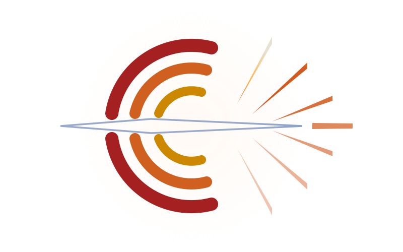
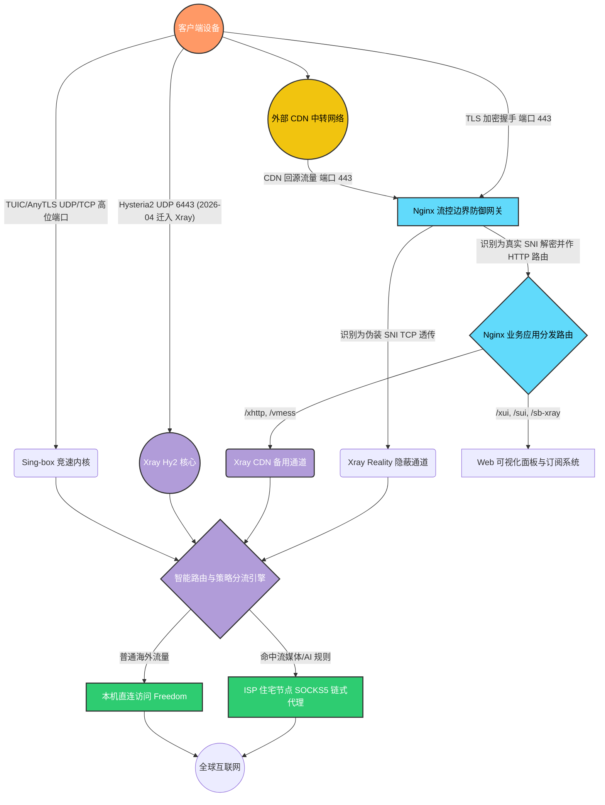

# SB-Xray 平台 🚀

> 专业级全栈网络调度与代理安全网关

<div align="center">
  

  <h3>您的企业级高性能网络安全枢纽</h3>
  <p>打破网络壁垒、聚合多协议、实现无感智能调度的终极云端边缘网关。</p>

  <p>
    <a href="https://hub.docker.com/r/currycan/sb-xray">
      
    </a>
    
    <a href="https://github.com/XTLS/Xray-core">
      
    </a>
    <a href="https://github.com/SagerNet/sing-box">
      
    </a>
    
  </p>

  <p>
    <a href="#-全景架构图-architecture-overview">全景架构</a> •
    <a href="#-核心企业级特性-enterprise-features">核心特性</a> •
    <a href="#-官方文档全集-documentation">官方文档</a> •
    <a href="#-安装与快速接入-quick-start">快速接入</a> •
    <a href="#-完整配置指南-configuration">配置指南</a>
  </p>
</div>

---

**SB-Xray** 是一个基于 Docker 容器化技术构建的**商业级网络流量分发与代理聚合平台**。它摒弃了传统单一代理软件的单薄性，创新性地将 **Nginx 前置流量整形**、**Xray 与 Sing-box 双核引擎**、**后量子安全加密 (MLKEM)** 以及 **自动化资产清洗 (Sub-Store)** 完美融为一体。

通过本系统，您可以零门槛建立起一套涵盖服务器搭建、多级 ISP 智能落地分流、直至移动端/桌面端一键订阅配置下发的全周期网络环境。

## 🗺️ 全景架构图 (Architecture Overview)

为了直观展现系统的数据吞吐能力与安全屏障设计，我们绘制了以下宏观架构图：



## 🌟 核心企业级特性 (Enterprise Features)

### 1. 🚀 智能双核引擎驱动 (Dual-Core Engine)

- **Xray 核心 (隐蔽主干)**: 主理 Reality 协议与 XTLS-Vision 流控，在提供极高防探测能力的同时，确保高频数据通信（如日常网络代理、AI 接口调用）的绝对稳定。
- **Sing-box 核心 (竞速加速)**: 专注处理 TUIC、AnyTLS 等 UDP 竞速协议（Hysteria2 于 2026-04 永久迁至 Xray 原生入站，客户端订阅参数不变），在严重丢包弱网环境下暴力竞速压榨带宽。

### 2. 🛡️ 零信任前置网关 (Zero-Trust Gateway)

- **Nginx SNI 无缝分流**: 整个系统由 Nginx 统一接管 443 标准端口。它在握手阶段解析 SNI，将 Reality 伪装流量透明下发至 Xray，将 CDN 落地流量路由至 VMess，将管理请求分发至后台面板。即使面临主动探测，也只暴露高纯度的 Web 伪装内容。

### 3. 🔐 金融级抗量子加密 (Quantum-Resistant Security)

- **MLKEM 密码学加持**: 紧跟网络安全前沿，在 XHTTP 与 VLESS 通道中率先实装了 MLKEM768 后量子密码学协议（符合 NIST FIPS 203 标准），从容应对未来量子计算机的算力破解威胁。
- **ACME 自动发证中枢**: 内置全自动证书机器人，仅需配置环境变量，即可自动向 ZeroSSL 或 Google CA 申请泛域名证书，并执行 90 天自动化无感续期。

### 4. 🔀 业务级智能路由分发 (Smart Routing & Distribution)

- **多 ISP 原生链式落地**: 支持无缝挂载多个第三方住宅 IP (ISP Socks5)。内核级路由引擎可根据目标域名（如 Netflix, ChatGPT）自动引流至原生节点，彻底解决数据中心 IP 被阻断的问题。
- **自动化订阅节点清洗**: 系统内嵌 Sub-Store，在将节点下发给 Clash / Surge 客户端前，自动执行地名标准化、挂载国旗 Emoji、过滤失效节点，提升客户端策略组分流的精准度。

---

## 📚 官方文档全集 (Documentation)

为了给您提供清晰且有理论支撑的操作指引，我们将原来繁杂的文档重新进行了系统化梳理与合并。强烈建议按照以下顺序阅读：

| 模块分类                | 文档链接                                                                       | 内容简介与理论支撑                                                                                                     |
| :---------------------- | :----------------------------------------------------------------------------- | :--------------------------------------------------------------------------------------------------------------------- |
| 🟢 **架构与原理剖析**   | [**👉 01. 系统架构与网络流量链路详解**](./docs/01-architecture-and-traffic.md) | 深度解析 Nginx 前置分流原理、微观 Unix Socket 链路、架构方案对比以及 `entrypoint.py`（Python PID 1，`run` / `show` 子命令）守护进程的五大生命周期扇区。      |
| 🔵 **安全加固与协议**   | [**👉 02. 协议详解与安全加密体系**](./docs/02-protocols-and-security.md)       | 涵盖全部 9 种协议配置手册、MLKEM 后量子加密理论与实践、Reality Fallback 回落机制、ACME 证书管家以及 TUN 模式进阶指南。 |
| 🟡 **调度中枢与客户端** | [**👉 03. 智能路由策略与全平台客户端接入**](./docs/03-routing-and-clients.md)  | 详解 OpenClash Policy-Priority 六维加权评分体系、Sub-Store 深层节点清洗引擎，以及动态 ISP 链式落地的底层实现。         |
| 🔴 **系统运维与监控**   | [**👉 04. 运维管理与故障排查手册**](./docs/04-ops-and-troubleshooting.md)      | 包含多面板入口导航、订阅端点双重认证安全防扫描策略、证书运维以及应对 502/404/证书失效等故障的汇总排错指南。            |
| ⚙️ **构建部署指南**     | [**👉 05. 构建部署指南**](./docs/05-build-release.md)                          | 详解 `build.sh` 自动构建脚本、四阶段 Dockerfile 架构、11 个组件的版本管理策略与常见构建问题 FAQ。                      |
| 🔄 **内网穿透专题**     | [**👉 06. VLESS Reverse Proxy 部署指南**](./docs/06-reverse-proxy-guide.md)    | 家宽落地机反向挂载到 VPS 的端到端部署：portal 侧 `ENABLE_REVERSE` 开关、bridge 侧 simplified outbound 模板、双 UUID 隔离、故障排查与撤销流程。 |
| ✨ **新特性使用指南**   | [**👉 07. 新特性使用指南**](./docs/07-new-features-guide.md)          | 事件总线 / adv 抗审查订阅 / 反向穿透 / Xray 原生 Hy2 / XHTTP-H3 / XICMP / XDNS 共 8 个特性的五段式操作手册 + Env 速查表 + 通用故障排查。 |
| 📜 **版本发布日志**     | [**👉 CHANGELOG（Keep a Changelog 格式）**](./CHANGELOG.md)                    | Added / Changed / Fixed / Removed / Security / Migration notes 全分类列表，附生产 E2E 验证证据与 30 秒回滚命令。|

---

## ⚡ 安装与快速接入 (Quick Start)

**1. 前置准备工作**
确保您的宿主机已安装 Docker 环境，并放行了 TCP `80`、`443` 以及高位 UDP 端口（如果需要 Hysteria2 竞速）。准备好您的**主域名**与**CDN防护域名**，并将其 DNS 的 A 记录指向该服务器 IP。

**2. 编写部署清单 (docker-compose.yml)**

```yaml
services:
  sb-xray:
    image: docker.io/currycan/sb-xray:latest
    container_name: sb-xray
    environment:
      - DOMAIN=$domain # 必填: 您的私有主域名
      - CDNDOMAIN=$cdndomain # 必填: 您的 CDN 保护域名
      - DECODE=$code # 可选: 自定义解码密钥
      - ACMESH_DEBUG=1 # 证书调试日志级别 (0-2)
      # CA 机构: zerossl(默认推荐) / google
      - ACMESH_SERVER_NAME=zerossl
      - ACMESH_EAB_KID=$eab_kid # Google CA EAB keyId
      - ACMESH_EAB_HMAC_KEY=$eab_hmac_key # Google CA EAB b64MacKey
      - DEST_HOST=speed.cloudflare.com # Reality 伪装目标站点
      - LISTENING_PORT=443 # 主监听端口
      - DUFS_PATH_PREFIX=/myfiles # 文件服务 URL 前缀
      - XUI_WEBBASEPATH=3xadmin # X-UI 面板访问路径
      # Gemini 直连策略: true=直连, false=使用代理, 空=自动判断
      - GEMINI_DIRECT=
      # 节点名称后缀 (如: ✈ 高速)
      - NODE_SUFFIX=
      # ISP 落地代理: 留空则不启用
      - DEFAULT_ISP=
      # # 外部订阅源 (多个用换行分隔)
      # - |
      #   PROVIDERS=机场名称|https://<host>/api/v1/client/subscribe?token=xxx&flag=clash.meta|super
    ports:
      - "443:443/tcp"
      - "443:443/udp" # UDP 端口用于 HTTP/3 (QUIC)
    volumes:
      - ./pki:/pki # TLS 证书存储
      - ./acmecerts:/acmecerts # ACME 账户与中间证书
      - ./.envs:/.env # 运行时环境变量缓存 (UUID/密钥等)
      - ./sb-xray:/sb-xray # 生成的订阅文件与客户端配置
      - ./x-ui:/etc/x-ui/ # X-UI 数据库 (持久化面板数据)
      - ./x-ui:/x-ui/db # X-UI 数据库 (备份路径)
      - ./s-ui:/s-ui/db # S-UI 数据库
      - ./sub-store:/sub-store/data # Sub-Store 数据库
      - ./nginx/http:/etc/nginx/conf.d # 自定义 Nginx HTTP 配置
      - ./nginx/tcp:/etc/nginx/stream.d # 自定义 Nginx Stream 配置
      - ./nginx-dhparam:/etc/nginx/dhparam # DH 密钥参数 (首次生成后缓存)
      - ./data:/data # Dufs 文件服务数据存储
      - ./logs:/var/log # 全部日志文件
      # - /lib/modules:/lib/modules:ro              # 可选: 内核模块 (TUN 模式需要)
    restart: always
    tty: true
    network_mode: host # 必须: 直接使用宿主机网络
    # cap_add:                                      # 可选: TUN 透明代理需要
    #   - NET_ADMIN
    #   - SYS_MODULE
    ulimits:
      nproc: 65535
      nofile:
        soft: 65536
        hard: 65536
```

> **关键说明**：
>
> - `network_mode: host` — 直接使用宿主机网络栈，避免 Docker NAT 带来的性能损耗和 UDP 转发问题
> - `ports` 中同时声明了 TCP 和 UDP 443 — UDP 用于 HTTP/3 (QUIC) 协议支持
> - `ulimits` — 将文件句柄数提升至 65536，防止高并发时出现 "too many open files" 错误
> - `tty: true` — 保持终端分配，便于 `docker exec` 交互调试

**3. 一键启动引擎**

```bash
docker compose up -d
```

启动成功后，执行 `docker logs -f sb-xray`。系统将会输出生成的强密码账户、节点 UUID、订阅专属防泄漏 Token 及您的私密入口链接。

---

## 📋 完整配置指南 (Configuration)

### 环境变量全集

以下是所有可用的环境变量及其作用（可在 `docker-compose.yml` 中配置）：

<details>
<summary>点击展开完整环境变量列表</summary>

#### 核心配置

| 变量名           | 默认值              | 说明                                                     |
| :--------------- | :------------------ | :------------------------------------------------------- |
| `DOMAIN`         | _必填_              | 您的私有主域名（如 `example.com`）                       |
| `CDNDOMAIN`      | _必填_              | CDN 保护域名（如 `cdn.example.com`）                     |
| `DECODE`         | _空_                | 自定义解码密钥                                           |
| `DEST_HOST`      | `www.microsoft.com` | Reality 伪装目标站点（推荐 `speed.cloudflare.com`）      |
| `LISTENING_PORT` | `443`               | 主监听端口（TCP，Nginx/Xray 共用）                       |
| `PORT_HYSTERIA2` | `6443`              | Hysteria2 协议 UDP 监听端口                              |
| `PORT_TUIC`      | `8443`              | TUIC 协议 UDP 监听端口                                   |
| `PORT_ANYTLS`    | `4433`              | AnyTLS 协议 TCP 监听端口                                 |
| `NODE_SUFFIX`    | _空_                | 节点名称后缀（如 ` ✈ 高速`），会附加在所有生成的节点名后 |

#### 证书配置

| 变量名                  | 默认值    | 说明                                           |
| :---------------------- | :-------- | :--------------------------------------------- |
| `ACMESH_SERVER_NAME`    | `zerossl` | CA 机构：`zerossl`（推荐）或 `google`          |
| `ACMESH_REGISTER_EMAIL` | _空_      | ACME 注册邮箱                                  |
| `ACMESH_EAB_KID`        | _空_      | Google CA EAB keyId（仅 Google CA 需要）       |
| `ACMESH_EAB_HMAC_KEY`   | _空_      | Google CA EAB b64MacKey（仅 Google CA 需要）   |
| `ACMESH_DEBUG`          | `2`       | 证书调试日志级别：`0`=关闭, `1`=基础, `2`=详细 |

#### ISP 落地代理

| 变量名          | 默认值   | 说明                                                    |
| :-------------- | :------- | :------------------------------------------------------ |
| `DEFAULT_ISP`   | `LA_ISP` | 默认落地出口标签（如 `LA_ISP`、`KR_ISP`），留空则不启用 |
| `XX_ISP_IP`     | _空_     | ISP 代理 IP 地址（`XX` 为自定义标签前缀）               |
| `XX_ISP_PORT`   | _空_     | ISP 代理端口                                            |
| `XX_ISP_USER`   | _空_     | ISP 代理用户名（可选）                                  |
| `XX_ISP_SECRET` | _空_     | ISP 代理密码（可选）                                    |

#### AI 路由策略

| 变量名          | 默认值           | 说明                                                                      |
| :-------------- | :--------------- | :------------------------------------------------------------------------ |
| `GEMINI_DIRECT` | _空（自动判断）_ | Gemini 直连策略：`true`=强制直连, `false`=强制代理, 空=自动探测 IP 可用性 |

#### Provider 订阅源

| 变量名      | 默认值 | 说明                                                                                                  |
| :---------- | :----- | :---------------------------------------------------------------------------------------------------- |
| `PROVIDERS` | _空_   | 外部机场订阅源，格式：`名称\|URL\|质量标签`，多个用换行分隔。质量标签：`super`(+30分) / `good`(+10分) |

#### 管理面板

| 变量名            | 默认值  | 说明                                       |
| :---------------- | :------ | :----------------------------------------- |
| `XUI_WEBBASEPATH` | `xui`   | X-UI 面板 URL 路径（建议修改为随机字符串） |
| `XUI_ACCOUNT`     | `admin` | X-UI 默认用户名                            |
| `XUI_PORT`        | `8888`  | X-UI 内部端口                              |
| `SUI_WEBBASEPATH` | `sui`   | S-UI 面板 URL 路径                         |
| `SUI_PORT`        | `3095`  | S-UI 内部端口                              |

#### Dufs 文件服务

| 变量名              | 默认值  | 说明              |
| :------------------ | :------ | :---------------- |
| `DUFS_PATH_PREFIX`  | `/dufs` | 文件服务 URL 前缀 |
| `DUFS_SERVE_PATH`   | `/data` | 文件存储路径      |
| `DUFS_ALLOW_UPLOAD` | `true`  | 是否允许上传      |
| `DUFS_ALLOW_DELETE` | `true`  | 是否允许删除      |

</details>

### 目录结构说明

```
sb-xray/
├── docker-compose.yml        # 部署清单
├── build.sh                  # 自动构建脚本
├── Dockerfile                # 四阶段构建文件
├── scripts/
│   ├── entrypoint.py         # 容器启动守护进程（Python PID 1；argparse run/show/trim；run 一次性编排 16 段启动流水线；trim 按 ENABLE_* 精简 supervisord 配置）
│   ├── sb_xray/              # Python 包：env/logging/cert/config_builder/speed_test/routing/stages/...
│   ├── geo_update.sh         # GeoIP/GeoSite 数据更新
│   ├── check_ip_type.sh      # IP 类型检测
│   └── show                  # Python `entrypoint.py show` 子命令 shim
├── templates/
│   ├── xray/                 # Xray 入站/出站/路由 JSON 模板
│   ├── sing-box/             # Sing-box 入站/出站/路由 JSON 模板
│   ├── nginx/                # Nginx 站点配置模板
│   ├── dufs/                 # Dufs 文件服务配置模板
│   ├── supervisord/          # Supervisor 进程管理配置模板
│   ├── proxies/              # 代理节点配置模板
│   ├── client_template/      # 客户端订阅模板 (Mihomo/OneSmartPro/Surge/Stash)
│   └── providers/            # 订阅源提供者模板
├── docs/                     # 技术文档
└── sources/                  # 静态资源与伪装站点素材
```

### 挂载卷说明

| 挂载路径          | 容器路径                  | 用途                                  |
| :---------------- | :------------------------ | :------------------------------------ |
| `./pki`           | `/pki`                    | TLS 证书存储                          |
| `./acmecerts`     | `/acmecerts`              | ACME 账户与中间证书                   |
| `./.envs`         | `/.env`                   | 运行时环境变量缓存（含 UUID、密钥等） |
| `./sb-xray`       | `/sb-xray`                | 生成的订阅文件与客户端配置            |
| `./data`          | `/data`                   | Dufs 文件服务的数据存储               |
| `./x-ui`          | `/etc/x-ui/` + `/x-ui/db` | X-UI 数据库（持久化面板数据）         |
| `./s-ui`          | `/s-ui/db`                | S-UI 数据库                           |
| `./sub-store`     | `/sub-store/data`         | Sub-Store 数据库                      |
| `./nginx/http`    | `/etc/nginx/conf.d`       | 自定义 Nginx HTTP 配置                |
| `./nginx/tcp`     | `/etc/nginx/stream.d`     | 自定义 Nginx Stream 配置              |
| `./nginx-dhparam` | `/etc/nginx/dhparam`      | DH 密钥参数（首次生成后缓存）         |
| `./logs`          | `/var/log`                | 所有日志文件                          |

### Provider（外部订阅源）配置

如需引入外部机场订阅，支持两种方式：

**方式一：环境变量**

```yaml
environment:
  - |
    PROVIDERS=机场名称A|https://example.com/subscribe?token=xxx|super
    机场名称B|https://example2.com/sub?token=yyy|good
```

**方式二：文件挂载**

```bash
# 在 ./sb-xray/providers 目录下创建 providers.yaml 文件
echo '机场名称|https://xxx|super' > ./sb-xray/providers/providers.yaml
```

> **质量标签说明**：`super` = 住宅流畅级（权重+30），`good` = 代理流畅级（权重+10）

### 常用运维命令

```bash
# 一键启动
docker compose up -d

# 查看日志
docker logs -f sb-xray

# 查看生成的配置与订阅链接
docker exec sb-xray show

# 重启所有服务
docker compose restart

# 仅重启某个核心
docker exec sb-xray supervisorctl restart xray
docker exec sb-xray supervisorctl restart sing-box

# 进入容器终端
docker exec -it sb-xray bash
```

---

## 🛠️ 开发与跨平台构建 (Development)

详细的构建说明请参阅 [**👉 05. 构建部署指南**](./docs/05-build-release.md)。

<details>
<summary>点击查看快速构建命令</summary>

### 自动整合构建（推荐）

```bash
./build.sh
```

### 使用默认版本构建（离线环境）

```bash
./build.sh default
```

</details>

---

## 🤝 鸣谢与参考文献 (Acknowledgements & References)

本系统的基石建立在众多优秀的开源项目之上。以下按类别列出全部上游依赖和理论文献。

### 🔧 核心代理引擎

| 项目                    | 作用                                                 | 链接                                                      |
| :---------------------- | :--------------------------------------------------- | :-------------------------------------------------------- |
| **Xray-core**           | VLESS/VMess/Reality/XHTTP 协议核心，XTLS-Vision 流控 | [XTLS/Xray-core](https://github.com/XTLS/Xray-core)       |
| **Sing-box**            | TUIC/AnyTLS 等 UDP/QUIC 协议核心（Hysteria2 2026-04 迁至 Xray） | [SagerNet/sing-box](https://github.com/SagerNet/sing-box) |
| **Mihomo (Clash Meta)** | 客户端智能路由内核，Smart 模式策略组引擎             | [MetaCubeX/mihomo](https://github.com/MetaCubeX/mihomo)   |

### 🖥️ 管理面板与前端

| 项目                    | 作用                               | 链接                                                                                      |
| :---------------------- | :--------------------------------- | :---------------------------------------------------------------------------------------- |
| **3x-ui**               | Xray 可视化管理面板 (X-UI)         | [MHSanaei/3x-ui](https://github.com/MHSanaei/3x-ui)                                       |
| **S-UI**                | Sing-box 可视化管理面板            | [alireza0/s-ui](https://github.com/alireza0/s-ui)                                         |
| **Sub-Store**           | 订阅源聚合、节点清洗与转换平台     | [sub-store-org/Sub-Store](https://github.com/sub-store-org/Sub-Store)                     |
| **Sub-Store-Front-End** | Sub-Store 前端界面                 | [sub-store-org/Sub-Store-Front-End](https://github.com/sub-store-org/Sub-Store-Front-End) |
| **Http-Meta**           | Sub-Store 的 HTTP 后端元数据处理器 | [xream/http-meta](https://github.com/xream/http-meta)                                     |

### 🛡️ 安全与运维基建

| 项目            | 作用                                | 链接                                                                  |
| :-------------- | :---------------------------------- | :-------------------------------------------------------------------- |
| **acme.sh**     | ACME 全自动证书签发与续期           | [acmesh-official/acme.sh](https://github.com/acmesh-official/acme.sh) |
| **Cloudflared** | Cloudflare Tunnel 隧道客户端        | [cloudflare/cloudflared](https://github.com/cloudflare/cloudflared)   |
| **Fail2ban**    | 入侵防护与暴力破解检测              | [fail2ban/fail2ban](https://github.com/fail2ban/fail2ban)             |
| **Shoutrrr**    | 多平台通知推送（Telegram/Slack 等） | [containrrr/shoutrrr](https://github.com/containrrr/shoutrrr)         |
| **Supervisor**  | 进程管理与守护                      | [Supervisor/supervisor](https://github.com/Supervisor/supervisor)     |
| **dumb-init**   | 容器 PID 1 信号转发                 | [Yelp/dumb-init](https://github.com/Yelp/dumb-init)                   |

### 🗂️ 工具与文件服务

| 项目      | 作用                            | 链接                                            |
| :-------- | :------------------------------ | :---------------------------------------------- |
| **Dufs**  | 轻量级文件上传/下载/WebDAV 服务 | [sigoden/dufs](https://github.com/sigoden/dufs) |
| **Nginx** | 前置边界网关与 SNI 分流         | [nginx/nginx](https://github.com/nginx/nginx)   |

### 📜 规则集与 GeoIP 数据

| 项目                                    | 作用                                                 | 链接                                                                                          |
| :-------------------------------------- | :--------------------------------------------------- | :-------------------------------------------------------------------------------------------- |
| **666OS/rules**                         | 主力分流规则集（域名 + IP，MRS 格式）                | [666OS/rules](https://github.com/666OS/rules)                                                 |
| **666OS/YYDS**                          | OneSmartPro 客户端配置模板参考                       | [666OS/YYDS](https://github.com/666OS/YYDS)                                                   |
| **blackmatrix7/ios_rule_script**        | 补充分流规则（Claude、Epic、PlayStation 等）         | [blackmatrix7/ios_rule_script](https://github.com/blackmatrix7/ios_rule_script)               |
| **metacubex/meta-rules-dat**            | Mihomo 官方 GeoSite 规则（GitHub、Reddit、Steam 等） | [metacubex/meta-rules-dat](https://github.com/metacubex/meta-rules-dat)                       |
| **liandu2024/clash**                    | 自定义扩展规则（Gemini、Grok、Copilot 等）           | [liandu2024/clash](https://github.com/liandu2024/clash)                                       |
| **liandu2024/little**                   | YAML 文件处理工具                                    | [liandu2024/little](https://github.com/liandu2024/little/tree/main/yaml)                      |
| **qichiyuhub/rule**                     | Clash、Sing-box、等分流规则                          | [qichiyuhub/rule](https://github.com/qichiyuhub/rule/tree/main)                               |
| **Loyalsoldier/v2ray-rules-dat**        | Xray GeoIP/GeoSite 数据库                            | [Loyalsoldier/v2ray-rules-dat](https://github.com/Loyalsoldier/v2ray-rules-dat)               |
| **chocolate4u/Iran-v2ray-rules**        | 伊朗地区 GeoIP/GeoSite 数据库                        | [chocolate4u/Iran-v2ray-rules](https://github.com/chocolate4u/Iran-v2ray-rules)               |
| **runetfreedom/russia-v2ray-rules-dat** | 俄罗斯地区 GeoIP/GeoSite 数据库                      | [runetfreedom/russia-v2ray-rules-dat](https://github.com/runetfreedom/russia-v2ray-rules-dat) |
| **v2fly/domain-list-community**         | 社区维护的域名列表                                   | [v2fly/domain-list-community](https://github.com/v2fly/domain-list-community)                 |

### 📐 技术标准与理论文献

| 标准/文献               | 说明                             | 链接                                                                                                 |
| :---------------------- | :------------------------------- | :--------------------------------------------------------------------------------------------------- |
| **NIST FIPS 203**       | MLKEM 后量子密钥封装机制标准     | [ML-KEM Standard](https://csrc.nist.gov/pubs/fips/203/final)                                         |
| **NIST PQC 项目**       | 后量子密码学标准化项目           | [Post-Quantum Cryptography](https://csrc.nist.gov/projects/post-quantum-cryptography)                |
| **VLESS Encryption PR** | RPRX 的 VLESS 端到端加密设计文档 | [XTLS/Xray-core#5067](https://github.com/XTLS/Xray-core/pull/5067)                                   |
| **REALITY 协议**        | Reality 深度伪装协议设计         | [XTLS/Xray-core#4915](https://github.com/XTLS/Xray-core/pull/4915)                                   |
| **XHTTP 协议**          | XHTTP 传输层标准探讨             | [XTLS/Xray-core#4113](https://github.com/XTLS/Xray-core/discussions/4113)                            |
| **Vision 流控**         | XTLS-Vision 流量控制设计         | [XTLS/Xray-core#1295](https://github.com/XTLS/Xray-core/discussions/1295)                            |
| **Reality 端口共存**    | Nginx + Reality 架构参考模型     | [XTLS/Xray-core#4118](https://github.com/XTLS/Xray-core/discussions/4118)                            |
| **GFW SS MITM 攻击**    | 流量主动探测安全性分析           | [net4people/bbs#526](https://github.com/net4people/bbs/issues/526)                                   |
| **Nginx Stream SNI**    | Stream 模块 SNI 预读技术         | [ngx_stream_ssl_preread_module](https://nginx.org/en/docs/stream/ngx_stream_ssl_preread_module.html) |
| **Unix Domain Socket**  | 进程间高效通信 (IPC) 规范        | POSIX.1-2001 `unix(7)`                                                                               |

## 📄 许可协议 (License)

本项目及其所有相关脚本受 [MIT License](LICENSE) 保护。您可自由用于商业化部署或二次开发分发，但需保留原作者版权声明。
