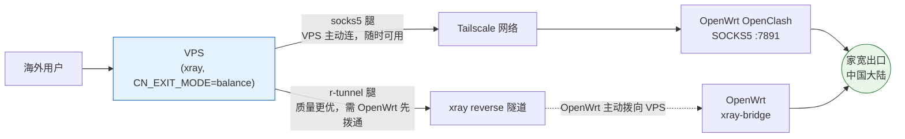
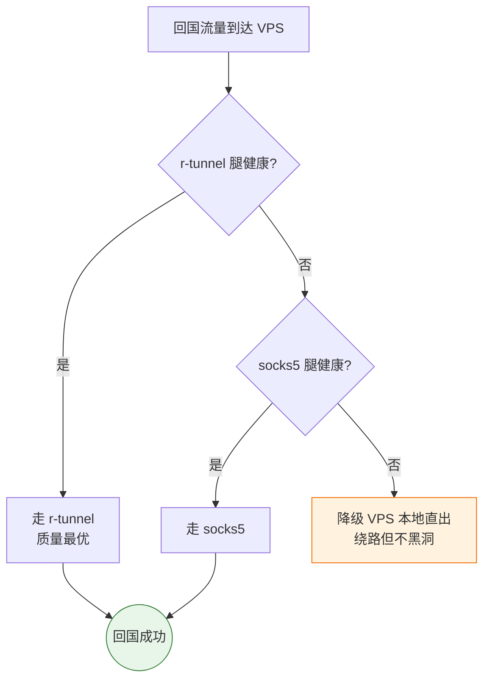
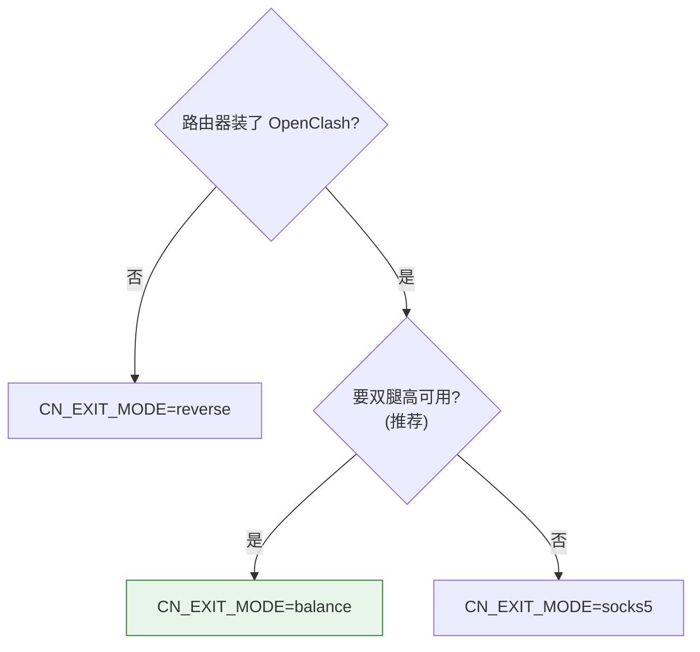
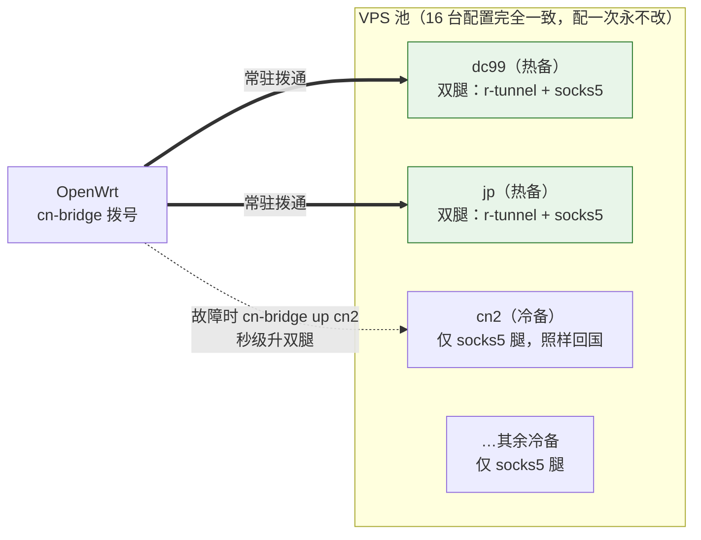
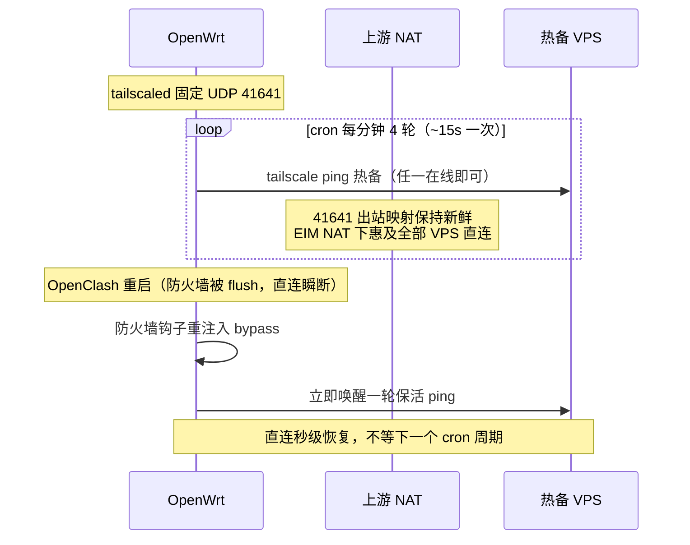
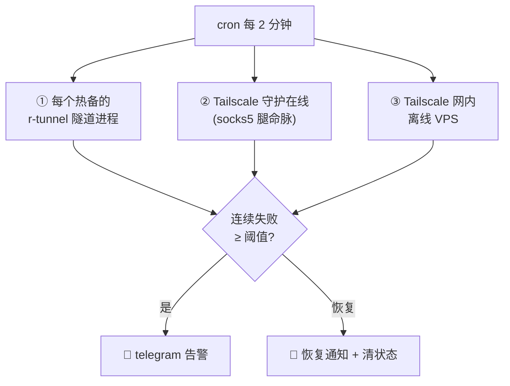
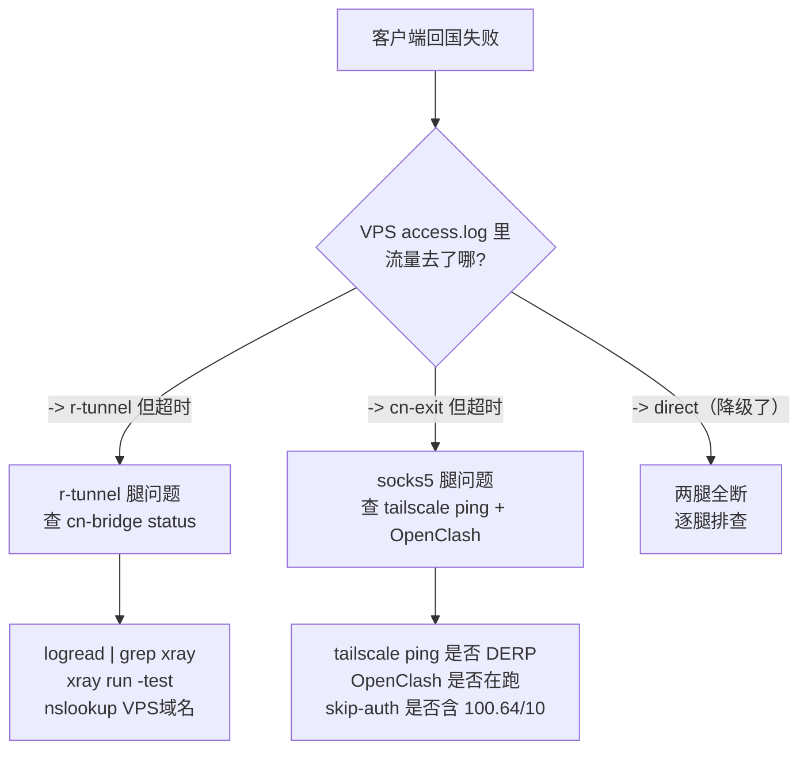

# sb-xray OpenWrt 回国出口（CN exit）一键配置

把「海外 VPS 流量回到中国大陆家宽出口」所需的 OpenWrt 侧全部配置，固化成一个**可反复重跑的幂等脚本**。你只需要填一份 `config.env`，跑一条命令，脚本自动完成安装、配置、自检。

服务端（VPS）由 `docker-compose` 单独部署（多台 VPS 可用 [`../vps/vps-cn-exit-init.sh`](../vps/vps-cn-exit-init.sh) 一键初始化，用法见 [../vps/README.md](../vps/README.md)），不在本目录范围内。

## 目录内容

| 文件 | 作用 | 装到路由器哪里 |
|------|------|----------------|
| `cn-exit-setup.sh` | 主脚本：装 Tailscale / xray bridge + 全部配置 + 自检 | 手动上传，跑完即可删 |
| `config.env.example` | 配置模板，复制为 `config.env` 后填值 | 与主脚本同目录 |
| `nodes.list.example` | 多 VPS 节点清单模板（多节点高可用用） | 与主脚本同目录，装入 `/etc/cn-exit/nodes.list` |
| `cn-bridge` | 拨号工具：随时拨通 / 断开任意 VPS 的回国隧道 | 脚本自动装到 `/usr/bin/cn-bridge` |
| `cn-bridge-monitor` | 双腿探活 + telegram 告警 | 脚本自动装到 `/usr/bin/cn-bridge-monitor` |

---

## 1. 架构与设计

### 1.1 回国双腿

每台 VPS 到家宽有**两条互为备份的回国通道**（“腿”），由 VPS 侧 `CN_EXIT_MODE=balance` 自动择优与故障转移：



- **socks5 腿**：VPS 经 Tailscale 网络访问家里 OpenClash 的 SOCKS5 端口回国。OpenWrt 只要在 Tailscale 网内，**任何 VPS 随时可用**这条腿。
- **r-tunnel 腿**：OpenWrt 用 xray 主动拨向 VPS 建立反向隧道。纯直出、不经 OpenClash，质量更优，但**只有被拨通的 VPS** 才有这条腿。
- **三重兜底**（VPS 侧自动完成，无需人工干预）：



### 1.2 三种模式（CN_EXIT_MODE）

与 VPS 服务端的 `CN_EXIT_MODE` 对齐：

| 模式 | OpenWrt 侧装什么 | 适用 |
|------|------------------|------|
| `socks5` | 仅 Tailscale | 已有 OpenClash，只要 socks5 腿 |
| `reverse` | 仅 xray reverse bridge | 无 OpenClash / 纯回国穿透 |
| `balance` | 两者都装（推荐） | 既有 OpenClash 又要高可用 |

留空默认 `balance`。选择困难时按这个走：



### 1.3 多 VPS 高可用：热备与冷备

多台公网 VPS = 多个独立回国入口（不是叠加带宽，家宽上行是共同出口）。OpenWrt 侧只需决定**给谁拨 r-tunnel**：



- **热备**（`BRIDGE_HOT` 指定，建议 2 台）：常驻拨通，双腿齐全，回国质量最优。
- **冷备**（清单里其余节点）：平时不拨，**仅靠 socks5 腿照样回国**；某热备故障时 `cn-bridge up <名>` 一条命令秒级顶上。

VPS 侧 16 台配置完全一致（都是 `balance`），**配一次永不改**；切换全部在 OpenWrt 侧用 `cn-bridge` 完成。

### 1.4 设计要点

- **幂等**：二进制按版本比对命中即跳过；cron / OpenClash 规则有 grep 守卫不重复；防火墙钩子自带去重；每次覆盖前自动留 `.bak.<时间戳>`。重复跑安全。
- **多隧道不冲突**：每个拨通的节点是独立 `xray-bridge-<名>` 进程 + 独立 `client-<名>.json`，api 端口自动错开（17900+序号），互不影响、单点崩溃 procd 自动拉起。
- **两腿质量对齐**：socks5 腿进入 OpenClash 后会被二次分流，灰色域名可能被判海外又代理出去。脚本注入 `IN-PORT,7891,DIRECT` 规则，让 socks5 腿流量强制纯直出，与 r-tunnel 同质量——冷备节点长期只有 socks5 腿也不吃亏。
- **Tailscale 直连保活**：OpenWrt 多在双重 NAT 后，直连靠 41641 出站映射，空闲即老化掉线。三件套配合保住映射：



---

## 2. 准备工作

### 2.1 前置条件

- OpenWrt 路由器，使用 **fw4 / nftables**（不是旧 iptables）
- 路由器能访问公网（下载 Tailscale / Xray / 落地机配置）
- `socks5` / `balance` 模式：**OpenClash 已安装并运行**（脚本只注入钩子与规则，不装 OpenClash 本体）
- `reverse` / `balance` 模式：VPS 服务端已 `ENABLE_REVERSE=true`

### 2.2 信息收集清单（照抄命令即可）

填配置前，先把这几个值拿到手。**全部来自 VPS**：

| 要填的值 | 在哪拿 | 命令 / 位置 |
|----------|--------|-------------|
| `VPS_DOMAIN`（域名） | VPS 上 | `docker exec sb-xray show`，输出里的域名（**不带** `https://`） |
| `SUBSCRIBE_TOKEN`（订阅 token） | VPS 上 | 同上输出中下载链接 `?token=` 后面那段 |
| `PEER_TS_IP`（VPS 的 Tailscale IP） | VPS 上 | `tailscale ip -4`，形如 `100.x.y.z` |
| `XRAY_VERSION` | GitHub | [Xray-core releases](https://github.com/XTLS/Xray-core/releases) 最新 tag，去掉 `v` 前缀 |
| `TS_VERSION` | Tailscale | [pkgs.tailscale.com/stable](https://pkgs.tailscale.com/stable/) 当前版本号 |
| 多节点：每台的 名/FQDN/token | 各台 VPS 上 | 各跑一次 `docker exec sb-xray show` 抄下来 |

---

## 3. 快速开始

整体流程五步，跟着走即可：


### 步骤 1：下载文件到路由器

登录路由器，直接 wget 拉取：

```sh
ssh root@<路由器IP>
mkdir -p /root/sb-xray-openwrt && cd /root/sb-xray-openwrt
for f in cn-exit-setup.sh config.env.example cn-bridge cn-bridge-monitor nodes.list.example; do
  wget -O "$f" "https://raw.githubusercontent.com/currycan/sb-xray/main/sources/openwrt/$f"
done
```

> 国内直连 GitHub raw 可能失败：让路由器先走代理再下载，或换一台能访问 GitHub 的机器下载后传入。`cn-bridge` / `cn-bridge-monitor` 缺失也不要紧——主脚本运行时会自动补下载。

### 步骤 2：填配置

```sh
ssh root@<路由器IP>
cd /root/sb-xray-openwrt
cp config.env.example config.env
vi config.env
```

按你的场景，三选一照抄（只列必填，其余保持默认）：

**场景 A —— 只要 Tailscale socks5 腿（最简单）**

```sh
CN_EXIT_MODE=socks5
VPS_DOMAIN=dc99.example.com        # 你的 VPS 域名
PEER_TS_IP=100.x.y.z               # VPS 的 tailscale ip -4
TS_HOSTNAME=openwrt-cn             # 本机在 Tailscale 里的名字，随意
TS_VERSION=1.98.4
```

**场景 B —— 单 VPS 双腿（balance）**

```sh
CN_EXIT_MODE=balance
VPS_DOMAIN=dc99.example.com
SUBSCRIBE_TOKEN=xxxxxxxx           # show 输出 ?token= 后那段
XRAY_VERSION=26.3.27
PEER_TS_IP=100.x.y.z
TS_HOSTNAME=openwrt-cn
TS_VERSION=1.98.4
```

**场景 C —— 多 VPS 高可用（推荐）**

先建节点清单：

```sh
cp nodes.list.example nodes.list
vi nodes.list
# 每行一台：<名> <FQDN> <token>，例：
#   dc99   dc99.example.com   tokA
#   jp     jp.example.com     tokB
#   cn2    cn2.example.com    tokC
```

再填 `config.env`（清单存在时 `VPS_DOMAIN` 可不填）：

```sh
CN_EXIT_MODE=balance
BRIDGE_HOT=dc99,jp                 # 常驻拨通的热备（建议 2 台）；其余自动为冷备
SUBSCRIBE_TOKEN=xxxxxxxx           # 任填一台的 token（各节点 token 已在清单里）
XRAY_VERSION=26.3.27
PEER_TS_IP=100.x.y.z               # 任一热备 VPS 的 Tailscale IP
KEEPALIVE_PEERS=100.a.b.c,100.d.e.f  # 可选：多个热备的 Tailscale IP，保活更稳
TS_HOSTNAME=openwrt-cn
TS_VERSION=1.98.4
```

### 步骤 3：运行

```sh
sh cn-exit-setup.sh
```

不想建文件也可以全内联（注意 token 会进 shell history）：

```sh
CN_EXIT_MODE=reverse VPS_DOMAIN=vpn.example.com \
  SUBSCRIBE_TOKEN=<token> XRAY_VERSION=26.3.27 \
  sh cn-exit-setup.sh
```

### 步骤 4：Tailscale 授权（仅首次）

脚本跑到 `tailscale up` 时，若本机未登录会**打印一个登录 URL 并停下等待**——用浏览器打开、授权一次，脚本随后自动继续。

然后到 [Tailscale 管理后台](https://login.tailscale.com/admin/machines) → 找到本机 → **Edit route settings** → 勾选 subnet routes 和 **Use as exit node**（脚本通告了，但需手动批准一次才生效）。

### 步骤 5：确认结果

脚本结尾自动跑端到端自检，输出 `自检结果: N 通过 / M 失败`。失败不为 0 时先看[问题处理](#6-问题处理)。手动复测：

```sh
# Tailscale 直连（应显示 via <公网IP>:41641，而不是 via DERP）
tailscale ping -c1 <PEER_TS_IP>

# bridge 隧道与节点状态
cn-bridge status

# OpenClash 重启鲁棒性：重启后链路应秒级恢复
/etc/init.d/openclash restart && sleep 5 && tailscale ping -c1 <PEER_TS_IP>
```

VPS 侧确认回国流量确实走了隧道：

```sh
docker exec sb-xray sh -c 'grep r-tunnel /var/log/xray/access.log | tail'
# 应见 accepted ... -> r-tunnel
```

---

## 4. 配置项完整参考

全部配置见 `config.env.example`（每项均有注释）。必填项按模式裁剪：

| 变量 | 必填模式 | 说明 |
|------|----------|------|
| `CN_EXIT_MODE` | — | `socks5` / `reverse` / `balance`，留空默认 `balance` |
| `VPS_DOMAIN` | 所有（无节点清单时） | VPS 域名，不带 `https://` |
| `NODES_FILE` / 同目录 `nodes.list` | 多节点 | 节点清单文件，每行 `<名> <FQDN> <token>`，优先级最高 |
| `BRIDGE_NODES` | 多节点（备选） | 内联清单：`"名:FQDN:token 名:FQDN:token"`，无清单文件时生效 |
| `BRIDGE_HOT` | 多节点 | 常驻热备节点名（逗号分隔）；未设则拨清单内全部 |
| `SUBSCRIBE_TOKEN` | reverse / balance | 订阅 token，`show` 输出 `?token=` 后那段 |
| `XRAY_VERSION` | reverse / balance | Xray-core 版本号（不含 `v`） |
| `PEER_TS_IP` | socks5 / balance | VPS 的 Tailscale IP（keepalive 锚点） |
| `KEEPALIVE_PEERS` | 可选 | 保活目标列表（逗号分隔），默认 = `PEER_TS_IP`；多热备时填多个更稳 |
| `TS_HOSTNAME` | socks5 / balance | 本机在 Tailscale 网络的名字 |
| `TS_VERSION` | socks5 / balance | Tailscale 版本号 |
| `TS_PORT` | 可选 | tailscaled 固定 UDP 端口，默认 41641，别改 |
| `TS_ADVERTISE_ROUTES` | 可选 | subnet router 通告网段，默认 `172.18.18.0/23`，按实际 lan 改 |
| `ARCH_OVERRIDE` | 可选 | 留空自动检测；可强制 `arm64` / `amd64` |
| `RELOAD_OPENCLASH` | 可选 | `1` = 安装末尾自动 reload OpenClash 使规则立即生效，默认 `0` 只提示 |
| `DOWNLOAD_RETRIES` | 可选 | 下载失败重试次数，默认 3 |
| `ALERT_TG_TOKEN` / `ALERT_TG_CHAT` | 可选 | telegram bot token / chat id，填了才告警 |
| `MON_INTERVAL` / `MON_THRESHOLD` | 可选 | 探活周期（分钟，默认 2）/ 连续失败几次才告警（默认 3） |

脚本按模式执行的步骤一览：

| 步骤 | 模式 | 内容 |
|------|------|------|
| Tailscale | socks5 / balance | 二进制 + init.d 服务，固定 UDP 41641 + kernel TUN；防火墙 zone 与转发；通告 subnet routes + exit node |
| 防火墙放行 | socks5 / balance | OpenClash 钩子把 Tailscale UDP 在 nftables mangle 链顶 `return` 绕过 tproxy，OpenClash 每次重启自动重跑 |
| skip-auth | socks5 / balance | 把 `100.64.0.0/10` 注入 mihomo `skip-auth-prefixes`，VPS 经 Tailscale 访问本机 SOCKS5(7891) 免认证 |
| keepalive / UDP GRO | socks5 / balance | ~15s 一轮 ping 热备保住 41641 映射；WAN 网卡开 `rx-udp-gro-forwarding` 提升转发吞吐 |
| 解耦 | 所有（有 OpenClash 时） | 给清单内每个 VPS 域名加 `DOMAIN,<vps>,DIRECT` + fake-ip 过滤，bridge 直连真实 IP |
| xray bridge | reverse / balance | 装 xray + `cn-bridge` + 生成节点清单；对热备各拨一条独立隧道 |
| socks5 对齐 | socks5 / balance | OpenClash 加 `IN-PORT,7891,DIRECT`，socks5 腿强制纯直出 |
| 监控 | 配了 TG 告警时 | 装 `cn-bridge-monitor` + cron 周期探活 |
| 自检 | 所有 | 按模式裁剪的端到端验证 |

---

## 5. 日常运维

### 5.1 `cn-bridge` 拨号（多节点切换核心）

```sh
cn-bridge list            # 列出所有节点 + 拨号/进程状态
cn-bridge up dc99         # 拨通（下载配置 + 起进程 + 开机自启）；已拨则刷新配置并重启
cn-bridge down dc99       # 断开（停进程 + 取消自启 + 删配置）
cn-bridge status          # ESTABLISHED 连接概览 + 节点列表
cn-bridge                 # 交互菜单（傻瓜式）
```

典型场景——热备 dc99 故障，冷备 cn2 顶上：


切换不改任何 VPS 配置；冷备在被拨通前也一直有 socks5 腿可回国，不存在“空窗”。

### 5.2 监控告警

填了 `ALERT_TG_TOKEN` / `ALERT_TG_CHAT` 后，cron 每 `MON_INTERVAL` 分钟探活三类目标，连续 `MON_THRESHOLD` 次失败才告警（去抖），恢复后自动发恢复通知：



手动跑一次看效果：`cn-bridge-monitor`。

### 5.3 升级 / 重跑

改 `config.env` 里的 `XRAY_VERSION` / `TS_VERSION` 后重跑 `sh cn-exit-setup.sh` 即可——幂等设计，只更新有变化的部分。

---

## 6. 问题处理

### 6.1 脚本报错对照

| 报错 | 原因与解决 |
|------|------------|
| `未找到 nft，需要 fw4/nftables 的 OpenWrt` | 路由器还是旧 iptables 固件，需 OpenWrt 22.03+ |
| `未找到 /etc/init.d/openclash` | socks5/balance 模式需先装好 OpenClash，或改用 `CN_EXIT_MODE=reverse` |
| `缺少必填项 (CN_EXIT_MODE=...)` | 按提示补 `config.env` 中该模式的必填变量（见上表） |
| `VPS_DOMAIN 不要带 http(s):// 前缀` | 只填域名本身 |
| `PEER_TS_IP 仍是示例占位符 100.0.0.0` | 去 VPS 跑 `tailscale ip -4` 拿真实 IP |
| `需提供节点清单文件、BRIDGE_NODES 或 VPS_DOMAIN` | 三种节点来源至少给一种 |
| `下载失败（已重试 N 次）` | 路由器到 GitHub/Tailscale 网络不通；挂代理后重跑，或换台能访问 GitHub 的机器下载后传入脚本同目录（脚本优先用同目录文件） |
| `client.json 含占位符` | VPS 服务端没开 `ENABLE_REVERSE=true`，或 token 抄错——去 VPS 重新 `show` 核对 |
| `无法获得 /dev/net/tun` | 固件缺 kmod-tun 且 opkg 安装失败；先 `opkg update && opkg install kmod-tun` 再重跑 |
| `不支持的架构` | 在 `config.env` 设 `ARCH_OVERRIDE=arm64` 或 `amd64` |

### 6.2 链路问题排查

先定位坏的是哪条腿，再按对应小节处理：



**自检有失败项，但刚做完 Tailscale 授权** —— 打洞需要 1-2 分钟，稍等后重跑一次 `sh cn-exit-setup.sh`（或只看 `tailscale ping`）即可。

**`tailscale ping` 显示 `via DERP`（走中继，慢）**

```sh
tailscale ping -c5 <PEER_TS_IP>     # 多 ping 几次，常常前几包 DERP、随后转直连
logread | grep tailscale | tail     # 看守护日志
```

仍不转直连：确认 keepalive cron 在（`crontab -l | grep tailscale`）、`TS_PORT` 41641 未被占用、上游运营商未封 UDP。

**bridge 隧道不通（`cn-bridge status` 看不到 ESTABLISHED）**

```sh
cn-bridge list                       # 进程是否 running
logread | grep xray | tail           # xray 报错原因
xray run -test -config /etc/xray/client-<名>.json   # 配置自检
nslookup <VPS域名>                   # 域名解析是否被 OpenClash fake-ip 污染
```

最后一条很关键：bridge 必须直连 VPS **真实 IP**。脚本已为清单内每个域名注入 OpenClash 的 `DIRECT` 规则 + fake-ip 过滤，若你新加了节点却没重跑脚本/没 `cn-bridge up`，解析可能被劫持——`cn-bridge up <名>` 会同步补规则。

**OpenClash 重启后回国断了几十秒以上** —— 正常应秒级恢复。检查防火墙钩子是否在：

```sh
grep -c tailscale /etc/openclash/custom/openclash_custom_firewall_rules.sh
/usr/bin/cn-ts-keepalive once        # 手动唤醒一轮保活
```

**VPS 侧回国失败（客户端访问国内站点超时）**

```sh
# VPS 上看两条腿的健康探测与实际选路
docker exec sb-xray sh -c 'grep -E "r-tunnel|cn-exit" /var/log/xray/access.log | tail -20'
```

两条腿全断时 VPS 会降级本地直出（国内站点表现为绕路但不黑洞）。逐腿排查：socks5 腿看 OpenWrt 的 OpenClash 是否在跑 + `tailscale ping`；r-tunnel 腿看 `cn-bridge status`。

**告警收不到** —— `cn-bridge-monitor` 手动跑一遍；确认 `/etc/cn-exit/monitor.env` 里 `TG_TOKEN`/`TG_CHAT` 非空、路由器能 curl 通 `api.telegram.org`（被墙环境需让该域名走代理）。

### 6.3 日志位置速查

| 组件 | 看日志 |
|------|--------|
| 脚本本身 | 终端输出（`[install]` / `[cn-exit]` 前缀） |
| tailscaled / xray-bridge | `logread`（procd 接管 stdout/stderr） |
| OpenClash | LuCI 界面或 `/tmp/openclash.log` |
| 监控状态 | `/tmp/cn-mon/`（去抖计数与告警标记） |
| VPS 侧 | `docker exec sb-xray sh -c 'tail /var/log/xray/access.log'` |

---

## 7. 回滚与停用

每个被改文件都有 `.bak.<时间戳>` 备份：

```sh
ls -t /etc/init.d/tailscale.bak.*        # 找最近备份
cp /etc/init.d/tailscale.bak.<ts> /etc/init.d/tailscale
/etc/init.d/tailscale restart
```

停用整套：

```sh
# 断开全部 bridge 隧道
for s in /etc/init.d/xray-bridge-*; do $s stop; $s disable; done
/etc/init.d/tailscale stop && /etc/init.d/tailscale disable
# 删 keepalive / 监控 cron 行 + OpenClash custom 规则后重载 OpenClash
crontab -l | grep -v -e cn-ts-keepalive -e cn-bridge-monitor | crontab -
```

回退到 userspace-networking 形态（不需要 TUN / 防火墙 zone 的旧形态）：

```sh
# 仓库侧取回旧版脚本重跑（commit 10ce8f9 时脚本位于 openwrt/install.sh）
git checkout 10ce8f9 -- openwrt/install.sh
# 重新 scp openwrt/install.sh 到路由器后 sh install.sh

# （可选）清理 kernel TUN 模式遗留的防火墙配置——留着也无害
uci delete network.tailscale
# 按 uci show firewall | grep tailscale 输出的索引逐个删除 zone/forwarding 后：
uci commit network && uci commit firewall
/etc/init.d/network reload && /etc/init.d/firewall reload
```
