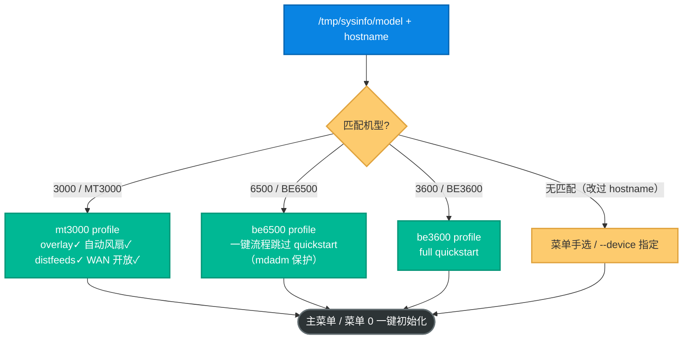
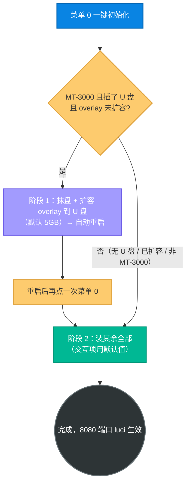

# gl-inet.sh —— GL.iNet 统一一键工具箱（BE3600 / BE6500 / MT-3000）

一个脚本搞定三款 GL.iNet 路由器的「开箱配置」：自动识别机型，按机型差异装好 iStoreOS 风格首页、Argon 主题、iStore 商店、文件管理器、自定义软件源等，并把交互细节收敛成默认值。给拿到新设备、想一条命令配置到位的人。

> **默认姿态**：脚本自带快捷键 `g`（首次运行自动安装到 `/usr/bin/g`），之后输 `g` 即可再次进入菜单；菜单 14 从 sb-xray 仓库 raw 源自更新。本工具箱独立于同目录的 cn-exit 回国出口（`openwrt-init.sh`），用途无关，放同目录仅因都装到路由器。

## 阅读约定：三种信息块

| 图标 | 含义 | 给谁看 |
|---|---|---|
| 📘 **概念卡** | 一句话讲清「是什么、为什么」 | 新手必读 |
| 🔧 **操作块** | 可复制的命令，标注「自动」还是「需手动」 | 动手部署的人 |
| 🔬 **深挖框** | 机型门控、幂等机制、底层实现 | 想懂原理的人，新手可跳过 |

**读者导航**：只想快速配新设备 → 直接看 [获取脚本](#获取脚本) + [菜单 0 一键初始化](#菜单-0一键初始化)；想了解机型差异 → [机型识别与差异](#机型识别与差异)；部署后自检 → [真机验证 checklist](#真机验证-checklist)。

## 能力总览

📘 启动即合并 `/tmp/sysinfo/model` 与 hostname 自动判机型，落到对应 profile，后续所有功能按 profile 自动切换（源、安装法、菜单项可见性都随之变）。



---

## 机型识别与差异

📘 BE 系列的 `/tmp/sysinfo/model` 是 Qualcomm 板名（如 `IPQ5332`）不含型号数字，靠 hostname（GL.iNet 默认 `GL-BE6500` / `GL-BE3600` / `GL-MT3000`）兜底识别。改过 hostname 导致识别失败时，用 `--device` 手动指定或在菜单提示时手选。

🔧 手动指定机型：

```sh
./gl-inet.sh --device be3600   # 或 be6500 / mt3000
```

🔬 各 profile 的行为差异（脚本内 `detect_profile` 自动设定，无需手改）：

| 维度 | BE3600 | BE6500 | MT-3000 |
|------|--------|--------|---------|
| arch.conf 源 | 64bit | 64bit | mtarch |
| iStore 安装法 | wget | wget | is-opkg |
| 一键流程 quickstart | full | 跳过（mdadm 不兼容） | is-opkg |
| 自动风扇温控 | — | — | ✓（默认 48℃） |
| distfeeds 恢复（菜单 15） | — | — | ✓ |
| WAN 防火墙放行 | — | — | ✓（方便主路由访问） |
| overlay 换分区（菜单 13） | —（见下） | —（见下） | ✓ |

> ⚠️ 📘 **overlay 换分区仅 MT-3000 可用**：BE 系列（BE3600/BE6500）的 GL SDK4 固件 preinit(`80_mount_root`) 写死 `mount_ext4 "systemrw" /overlay`、不读 fstab 的 `config mount 'overlay'`，U 盘 extroot 扩容在 BE 上不生效（机械步骤会跑但重启后 /overlay 仍在内部 flash）。故该菜单项按 profile 仅对 MT-3000 显示。U 盘在 BE 上仍可作数据盘/NAS（GL 原生 `gl_nas_diskmanager`）。

📘 **不含 Docker**：低端机型（如 MT-3000 256MB RAM）的源/内存支持不确定，BE 系列又无法 extroot 扩容、内部 flash 仅 ~285MB 装不下；需要时用 GL 原生面板或自行 `opkg install dockerd`。

---

## 获取脚本

### 方法 A —— 设备直接从 GitHub 拉取（推荐，免 PC 中转）

🔧 路由器 SSH 里一行搞定（设备联网即可）：

```sh
wget -O gl-inet.sh https://raw.githubusercontent.com/currycan/sb-xray/main/sources/openwrt/gl-inet.sh && chmod +x gl-inet.sh && ./gl-inet.sh
```

🔧 中国大陆访问 `raw.githubusercontent.com` 不稳时，换 jsDelivr CDN 镜像（同一文件）：

```sh
wget -O gl-inet.sh https://cdn.jsdelivr.net/gh/currycan/sb-xray@main/sources/openwrt/gl-inet.sh && chmod +x gl-inet.sh && ./gl-inet.sh
```

装好后下次直接输快捷键 `g` 运行；菜单 14「更新本脚本」从同一 GitHub raw 源自更新（jsDelivr 有 CDN 缓存，要最新版优先用 raw）。

### 方法 B —— 从本地电脑上传

> 🔬 GL.iNet 固件的 SSH 是 **dropbear**，默认**不含 `sftp-server`**，`scp` / SFTP 直传会失败（TCP 能连上但子系统协商失败）。

🔧 三选一：

```sh
# ① SSH 管道直传（免装包，最省事）
ssh root@<设备IP> 'cat > /root/gl-inet.sh' < gl-inet.sh
# ② 旧版 SCP 协议
scp -O gl-inet.sh root@<设备IP>:/root/
# ③ 启用 SFTP 后再用 scp/SFTP
ssh root@<设备IP> 'opkg update && opkg install openssh-sftp-server'
```

---

## 菜单 0「一键初始化」

📘 **做什么**：全自动跑除 **6 AdGuard / 9 wireguard / 13 overlay / 14 更新脚本** 外的全部功能项，交互项一律用默认值（11 软件源最先执行、取默认 TUNA 镜像；5 风扇 48℃；7 自动继续）。

📘 **MT-3000 两阶段**：先扩容 overlay 到 U 盘腾空间，重启后再装其余包。靠 `/etc/.glinet_init_overlay_tried` 标记防止重复抹盘。



> ✅ 🔬 **MT-3000 overlay 已真机验证生效**（GL 固件 OpenWrt 21.02 base）：阶段 1 重启后 `df /overlay` 显示 `/dev/sda1`（U 盘）挂为 `/overlay`、root overlayfs 的 upperdir 指向之，与 BE 系列不同。USB 检测用内核 `/sys/block/*/removable` 标志（不依赖全新固件未装的 `lsblk`），插了 U 盘即能进阶段 1。

🔧 **如何验证**扩容生效：

```sh
df -h /overlay      # 期望：Filesystem 为 /dev/sda1，Size 远大于内部 flash（如 4.8G）
```

---

## 菜单一览

| # | 功能 | 备注 |
|---|------|------|
| 0 | 一键初始化（全自动） | 跑除 6/9/13/14 外全部，交互项用默认值；MT-3000 两阶段 |
| 1 | 一键 iStoreOS 风格化 | profile 决定 iStore 法 / quickstart 走法 |
| 2 | 安装 Argon 紫色主题 | |
| 3 | 单独安装 iStore 商店 | |
| 4 | 隐藏首页非必要 UI 元素 | |
| 5 | 设置风扇工作温度 | 交互，回车默认 **48℃** |
| 6 | 启用/关闭 AdGuardHome | |
| 7 | 安装个性化 UI 辅助插件 | 交互，回车继续 |
| 8 | 安装高级卸载插件 | |
| 9 | 安装 luci-app-wireguard | |
| 10 | 安装文件管理器 | |
| 11 | 设置/删除自定义软件源 | 交互，回车默认 **TUNA 镜像** |
| 12 | 手动安装/更新 quickstart 首页 | |
| 13 | Overlay 换分区助手 | **仅 MT-3000 显示**；子项自定义大小回车默认 **5GB** |
| 14 | 更新本脚本 | 从 sb-xray 仓库 raw 自更新 |
| 15 | 恢复原厂 OPKG 配置 | **仅 MT-3000 显示** |
| R | 恢复出厂设置 | 需手输 `yes` |
| Q | 退出 | |

---

## 默认值与幂等

📘 **交互默认值**：风扇温度（48℃）、自定义软件源（TUNA 镜像）、overlay 自定义包大小（5GB）均可直接回车采用，也可手输覆盖。

🔬 **幂等**：所有功能可重复执行而不累积垃圾 / 损坏配置——`uci set`、清空再写、`grep -q` 去重、`sed` 替换均幂等；`uci add` / CSS 追加有存在性防护。唯一破坏性操作 overlay 换分区有「已扩容则确认」防护；一键初始化用 `/etc/.glinet_init_overlay_tried` 标记防止重复抹盘。

📘 **真实 IP**：安装提示里的 luci / AdGuard 地址动态取 `uci get network.lan.ipaddr`（设备真实 LAN IP），不写死 `192.168.8.1`。

---

## 真机验证 checklist

🔧 部署后在对应设备上至少验证：

1. 启动后菜单顶部「当前机型」识别正确（错误则用 `--device` 复核子串匹配）。
2. 菜单项 1「一键 iStoreOS 风格化」跑通，8080 端口 luci 生效。
3. 抽测：argon 主题（2）、iStore（3）、quickstart（12）。
4. MT-3000 额外验证：第 15 项 distfeeds 恢复、overlay 换分区（13，需插 U 盘）。
5. BE6500 确认一键流程未触发 quickstart（mdadm 保护）。

---

## 相关资源

- [`openwrt-init.sh` 文档](./README.md) —— 同目录的 cn-exit 回国出口一键初始化（独立工具）
- [`../openclash/`](../openclash/) —— OpenClash 配置模板（op-amd / op-arm）
- [`../../CHANGELOG.md`](../../CHANGELOG.md)
