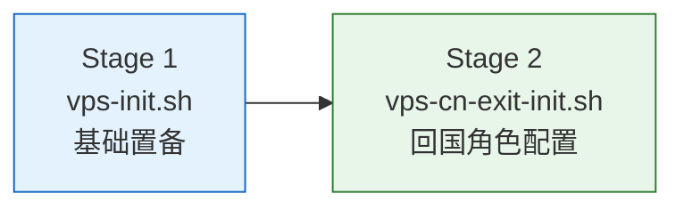
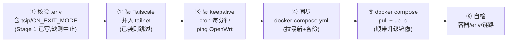
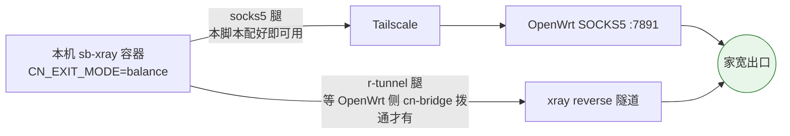

# sb-xray VPS 侧回国出口（CN exit）一键初始化

在每台公网 VPS 上跑一次 `vps-cn-exit-init.sh`，完成回国双腿（balance）所需的 VPS 侧【运行时】动作：装 Tailscale 入网、配链路保活、拉起容器、自检。回国 `.env` 由 Stage 1 (`vps-init.sh`) 一次写全（见 §0）——Stage 2 只校验后执行运行时动作，不写 `.env`。**配一次永不改**——之后的回国拨号切换全部在 OpenWrt 侧用 `cn-bridge` 完成（见 [../openwrt/README.md](../openwrt/README.md)）。

## 0. 两阶段：先 `vps-init.sh`（Stage 1），再 `vps-cn-exit-init.sh`（Stage 2）

拿到一台全新装好系统的 VPS，按两步走：



| 阶段 | 脚本 | 做什么 | 跑几次 |
|------|------|--------|--------|
| **Stage 1** | `vps-init.sh` | 系统调优 + BBR、建 sudo 用户、SSH 加固（仅密钥）、装 Docker（官方源）、**写全 `sb-xray/.env`**（域名/code +（CN-exit 节点）回国项）+ compose 模板 | 新机一次 |
| **Stage 2** | `vps-cn-exit-init.sh` | Tailscale 入网、保活/自检护栏、拉起容器（**校验 `.env`，不写 `.env`**） | 回国节点一次（见 §1 起） |

`vps-init.sh` 跑完正好满足 Stage 2 的前置（docker 已装、`/root/sb-xray/docker-compose.yml` 存在、`.env` 已写全）。它是 `.env` 的**单一所有者**：当 `initial.env` 含 `OPENWRT_TS_IP`（即本机是 CN-exit 节点）时，Stage 1 一并写全回国项（`CN_EXIT_MODE`/`ENABLE_REVERSE`/`ENABLE_SOCKS5_PROXY`/`tsip`/按角色的 `WATCHTOWER_SCHEDULE`）；否则只写域名/code 保持通用——非回国节点跑完 Stage 1 即可。这样初始化即产出**完整 `.env`**，避免容器在两阶段之间以半完整配置启动被 watchtower 固化（见 CLAUDE.md §2）。

### Stage 1 用法

```sh
cd sources/vps
cp initial.env.example initial.env   # 填值（见下方契约）
vi initial.env
sudo bash vps-init.sh
```

配置从同目录 `initial.env` 读取——它是**整套 `vps/` 脚本共用的「节点唯一输入配置」**：Stage 1 与 Stage 2（`vps-cn-exit-init.sh`）都 source 同一个文件，**操作者每台只编辑这一个文件**。语义是「**文件为准，文件没写的项可用命令行环境变量补**」。真实 `initial.env` 含凭据，已被 `.gitignore` 排除，**不入库**。

> 🧭 **输入 vs 生成产物**：`initial.env` 是人填的*输入*；sb-xray 的 `SBXRAY_DIR/.env`（docker-compose 读）、`/etc/cn-exit-watchdog.conf`、canary 的 cron env 是脚本从输入*派生*的产物，**不手改**。两个 cron 脚本（canary/watchdog）由 Stage 2 provision，无需直接 source——人始终只碰 `initial.env` 一个文件。
>
> 📝 `initial.env` 按 shell 语法 `source`：**值含空格/特殊字符（尤其 SSH 公钥、带符号的密码/code）必须加引号**，否则解析报错。公钥永远含空格——推荐用 `SSH_PUBKEY_FILE` 指向 `.pub` 文件免去引号，它还能一次装入文件里的多把公钥（多管理机/密钥轮换）。密钥类型推荐 **ed25519** 而非 RSA：更短、更快、更安全。

| 变量 | 必填 | 说明 |
|------|------|------|
| `SSH_PUBKEY_FILE` / `SSH_PUBKEY` | ✅ | 公钥登录所需公钥（二选一，`SSH_PUBKEY_FILE` 优先且支持多公钥）。**脚本会关闭密码登录、仅留公钥**——无有效公钥时在动 SSH 前中止（防锁机）。推荐 **ed25519**（`ssh-keygen -t ed25519`）而非 RSA |
| `SBX_USER` | 可选 | 要创建的 sudo 用户名（默认 `sbx`） |
| `SBX_USER_PASSWORD` / `ROOT_PASSWORD` | 可选 | 空=不设/不改密码（仅密钥登录推荐留空，泄露面最小） |
| `SSH_PORT` | 可选 | SSH 端口（默认 `38666`） |
| `TIMEZONE` | 可选 | 默认 `Asia/Shanghai` |
| `SBX_DOMAIN` / `SBX_CDN_DOMAIN` / `SBX_CODE` | 可选 | 写入 `sb-xray/.env` 的 `domain`（空=`hostname`）/ `cdndomain` / `code` |
| `OPENWRT_TS_IP` 及回国项 | 可选 | 给定 `OPENWRT_TS_IP` 即判定本机为 **CN-exit 节点**，Stage 1 一并写全回国 `.env`（`CN_EXIT_MODE` / `ENABLE_REVERSE` / `ENABLE_SOCKS5_PROXY` / `tsip` / 按 `SBX_CANARY_ROLE` 的 `WATCHTOWER_SCHEDULE`，及 `REVERSE_DOMAINS`/`VPS_DOMAIN`/`SHOUTRRR_URLS`）。各项含义见 [§3 参数参考](#3-参数参考)。留空=非回国节点，只写域名/code |
| `SBX_COMPOSE_URL` | 可选 | `docker-compose.yml` 下载源（默认仓库 `main` 的 raw） |
| `INSTALL_SSRPOLIPO` / `SSRPOLIPO_COMPOSE_URL` | 可选 | **默认 `1`（开启）**；启用时必须给 `SSRPOLIPO_COMPOSE_URL`，否则 warn 跳过。设 `0` 关闭 |
| `BASHRC_URL` / `VIMRC_URL` | 可选 | 给定则拉取 `.bashrc`/`.vimrc` 到 root 与 sudo 用户家目录（留空跳过）；地址写在 `initial.env`，不入库 |
| `INSTALL_TCP_BRUTAL` / `TCP_BRUTAL_URL` | 可选 | **默认 `1`（开启）**：安装 `tcp-brutal` DKMS 内核模块（Hysteria 2 brutal 拥塞控制，apernet 官方）。**仅令诊断位 `IS_BRUTAL=true`；Hy2 实际用 bbr，不装不影响代理功能。** 自动补 `build-essential`+运行内核头;运行内核被仓库淘汰时无法编译（需先升级内核+重启）。设 `0` 关闭 |

> ⚠️ **锁机警告**：本脚本设 `PasswordAuthentication no` + `PermitRootLogin prohibit-password` 并改端口。运行前务必确认 `SSH_PUBKEY` 正确、且你手上的私钥能用。脚本会在写 SSH 配置后 `sshd -t` 校验，失败即删除 drop-in 并中止；但仍建议**保留一个当前已连接的会话**直到用新端口+公钥验证能登录。
>
> ✅ **幂等**：所有系统配置写成专属 drop-in（`/etc/sysctl.d/`、`/etc/security/limits.d/`、`/etc/profile.d/`、`/etc/ssh/sshd_config.d/`、`/etc/sudoers.d/`），每次运行全量重写——可重复跑不产生重复行、不漂移。`仅 Debian/Ubuntu`。
>
> 🔒 **凭据安全**：脚本不向任何世界可读日志写密码/`code`（设密码步骤日志显示「（隐藏）」）；产物 `sb-xray/.env` 600、`authorized_keys` 600、`sudoers.d/*` 0440。运行输出如需留存，请自行重定向到受限文件。

---

## 1. 它做什么



跑完后这台 VPS 具备**两条回国腿**，由容器内 xray 自动择优与故障转移：



- **socks5 腿**：本脚本跑完即可用（前提：OpenWrt 已按 [../openwrt/README.md](../openwrt/README.md) 配好）。
- **r-tunnel 腿**：是否拨通由 OpenWrt 侧决定（热备常驻拨、冷备按需拨），VPS 侧无需任何操作。
- 多台 VPS 配置完全一致，每台的 `XRAY_REVERSE_UUID` 由服务端自动生成持久化，互不冲突。

## 2. 前置条件

- 标准 Linux + Docker，**sb-xray 已部署**（存在 `docker-compose.yml`，默认目录 `/root/sb-xray`，可用 `SBXRAY_DIR` 指定）
- 家里 OpenWrt 已入 Tailscale 网（要它的 Tailscale IP）
- 首次装 Tailscale 的机器：准备一个 **reusable 的 Tailscale auth key**（[管理后台 → Settings → Keys](https://login.tailscale.com/admin/settings/keys) 生成，勾选 Reusable；多台共用一个 key）

## 3. 参数参考

这些变量都写进同目录 `initial.env`（与 Stage 1 共用的节点唯一输入配置，两个脚本都自动 source）。

> 🧭 **谁消费哪些变量**：回国 `.env` 项（`CN_EXIT_MODE` / `REVERSE_DOMAINS` / `VPS_DOMAIN` / `SHOUTRRR_URLS`，连同 `tsip`/`ENABLE_*`/`WATCHTOWER_SCHEDULE`）由 **Stage 1** 写入 `.env`；下表中标「Stage 1 写」的即属此类，Stage 2 只在自检时读 `CN_EXIT_MODE` 比对。`OPENWRT_TS_IP` / `TS_*` / `SBXRAY_DIR` / `COMPOSE_URL` 是 **Stage 2 运行时**仍直接读取的。

| 变量 | 必填 | 说明 | 在哪拿 |
|------|------|------|--------|
| `OPENWRT_TS_IP` | ✅ | 家里 OpenWrt 的 Tailscale IP（socks5 腿回国出口）；**也是 Stage 1 判定本机为 CN-exit 节点、写全回国 `.env` 的开关** | OpenWrt 上 `tailscale ip -4` |
| `TS_AUTHKEY` | 首次装 tailscale 时 | Tailscale reusable auth key；本机已在网可省 | Tailscale 管理后台 Keys 页 |
| `TS_AUTHKEY_FILE` | 可选 | 改从文件读 authkey（`TS_AUTHKEY` 为空时生效），避免 key 进远端进程表/历史 | — |
| `TS_HOSTNAME` | 可选 | 本机在 tailnet 的设备名，默认取 `hostname` | 建议用节点裸名（如 `dc99`） |
| `SBXRAY_DIR` | 可选 | sb-xray 部署目录，默认 `/root/sb-xray` | — |
| `CN_EXIT_MODE` | 可选（Stage 1 写） | 回国模式，默认 `balance` | — |
| `REVERSE_DOMAINS` | 可选（Stage 1 写） | 经 bridge 出的内网域名（逗号分隔），多台建议统一 | — |
| `VPS_DOMAIN` | 可选（Stage 1 写） | 本节点对外域名（写进 `.env` 的 `domain`，覆盖 hostname 派生值） | — |
| `SHOUTRRR_URLS` | 可选（Stage 1 写） | 事件总线告警 URL | 见 [docs/06](../../docs/06-event-bus-shoutrrr.md) |
| `COMPOSE_URL` | 可选 | `docker-compose.yml` 下载源，默认仓库 `main` 的 raw | — |
| `SKIP_COMPOSE_UPDATE` | 可选 | 设 `1` 跳过 compose 同步；默认 `0`（拉最新覆盖，原始 compose 留存 `.bak`） | — |
| `SKIP_PULL` | 可选 | 设 `1` 只 `up -d` 不 `pull`（不升级镜像）；默认 `0` | — |
| `CANARY_URL` | 可选 | `sbx-canary-check.sh` 下载源，默认仓库 `main` 的 raw（见 §D） | — |
| `SKIP_CANARY_WIRING` | 可选 | 设 `1` 跳过 watchtower 自检护栏安装（canary 脚本 + cron + `sbx-update`）；默认 `0` | — |
| `WD_TG_TOKEN` | 可选 | CN 出口反向探活的 Telegram bot token；**与 `WD_TG_CHAT` 同时有值才安装**（见 §watchdog） | 复用告警 bot |
| `WD_TG_CHAT` | 可选 | 反向探活告警的 Telegram chat id | 同上 |
| `WATCHDOG_URL` | 可选 | `cn-exit-watchdog.sh` 下载源，默认仓库 `main` 的 raw | — |
| `SKIP_WATCHDOG_WIRING` | 可选 | 设 `1` 跳过反向探活安装；默认 `0`（不传 `WD_*` 本就不装） | — |

> ℹ️ 脚本会自动把 `docker-compose.yml` 同步为仓库最新版（首次的原始文件保留为 `docker-compose.yml.bak`，重跑不覆盖）。旧部署的 compose 可能不含 `${CN_EXIT_MODE}` / `${tsip}` 等引用，不同步则 `.env` 里的回国项不会生效。节点专属配置都在 `.env`，compose 是模板，覆盖安全。
>
> ✅ **退出码**：自检全部通过返回 0；容器未起 / `CN_EXIT_MODE` 未生效 / Tailscale 未在网任一硬失败返回非 0，便于批量编排（`for h in …; do ssh … || echo "$h FAIL"; done`）筛出坏节点。ping、socks5 回国实测为软告警（打洞/预热期可能暂时不通），不影响退出码。自检还会经 SOCKS5 实测一次回国出口 IP（`[ OK ] socks5 腿回国实测：…`）。

## 4. 快速开始

### 单台

VPS 上直接下载并运行：

```sh
wget -O ~/sb-xray/vps-cn-exit-init.sh \
  https://raw.githubusercontent.com/currycan/sb-xray/main/sources/vps/vps-cn-exit-init.sh

OPENWRT_TS_IP=100.x.y.z \
TS_AUTHKEY=tskey-auth-xxxxxx \
TS_HOSTNAME=dc99 \
sh ~/sb-xray/vps-cn-exit-init.sh
```

> 内联传参会把 `TS_AUTHKEY` 留在 shell history；介意的话 `export` 后再跑，或事后 `history -c`。

已在 tailnet 的机器（比如装过 Tailscale 的）更简单：

```sh
OPENWRT_TS_IP=100.x.y.z sh ~/sb-xray/vps-cn-exit-init.sh
```

### 多台批量

在你自己的电脑上循环 ssh（每台 `TS_HOSTNAME` 用各自裸名）：

```sh
KEY=tskey-auth-xxxxxx
for h in dc99 jp dc99-3 cn2; do
  ssh root@$h.example.com "
    wget -qO ~/sb-xray/vps-cn-exit-init.sh https://raw.githubusercontent.com/currycan/sb-xray/main/sources/vps/vps-cn-exit-init.sh &&
    OPENWRT_TS_IP=100.x.y.z TS_AUTHKEY=$KEY TS_HOSTNAME=$h sh ~/sb-xray/vps-cn-exit-init.sh
  "
done
```

脚本幂等（校验 `.env` 只读不写、tailscale 已装则跳过、cron 直接覆盖），重复跑安全。改回国 `.env` 参数：带新 `initial.env` 重跑 **Stage 1**（`.env` 单一所有者），或直接编辑 `.env` 后 `docker compose up -d`。

### 跑完之后

1. 看自检输出（见下节），4 项应全 `[ OK ]`。
2. 把这台节点加进 OpenWrt 侧 `nodes.list`（名/FQDN/token），需要 r-tunnel 腿时 `cn-bridge up <名>`。
3. 验证回国出口：

```sh
# 经本机 socks5 腿应出家宽 IP（在 VPS 上）
docker exec sb-xray sh -c 'grep -E "r-tunnel|cn-exit" /var/log/xray/access.log | tail'
```

## 5. 自检输出说明

| 自检项 | 通过含义 | FAIL 时 |
|--------|----------|---------|
| `sb-xray 容器运行中` | compose 已拉起 | `docker compose logs` 看启动错误 |
| `容器内 CN_EXIT_MODE=... 生效` | Stage 1 写的 `.env` 已被容器读入 | `docker compose up -d --force-recreate` 强制重建 |
| `Tailscale 在网` | 守护已登录 | `tailscale status` 看状态；authkey 失效则换新 key 重跑 |
| `到 OpenWrt ... 链路通` | socks5 腿物理链路就绪 | 刚入网打洞需 1-2 分钟，keepalive 会自愈；持续不通见下节 |

## 6. 问题处理

| 报错 / 现象 | 原因与解决 |
|------|------------|
| `未找到 sb-xray 目录` | 先部署 sb-xray，或 `SBXRAY_DIR=/实际/路径` 指定 |
| `.env 缺 tsip` / `.env 缺 CN_EXIT_MODE` | Stage 1 未写全 `.env`——用含 `OPENWRT_TS_IP` 的完整 `initial.env` 重跑 `vps-init.sh` 再跑本脚本 |
| `必填 OPENWRT_TS_IP` | 去 OpenWrt 跑 `tailscale ip -4` 拿 IP 传入 |
| `WARN: ... 不像 Tailscale IP（应为 100.x 段）` | 传成公网 IP 了；Tailscale IP 一定是 `100.x.y.z` |
| `未装 tailscale 且未提供 TS_AUTHKEY` | 补 `TS_AUTHKEY=tskey-auth-...` |
| `Tailscale 安装失败` | VPS 到 `tailscale.com` 网络不通，换网络源或手动装后重跑 |
| `tailscale up 未成功` | authkey 过期/用尽——管理后台生成新的 reusable key 重跑 |
| 持续 ping 不通 OpenWrt | ① OpenWrt 侧 Tailscale 是否在线（`tailscale status`）；② 管理后台两台设备是否都未过期；③ OpenWrt 侧 keepalive 是否在跑（它才是打洞主力） |
| 回国流量黑洞 / 走偏 | OpenWrt 侧 OpenClash 的 skip-auth（`100.64.0.0/10`）与 `IN-PORT,7891,DIRECT` 规则是否在——重跑一次 `openwrt-init.sh` 即补全 |
| 容器内 env 是旧值 | `.env` 改了但容器没重建：`docker compose up -d --force-recreate` |

## 7. 改了什么（便于审计/回滚）

| 位置 | 内容 |
|------|------|
| `$SBXRAY_DIR/.env` | **只校验不写**（回国项由 Stage 1 写入；缺 `tsip`/`CN_EXIT_MODE` 则在动 docker 前中止） |
| 系统 | 安装 tailscale（官方源），`tailscale up --accept-dns=false`（不改本机 DNS，避免影响容器） |
| `/etc/cron.d/cn-exit-keepalive` | 每分钟 `tailscale ping` OpenWrt 一次（辅助保活；主力在 OpenWrt 侧） |
| Docker | `docker compose pull && up -d`（镜像升级到最新） |

停用：删 `/etc/cron.d/cn-exit-keepalive`；`.env` 里 `CN_EXIT_MODE=off` 后 `docker compose up -d --force-recreate`；`tailscale down` 可断开 tailnet。

---

# `sbx-canary-check.sh` —— 自动更新后业务自检 + 中文通知

同目录的另一个脚本。watchtower 在 schedule 窗口更新镜像后，本脚本由 cron（`/etc/cron.d/sbx-canary-check`）稍后跑一轮业务自检，经容器内 shoutrrr-forwarder 推中文 Telegram 通知（watchtower 自带英文通知已关闭，所有报警统一走这里）。通知格式见 [docs/06 §9.1](../../docs/06-event-bus-shoutrrr.md)。

## A. 四项自检

| 项 | 通过含义 |
|----|----------|
| 容器健康 | `docker inspect` Health = healthy |
| 443 端口 | tcp + udp 均在 listen |
| 回国链路 | 经容器出站探国内目标，2xx / 204 即通 |
| 镜像 digest 读取 | 能拿到 RepoDigest |

## B. 两类通知

| 事件 | 触发 | 正文 |
|------|------|------|
| `watchtower.canary.updated` | 自检全过 **且** 镜像 digest 跳变 | `镜像构建: <版本>` +「四项自检全部通过」 |
| `watchtower.canary.failed` | 任一自检失败（退出码 1） | 节点角色 / 失败项 / `镜像构建` / 处置 runbook |

- **静默**：自检过但无 digest 跳变时不推送（避免每天噪音）；首次运行只落盘 digest、不报「已更新」。
- **`镜像构建`**：取镜像 `org.opencontainers.image.version` label（如 `26.6.10-<sha>`）；label 缺失时回退 digest 末段。

## C. 角色（`SBX_CANARY_ROLE`）

只决定失败 runbook 文案，不影响自检逻辑：

| 角色 | 用途 | 失败提示 |
|------|------|----------|
| `canary` | 指定一台错峰先行（建议较早窗口） | 叫停其余节点，确认坏镜像后再处置 |
| `worker` | 其余各台（建议稍后窗口错峰） | 回滚本台，并核对回国链路 |

其余 env（`SBX_CONTAINER` / `SBX_FORWARDER` / `SBX_PROBE_URL` / `SBX_DIGEST_STATE` / `SBX_RETRIES` / `SBX_RETRY_INTERVAL`）见脚本头注释。

## D. 安装与更新（脚本怎么到节点上）

脚本与 cron 都由 `vps-cn-exit-init.sh` 的 watchtower 护栏段自动装好，**无需单独操作**：

- **下载**：从 `CANARY_URL`（默认 `https://raw.githubusercontent.com/currycan/sb-xray/main/sources/vps/sbx-canary-check.sh`）`curl` 到 `$SBXRAY_DIR/sbx-canary-check.sh`（`chmod 755`）。下载失败但本地已有则保留旧版，不会清空。
- **cron**：写 `/etc/cron.d/sbx-canary-check`，按角色定时（canary 较早窗口、worker 稍后窗口错峰），注入 `SBX_CANARY_ROLE` 与 `SBX_DIGEST_STATE`。
- **顺带**装 `/usr/local/bin/sbx-update`（`watchtower --run-once sb-xray`，手动灰度更新本台镜像）。
- 用 `SKIP_CANARY_WIRING=1` 跳过整段护栏安装。

**更新到最新版**两种方式：

```sh
# 方式一：重跑 vps-cn-exit-init.sh（幂等，会重新 curl 最新脚本并重装 cron）

# 方式二：只更 canary 脚本（与 init 内部同源同命令，最轻）
curl -fsSL https://raw.githubusercontent.com/currycan/sb-xray/main/sources/vps/sbx-canary-check.sh \
  -o /root/sb-xray/sbx-canary-check.sh && chmod 755 /root/sb-xray/sbx-canary-check.sh
# 下次 cron 触发即生效；批量可在控制端对各节点循环执行上面两行
```

---

# `cn-exit-watchdog.sh` —— CN 出口整机宕机反向探活

同目录的第三个脚本，补一个监控盲区：设备侧监控（`cn-bridge-monitor`）跑在 CN 出口设备自身上——**设备整机宕机时监控随之失联**，而 VPS 侧 balance 探活只做静默 failover 不发告警。本脚本部署在任意 1-2 台 VPS 上由 cron 每分钟执行，从外部反向探活 CN 出口。

## 机制

- 经 socks5 腿（`WD_SOCKS5_HOST:WD_SOCKS5_PORT`，host 默认读本机 `.env` 的 `tsip`，端口默认 7891）`curl` 探活 URL（默认 generate_204），2xx/204 视为通。
- 连续 `WD_THRESHOLD`（默认 3）次失败 → 发 Telegram 告警（bot 直连 `api.telegram.org`，需 `WD_TG_TOKEN`/`WD_TG_CHAT`）；**告警期内去重不刷屏**；恢复后发解除消息。状态落 `WD_STATE`（默认 `/var/tmp/cn-exit-watchdog.state`）。
- `--test` 旗标发一条测试消息验证告警通道；`WD_TAG` 可给消息加前缀（演练时设 `[演练]`）。

## 安装

**推荐：随 init 自动装**——重跑 `vps-cn-exit-init.sh` 时多传两个变量即可（下载脚本 + 写 conf 600 + 装 `/etc/cron.d/cn-exit-watchdog`，幂等，并自动迁移清理早期手装的 user-crontab 条目）：

```sh
OPENWRT_TS_IP=100.x.y.z WD_TG_TOKEN=<bot-token> WD_TG_CHAT=<chat-id> \
  sh ~/sb-xray/vps-cn-exit-init.sh
/root/sb-xray/cn-exit-watchdog.sh --test   # 验证告警通道
```

不传 `WD_*` 的节点不装（可选护栏，自门控）。手动方式（不跑 init 时）：scp 脚本到 `/root/sb-xray/` 并 `chmod +x`，按脚本头注释写 conf 与 cron。

建议部署 2 台互为冗余（监控节点自身也可能宕机）；多台同时告警属预期，消息含节点 hostname 可区分。停用：删 `/etc/cron.d/cn-exit-watchdog` + `/etc/cn-exit-watchdog.conf`。与镜像/compose 无关，不涉及 watchtower 发布纪律。
