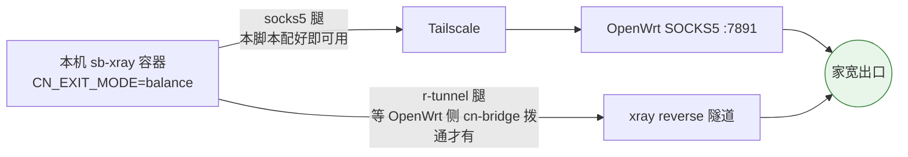

# sb-xray VPS 侧回国出口（CN exit）一键初始化

在每台公网 VPS 上跑一次 `vps-cn-exit-init.sh`，完成回国双腿（balance）所需的全部 VPS 侧配置：写 `.env`、装 Tailscale 入网、配链路保活、拉起容器、自检。**配一次永不改**——之后的回国拨号切换全部在 OpenWrt 侧用 `cn-bridge` 完成（见 [../openwrt/README.md](../openwrt/README.md)）。

## 1. 它做什么


跑完后这台 VPS 具备**两条回国腿**，由容器内 xray 自动择优与故障转移：



- **socks5 腿**：本脚本跑完即可用（前提：OpenWrt 已按 [../openwrt/README.md](../openwrt/README.md) 配好）。
- **r-tunnel 腿**：是否拨通由 OpenWrt 侧决定（热备常驻拨、冷备按需拨），VPS 侧无需任何操作。
- 多台 VPS 配置完全一致，每台的 `XRAY_REVERSE_UUID` 由服务端自动生成持久化，互不冲突。

## 2. 前置条件

- 标准 Linux + Docker，**sb-xray 已部署**（存在 `docker-compose.yml`，默认目录 `/root/sb-xray`，可用 `SBXRAY_DIR` 指定）
- 家里 OpenWrt 已入 Tailscale 网（要它的 Tailscale IP）
- 首次装 Tailscale 的机器：准备一个 **reusable 的 Tailscale auth key**（[管理后台 → Settings → Keys](https://login.tailscale.com/admin/settings/keys) 生成，勾选 Reusable；多台共用一个 key）

## 3. 参数参考

全部通过环境变量传入：

| 变量 | 必填 | 说明 | 在哪拿 |
|------|------|------|--------|
| `OPENWRT_TS_IP` | ✅ | 家里 OpenWrt 的 Tailscale IP（socks5 腿回国出口） | OpenWrt 上 `tailscale ip -4` |
| `TS_AUTHKEY` | 首次装 tailscale 时 | Tailscale reusable auth key；本机已在网可省 | Tailscale 管理后台 Keys 页 |
| `TS_AUTHKEY_FILE` | 可选 | 改从文件读 authkey（`TS_AUTHKEY` 为空时生效），避免 key 进远端进程表/历史 | — |
| `TS_HOSTNAME` | 可选 | 本机在 tailnet 的设备名，默认取 `hostname` | 建议用节点裸名（如 `dc99`） |
| `SBXRAY_DIR` | 可选 | sb-xray 部署目录，默认 `/root/sb-xray` | — |
| `CN_EXIT_MODE` | 可选 | 回国模式，默认 `balance` | — |
| `REVERSE_DOMAINS` | 可选 | 经 bridge 出的内网域名（逗号分隔），多台建议统一 | — |
| `VPS_DOMAIN` | 可选 | 本节点对外域名（写进 `.env` 的 `domain`） | — |
| `SHOUTRRR_URLS` | 可选 | 事件总线告警 URL | 见 [docs/06](../../docs/06-event-bus-shoutrrr.md) |
| `COMPOSE_URL` | 可选 | `docker-compose.yml` 下载源，默认仓库 `main` 的 raw | — |
| `SKIP_COMPOSE_UPDATE` | 可选 | 设 `1` 跳过 compose 同步；默认 `0`（拉最新覆盖，原始 compose 留存 `.bak`） | — |
| `SKIP_PULL` | 可选 | 设 `1` 只 `up -d` 不 `pull`（不升级镜像）；默认 `0` | — |

> ℹ️ 脚本会自动把 `docker-compose.yml` 同步为仓库最新版（首次的原始文件保留为 `docker-compose.yml.bak`，重跑不覆盖）。旧部署的 compose 可能不含 `${CN_EXIT_MODE}` / `${tsip}` 等引用，不同步则 `.env` 里的回国项不会生效。节点专属配置都在 `.env`，compose 是模板，覆盖安全。
>
> ✅ **退出码**：自检全部通过返回 0；容器未起 / `CN_EXIT_MODE` 未生效 / Tailscale 未在网任一硬失败返回非 0，便于批量编排（`for h in …; do ssh … || echo "$h FAIL"; done`）筛出坏节点。ping、socks5 回国实测为软告警（打洞/预热期可能暂时不通），不影响退出码。自检还会经 SOCKS5 实测一次回国出口 IP（`[ OK ] socks5 腿回国实测：…`）。

## 4. 快速开始

### 单台

VPS 上直接下载并运行：

```sh
wget -O ~/sb-xray/vps-cn-exit-init.sh \
  https://raw.githubusercontent.com/currycan/sb-xray/main/sources/vps/vps-cn-exit-init.sh

OPENWRT_TS_IP=100.x.y.z \
TS_AUTHKEY=tskey-auth-xxxxxx \
TS_HOSTNAME=dc99 \
sh ~/sb-xray/vps-cn-exit-init.sh
```

> 内联传参会把 `TS_AUTHKEY` 留在 shell history；介意的话 `export` 后再跑，或事后 `history -c`。

已在 tailnet 的机器（比如装过 Tailscale 的）更简单：

```sh
OPENWRT_TS_IP=100.x.y.z sh ~/sb-xray/vps-cn-exit-init.sh
```

### 多台批量

在你自己的电脑上循环 ssh（每台 `TS_HOSTNAME` 用各自裸名）：

```sh
KEY=tskey-auth-xxxxxx
for h in dc99 jp dc99-3 cn2; do
  ssh root@$h.example.com "
    wget -qO ~/sb-xray/vps-cn-exit-init.sh https://raw.githubusercontent.com/currycan/sb-xray/main/sources/vps/vps-cn-exit-init.sh &&
    OPENWRT_TS_IP=100.x.y.z TS_AUTHKEY=$KEY TS_HOSTNAME=$h sh ~/sb-xray/vps-cn-exit-init.sh
  "
done
```

脚本幂等（`.env` 按 key 覆盖写入、tailscale 已装则跳过、cron 直接覆盖），重复跑安全；改了某个参数重跑一次即生效。

### 跑完之后

1. 看自检输出（见下节），4 项应全 `[ OK ]`。
2. 把这台节点加进 OpenWrt 侧 `nodes.list`（名/FQDN/token），需要 r-tunnel 腿时 `cn-bridge up <名>`。
3. 验证回国出口：

```sh
# 经本机 socks5 腿应出家宽 IP（在 VPS 上）
docker exec sb-xray sh -c 'grep -E "r-tunnel|cn-exit" /var/log/xray/access.log | tail'
```

## 5. 自检输出说明

| 自检项 | 通过含义 | FAIL 时 |
|--------|----------|---------|
| `sb-xray 容器运行中` | compose 已拉起 | `docker compose logs` 看启动错误 |
| `容器内 CN_EXIT_MODE=... 生效` | `.env` 注入成功 | `docker compose up -d --force-recreate` 强制重建 |
| `Tailscale 在网` | 守护已登录 | `tailscale status` 看状态；authkey 失效则换新 key 重跑 |
| `到 OpenWrt ... 链路通` | socks5 腿物理链路就绪 | 刚入网打洞需 1-2 分钟，keepalive 会自愈；持续不通见下节 |

## 6. 问题处理

| 报错 / 现象 | 原因与解决 |
|------|------------|
| `未找到 sb-xray 目录` | 先部署 sb-xray，或 `SBXRAY_DIR=/实际/路径` 指定 |
| `必填 OPENWRT_TS_IP` | 去 OpenWrt 跑 `tailscale ip -4` 拿 IP 传入 |
| `WARN: ... 不像 Tailscale IP（应为 100.x 段）` | 传成公网 IP 了；Tailscale IP 一定是 `100.x.y.z` |
| `未装 tailscale 且未提供 TS_AUTHKEY` | 补 `TS_AUTHKEY=tskey-auth-...` |
| `Tailscale 安装失败` | VPS 到 `tailscale.com` 网络不通，换网络源或手动装后重跑 |
| `tailscale up 未成功` | authkey 过期/用尽——管理后台生成新的 reusable key 重跑 |
| 持续 ping 不通 OpenWrt | ① OpenWrt 侧 Tailscale 是否在线（`tailscale status`）；② 管理后台两台设备是否都未过期；③ OpenWrt 侧 keepalive 是否在跑（它才是打洞主力） |
| 回国流量黑洞 / 走偏 | OpenWrt 侧 OpenClash 的 skip-auth（`100.64.0.0/10`）与 `IN-PORT,7891,DIRECT` 规则是否在——重跑一次 `cn-exit-setup.sh` 即补全 |
| 容器内 env 是旧值 | `.env` 改了但容器没重建：`docker compose up -d --force-recreate` |

## 7. 改了什么（便于审计/回滚）

| 位置 | 内容 |
|------|------|
| `$SBXRAY_DIR/.env` | 回国相关 key 覆盖写入（`CN_EXIT_MODE` / `ENABLE_REVERSE` / `ENABLE_SOCKS5_PROXY` / `tsip` 等），权限收紧 600 |
| 系统 | 安装 tailscale（官方源），`tailscale up --accept-dns=false`（不改本机 DNS，避免影响容器） |
| `/etc/cron.d/cn-exit-keepalive` | 每分钟 `tailscale ping` OpenWrt 一次（辅助保活；主力在 OpenWrt 侧） |
| Docker | `docker compose pull && up -d`（镜像升级到最新） |

停用：删 `/etc/cron.d/cn-exit-keepalive`；`.env` 里 `CN_EXIT_MODE=off` 后 `docker compose up -d --force-recreate`；`tailscale down` 可断开 tailnet。
