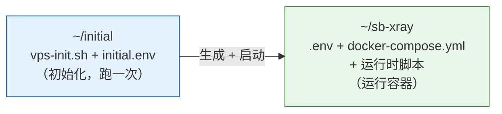
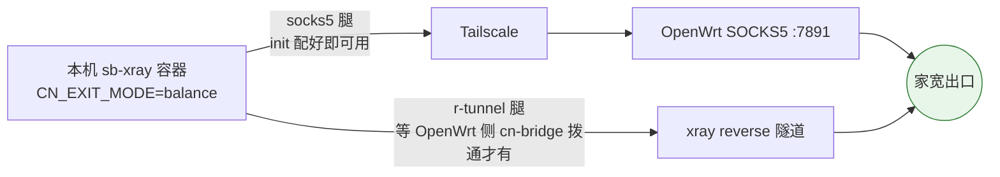

# sb-xray VPS 一键初始化（单脚本）

在每台公网 VPS 上跑一次 `vps-init.sh`，把机器从「全新系统」拉到「跑着 sb-xray 容器」的状态——系统调优 + BBR、sudo 用户、SSH 仅公钥加固、装 Docker、写容器 `.env` + compose、**启动容器**，一次完成。回国出口（CN exit）节点再自动装 Tailscale 入网、链路保活、自检护栏、反向探活并自检。

> 🎯 **核心结论（先记住这一条）**：操作者**从 GitHub 下载脚本到 VPS**（不是 scp、不用 clone 整个仓库）。每台机器**只需手动放 2 个文件**到 `~/initial`：`vps-init.sh` + `initial.env`。其余一切——`docker-compose.yml`、运行时更新脚本、canary/watchdog 护栏——都由脚本自动从 GitHub 拉取。

---

## 1. 心智模型：一个 init 脚本 + 两个目录



**init 与 runtime 是两个解耦的工作流、两个目录**：

| 目录 | 是什么 | 内容 |
|------|--------|------|
| **`~/initial`** | **初始化工作流**（一次性） | `vps-init.sh` + 你填的 `initial.env` |
| **`~/sb-xray`** | **运行 sb-xray 工作流**（持续） | `.env`（**只给容器**）+ `docker-compose.yml` + 运行时脚本（`sbx-redeploy.sh`、回国节点的 `sbx-canary-check.sh`/`cn-exit-watchdog.sh`） |

**三个不变量**（理解了就不会用错）：

1. **`initial.env` 是唯一人填输入。** 放在 `~/initial`，只被 `vps-init.sh` 读（脚本同目录）。`~/sb-xray/.env`、各 cron 的 conf 都是脚本从它**派生**的产物，不手改。
2. **`~/sb-xray/.env` 只给 docker 容器用。** `vps-init.sh` 写它（域名/code，回国节点加 `tsip`/`CN_EXIT_MODE`/`ENABLE_*`/`WATCHTOWER_SCHEDULE`）。Tailscale 入网参数（`TS_AUTHKEY`/`TS_HOSTNAME`）是 init 侧的，从 `initial.env` 读，**不写进容器 `.env`**。
3. **回国节点开关 = `OPENWRT_TS_IP`。** `initial.env` 给了它，本机就是 CN-exit 节点，`vps-init.sh` 自动写全回国 env + 装 Tailscale/护栏 + 自检；不给则是通用节点，跑完即启动容器。

---

## 2. 怎么用

主线：**下载 2 个文件 → 填 `initial.env` → 跑 `vps-init.sh`**。一次跑完，容器就起来了。

### 2.0 前置条件

- 全新 **Debian/Ubuntu** VPS（仅支持这两个发行版；Docker 由脚本装，无需预装）。
- 一把 SSH 公钥（推荐 **ed25519**：`ssh-keygen -t ed25519`）——脚本会关掉密码登录只留公钥，无有效公钥会在动 SSH 前中止（防锁机）。
- **回国节点额外需要**：家里 OpenWrt 已入 Tailscale 网（拿它的 Tailscale IP，OpenWrt 上 `tailscale ip -4`）；一把 **reusable** 的 Tailscale auth key（[管理后台 → Settings → Keys](https://login.tailscale.com/admin/settings/keys) 生成，勾 Reusable，多台共用一把）。

### 2.1 第一步：从 GitHub 下载 2 个文件到 `~/initial`

```sh
mkdir -p ~/initial && cd ~/initial
wget -O vps-init.sh         https://raw.githubusercontent.com/currycan/sb-xray/main/sources/vps/vps-init.sh
wget -O initial.env.example https://raw.githubusercontent.com/currycan/sb-xray/main/sources/vps/initial.env.example
chmod +x vps-init.sh
```

> 💡 必须带 `-O <文件名>`：裸 `wget <URL>` 在文件已存在时会另存为 `vps-init.sh.1`，重跑就拿到旧文件。`-O` 强制覆盖到确定文件名（`curl -fsSL -o <文件名> <URL>` 同效）。
>
> 🧭 **放 `~/initial`**：这是 init 工作流的专属目录，与容器运行目录 `~/sb-xray` 分开。`vps-init.sh` 读同目录的 `initial.env`，并把容器部署到 `~/sb-xray`、运行时脚本也拉到那里。
>
> 🌏 CN 境内拉 `raw.githubusercontent.com` 慢/不通时，把 URL 换成你的镜像/代理地址即可（脚本内部下载源也都能用 `*_URL` 变量改写，见 §4）。

### 2.2 第二步：填 `initial.env`

```sh
cp initial.env.example initial.env
vi initial.env
```

`initial.env` 按 shell 语法 `source`——**值含空格/特殊字符（尤其 SSH 公钥、带符号的密码/code）必须加引号**。真实 `initial.env` 含凭据，已被 `.gitignore` 排除，**不入库**。

最少要填：

| 节点类型 | 至少填 |
|----------|--------|
| **通用节点** | `SSH_PUBKEY_FILE`（或 `SSH_PUBKEY`）。域名/code（`SBX_DOMAIN`/`SBX_CODE`）按需，留空用 hostname 派生 |
| **回国节点** | 上面那些 + `OPENWRT_TS_IP`（给了它即判本机为 CN-exit 节点）+ `TS_AUTHKEY`（首次入网必填）+ 建议 `TS_HOSTNAME`（tailnet 设备名）+ `SBX_CANARY_ROLE`（`canary` 或 `worker`） |

全部变量见 [§4 参数全集](#4-initialenv-参数全集)。

> 📝 公钥永远含空格——推荐用 `SSH_PUBKEY_FILE` 指向 `.pub` 文件免去引号，它还能一次装入多把公钥（多管理机/密钥轮换）。
>
> ⚠️ **锁机警告**：脚本设 `PasswordAuthentication no` + `PermitRootLogin prohibit-password` 并改 SSH 端口（默认 `38666`）。运行前确认公钥正确、手上私钥能用。脚本写完 SSH 配置后 `sshd -t` 校验，失败即删 drop-in 并中止；仍建议**保留一个已连接会话**直到用新端口 + 公钥验证能登录。

### 2.3 第三步：跑 `vps-init.sh`

```sh
sudo ./vps-init.sh           # -h/--help 看用法
```

一次跑完：系统调优 + Docker、写 `~/sb-xray/.env` + 落 compose、把运行时脚本拉到 `~/sb-xray`、**`docker compose up -d` 启动容器**；**回国节点**额外装 Tailscale 入网 + keepalive + 自检护栏 + 反向探活，并在末尾自检（4 项，硬失败非 0 退出）。

> ✅ **幂等**：系统配置写成专属 drop-in（`/etc/sysctl.d/`、`/etc/ssh/sshd_config.d/`、`/etc/sudoers.d/` 等），全量重写不漂移。重跑安全。
>
> 🔒 不向世界可读日志写密码/`code`；`~/sb-xray/.env` 600、`authorized_keys` 600、`sudoers.d/*` 0440。

### 2.4 多台批量

控制端循环 ssh，每台「下 2 文件 → 填 → 跑」。把填好的 `initial.env` 在控制端按节点改 `TS_HOSTNAME` 备份后推上去最省事：

```sh
for h in dc99 jp cn2; do
  ssh root@$h.example.com "mkdir -p ~/initial"
  scp initial.env-$h root@$h.example.com:'~/initial/initial.env'   # 仅推配置，脚本仍从 GitHub 拉
  ssh root@$h.example.com "
    cd ~/initial &&
    wget -qO vps-init.sh https://raw.githubusercontent.com/currycan/sb-xray/main/sources/vps/vps-init.sh &&
    chmod +x vps-init.sh && sudo ./vps-init.sh
  "
done
```

> 回国节点自检对硬失败（容器未起 / `CN_EXIT_MODE` 未生效 / Tailscale 未在网）返回非 0，便于批量筛坏节点：`... || echo "$h FAIL"`。ping、socks5 实测为软告警，不影响退出码。

### 2.5 跑完之后

1. 看自检输出（回国节点，见 [§5](#5-回国节点自检输出说明)），4 项应全 `[ OK ]`。
2. 回国节点：把它加进 OpenWrt 侧 `nodes.list`（名/FQDN/token），需要 r-tunnel 腿时 `cn-bridge up <名>`。
3. 验证回国出口（在 VPS 上，经本机 socks5 腿应出家宽 IP）：

```sh
docker exec sb-xray sh -c 'grep -E "r-tunnel|cn-exit" /var/log/xray/access.log | tail'
```

**改回国参数**：编辑 `~/initial/initial.env` 后在 `~/initial` 重跑 `sudo ./vps-init.sh`（幂等）。

---

## 3. 回国双腿原理

回国节点初始化后具备**两条回国腿**，由容器内 xray 自动择优与故障转移：



- **socks5 腿**：init 跑完即可用（前提：OpenWrt 已按 [../openwrt/README.md](../openwrt/README.md) 配好）。
- **r-tunnel 腿**：是否拨通由 OpenWrt 侧决定（热备常驻拨、冷备按需拨），VPS 侧无需任何操作。
- 多台 VPS 配置完全一致，每台的 `XRAY_REVERSE_UUID` 由服务端自动生成持久化，互不冲突。

---

## 4. `initial.env` 参数全集

`vps-init.sh` 从同目录 `initial.env` 读取。「谁用」一栏：容器变量由脚本写进 `~/sb-xray/.env`、容器读；其余是脚本初始化时直接用。

### 系统 / SSH

| 变量 | 必填 | 说明 / 默认 |
|------|------|-------------|
| `SSH_PUBKEY_FILE` / `SSH_PUBKEY` | ✅ | 公钥登录所需公钥（二选一，`SSH_PUBKEY_FILE` 优先且支持多公钥）。无有效公钥则在动 SSH 前中止。推荐 **ed25519** |
| `SBX_USER` | 可选 | 要创建的 sudo 用户名（默认 `sbx`） |
| `SBX_USER_PASSWORD` / `ROOT_PASSWORD` | 可选 | 空 = 不设/不改密码（仅密钥登录推荐留空） |
| `SSH_PORT` | 可选 | SSH 端口（默认 `38666`） |
| `TIMEZONE` | 可选 | 默认 `Asia/Shanghai` |
| `BASHRC_URL` / `VIMRC_URL` | 可选 | 给定则拉 `.bashrc`/`.vimrc` 到 root 与 sudo 用户家目录（留空跳过） |

### 容器配置（写进 `~/sb-xray/.env`）

| 变量 | 必填 | 说明 / 默认 |
|------|------|-------------|
| `SBX_DOMAIN` / `SBX_CDN_DOMAIN` / `SBX_CODE` | 可选 | 写入 `.env` 的 `domain`（空 = hostname，须 `.com` FQDN）/ `cdndomain` / `code` |

### 回国（CN-exit）—— 给 `OPENWRT_TS_IP` 即触发

| 变量 | 必填 | 说明 / 在哪拿 | 谁用 |
|------|------|---------------|------|
| `OPENWRT_TS_IP` | 回国节点 ✅ | 家里 OpenWrt 的 Tailscale IP（socks5 腿回国出口）；**也是判定本机为 CN-exit 节点的开关**。OpenWrt 上 `tailscale ip -4` | 写 `.env` 的 `tsip` + keepalive |
| `TS_AUTHKEY` | 首次入网 | reusable auth key；已在网可省。管理后台 Keys 页 | init 入网（不入 `.env`） |
| `TS_AUTHKEY_FILE` | 可选 | 改从文件读 authkey（`TS_AUTHKEY` 为空时生效），避免 key 进进程表/历史 | init 入网 |
| `TS_HOSTNAME` | 可选 | tailnet 设备名，默认取 `hostname`。建议用节点裸名（如 `dc99`） | init 入网 |
| `SBX_CANARY_ROLE` | 可选 | watchtower 角色 `canary`\|`worker`（默认 `worker`；指定一台金丝雀设 `canary`，见 §6） | 写 `.env` + 自检 cron 时段 |
| `CN_EXIT_MODE` | 可选 | 回国模式，默认 `balance` | 写 `.env` |
| `REVERSE_DOMAINS` | 可选 | 经 bridge 出的内网域名（逗号分隔），多台建议统一 | 写 `.env` |
| `VPS_DOMAIN` | 可选 | 本节点对外域名（覆盖 hostname 派生的 `domain`） | 写 `.env` |
| `SHOUTRRR_URLS` | 可选 | 事件总线告警 URL，见 [docs/06](../../docs/06-event-bus-shoutrrr.md) | 写 `.env` |
| `WD_TG_TOKEN` / `WD_TG_CHAT` | 可选 | CN 出口反向探活的 Telegram bot token / chat id；**两者同时有值才装 watchdog**（见 §6） | init 装护栏 |

### 下载源覆盖（`*_URL`，默认都是仓库 `main` 的 raw）

| 变量 | 默认拉取 |
|------|----------|
| `SBX_COMPOSE_URL` | `docker-compose.yml`（init 首次落盘） |
| `REDEPLOY_URL` | `sbx-redeploy.sh`（运行时更新脚本，拉到 `~/sb-xray`） |
| `CANARY_URL` | `sbx-canary-check.sh`（回国节点护栏） |
| `WATCHDOG_URL` | `cn-exit-watchdog.sh`（回国节点护栏） |
| `SSRPOLIPO_COMPOSE_URL` | ssr-polipo compose（`INSTALL_SSRPOLIPO=1` 时必给） |
| `TCP_BRUTAL_URL` | tcp-brutal 安装脚本 |

> CN 节点拉 raw 慢时，把对应 `*_URL` 指向镜像/代理。

### 开关

| 变量 | 默认 | 说明 |
|------|------|------|
| `SBXRAY_DIR` | `~/sb-xray` | sb-xray 运行目录（`.env`/compose/运行时脚本所在；与 init 目录 `~/initial` 分开） |
| `INSTALL_SSRPOLIPO` | `1`（开） | 启用须给 `SSRPOLIPO_COMPOSE_URL`，否则 warn 跳过。设 `0` 关 |
| `INSTALL_TCP_BRUTAL` | `1`（开） | 装 `tcp-brutal` DKMS 内核模块。**仅令诊断位 `IS_BRUTAL=true`；Hy2 实际用 bbr，不装不影响代理功能。** 自动补 `build-essential` + 运行内核头；运行内核被仓库淘汰时无法编译（需先升级内核 + 重启）。设 `0` 关 |
| `SKIP_PULL` | `0` | 设 `1` 启动只 `up -d` 不 `pull`（不升级镜像） |
| `SKIP_CANARY_WIRING` | `0` | 设 `1` 跳过 watchtower 自检护栏（canary 脚本 + cron + `sbx-update`） |
| `SKIP_WATCHDOG_WIRING` | `0` | 设 `1` 跳过反向探活（不传 `WD_*` 本就不装） |

---

## 5. 回国节点自检输出说明

| 自检项 | 通过含义 | FAIL 时 |
|--------|----------|---------|
| `sb-xray 容器运行中` | compose 已拉起 | `docker compose logs` 看启动错误 |
| `容器内 CN_EXIT_MODE=... 生效` | 写的 `.env` 已被容器读入 | `docker compose up -d --force-recreate` 强制重建 |
| `Tailscale 在网` | 守护已登录 | `tailscale status` 看状态；authkey 失效则换新 key 重跑 |
| `到 OpenWrt ... 链路通` | socks5 腿物理链路就绪 | 刚入网打洞需 1-2 分钟，keepalive 会自愈；持续不通见 §7 |

自检还会经 SOCKS5 实测一次回国出口 IP（`[ OK ] socks5 腿回国实测：…`）。

---

## 6. 运行时操作（`~/sb-xray`）

init 跑完后，日常运维都在容器运行目录 `~/sb-xray`，与 init 解耦。

### 更新容器到最新：`sbx-redeploy.sh`

`vps-init.sh` 已把它拉到 `~/sb-xray`。它重拉 `docker-compose.yml` → `down` → `pull` → 清**可重生成目录**（`sb-xray/`、`logs/`、`nginx/`）→ `up -d` → 清悬空镜像。持久状态（`pki/`、`acmecerts/`、`x-ui/`、`sub-store/`、`data/`、`geo/` 等）**不动**。

```sh
~/sb-xray/sbx-redeploy.sh        # -h/--help 看用法
```

### watchtower 自检护栏（回国节点自动装）

watchtower 在 compose 里凌晨自动更新 `:latest`；init 在回国节点装两件护栏（`SKIP_CANARY_WIRING=1` 跳过）：

- **`sbx-canary-check.sh`**（→ `~/sb-xray`）+ cron `/etc/cron.d/sbx-canary-check`：更新后业务自检（容器健康 / 443 tcp+udp / 回国链路 / 镜像 digest），经容器内 shoutrrr 推中文 Telegram 通知。自检过且 digest 跳变才推「已更新」；任一失败推失败 runbook。通知格式见 [docs/06 §9.1](../../docs/06-event-bus-shoutrrr.md)。
- **`/usr/local/bin/sbx-update`**：`watchtower --run-once sb-xray`，手动灰度更新本台镜像。

**角色 `SBX_CANARY_ROLE`** 只决定 watchtower/自检时段与失败 runbook 文案：`canary`（一台错峰先行，03:00 更新 / 03:05 自检，失败叫停其余节点）、`worker`（其余各台，04:00 / 04:05）。

### CN 出口反向探活：`cn-exit-watchdog.sh`（可选，回国节点）

补一个监控盲区：CN 出口设备整机宕机时设备侧监控随之失联，而 balance 探活只做静默 failover。`initial.env` 同时给 `WD_TG_TOKEN` + `WD_TG_CHAT` 时，init 装 `cn-exit-watchdog.sh`（→ `~/sb-xray`）+ cron `/etc/cron.d/cn-exit-watchdog`，每分钟经 socks5 腿反向探活，连续失败发 Telegram 告警、恢复发解除。建议只在 1-2 台启用互为冗余。通道验证：`~/sb-xray/cn-exit-watchdog.sh --test`。

---

## 7. 问题处理

| 报错 / 现象 | 原因与解决 |
|------|------------|
| `wget` 拉 raw 失败 / CN 拉取很慢 | 换镜像/代理地址；脚本内部下载源用对应 `*_URL` 变量改写（见 §4） |
| `缺 OPENWRT_TS_IP` | 回国节点没填——`~/initial/initial.env` 补 `OPENWRT_TS_IP`（OpenWrt 上 `tailscale ip -4` 拿）后重跑 |
| `WARN: ... 不像 Tailscale IP（应为 100.x 段）` | 传成公网 IP 了；Tailscale IP 一定是 `100.x.y.z` |
| `未装 tailscale 且无 TS_AUTHKEY` | 首次入网：`~/initial/initial.env` 配 `TS_AUTHKEY`（reusable key）后重跑 |
| `Tailscale 安装失败` | VPS 到 `tailscale.com` 网络不通，换网络源或手动装后重跑 |
| `tailscale up 未成功` | authkey 过期/用尽——管理后台生成新 reusable key 重跑 |
| 持续 ping 不通 OpenWrt | ① OpenWrt 侧 Tailscale 是否在线（`tailscale status`）；② 管理后台两台设备是否都未过期；③ OpenWrt 侧 keepalive 是否在跑（它才是打洞主力） |
| 回国流量黑洞 / 走偏 | OpenWrt 侧 OpenClash 的 skip-auth（`100.64.0.0/10`）与 `IN-PORT,7891,DIRECT` 规则是否在——重跑一次 `openwrt-init.sh` 即补全 |
| 容器内 env 是旧值 | `.env` 改了但容器没重建：`docker compose up -d --force-recreate`，或跑 `~/sb-xray/sbx-redeploy.sh` |

---

## 8. 改了什么（便于审计 / 回滚）

| 位置 | 内容 |
|------|------|
| `~/sb-xray/.env` | `vps-init.sh` 写（**仅容器变量**：domain/code，回国节点加 `tsip`/`CN_EXIT_MODE`/`ENABLE_*`/`WATCHTOWER_SCHEDULE`） |
| 系统（回国节点） | 安装 tailscale（官方源），`tailscale up --accept-dns=false`（不改本机 DNS，避免影响容器） |
| `/etc/cron.d/cn-exit-keepalive`（回国） | 每分钟 `tailscale ping` OpenWrt（辅助保活；主力在 OpenWrt 侧） |
| `/etc/cron.d/sbx-canary-check`（回国） | 自动更新后业务自检（`SKIP_CANARY_WIRING=1` 不装） |
| `/etc/cron.d/cn-exit-watchdog`（回国，传 `WD_*`） | 反向探活 |
| Docker | `docker compose pull && up -d`（启动并升级到最新镜像） |

停用回国：删 `/etc/cron.d/cn-exit-keepalive`；`~/sb-xray/.env` 里 `CN_EXIT_MODE=off` 后 `docker compose up -d --force-recreate`；`tailscale down` 断开 tailnet。停用反向探活：删 `/etc/cron.d/cn-exit-watchdog` + `/etc/cn-exit-watchdog.conf`。
